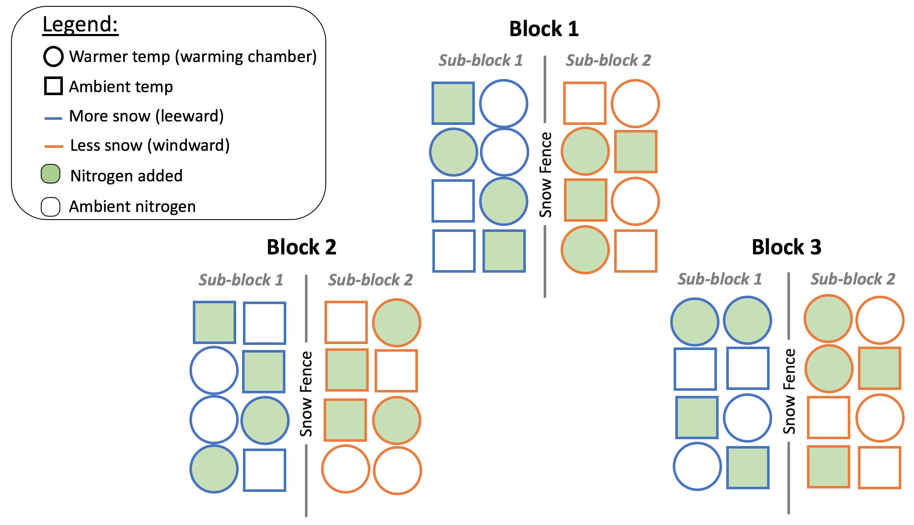
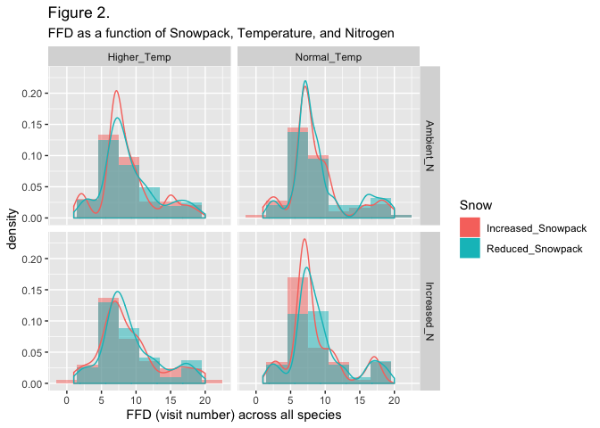

How does snowpack, Nitrogen, and temperature affect the phenology of an
alpine grass?
================
Kelsey Elwood
12/21/2018

This script is the final, summary report of a Bayesian hierarchical
analysis of flowering time of Deschampsia cespitosa as a function of
snow, nitrogen, and temperature. More information can be found on each
part of the analysis by referring to the associated scripts available on
github.

The following libraries are required for this script

``` r
library(dplyr)
library(tidyr)
library(lme4)
library(ggplot2)
library(rstanarm)
library(rstan)
library(forcats)
options(mc.cores = parallel::detectCores())
theme_set(theme_grey()) #rstanarm overrides default ggplot theme: set it back

source("source/hpdi.R")
```

# 1\. Introduction

The purpose of this analysis is to evaluate whether first flowering date
(FFD) changes in response to increases in temperature, snowpack, and/or
N. Data was collected for 2007 and 2008, though I only looked at 2007
data. The data are grouped at 2 levels: block and sub-block. There are a
total of 3 blocks, each with 2 sub-blocks. Sub-blocks are separated by a
snowfence with plots on the leeward side experiencing normal to reduced
snowpack, while plots on the windward side experiencing increased
snowpack. In each sub-block, 2 plots have warming treatments, 2 plots
have increased nitrogen, 2 plots have both warming and increased
nitrogen, and 2 plots are left as controls (ambient N and ambient
temperature). Figure 1 (below) captures the conceptual layout of the
data structure.

 ***Figure
1.** The experimental design shows all 48 plots divided into blocks and
sub-blocks. Each plot within a sub-block is 1 meter apart. The blocks
are approximately 50 meters apart.*

# 2\. Exploring the data

*For more, see “indiv\_project\_2\_eda.md”*

Load and clean the data

``` r
# Load data
nwt_ffd <- read.csv(file = "data/NWT_ITEX_FFD_data_2007_and_2008.csv", na.strings = ".") %>% 
    
    # create 0,1 vector for values
    mutate(Snow_x = ifelse(Snow == "X", "0", "1")) %>%
    mutate(Temp_x = ifelse(Temp == "X", "0", "1")) %>%
    mutate(N_x = ifelse(N == "X", "0", "1")) %>%   
    
    # rename the values to be more true to their meaning:
    mutate(Snow = as.factor(ifelse(Snow == "X", "Reduced_Snowpack", "Increased_Snowpack"))) %>%
    mutate(Temp = as.factor(ifelse(Temp == "X", "Normal_Temp", "Higher_Temp"))) %>%
    mutate(N = as.factor(ifelse(N == "X", "Ambient_N", "Increased_N"))) %>% 
    
    # create a new column for "subblock"
    mutate(Subblock = as.factor(ifelse(Snow == "Reduced_Snowpack", 0, 1))) %>% 
    
    # define "Block" as a factor
    mutate(Block = as.factor(Block)) %>% 
    
    # create a new Block|Subblock column
    mutate(Subblock_ID = as.factor(paste0(Block, "_", Subblock))) %>% 
    
    # remove 2 unnecessary (and empty) columns
    select(-c("X", "X.1")) 

# Convert data frame with species as a vector
nwt_ffd2 <- nwt_ffd %>% 
    gather(key = Species, value = FFD, 8:35, na.rm = TRUE, factor_key = TRUE) %>% 
    mutate(Species = factor(Species)) %>% 
    mutate(log_FFD = log(FFD)) 

# Subset data for 2007 (2008 was incomplete) and centered FFD
nwt_ffd2_2007 <- nwt_ffd2 %>% 
    filter(year == "2007") %>% 
    mutate(FFD_s = scale(FFD))

# create a new column for FFD based on visit number (rather than Julian day)
days_visited <- as.vector(sort(unique(nwt_ffd2_2007$FFD)))
number_visits <- length(days_visited)
Visit <- as.vector(1:number_visits)
visits_df <- data.frame(days_visited, Visit)
nwt_ffd2_2007 <- merge(nwt_ffd2_2007, visits_df, by.x = "FFD", by.y = "days_visited")

# subset of DESCAE (Deschampsia cespitosa) in 2007, with centered FFD
nwt_descae_2007 <- nwt_ffd2 %>% 
    filter(Species == "DESCAE") %>% 
    filter(year == "2007") %>% 
    merge(visits_df, by.x = "FFD", by.y = "days_visited") %>% 
    mutate(FFD_s = scale(FFD))
```

Explore data

``` r
str(nwt_ffd2_2007)
```

    ## 'data.frame':    500 obs. of  17 variables:
    ##  $ FFD        : int  150 150 155 155 155 155 155 155 155 155 ...
    ##  $ year       : int  2007 2007 2007 2007 2007 2007 2007 2007 2007 2007 ...
    ##  $ Block      : Factor w/ 3 levels "1","2","3": 1 3 3 3 3 1 1 3 3 2 ...
    ##  $ Plot       : int  16 42 41 36 44 9 11 43 45 29 ...
    ##  $ Code       : Factor w/ 8 levels "PNW","PNX","PXW",..: 4 1 4 5 3 1 3 2 3 3 ...
    ##  $ Snow       : Factor w/ 2 levels "Increased_Snowpack",..: 1 1 1 2 1 1 1 1 1 1 ...
    ##  $ Temp       : Factor w/ 2 levels "Higher_Temp",..: 2 1 2 1 1 1 1 2 1 1 ...
    ##  $ N          : Factor w/ 2 levels "Ambient_N","Increased_N": 1 2 1 2 1 2 1 2 1 1 ...
    ##  $ Snow_x     : chr  "1" "1" "1" "0" ...
    ##  $ Temp_x     : chr  "0" "1" "0" "1" ...
    ##  $ N_x        : chr  "0" "1" "0" "1" ...
    ##  $ Subblock   : Factor w/ 2 levels "0","1": 2 2 2 1 2 2 2 2 2 2 ...
    ##  $ Subblock_ID: Factor w/ 6 levels "1_0","1_1","2_0",..: 2 6 6 5 6 2 2 6 6 4 ...
    ##  $ Species    : Factor w/ 28 levels "ACOROS","ARTSCO",..: 5 5 5 5 5 5 5 5 18 5 ...
    ##  $ log_FFD    : num  5.01 5.01 5.04 5.04 5.04 ...
    ##  $ FFD_s      : num [1:500, 1] -2.2 -2.2 -1.86 -1.86 -1.86 ...
    ##  $ Visit      : int  1 1 2 2 2 2 2 2 2 2 ...

``` r
p2 <- ggplot(data = nwt_ffd2_2007) +
    geom_histogram(mapping = aes(x = Visit, y = stat(density), fill = Snow), position = "identity", alpha = 0.5, na.rm = TRUE, binwidth = 3) + 
    geom_density(mapping = aes(x = Visit, col = Snow)) +
    facet_grid(N ~ Temp) +
    labs(title = "Figure 2.", 
         subtitle = "FFD as a function of Snowpack, Temperature, and Nitrogen",
         x = "FFD (visit number) across all species")

p2
```

<!-- -->
***Figure 2.** A histogram of all species as a function of snowpack,
temperature, and nitrogen.*

Not all species are equally represented in the dataset:

``` r
species_list <- unique(nwt_ffd2$Species)
number_obs_df <- data.frame(ncol = 2, nrow = length(species_list))
colnames(number_obs_df) <- c("Species", "NA_count")

number_obs_df <- nwt_ffd2 %>% 
    group_by(Species, year) %>% 
    summarise(number_obs = n()) %>% 
    mutate(number_nas = 48 - number_obs) %>% 
    arrange(year, -number_obs)
head(number_obs_df)
```

    ## # A tibble: 6 x 4
    ## # Groups:   Species [6]
    ##   Species  year number_obs number_nas
    ##   <fct>   <int>      <int>      <dbl>
    ## 1 DESCAE   2007         48          0
    ## 2 ACOROS   2007         47          1
    ## 3 ARTSCO   2007         45          3
    ## 4 CALLEP   2007         44          4
    ## 5 GENALG   2007         41          7
    ## 6 BISBIS   2007         40          8

One species, Deschampsia cespitosa (DESCAE), is present in all the plots
in the 2007 data. For simplication, let’s just use Deschampsia cespitosa
for the hierarchical analysis.

``` r
p3 <- ggplot() +
    geom_histogram(data = nwt_descae_2007, 
                   mapping = aes(x = Visit, y = stat(density)), 
                   binwidth = 1) + 
    geom_density(data = nwt_descae_2007, 
                 mapping = aes(x = Visit), 
                 col = "darkblue") +
    labs(title = "Figure 3.",
         subtitle = "FFD of Deschampsia cespitosa",
         x = "FFD (visit number) of Deschampsia cespitosa")
p3
```

<!-- -->
***Figure 3.** A histogram of FFD of Deschampsia cespitosa across all
plots.*

``` r
p4 <- ggplot(data = nwt_descae_2007) +
    geom_histogram(mapping = aes(x = Visit, y = stat(density), fill = Snow,), position = "identity", alpha = 0.5, na.rm = TRUE, binwidth = 3) + 
    geom_density(mapping = aes(x = Visit, col = Snow)) +
    facet_grid(N ~ Temp) +
    labs(title = "Figure 4.", 
         subtitle = "FFD as a function of Snowpack, Temperature, and Nitrogen",
         x = "FFD (visit number) of Deschampsia cespitosa")

p4
```

<!-- -->
***Figure 4.** A density histogram of FFD as a function of Snowpack,
Temperature, and Nitrogen with a density smoother overlaid.*

``` r
p5 <- ggplot(data = nwt_descae_2007) +
    geom_histogram(mapping = aes(x = Visit, y = stat(density), fill = Code), position = "identity", alpha = 0.5, na.rm = TRUE, binwidth = 4, stat = "density") + 
    labs(title = "Figure 5", 
         subtitle = "FFD of all 8 types of plots",
         x = "FFD of Deschampsia cespitosa")
```

    ## Warning: Ignoring unknown parameters: binwidth, bins, pad

``` r
p5
```

<!-- -->
***Figure 5** A density plot of FFD for Deschampsia cespitosa in each of
the 8 different types of plots (combinations of snow, nitrogen, and
temperature).*

``` r
p6 <- ggplot(data = nwt_descae_2007, aes(x = Code, y = Visit, fill = Code, col = Code)) +
  stat_summary(geom = "point", fun.y = mean, position = "dodge") +
  stat_summary(geom = "errorbar", fun.data = mean_se, position = "dodge") + 
    labs(title = "Figure 6",
         subtitle = "First flowering data of each plot type",
         x = "Plot code",
         y = "First flowering date (visit) of Geum rossii")
p6
```

<!-- -->
***Figure 6.** Mean and SE of FFD for Deschampsia cespitosa for all plot
types.*

# 3\. Define conceptual (biological) model

The purpose of the model is to evaluate how snowpack, temperature, and
nitrogen impact the phenology of alpine plants. As discussed above, I
will only look at one species (Deschampsia cespitosa) in one year (2007)
for the sake of simplicity.

The structure of the experimental design has **2 grouping variables**:
blocks (3 replicates separated in space) and 2 sub-blocks per block
(separated by a snowfence).

There are **3 explanatory variables**: snowpack (`Snow`), temperature
(`Temp`), and nitrogen (`N`).

The **response variable** is the first flowering date of Deschampsia
cespitosa, which is indicated by the visit number (`Visit`).

The following conceptual model considers all three explanatory variables
and their interactions. I predicted that interactions might be
important. I will evaluate this assumption when I build and compare
models later in the script.

***Plot level:***  
")  
![\\mu\_i = \\alpha\_{j\[i\]} + \\beta\_1 x\_1 + \\beta\_2 x\_2 +
\\beta\_3 x\_1
x\_2](https://latex.codecogs.com/png.latex?%5Cmu_i%20%3D%20%5Calpha_%7Bj%5Bi%5D%7D%20%2B%20%5Cbeta_1%20x_1%20%2B%20%5Cbeta_2%20x_2%20%2B%20%5Cbeta_3%20x_1%20x_2
"\\mu_i = \\alpha_{j[i]} + \\beta_1 x_1 + \\beta_2 x_2 + \\beta_3 x_1 x_2")  
where…  
\-  represents
the observed value of FFD for a given plot
  
\- 
represents the expected FFD for plot
  
\-
![\\alpha\_{j\[i\]}](https://latex.codecogs.com/png.latex?%5Calpha_%7Bj%5Bi%5D%7D
"\\alpha_{j[i]}") represents the expected value for a plot
 given it is within
sub-block   
\-  represents N
(2 levels: increased and ambient) and  
\-  represents
temperature (2 levels: increased and ambient)  
\-  represents
snow (2 levels: increased or decreased)

***Subblock level:***  
![\\alpha\_{j} \\sim Normal(\\gamma\_{k\[i\]},
\\sigma\_\\mu^2)](https://latex.codecogs.com/png.latex?%5Calpha_%7Bj%7D%20%5Csim%20Normal%28%5Cgamma_%7Bk%5Bi%5D%7D%2C%20%5Csigma_%5Cmu%5E2%29
"\\alpha_{j} \\sim Normal(\\gamma_{k[i]}, \\sigma_\\mu^2)")  
![\\gamma\_k = \\omega\_{k\[i\]} + \\beta\_4 x\_3 + \\beta\_5 x\_1 x\_3
+ \\beta\_6 x\_2 x\_3 + \\beta\_7 x\_1 x\_2
x\_3](https://latex.codecogs.com/png.latex?%5Cgamma_k%20%3D%20%5Comega_%7Bk%5Bi%5D%7D%20%2B%20%5Cbeta_4%20x_3%20%2B%20%5Cbeta_5%20x_1%20x_3%20%2B%20%5Cbeta_6%20x_2%20x_3%20%2B%20%5Cbeta_7%20x_1%20x_2%20x_3
"\\gamma_k = \\omega_{k[i]} + \\beta_4 x_3 + \\beta_5 x_1 x_3 + \\beta_6 x_2 x_3 + \\beta_7 x_1 x_2 x_3")  
where….  
\-  represents N
(2 levels: increased and ambient),  
\-  represents
temperature (2 levels: increased and ambient)

***Block level:***  
")  
where…  
\-  represents the mean among sub-blocks in blocks,  
\-
 represents the mean among blocks, and  
\-
 represents the variance among blocks

**Alternative Parameterization:**  


*which expands to…*  
  
where…  
\-  represents N
(2 levels: increased and ambient),  
\-  represents
temperature (2 levels: increased and ambient),  
\-  represents
snow (2 levels: increased or decreased),  
\-  represents
variance of a specific block  from the mean of all blocks such that "),  
\-  represents
variance of a specific sub-block
 from the mean of
sub-blocks such that "), and  
\-  represents
variance of a specific plot  from the mean of plots such that ")

# Build and run Bayesian hierarchical models

*A selection of models are presented here for comparison. The following
models were chosen based on a much more thorough model selection
comparison in “indiv\_project\_5\_model\_selection”.*

To start, let’s look at the proposed conceptual model, which includes
snow, temperature, nitrogen, and all their interactions as explanatory
variables. I will use a normal, “gaussian” distribution for now, but I
will return to this assumption later. Let’s call this **“Model 1”**.

**Model 1: N x Temp x Snow**

``` r
# Model 1: Visit, gaussian
bayes_NxTxS <- stan_glmer(Visit ~ N*Temp*Snow + (1|Block / Subblock), 
                          family = gaussian,
                          data = nwt_descae_2007,
                          adapt_delta = 0.999999)
```

I used default priors for the model, which mean that all parameters
(including the intercept) have a default prior mean of 0, with variance
of 10 for the intercept and 2.5 for the other parameters (default for
normal distributions). The default priors are appropriate for this model
because they are of the appropriate magnitude for the data, are weakly
informative, and I don’t have a good reason to use any other prior.

``` r
prior_summary(bayes_NxTxS)
```

    ## Priors for model 'bayes_NxTxS' 
    ## ------
    ## Intercept (after predictors centered)
    ##  ~ normal(location = 0, scale = 10)
    ##      **adjusted scale = 5.04
    ## 
    ## Coefficients
    ##  ~ normal(location = [0,0,0,...], scale = [2.5,2.5,2.5,...])
    ##      **adjusted scale = [1.26,1.26,1.26,...]
    ## 
    ## Auxiliary (sigma)
    ##  ~ exponential(rate = 1)
    ##      **adjusted scale = 0.50 (adjusted rate = 1/adjusted scale)
    ## 
    ## Covariance
    ##  ~ decov(reg. = 1, conc. = 1, shape = 1, scale = 1)
    ## ------
    ## See help('prior_summary.stanreg') for more details

The covariance plot looks good. Values are below +/- 0.7:

``` r
vcov(bayes_NxTxS, correlation=TRUE)
```

The diagnostics look fine
too:

``` r
launch_shinystan(bayes_NxTxS)
```

``` r
plot(bayes_NxTxS)
```

<!-- -->
***Figure 7.** Looking at the posterior distribution, it appears that
only nitrogen and temperature had a non-zero slope. Increased nitrogen
or increased temperature appear to cause earlier flowering in
Deschampsia cespitosa. The interaction between N and temperature is on
the cusp, but interestingly, shows that the combination of increased N
and increased temperature can delay flowering.*

Based on the results of the conceptual model, it appears that only N and
temperature (and maybe their interaction) affect the flowering time of
Deschampsia cespitosa. To explore this, here is **“Model 2”**, which
only includes N, temperature, and N:temperature.

**Model 2: N x Temp**

``` r
# Model 2: Visit, gaussian
bayes_NxT <- stan_glmer(Visit ~ N*Temp + (1|Block / Subblock), 
                          family = gaussian,
                          data = nwt_descae_2007,
                          adapt_delta = 0.999999)
```

I chose to use default priors because they are weakly informative and I
don’t have a good reason to use any other prior.

``` r
prior_summary(bayes_NxT)
```

    ## Priors for model 'bayes_NxT' 
    ## ------
    ## Intercept (after predictors centered)
    ##  ~ normal(location = 0, scale = 10)
    ##      **adjusted scale = 5.04
    ## 
    ## Coefficients
    ##  ~ normal(location = [0,0,0], scale = [2.5,2.5,2.5])
    ##      **adjusted scale = [1.26,1.26,1.26]
    ## 
    ## Auxiliary (sigma)
    ##  ~ exponential(rate = 1)
    ##      **adjusted scale = 0.50 (adjusted rate = 1/adjusted scale)
    ## 
    ## Covariance
    ##  ~ decov(reg. = 1, conc. = 1, shape = 1, scale = 1)
    ## ------
    ## See help('prior_summary.stanreg') for more details

The covariance plot looks good. Values are below +/- 0.7:

``` r
vcov(bayes_NxT, correlation=TRUE)
```

The diagnostics look fine
too:

``` r
launch_shinystan(bayes_NxT)
```

``` r
plot(bayes_NxT)
```

<!-- -->
***Figure 8.** The posterior distribution for model 2 looks similar to
model 1, with only nitrogen and temperature having a non-zero slope. The
interaction between N and temperature is still on the cusp.*

For exploration sake, let’s build \_\_“model 3”, which excludes the
interaction term.

**Model 3: N + Temp **

``` r
# Model 1: Visit, gaussian
bayes_NT <- stan_glmer(Visit ~ N + Temp + (1|Block / Subblock), 
                          family = gaussian,
                          data = nwt_descae_2007,
                          adapt_delta = 0.99999999)
```

    ## Warning: There were 1 divergent transitions after warmup. Increasing adapt_delta above 0.99999999 may help. See
    ## http://mc-stan.org/misc/warnings.html#divergent-transitions-after-warmup

    ## Warning: Examine the pairs() plot to diagnose sampling problems

I chose to use default priors because they are weakly informative and I
don’t have a good reason to use any other prior.

``` r
prior_summary(bayes_NT)
```

    ## Priors for model 'bayes_NT' 
    ## ------
    ## Intercept (after predictors centered)
    ##  ~ normal(location = 0, scale = 10)
    ##      **adjusted scale = 5.04
    ## 
    ## Coefficients
    ##  ~ normal(location = [0,0], scale = [2.5,2.5])
    ##      **adjusted scale = [1.26,1.26]
    ## 
    ## Auxiliary (sigma)
    ##  ~ exponential(rate = 1)
    ##      **adjusted scale = 0.50 (adjusted rate = 1/adjusted scale)
    ## 
    ## Covariance
    ##  ~ decov(reg. = 1, conc. = 1, shape = 1, scale = 1)
    ## ------
    ## See help('prior_summary.stanreg') for more details

The covariance plot looks good. Values are below +/- 0.4:

``` r
vcov(bayes_NT, correlation=TRUE)
```

The diagnostics look fine
too:

``` r
launch_shinystan(bayes_NT)
```

``` r
plot(bayes_NT)
```

<!-- -->
***Figure 9.** The results of the posterior distribution for model 3
match the results from model 1 and model 2. The posterior shows that
increased N or increased temperature lead to earlier flowering.*

To compare the models, I used LOOIC. The LOOIC values for each model are
reported below and show that the model with nitrogen, temperature, and
nitrogen:temperature is likely the preferred model. The SE for the LOOIC
values is relatively large, however, so all three models could be used.
Fewer parameters is better, so either model 2 (N x temperature) or model
3 (N + temperature) are good contenders. I chose to explore model 2 (N x
temperature) for the rest of the analysis because (1) it has the lowest
LOOIC and (2) the interaction term has the opposite effect than each of
the individual terms (the interaction delays flowering, while the
individual terms cause earlier flowering), which could be biologically
important.

``` r
loo_NxTxS <- loo(bayes_NxTxS, k_threshold = 0.7)
```

    ## 2 problematic observation(s) found.
    ## Model will be refit 2 times.

    ## 
    ## Fitting model 1 out of 2 (leaving out observation 1)

    ## 
    ## Fitting model 2 out of 2 (leaving out observation 48)

``` r
loo_NxT <- loo(bayes_NxT, k_threshold = 0.7)
```

    ## All pareto_k estimates below user-specified threshold of 0.7. 
    ## Returning loo object.

``` r
loo_NT <- loo(bayes_NT, k_threshold = 0.7)
```

    ## 1 problematic observation(s) found.
    ## Model will be refit 1 times.

    ## 
    ## Fitting model 1 out of 1 (leaving out observation 48)

``` r
compare_models(loo_NxTxS, loo_NxT, loo_NT)
```

    ## 
    ## Model comparison: 
    ## (ordered by highest ELPD)
    ## 
    ##             elpd_diff se_diff
    ## bayes_NxT    0.0       0.0   
    ## bayes_NT    -1.4       2.0   
    ## bayes_NxTxS -3.2       1.1

# Simulate data to test model

Before continuing exploration of the model, I want to test the model
algorithm using simulated data on a null model.

Define parameters

``` r
# Parameters for block level
meanblock <- 5.32 # also omega_bar (since data is centered, the value should be 0: 0 = average, negative = early, and positive = late flowering)
vblock <- 0.72 # variation between block 1, 2, 3: close to 1 day
nblock <- 3

#simulate block level
block_sim <- rnorm(nblock, meanblock, sqrt(vblock)) # the output would be the omega_k (see equation 5)

# parameters for subblock level
vsub <- 1.37 # bigger than between block variance (snow might be different?)
nsub <- 2 # 2 for each block


# simulate subblock level
blockmean_vector <- rep(block_sim, each = nsub) # repeat simulated mean of each block 2x (since there are 2 subblocks in each block); the length of the vector will be 6 (3 blocks x 2 subblocks/block)
subblock_sim <- rnorm(nsub*nblock, blockmean_vector, sqrt(vsub))

# parameters for data level
vy <- 2.32 # variance in FFD
n <- 32 # number of data points within a sub-block (32 = 4x as many as reality)

# Simulate data level (vectorized)    
subblockmean_vector <- rep(subblock_sim, each = n) # repeat simulated mean of each subblock n times each (length = 6 subblocks * n data/subblock)
y <- rnorm(n*nsub*nblock, subblockmean_vector, sqrt(vy)) #Simulate y depending on group means


# Compile into a dataframe
dat <- data.frame(Visit = y,
                  Block = factor(rep(1:nblock, each = nsub)),
                  Subblock = factor(rep(1:nsub, each = n)))
dat <- dat[order(dat$Block, dat$Subblock),]
head(dat)
```

    ##       Visit Block Subblock
    ## 1  1.107648     1        1
    ## 2  6.763521     1        1
    ## 7  6.002802     1        1
    ## 8  7.108182     1        1
    ## 13 4.429291     1        1
    ## 14 4.378326     1        1

``` r
# Add a random factor for species
dat2 <- data.frame(Visit = y,
                  Block = factor(rep(1:nblock, each = nsub)),
                  Subblock = factor(rep(1:nsub, each = n)),
                  Species = sample(1:20, n*nsub*nblock, replace = TRUE))
head(dat2)
```

    ##      Visit Block Subblock Species
    ## 1 1.107648     1        1       7
    ## 2 6.763521     1        1      15
    ## 3 4.130240     2        1      20
    ## 4 4.063392     2        1      13
    ## 5 2.504303     3        1      15
    ## 6 5.915298     3        1      13

Null model

``` r
# Null model (no explanatory variables)
bayes_null_sim <- stan_glmer(Visit ~ 1 + (1 | Block / Subblock), 
                      data = dat,
                      family = gaussian,
                      adapt_delta = 0.99999)
summary(bayes_null_sim)[,c(1,3,10,9)] #a sample of the full output
```

    ##                                                        mean        sd
    ## (Intercept)                                      5.53952093 0.5113716
    ## b[(Intercept) Subblock:Block:1:1]                0.01128872 0.3287982
    ## b[(Intercept) Subblock:Block:1:2]                0.27413037 0.3933258
    ## b[(Intercept) Subblock:Block:1:3]                0.09269091 0.3265139
    ## b[(Intercept) Subblock:Block:2:1]               -0.14624495 0.3469849
    ## b[(Intercept) Subblock:Block:2:2]               -0.10643360 0.3515429
    ## b[(Intercept) Subblock:Block:2:3]               -0.14646444 0.3361924
    ## b[(Intercept) Block:1]                          -0.14816496 0.5102817
    ## b[(Intercept) Block:2]                           0.17802224 0.5203611
    ## b[(Intercept) Block:3]                          -0.04753336 0.5060269
    ## sigma                                            2.08200813 0.1081697
    ## Sigma[Subblock:Block:(Intercept),(Intercept)]    0.25472921 0.5265494
    ## Sigma[Block:(Intercept),(Intercept)]             0.75434549 2.3964752
    ## mean_PPD                                         5.52843455 0.2092060
    ## log-posterior                                 -438.15149944 3.4216629
    ##                                                    Rhat n_eff
    ## (Intercept)                                   1.0050652  1162
    ## b[(Intercept) Subblock:Block:1:1]             0.9998293  3172
    ## b[(Intercept) Subblock:Block:1:2]             1.0003011  2388
    ## b[(Intercept) Subblock:Block:1:3]             1.0012033  2917
    ## b[(Intercept) Subblock:Block:2:1]             0.9998183  3130
    ## b[(Intercept) Subblock:Block:2:2]             1.0005388  2684
    ## b[(Intercept) Subblock:Block:2:3]             1.0009352  3032
    ## b[(Intercept) Block:1]                        1.0035180  1280
    ## b[(Intercept) Block:2]                        1.0028532  1283
    ## b[(Intercept) Block:3]                        1.0035473  1536
    ## sigma                                         1.0004380  3661
    ## Sigma[Subblock:Block:(Intercept),(Intercept)] 1.0005745  1937
    ## Sigma[Block:(Intercept),(Intercept)]          1.0009899  1634
    ## mean_PPD                                      1.0006726  4220
    ## log-posterior                                 1.0037124   996

``` r
# Explore the number of columns here so that I can adjust ncol in keep dataframe (when setting up simulation loop)

results <- c(fixef(bayes_null_sim), as.data.frame(VarCorr(bayes_null_sim))[,4])

loo_bayes_null_sim <- loo(bayes_null_sim)
```

# Repeat simulation numerous times (5000 or so is best, but I’ll do 10)

``` r
# Setup
reps <- 10 #Number of replicate simulations
keep <- matrix(NA, nrow = reps, ncol = 8) # it was 6, but I think it will be 8 for my data

# Useful to add a timer. You could set reps to say 10 at first, then calculate
# how long it will take to run a larger simulation.
system.time(
for ( i in 1:reps ) {

#   Simulate block level
    block_sim <- rnorm(nblock, meanblock, sqrt(vblock))
    
#   simulate subblock level
    blockmean_vector <- rep(block_sim, each = nsub) # repeat simulated mean of each block 2x (since there are 2 subblocks in each block); the length of the vector will be 6 (3 blocks x 2 subblocks/block)
    subblock_sim <- rnorm(nsub*nblock, blockmean_vector, sqrt(vsub))

#   Simulate data level (vectorized)    
    subblockmean_vector <- rep(subblock_sim, each = n) # repeat simulated mean of each subblock n times each (length = 6 subblocks * n data/subblock)
    y <- rnorm(n*nsub*nblock, subblockmean_vector, sqrt(vy)) #Simulate y depending on group means

#   Fit model to simulated data
    dat <- data.frame(Visit = y,
                      Block = factor(rep(1:nblock, each = nsub)),
                      Subblock = factor(rep(1:nsub, each = n)))
    mlfit <- lmer(Visit ~ 1 + (1|Block/Subblock), 
                  data = dat, 
                  REML = FALSE)
    baysfit <- stan_lmer(Visit ~ 1 + (1|Block/Subblock), 
                         data = dat,
                         adapt_delta = 0.9999999999999999,
                         chains = 3)

#   Record results (VarCorr extracts the variance estimates)
    keep[i,] <- c(fixef(mlfit), as.data.frame(VarCorr(mlfit))[,4],
                  fixef(baysfit), as.data.frame(VarCorr(baysfit))[,4] )
    
#   Tidy up
    rm(block_sim, blockmean_vector, subblock_sim, subblockmean_vector, y, dat, mlfit, baysfit)
    
#   Monitoring progress   
    if ( i %% 10 == 0 ) {
        print(i) 
    }
}
)
save(keep, file="indiv_project_simulation_kelsey-e.RData") #Save the simulation for future use
```

The model had trouble converging on 3 of the 10 simulation, despite an
adapt\_delta very close to 1 and reducing the number of chains to 3.
This may be an indication of a bigger problem with the model structure.

``` r
load(file="indiv_project_simulation_kelsey-e.RData")
head(keep)
```

    ##          [,1]         [,2]        [,3]     [,4]     [,5]       [,6]
    ## [1,] 5.702924 3.085854e-15 0.008320889 3.002527 5.691862 0.12220676
    ## [2,] 4.597481 0.000000e+00 0.000000000 4.655488 4.610469 0.24137425
    ## [3,] 5.623230 0.000000e+00 0.000000000 7.450803 5.593068 0.18836378
    ## [4,] 5.301740 0.000000e+00 0.000000000 5.593922 5.304842 0.19020921
    ## [5,] 5.452605 0.000000e+00 0.000000000 2.709984 5.444654 0.06920163
    ## [6,] 5.746652 0.000000e+00 0.000000000 6.843679 5.735840 0.19106128
    ##           [,7]     [,8]
    ## [1,] 0.4748647 2.997167
    ## [2,] 0.5598741 4.652053
    ## [3,] 1.2221168 7.487201
    ## [4,] 0.7221918 5.615731
    ## [5,] 0.3589208 2.736293
    ## [6,] 0.8188178 6.910245

``` r
# Expected values of the algorith
ml_blockmean <- mean(keep[,1])
ml_vblock <- mean(keep[,2])
ml_vsub <- mean(keep[,3])
ml_vy <- mean(keep[,4])
b_blockmean <- mean(keep[,5])
b_vblock <- mean(keep[,6])
b_vsub <- mean(keep[,7])
b_vy <- mean(keep[,8])
```

Compare to the true values (as determined in defining the simulation
data)

``` r
# block-level mean
cbind(meanblock,ml_blockmean,b_blockmean)
```

    ##      meanblock ml_blockmean b_blockmean
    ## [1,]      5.32     5.371151     5.36386

``` r
# block-level variance
cbind(vblock,ml_vblock,b_vblock)
```

    ##      vblock  ml_vblock  b_vblock
    ## [1,]   0.72 0.01156604 0.1903296

``` r
# sub-block level variance
cbind(vsub,ml_vsub,b_vsub)
```

    ##      vsub     ml_vsub    b_vsub
    ## [1,] 1.37 0.008716926 0.6550091

``` r
# data-level variance
cbind(vy,ml_vy,b_vy)
```

    ##        vy    ml_vy     b_vy
    ## [1,] 2.32 4.504792 4.523215

Uh oh\! The model did not do a good job recovering the values. The
block-level means were pretty close, but the model did not have
comparable values for the variance at the block, sub-block, or
data-levels. The poor recovery of our initial values may suggest that
the data would be better fit to another model structure. After
discussions with Brett, the data structure might do better with a
binomial, “event-based” approach (see “binomial\_test.R” that Brett
posted in my github repository). I will explore alternative models in
the future, but for the remainder of this script, I will continue to use
the normally distributed
    model.

# Summary of Bayesian Model

``` r
summary(bayes_NxT)[,c(1,3,10,9)] #a sample of the full output
```

    ##                                                        mean         sd
    ## (Intercept)                                     6.918505874 0.25368403
    ## NIncreased_N                                   -0.016084301 0.17460755
    ## TempNormal_Temp                                 0.479989179 0.17509011
    ## NIncreased_N:TempNormal_Temp                   -0.466612874 0.24138665
    ## b[(Intercept) Subblock:Block:0:1]               0.088268695 0.15660531
    ## b[(Intercept) Subblock:Block:0:2]              -0.004677098 0.14800648
    ## b[(Intercept) Subblock:Block:0:3]              -0.030498544 0.15353729
    ## b[(Intercept) Subblock:Block:1:1]              -0.079549400 0.15158463
    ## b[(Intercept) Subblock:Block:1:2]               0.108114364 0.16427823
    ## b[(Intercept) Subblock:Block:1:3]              -0.087942334 0.16179618
    ## b[(Intercept) Block:1]                          0.018628394 0.22406524
    ## b[(Intercept) Block:2]                          0.117874091 0.23379745
    ## b[(Intercept) Block:3]                         -0.113047162 0.23403069
    ## sigma                                           0.435122895 0.04887512
    ## Sigma[Subblock:Block:(Intercept),(Intercept)]   0.046593746 0.07808762
    ## Sigma[Block:(Intercept),(Intercept)]            0.116277541 0.29209433
    ## mean_PPD                                        7.041013621 0.09065270
    ## log-posterior                                 -54.190071384 3.55417721
    ##                                                    Rhat n_eff
    ## (Intercept)                                   1.0005151  1271
    ## NIncreased_N                                  1.0002932  3169
    ## TempNormal_Temp                               0.9993627  2861
    ## NIncreased_N:TempNormal_Temp                  1.0004930  2571
    ## b[(Intercept) Subblock:Block:0:1]             1.0000449  2765
    ## b[(Intercept) Subblock:Block:0:2]             0.9997105  2568
    ## b[(Intercept) Subblock:Block:0:3]             1.0018612  2532
    ## b[(Intercept) Subblock:Block:1:1]             0.9998627  2848
    ## b[(Intercept) Subblock:Block:1:2]             1.0015584  2000
    ## b[(Intercept) Subblock:Block:1:3]             1.0011147  2356
    ## b[(Intercept) Block:1]                        1.0014215  1246
    ## b[(Intercept) Block:2]                        1.0026153  1254
    ## b[(Intercept) Block:3]                        1.0000364  1123
    ## sigma                                         1.0005398  3538
    ## Sigma[Subblock:Block:(Intercept),(Intercept)] 1.0005446  2021
    ## Sigma[Block:(Intercept),(Intercept)]          1.0024770  1729
    ## mean_PPD                                      0.9998270  4095
    ## log-posterior                                 1.0014933  1303

Note that the Rhat values are all close to, but not quite 1. The number
of effective replicates, which would ideally be 4000, is not always that
high.

``` r
posterior_interval(bayes_NxT,prob=0.95)
```

    ##                                                        2.5%        97.5%
    ## (Intercept)                                    6.392569e+00  7.410384886
    ## NIncreased_N                                  -3.603532e-01  0.322070552
    ## TempNormal_Temp                                1.256657e-01  0.828611944
    ## NIncreased_N:TempNormal_Temp                  -9.374868e-01 -0.004448939
    ## b[(Intercept) Subblock:Block:0:1]             -1.735805e-01  0.455135822
    ## b[(Intercept) Subblock:Block:0:2]             -3.173747e-01  0.320166899
    ## b[(Intercept) Subblock:Block:0:3]             -3.867671e-01  0.267552633
    ## b[(Intercept) Subblock:Block:1:1]             -4.411568e-01  0.179059525
    ## b[(Intercept) Subblock:Block:1:2]             -1.409033e-01  0.501622849
    ## b[(Intercept) Subblock:Block:1:3]             -4.547385e-01  0.174235879
    ## b[(Intercept) Block:1]                        -4.389073e-01  0.523240228
    ## b[(Intercept) Block:2]                        -2.695108e-01  0.685669579
    ## b[(Intercept) Block:3]                        -6.519420e-01  0.304196891
    ## sigma                                          3.523896e-01  0.541939189
    ## Sigma[Subblock:Block:(Intercept),(Intercept)]  4.980471e-05  0.245970867
    ## Sigma[Block:(Intercept),(Intercept)]           1.261421e-04  0.750479635

``` r
par(mfrow = c(1,1))
bayes_NxT$stanfit
```

    ## Inference for Stan model: continuous.
    ## 4 chains, each with iter=2000; warmup=1000; thin=1; 
    ## post-warmup draws per chain=1000, total post-warmup draws=4000.
    ## 
    ##                                                     mean se_mean   sd
    ## (Intercept)                                         6.92    0.01 0.25
    ## NIncreased_N                                       -0.02    0.00 0.17
    ## TempNormal_Temp                                     0.48    0.00 0.18
    ## NIncreased_N:TempNormal_Temp                       -0.47    0.00 0.24
    ## b[(Intercept) Subblock:Block:0:1]                   0.09    0.00 0.16
    ## b[(Intercept) Subblock:Block:0:2]                   0.00    0.00 0.15
    ## b[(Intercept) Subblock:Block:0:3]                  -0.03    0.00 0.15
    ## b[(Intercept) Subblock:Block:1:1]                  -0.08    0.00 0.15
    ## b[(Intercept) Subblock:Block:1:2]                   0.11    0.00 0.16
    ## b[(Intercept) Subblock:Block:1:3]                  -0.09    0.00 0.16
    ## b[(Intercept) Subblock:Block:_NEW_Subblock:Block]   0.00    0.00 0.22
    ## b[(Intercept) Block:1]                              0.02    0.01 0.22
    ## b[(Intercept) Block:2]                              0.12    0.01 0.23
    ## b[(Intercept) Block:3]                             -0.11    0.01 0.23
    ## b[(Intercept) Block:_NEW_Block]                     0.00    0.01 0.33
    ## sigma                                               0.44    0.00 0.05
    ## Sigma[Subblock:Block:(Intercept),(Intercept)]       0.05    0.00 0.08
    ## Sigma[Block:(Intercept),(Intercept)]                0.12    0.01 0.29
    ## mean_PPD                                            7.04    0.00 0.09
    ## log-posterior                                     -54.19    0.10 3.55
    ##                                                     2.5%    25%    50%
    ## (Intercept)                                         6.39   6.78   6.92
    ## NIncreased_N                                       -0.36  -0.13  -0.01
    ## TempNormal_Temp                                     0.13   0.36   0.48
    ## NIncreased_N:TempNormal_Temp                       -0.94  -0.63  -0.47
    ## b[(Intercept) Subblock:Block:0:1]                  -0.17   0.00   0.05
    ## b[(Intercept) Subblock:Block:0:2]                  -0.32  -0.07   0.00
    ## b[(Intercept) Subblock:Block:0:3]                  -0.39  -0.10  -0.01
    ## b[(Intercept) Subblock:Block:1:1]                  -0.44  -0.15  -0.05
    ## b[(Intercept) Subblock:Block:1:2]                  -0.14   0.00   0.07
    ## b[(Intercept) Subblock:Block:1:3]                  -0.45  -0.17  -0.05
    ## b[(Intercept) Subblock:Block:_NEW_Subblock:Block]  -0.45  -0.08   0.00
    ## b[(Intercept) Block:1]                             -0.44  -0.07   0.01
    ## b[(Intercept) Block:2]                             -0.27   0.00   0.08
    ## b[(Intercept) Block:3]                             -0.65  -0.21  -0.08
    ## b[(Intercept) Block:_NEW_Block]                    -0.64  -0.11   0.00
    ## sigma                                               0.35   0.40   0.43
    ## Sigma[Subblock:Block:(Intercept),(Intercept)]       0.00   0.00   0.02
    ## Sigma[Block:(Intercept),(Intercept)]                0.00   0.01   0.04
    ## mean_PPD                                            6.86   6.98   7.04
    ## log-posterior                                     -61.92 -56.47 -53.89
    ##                                                      75%  97.5% n_eff Rhat
    ## (Intercept)                                         7.06   7.41  1271    1
    ## NIncreased_N                                        0.10   0.32  3169    1
    ## TempNormal_Temp                                     0.59   0.83  2861    1
    ## NIncreased_N:TempNormal_Temp                       -0.30   0.00  2571    1
    ## b[(Intercept) Subblock:Block:0:1]                   0.17   0.46  2765    1
    ## b[(Intercept) Subblock:Block:0:2]                   0.06   0.32  2568    1
    ## b[(Intercept) Subblock:Block:0:3]                   0.04   0.27  2532    1
    ## b[(Intercept) Subblock:Block:1:1]                   0.01   0.18  2848    1
    ## b[(Intercept) Subblock:Block:1:2]                   0.19   0.50  2000    1
    ## b[(Intercept) Subblock:Block:1:3]                   0.01   0.17  2356    1
    ## b[(Intercept) Subblock:Block:_NEW_Subblock:Block]   0.08   0.44  4124    1
    ## b[(Intercept) Block:1]                              0.10   0.52  1246    1
    ## b[(Intercept) Block:2]                              0.22   0.69  1254    1
    ## b[(Intercept) Block:3]                              0.00   0.30  1123    1
    ## b[(Intercept) Block:_NEW_Block]                     0.11   0.67  3939    1
    ## sigma                                               0.46   0.54  3538    1
    ## Sigma[Subblock:Block:(Intercept),(Intercept)]       0.05   0.25  2021    1
    ## Sigma[Block:(Intercept),(Intercept)]                0.10   0.75  1729    1
    ## mean_PPD                                            7.10   7.22  4095    1
    ## log-posterior                                     -51.64 -48.22  1303    1
    ## 
    ## Samples were drawn using NUTS(diag_e) at Sat Aug 17 13:54:22 2019.
    ## For each parameter, n_eff is a crude measure of effective sample size,
    ## and Rhat is the potential scale reduction factor on split chains (at 
    ## convergence, Rhat=1).

``` r
traceplot(bayes_NxT$stanfit, pars = c("(Intercept)", "NIncreased_N", "TempNormal_Temp", "sigma", "Sigma[Subblock:Block:(Intercept),(Intercept)]", "Sigma[Block:(Intercept),(Intercept)]", "mean_PPD"))
```

<!-- -->
***Figure 10.** A traceplot of the intercept of Model 2 shows that,
although the model converged, there was a lot of variability through the
end of the iterations.*

Sample from posterior (real data)

``` r
#' Extract posterior samples:
samples <- extract(bayes_NxT$stanfit)
samplesdf <- data.frame(samples$alpha, samples$beta)
names(samplesdf) <- c("alpha", paste(names(samples[2]),1:3,sep="_"))
```

``` r
samplesdf %>% 
  gather(key = "parameter", value = "sample") %>%
  ggplot() +
  geom_histogram(mapping = aes(x=sample, y=stat(density),fill=parameter),
                 bins=75, color="gray",lwd=1) +
  geom_vline(xintercept = 0, color = "blue") + 
  facet_wrap(facets = ~ parameter,scales="free")
```

<!-- -->

``` r
# Intercept
hpdi(samples$alpha[,1], prob=0.89)
```

    ##         lower    upper
    ## [1,] 6.561506 7.294984

``` r
# Nitrogen (Increased N)
hpdi(samples$beta[1,1], prob=0.89)
```

    ##      lower upper
    ## [1,]    NA    NA

``` r
# Temperature (Warmer Temp)
hpdi(samples$beta[,2], prob=0.89)
```

    ##          lower     upper
    ## [1,] 0.2126868 0.7656126

``` r
# Nitrogen:Temperature (Increased N, Warmer Temp)
hpdi(samples$beta[,3], prob=0.89)
```

    ##           lower       upper
    ## [1,] -0.8404694 -0.06739349

``` r
pred <- predictive_interval(bayes_NxT,prob=0.95)
colnames(pred) <- c("pred_l","pred_u")
nwt_descae_2007 <- cbind(nwt_descae_2007, pred)
```

``` r
p11 <- ggplot(data = nwt_descae_2007, aes(x = Code, fill = Temp, col = Temp, pch = N)) +
    geom_point(aes(y = jitter(Visit)), alpha = 0.8) +
    geom_linerange(aes(y = Visit), ymin = nwt_descae_2007$pred_l, ymax = nwt_descae_2007$pred_u) +
    labs(title = "Figure 11",
         subtitle = "Observed data and predicted data from Bayesian model",
         x = "Plot code",
         y = "First flowering date (visit number) of Deschampsia cespitosa") + 
    ylim(5, 10)
```

    ## Warning: Ignoring unknown aesthetics: y

``` r
p11
```

<!-- -->
***Figure 11.** The observed data (plotted as points) is overlaid with
the predicted data from the model (lines). Overall, plots with higher
temperatures flowered earlier than plots with normal temperatures. Plots
with increased nitrogen, flowered earlier than plots with ambient
nitrogen. Plots with both increased temperature and increased nitrogen
flowered later.*

The preceding analysis showed that there may be some problematic
assumptions with using a gaussian distribution for this data. Though the
data is distributed relatively normally (see EDA), the number of total
observations and the variance in the data are too small to effectively
use a guassian GLMER. Future work should explore using a latent variable
model, which was recommended by Brett Melbourne.
