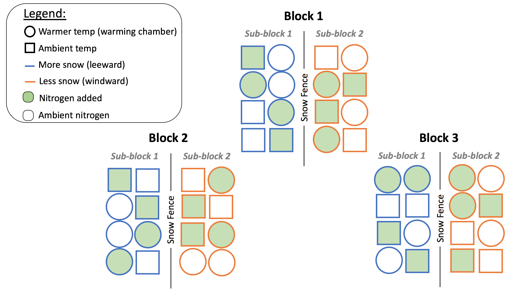

Niwot FFD
================
Kelsey Elwood
10/29/2018

The data I am using for the individual project looks at the first flowering date (FFD) of various alpine species in response to increases in temperature, snowpack, and N. Data was collected for 2007 and 2008, though for now I am only looking at 2008 data. The data is structured with three blocks of 16 plots each. In each block, a snowfence bisects the block to form sub-blocks, with half of the plots on the windward (normal to reduced snowpack) and half of the plots on the leeward (increased snowpack) side of the fence. In each sub-block, 2 plots have warming treatments, 2 plots have increased nitrogen, 2 plots have both warming and increased nitrogen, and 2 plots are left as controls. Figure 1 captures the conceptual layout of the plots.

 ***Figure 1.** The experimental design shows all 48 plots divided into blocks and sub-blocks. Each plot within a sub-block is 1 meter apart. The blocks are approximately 50 meters apart.*

Effectively, there are 2 replicates in 3 blocks for a total of 6 plots with a similar combination of warming, nitrogen, and snow. I will refer to the combination types using the plot "Code", which can is defined in Table 1.

***Table 1.** Plot codes and corresponding manipulations of snow, nitrogen, and temperature.*

| Code | Snow      | Nitrogen  | Temperature |
|------|-----------|-----------|-------------|
| PNW  | Increased | Increased | Warmer      |
| PNX  | Increased | Increased | ------      |
| PXW  | Increased | --------- | Warmer      |
| PXX  | Increased | --------- | ------      |
| XNW  | Decreased | Increased | Warmer      |
| XNX  | Decreased | Increased | ------      |
| XXW  | Decreased | --------- | Warmer      |
| XXX  | Decreased | --------- | ------      |

The following code works step-by-step through some exploratory data analysis (EDA):

1. Load libraries
-----------------

``` r
library(dplyr)
library(ggplot2)
library(tibble)
library(tidyr)
library(knitr)
```

2. Load & clean data
--------------------

``` r
nwt_ffd <- read.csv(file = "data/NWT_ITEX_FFD_data_2007-8.csv", na.strings = ".") %>% 
    # only look at year 2008 (not 2007): 
    filter(year ==  "2008") %>% 
    # rename the values to be more true to their meaning:
    mutate(Snow = as.factor(ifelse(Snow == "X", "Reduced_Snowpack", "Increased_Snowpack"))) %>%
    mutate(Temp = as.factor(ifelse(Temp == "X", "Ambient_Temp", "Warmer_Temp"))) %>%
    mutate(N = as.factor(ifelse(N == "X", "Ambient_N", "Increased_N"))) %>% 
    # remove 2 unnecessary (and empty) columns
    select(-c("X", "X.1")) 
```

3. Tidy data
------------

``` r
# convert from data frame to tibble
nwt_ffd_tib <- as_data_frame(nwt_ffd)
class(nwt_ffd_tib)
```

    ## [1] "tbl_df"     "tbl"        "data.frame"

``` r
str(nwt_ffd_tib)
```

    ## Classes 'tbl_df', 'tbl' and 'data.frame':    48 obs. of  35 variables:
    ##  $ year  : int  2008 2008 2008 2008 2008 2008 2008 2008 2008 2008 ...
    ##  $ Block : int  1 1 1 1 1 1 1 1 1 1 ...
    ##  $ Plot  : int  1 2 3 4 5 6 7 8 9 10 ...
    ##  $ Code  : Factor w/ 8 levels "PNW","PNX","PXW",..: 7 5 5 8 6 8 6 7 1 2 ...
    ##  $ Snow  : Factor w/ 2 levels "Increased_Snowpack",..: 2 2 2 2 2 2 2 2 1 1 ...
    ##  $ Temp  : Factor w/ 2 levels "Ambient_Temp",..: 2 2 2 1 1 1 1 2 2 1 ...
    ##  $ N     : Factor w/ 2 levels "Ambient_N","Increased_N": 1 2 2 1 2 1 2 1 2 2 ...
    ##  $ ACOROS: int  182 185 182 182 182 182 182 185 182 182 ...
    ##  $ ARTSCO: int  NA NA NA NA NA NA NA NA NA NA ...
    ##  $ BISBIS: int  193 190 190 193 183 185 185 193 190 183 ...
    ##  $ BISVIV: int  NA NA NA NA NA NA NA NA NA NA ...
    ##  $ CALLEP: int  168 NA 171 NA 168 168 171 NA 171 176 ...
    ##  $ CARsp : int  NA NA NA NA NA NA NA NA NA NA ...
    ##  $ CARSCO: int  182 NA NA NA 185 185 NA NA NA 203 ...
    ##  $ CASOCC: int  NA NA NA NA NA NA NA NA NA NA ...
    ##  $ CHIJAM: int  NA NA NA NA NA NA NA NA NA NA ...
    ##  $ DESCAE: int  190 190 183 190 185 190 190 190 183 190 ...
    ##  $ ERISIM: int  NA NA NA NA NA NA NA NA NA NA ...
    ##  $ GENALG: int  NA NA NA NA NA NA NA NA NA NA ...
    ##  $ LEWPYG: int  NA NA NA NA NA NA NA NA NA NA ...
    ##  $ LLOSER: int  NA NA NA NA NA NA NA NA NA NA ...
    ##  $ MERLAN: int  NA NA NA NA NA NA NA NA NA NA ...
    ##  $ PEDGRO: int  NA NA NA NA NA NA NA NA NA NA ...
    ##  $ POTDIV: int  NA NA NA NA NA NA NA NA NA NA ...
    ##  $ RHOINT: int  NA NA NA NA NA NA NA NA NA NA ...
    ##  $ SALsp : int  NA NA NA NA NA NA NA NA NA NA ...
    ##  $ TRIPAR: int  NA NA NA NA NA NA NA NA NA NA ...
    ##  $ TRISPI: int  NA NA NA NA NA NA NA NA NA NA ...
    ##  $ STELON: int  NA NA NA NA NA NA NA NA NA NA ...
    ##  $ FESBRA: int  NA NA NA NA NA NA NA NA NA NA ...
    ##  $ LUZSPI: int  NA NA NA NA NA NA NA NA NA NA ...
    ##  $ JUNsp : int  NA NA NA NA NA NA NA NA NA NA ...
    ##  $ DODPUL: int  NA NA NA NA NA NA NA NA NA NA ...
    ##  $ GENAMA: int  NA NA NA NA NA NA NA NA NA NA ...
    ##  $ POAALP: int  NA NA NA NA NA NA NA NA NA NA ...

4. Explore predictor variables (i.e. "Code", "Snow", "Temp", "N")
-----------------------------------------------------------------

``` r
# Check for unique values
unique(nwt_ffd_tib$Code)
```

    ## [1] XXW XNW XXX XNX PNW PNX PXW PXX
    ## Levels: PNW PNX PXW PXX XNW XNX XXW XXX

``` r
unique(nwt_ffd_tib$Snow)
```

    ## [1] Reduced_Snowpack   Increased_Snowpack
    ## Levels: Increased_Snowpack Reduced_Snowpack

``` r
unique(nwt_ffd_tib$Temp)
```

    ## [1] Warmer_Temp  Ambient_Temp
    ## Levels: Ambient_Temp Warmer_Temp

``` r
unique(nwt_ffd_tib$N)
```

    ## [1] Ambient_N   Increased_N
    ## Levels: Ambient_N Increased_N

5. Explore response variables
-----------------------------

Although my data has the first flowering date (FFD) of many species, I'm going to start by focusing on only one (*Geum rossii*, a.k.a. "ACOROS").

``` r
ACOROS_FFD <- nwt_ffd_tib$ACOROS
summary(ACOROS_FFD)
```

    ##    Min. 1st Qu.  Median    Mean 3rd Qu.    Max.    NA's 
    ##   176.0   182.0   182.0   183.8   185.0   198.0       4

*Summarize FFD for plot types*

``` r
# Summary statistics
nwt_ffd_summary <-
    nwt_ffd_tib %>%
    group_by(Code) %>%
    summarize(mean=mean(ACOROS, na.rm = TRUE),
              sd=sd(ACOROS, na.rm = TRUE),
              min=min(ACOROS, na.rm = TRUE),
              max=max(ACOROS, na.rm = TRUE)) %>% 
    mutate(se = sd/sqrt(length(sd)))
```

``` r
# Create normal fitted
norm_df <- NULL
for ( i in 1:8 ) {
    x <- seq(nwt_ffd_summary$min[i],nwt_ffd_summary$max[i],length.out = 100)
    y <- dnorm(x, nwt_ffd_summary$mean[i], nwt_ffd_summary$sd[i])
    norm_df <- rbind(norm_df,data.frame(x,y,Code=nwt_ffd_summary$Code[i]))
}
rm(x,y) #clean up
summary(norm_df)
```

    ##        x               y                Code    
    ##  Min.   :176.0   Min.   :0.01372   PNW    :100  
    ##  1st Qu.:182.9   1st Qu.:0.06172   PNX    :100  
    ##  Median :184.2   Median :0.10259   PXW    :100  
    ##  Mean   :185.1   Mean   :0.12623   PXX    :100  
    ##  3rd Qu.:186.9   3rd Qu.:0.19581   XNW    :100  
    ##  Max.   :198.0   Max.   :0.32571   XNX    :100  
    ##                                    (Other):200

``` r
norm_df <- arrange(norm_df, x)
plot(norm_df$x, norm_df$y)
```


``` r
ggplot() +
    geom_histogram(data = nwt_ffd_tib, mapping = aes(x = ACOROS, y = stat(density)), binwidth = 4) + 
    geom_density(data = nwt_ffd_tib, mapping = aes(x = ACOROS), col = "darkblue") +
    labs(title = "Figure 2",
         x = "FFD of Geum rossii")
```

 ***Figure 2.** A histogram of FFD across all plots.*

``` r
p3 <- ggplot(data = nwt_ffd_tib) +
    geom_histogram(mapping = aes(x = ACOROS, y = stat(density), fill = Snow,), position = "identity", alpha = 0.5, na.rm = TRUE, binwidth = 3) + 
    geom_density(mapping = aes(x = ACOROS, col = Snow)) +
    facet_grid(N ~ Temp) +
    ggtitle("Figure 3.1") + 
    labs(title = "Figure 3.", 
         subtitle = "FFD as a function of Snowpack, Temperature, and Nitrogen",
         x = "FFD of Geum rossii")

p3
```

 ***Figure 3** A density histogram of FFD as a function of Snowpack, Temperature, and Nitrogen with a density smoother overlaid.*

Let's look at the data a few more ways...

``` r
p4 <- ggplot(data = nwt_ffd_tib) +
    geom_histogram(mapping = aes(x = ACOROS, y = stat(density), fill = Code), position = "identity", alpha = 0.5, na.rm = TRUE, binwidth = 4, stat = "density") + 
    ggtitle("Figure 3") + 
    labs(title = "Figure 4", 
         subtitle = "FFD of all 8 types of plots",
         x = "FFD of Geum rossii")

p4
```

 ***Figure 4** A density plot of FFD in each of the 8 different types of plots (combinations of snow, nitrogen, and temperature).*

``` r
p5 <- ggplot(data = nwt_ffd_tib, aes(Code, ACOROS, fill = Code, col = Code)) +
  stat_summary(geom = "point", fun.y = mean, position = "dodge") +
  stat_summary(geom = "errorbar", fun.data = mean_se, position = "dodge") + 
    labs(title = "Figure 5",
         subtitle = "First flowering data of each plot type",
         x = "Plot code",
         y = "First flowering date of Geum rossii") +
    scale_y_discrete(limits = c(180:190))
p5
```

 ***Figure 5.** Mean and SE of FFD for all plot types.*

``` r
# Summary statistics for Snow
nwt_ffd_snow_summary <-
    nwt_ffd_tib %>%
    group_by(Snow) %>% 
    summarize(mean=mean(ACOROS, na.rm = TRUE),
              sd=sd(ACOROS, na.rm = TRUE),
              min=min(ACOROS, na.rm = TRUE),
              max=max(ACOROS, na.rm = TRUE))
nwt_ffd_snow_summary
```

    ## # A tibble: 2 x 5
    ##   Snow                mean    sd   min   max
    ##   <fct>              <dbl> <dbl> <dbl> <dbl>
    ## 1 Increased_Snowpack  185.  3.86   182   198
    ## 2 Reduced_Snowpack    183.  2.97   176   193

``` r
# Summary statistics for Temp
nwt_ffd_temp_summary <-
    nwt_ffd_tib %>%
    group_by(Temp) %>% 
    summarize(mean=mean(ACOROS, na.rm = TRUE),
              sd=sd(ACOROS, na.rm = TRUE),
              min=min(ACOROS, na.rm = TRUE),
              max=max(ACOROS, na.rm = TRUE))
nwt_ffd_temp_summary
```

    ## # A tibble: 2 x 5
    ##   Temp          mean    sd   min   max
    ##   <fct>        <dbl> <dbl> <dbl> <dbl>
    ## 1 Ambient_Temp  184.  4.08   176   198
    ## 2 Warmer_Temp   184.  2.87   182   193

``` r
# Summary statistics for N
nwt_ffd_n_summary <-
    nwt_ffd_tib %>%
    group_by(N) %>% 
    summarize(mean=mean(ACOROS, na.rm = TRUE),
              sd=sd(ACOROS, na.rm = TRUE),
              min=min(ACOROS, na.rm = TRUE),
              max=max(ACOROS, na.rm = TRUE))
nwt_ffd_n_summary
```

    ## # A tibble: 2 x 5
    ##   N            mean    sd   min   max
    ##   <fct>       <dbl> <dbl> <dbl> <dbl>
    ## 1 Ambient_N    185.  4.61   176   198
    ## 2 Increased_N  183.  1.98   182   190

``` r
# Violin plot of FFD as a function of Snow alone
ggplot(data = nwt_ffd_tib) +
  geom_violin(mapping = aes(y= as.numeric(ACOROS), x = Snow, fill = Snow))
```


``` r
# Violin plot of FFD as a function of Temp alone
ggplot(data = nwt_ffd_tib) +
  geom_violin(mapping = aes(y= as.numeric(ACOROS), x = Temp, fill = Temp))
```


``` r
# Violin plot of FFD as a function of N alone
ggplot(data = nwt_ffd_tib) +
  geom_violin(mapping = aes(y= as.numeric(ACOROS), x = N, fill = N))
```


Notes from class
----------------

*Think about sample or experimental unit.* In my case, plot is the experimental unit. Plots have either increased or ambient temp and increased or ambient N. The plots are within snow subblocks, within 3 blocks.
*Create a sample size versus mean and se value plot (like in radon).* Not relevant here because the sample size is designed to be consistent. However, it is worthwhile to review the species compositions and check when there is missing data (e.g. ACOROS did not flower in plot 39, 40, 45, 46) --&gt; Conclusion: DESCAE only missing from 1 and therefore may be a better study system? ACOROS = 4 NAs, CALLEP = 8 NA's. Those were the only species that flowered in more than 75% of the plots.

``` r
number_nas_df <- data.frame(ncol = 2, nrow = length(8:35))
colnames(number_nas_df) <- c("Species", "NA_count")
for(i in 8:35) {
    number_nas <- sum(is.na(nwt_ffd_tib[i]))
    rowname <- colnames(nwt_ffd_tib[i])
    number_nas_df[(i-7),1] <- rowname
    number_nas_df[(i-7),2] <- number_nas
}
class(number_nas_df$NA_count)
```

    ## [1] "integer"

``` r
arrange(number_nas_df, NA_count)
```

    ##    Species NA_count
    ## 1   DESCAE        1
    ## 2   ACOROS        4
    ## 3   CALLEP        8
    ## 4   BISBIS       12
    ## 5   CARSCO       33
    ## 6   ARTSCO       48
    ## 7   BISVIV       48
    ## 8    CARsp       48
    ## 9   CASOCC       48
    ## 10  CHIJAM       48
    ## 11  ERISIM       48
    ## 12  GENALG       48
    ## 13  LEWPYG       48
    ## 14  LLOSER       48
    ## 15  MERLAN       48
    ## 16  PEDGRO       48
    ## 17  POTDIV       48
    ## 18  RHOINT       48
    ## 19   SALsp       48
    ## 20  TRIPAR       48
    ## 21  TRISPI       48
    ## 22  STELON       48
    ## 23  FESBRA       48
    ## 24  LUZSPI       48
    ## 25   JUNsp       48
    ## 26  DODPUL       48
    ## 27  GENAMA       48
    ## 28  POAALP       48

*Think about the lmer() function from radon (partial pooling):*
house-level model: y\_i ~ N(mu\_j\[i\], sigma^2) --&gt; mu\_j\[i\] translates to... for a particular house (i), the mean depends on what county (j) you are in. Another way... the county j where house i is located. When understanding the output from radon, the "Residual" random effect represents the variance among houses. For example, when the output says that the county variance is 0.1 and the residual variance is 0.6, that means there is 6x more variance among houses in the county than among counties. But beware, it is still possible that the variance could still be driven by county-level differences. mu = the county mean radon level
county-level model: mu\_j ~ N(mu, sigma^2)

Exploration with other (all?) species
=====================================

``` r
# To do this, we first need to convert the data frame to have a column for "species" and a column for "FFD"
species_list <- colnames(nwt_ffd_tib[,8:35])
nwt_ffd_tib2 <- nwt_ffd_tib %>% 
    gather(species_list, key = "Species", value = "FFD")
```

``` r
# Summary statistics
nwt_ffd_summary_all <-
    nwt_ffd_tib2 %>%
    group_by(Code) %>% 
    summarize(mean=mean(FFD, na.rm = TRUE),
              sd=sd(FFD, na.rm = TRUE),
              min=min(FFD, na.rm = TRUE),
              max=max(FFD, na.rm = TRUE)) %>% 
    mutate(se = sd/sqrt(length(sd)))
nwt_ffd_summary_all
```

    ## # A tibble: 8 x 6
    ##   Code   mean    sd   min   max    se
    ##   <fct> <dbl> <dbl> <dbl> <dbl> <dbl>
    ## 1 PNW    182.  8.48   168   198  3.00
    ## 2 PNX    184.  9.06   168   203  3.20
    ## 3 PXW    183.  8.74   168   203  3.09
    ## 4 PXX    183.  9.50   168   198  3.36
    ## 5 XNW    181.  9.12   162   198  3.23
    ## 6 XNX    182.  9.99   165   203  3.53
    ## 7 XXW    184.  9.09   168   198  3.21
    ## 8 XXX    182.  8.94   162   193  3.16

``` r
p6 <- nwt_ffd_tib2 %>%
    group_by(Species) %>% 
    drop_na() %>% 
    ggplot(aes(Code, FFD, fill = Code, col = Code)) +
  stat_summary(geom = "point", fun.y = mean, position = "dodge") +
  stat_summary(geom = "errorbar", fun.data = mean_se, position = "dodge") + 
    facet_wrap(~ Species) + 
    labs(title = "Figure 6",
         subtitle = "First flowering date of each species of each plot type",
         x = "Plot code",
         y = "First flowering date")
p6
```

 ***Figure 6.** The 5 species with multiple observations across the plots are represented hear with the mean and SE of the first flowering date.*
