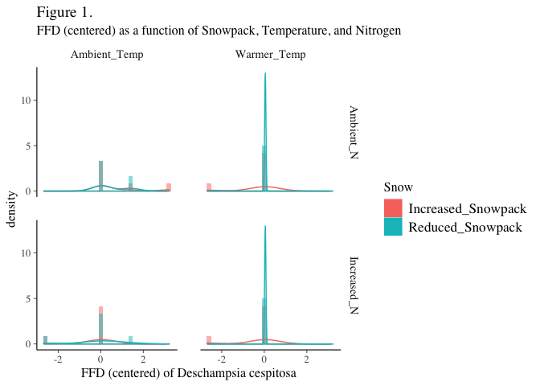
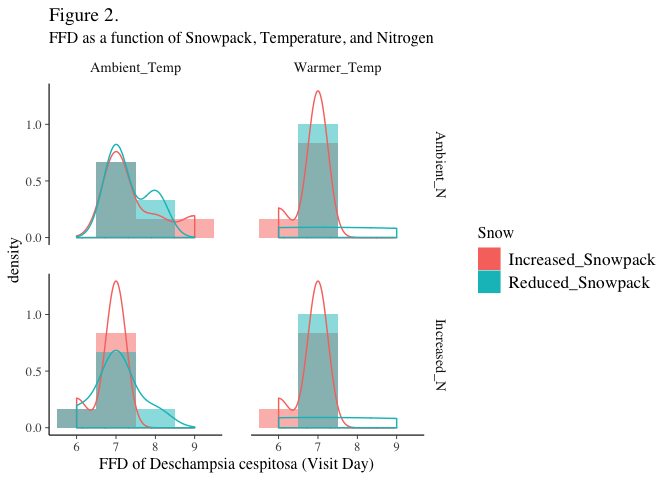

Individual Project: Model Selection
================
Kelsey Elwood
12/20/2018

Preparation
===========

``` r
# Set up for Bayesian analysis (order is important):
library(tidyr)
library(dplyr)
library(lme4)
library(ggplot2)
library(rstanarm)
options(mc.cores = parallel::detectCores())
theme_set(theme_grey()) #rstanarm overrides default ggplot theme: set it back
```

``` r
# Load data
nwt_ffd <- read.csv(file = "data/NWT_ITEX_FFD_data_2007-8.csv", na.strings = ".") %>% 
    
    # create 0,1 vector for values
    mutate(Snow_x = ifelse(Snow == "X", "0", "1")) %>%
    mutate(Temp_x = ifelse(Temp == "X", "0", "1")) %>%
    mutate(N_x = ifelse(N == "X", "0", "1")) %>%   
    
    # rename the values to be more true to their meaning:
    mutate(Snow = as.factor(ifelse(Snow == "X", "Reduced_Snowpack", "Increased_Snowpack"))) %>%
    mutate(Temp = as.factor(ifelse(Temp == "X", "Ambient_Temp", "Warmer_Temp"))) %>%
    mutate(N = as.factor(ifelse(N == "X", "Ambient_N", "Increased_N"))) %>% 
    
    # create a new column for "subblock"
    mutate(Subblock = as.factor(ifelse(Snow == "Reduced_Snowpack", 0, 1))) %>% 
    
    # define "Block" as a factor
    mutate(Block = as.factor(Block)) %>% 
    
    # create a new Block|Subblock column
    mutate(Subblock_ID = as.factor(paste0(Block, "_", Subblock))) %>% 
    
    # remove 2 unnecessary (and empty) columns
    select(-c("X", "X.1")) 

# Convert data frame with species as a vector
nwt_ffd2 <- nwt_ffd %>% 
    gather(key = Species, value = FFD, 8:35, na.rm = TRUE, factor_key = TRUE) %>% 
    mutate(Species = factor(Species)) %>% 
    mutate(log_FFD = log(FFD)) 

# Subset data for 2007 (2008 was incomplete) and centered FFD
nwt_ffd2_2007 <- nwt_ffd2 %>% 
    filter(year == "2007") %>% 
    mutate(FFD_s = scale(FFD))

# create a new column for FFD based on visit number (rather than Julian day)
days_visited <- as.vector(sort(unique(nwt_ffd2_2007$FFD)))
number_visits <- length(days_visited)
Visit <- as.vector(1:number_visits)
visits_df <- data.frame(days_visited, Visit)
nwt_ffd2_2007 <- merge(nwt_ffd2_2007, visits_df, by.x = "FFD", by.y = "days_visited")

# subset of DESCAE (Deschampsia cespitosa) in 2007, with centered FFD
nwt_descae_2007 <- nwt_ffd2 %>% 
    filter(Species == "DESCAE") %>% 
    filter(year == "2007") %>% 
    merge(visits_df, by.x = "FFD", by.y = "days_visited") %>% 
    mutate(FFD_s = scale(FFD))
```

Model Options
=============

### Model 1: N x Temp x Snow for Deschampsia in 2007

The following model is based on the apriori expectations that Nitrogen (N), Temperature (Temp), and Snow (Snow) all contribute to first flowering date (FFD). All interactions between the three explanatory variables are also included as explanatory parameters. First flowering date (FFD) is the response variable. FFD\_s represents the centered values of FFD. Levels include sub-blocks within blocks. Data is a subset of the full dataset and only includes FFD for one species (DESCAE) in one year (2007).

``` r
# Model 1a1: FFD, poisson --> converged (with 2 chains)
unitID <- 1:nrow(nwt_descae_2007) #set this up first, where df is the dataframe name
bayes_NxTxS_descae <- stan_glmer(FFD ~ N*Temp*Snow + (1|Block / Subblock) + (1|unitID), 
                          family = poisson,
                          data = nwt_descae_2007,
                          adapt_delta = 0.9999999999999999,
                          chains = 2)
```

    ## 
    ## SAMPLING FOR MODEL 'count' NOW (CHAIN 1).
    ## 
    ## Gradient evaluation took 0.000219 seconds
    ## 1000 transitions using 10 leapfrog steps per transition would take 2.19 seconds.
    ## Adjust your expectations accordingly!
    ## 
    ## 
    ## Iteration:    1 / 2000 [  0%]  (Warmup)
    ## Iteration:  200 / 2000 [ 10%]  (Warmup)
    ## Iteration:  400 / 2000 [ 20%]  (Warmup)
    ## Iteration:  600 / 2000 [ 30%]  (Warmup)
    ## Iteration:  800 / 2000 [ 40%]  (Warmup)
    ## Iteration: 1000 / 2000 [ 50%]  (Warmup)
    ## Iteration: 1001 / 2000 [ 50%]  (Sampling)
    ## Iteration: 1200 / 2000 [ 60%]  (Sampling)
    ## Iteration: 1400 / 2000 [ 70%]  (Sampling)
    ## Iteration: 1600 / 2000 [ 80%]  (Sampling)
    ## Iteration: 1800 / 2000 [ 90%]  (Sampling)
    ## Iteration: 2000 / 2000 [100%]  (Sampling)
    ## 
    ##  Elapsed Time: 4.70123 seconds (Warm-up)
    ##                5.39516 seconds (Sampling)
    ##                10.0964 seconds (Total)
    ## 
    ## 
    ## SAMPLING FOR MODEL 'count' NOW (CHAIN 2).
    ## 
    ## Gradient evaluation took 2.8e-05 seconds
    ## 1000 transitions using 10 leapfrog steps per transition would take 0.28 seconds.
    ## Adjust your expectations accordingly!
    ## 
    ## 
    ## Iteration:    1 / 2000 [  0%]  (Warmup)
    ## Iteration:  200 / 2000 [ 10%]  (Warmup)
    ## Iteration:  400 / 2000 [ 20%]  (Warmup)
    ## Iteration:  600 / 2000 [ 30%]  (Warmup)
    ## Iteration:  800 / 2000 [ 40%]  (Warmup)
    ## Iteration: 1000 / 2000 [ 50%]  (Warmup)
    ## Iteration: 1001 / 2000 [ 50%]  (Sampling)
    ## Iteration: 1200 / 2000 [ 60%]  (Sampling)
    ## Iteration: 1400 / 2000 [ 70%]  (Sampling)
    ## Iteration: 1600 / 2000 [ 80%]  (Sampling)
    ## Iteration: 1800 / 2000 [ 90%]  (Sampling)
    ## Iteration: 2000 / 2000 [100%]  (Sampling)
    ## 
    ##  Elapsed Time: 5.13476 seconds (Warm-up)
    ##                3.38727 seconds (Sampling)
    ##                8.52202 seconds (Total)

    ## Warning: There were 10 divergent transitions after warmup. Increasing adapt_delta above 1 may help. See
    ## http://mc-stan.org/misc/warnings.html#divergent-transitions-after-warmup

    ## Warning: Examine the pairs() plot to diagnose sampling problems

``` r
vcov(bayes_NxTxS_descae, correlation=TRUE)
```

    ##                                                   (Intercept) NIncreased_N
    ## (Intercept)                                         1.0000000   -0.2390931
    ## NIncreased_N                                       -0.2390931    1.0000000
    ## TempWarmer_Temp                                    -0.2795554    0.4866404
    ## SnowReduced_Snowpack                               -0.3624003    0.3998223
    ## NIncreased_N:TempWarmer_Temp                        0.1876866   -0.6917419
    ## NIncreased_N:SnowReduced_Snowpack                   0.1747511   -0.7094151
    ## TempWarmer_Temp:SnowReduced_Snowpack                0.1860162   -0.3472981
    ## NIncreased_N:TempWarmer_Temp:SnowReduced_Snowpack  -0.1361593    0.4841657
    ##                                                   TempWarmer_Temp
    ## (Intercept)                                            -0.2795554
    ## NIncreased_N                                            0.4866404
    ## TempWarmer_Temp                                         1.0000000
    ## SnowReduced_Snowpack                                    0.3796576
    ## NIncreased_N:TempWarmer_Temp                           -0.7034030
    ## NIncreased_N:SnowReduced_Snowpack                      -0.3366126
    ## TempWarmer_Temp:SnowReduced_Snowpack                   -0.7032239
    ## NIncreased_N:TempWarmer_Temp:SnowReduced_Snowpack       0.4887450
    ##                                                   SnowReduced_Snowpack
    ## (Intercept)                                                 -0.3624003
    ## NIncreased_N                                                 0.3998223
    ## TempWarmer_Temp                                              0.3796576
    ## SnowReduced_Snowpack                                         1.0000000
    ## NIncreased_N:TempWarmer_Temp                                -0.2722955
    ## NIncreased_N:SnowReduced_Snowpack                           -0.5604870
    ## TempWarmer_Temp:SnowReduced_Snowpack                        -0.5518212
    ## NIncreased_N:TempWarmer_Temp:SnowReduced_Snowpack            0.3770054
    ##                                                   NIncreased_N:TempWarmer_Temp
    ## (Intercept)                                                          0.1876866
    ## NIncreased_N                                                        -0.6917419
    ## TempWarmer_Temp                                                     -0.7034030
    ## SnowReduced_Snowpack                                                -0.2722955
    ## NIncreased_N:TempWarmer_Temp                                         1.0000000
    ## NIncreased_N:SnowReduced_Snowpack                                    0.5029996
    ## TempWarmer_Temp:SnowReduced_Snowpack                                 0.5093388
    ## NIncreased_N:TempWarmer_Temp:SnowReduced_Snowpack                   -0.7079681
    ##                                                   NIncreased_N:SnowReduced_Snowpack
    ## (Intercept)                                                               0.1747511
    ## NIncreased_N                                                             -0.7094151
    ## TempWarmer_Temp                                                          -0.3366126
    ## SnowReduced_Snowpack                                                     -0.5604870
    ## NIncreased_N:TempWarmer_Temp                                              0.5029996
    ## NIncreased_N:SnowReduced_Snowpack                                         1.0000000
    ## TempWarmer_Temp:SnowReduced_Snowpack                                      0.4706057
    ## NIncreased_N:TempWarmer_Temp:SnowReduced_Snowpack                        -0.6964407
    ##                                                   TempWarmer_Temp:SnowReduced_Snowpack
    ## (Intercept)                                                                  0.1860162
    ## NIncreased_N                                                                -0.3472981
    ## TempWarmer_Temp                                                             -0.7032239
    ## SnowReduced_Snowpack                                                        -0.5518212
    ## NIncreased_N:TempWarmer_Temp                                                 0.5093388
    ## NIncreased_N:SnowReduced_Snowpack                                            0.4706057
    ## TempWarmer_Temp:SnowReduced_Snowpack                                         1.0000000
    ## NIncreased_N:TempWarmer_Temp:SnowReduced_Snowpack                           -0.6980273
    ##                                                   NIncreased_N:TempWarmer_Temp:SnowReduced_Snowpack
    ## (Intercept)                                                                              -0.1361593
    ## NIncreased_N                                                                              0.4841657
    ## TempWarmer_Temp                                                                           0.4887450
    ## SnowReduced_Snowpack                                                                      0.3770054
    ## NIncreased_N:TempWarmer_Temp                                                             -0.7079681
    ## NIncreased_N:SnowReduced_Snowpack                                                        -0.6964407
    ## TempWarmer_Temp:SnowReduced_Snowpack                                                     -0.6980273
    ## NIncreased_N:TempWarmer_Temp:SnowReduced_Snowpack                                         1.0000000

``` r
# Model 1a2: Visit, poisson --> converged!
bayes_NxTxS_descae_visit <- stan_glmer(Visit ~ N*Temp*Snow + (1|Block / Subblock) + (1|unitID), 
                          family = poisson,
                          data = nwt_descae_2007,
                          adapt_delta = 0.99999999)
```

    ## 
    ## SAMPLING FOR MODEL 'count' NOW (CHAIN 1).
    ## 
    ## Gradient evaluation took 7.2e-05 seconds
    ## 1000 transitions using 10 leapfrog steps per transition would take 0.72 seconds.
    ## Adjust your expectations accordingly!
    ## 
    ## 
    ## Iteration:    1 / 2000 [  0%]  (Warmup)
    ## Iteration:  200 / 2000 [ 10%]  (Warmup)
    ## Iteration:  400 / 2000 [ 20%]  (Warmup)
    ## Iteration:  600 / 2000 [ 30%]  (Warmup)
    ## Iteration:  800 / 2000 [ 40%]  (Warmup)
    ## Iteration: 1000 / 2000 [ 50%]  (Warmup)
    ## Iteration: 1001 / 2000 [ 50%]  (Sampling)
    ## Iteration: 1200 / 2000 [ 60%]  (Sampling)
    ## Iteration: 1400 / 2000 [ 70%]  (Sampling)
    ## Iteration: 1600 / 2000 [ 80%]  (Sampling)
    ## Iteration: 1800 / 2000 [ 90%]  (Sampling)
    ## Iteration: 2000 / 2000 [100%]  (Sampling)
    ## 
    ##  Elapsed Time: 5.23944 seconds (Warm-up)
    ##                4.10386 seconds (Sampling)
    ##                9.3433 seconds (Total)
    ## 
    ## 
    ## SAMPLING FOR MODEL 'count' NOW (CHAIN 2).
    ## 
    ## Gradient evaluation took 3.1e-05 seconds
    ## 1000 transitions using 10 leapfrog steps per transition would take 0.31 seconds.
    ## Adjust your expectations accordingly!
    ## 
    ## 
    ## Iteration:    1 / 2000 [  0%]  (Warmup)
    ## Iteration:  200 / 2000 [ 10%]  (Warmup)
    ## Iteration:  400 / 2000 [ 20%]  (Warmup)
    ## Iteration:  600 / 2000 [ 30%]  (Warmup)
    ## Iteration:  800 / 2000 [ 40%]  (Warmup)
    ## Iteration: 1000 / 2000 [ 50%]  (Warmup)
    ## Iteration: 1001 / 2000 [ 50%]  (Sampling)
    ## Iteration: 1200 / 2000 [ 60%]  (Sampling)
    ## Iteration: 1400 / 2000 [ 70%]  (Sampling)
    ## Iteration: 1600 / 2000 [ 80%]  (Sampling)
    ## Iteration: 1800 / 2000 [ 90%]  (Sampling)
    ## Iteration: 2000 / 2000 [100%]  (Sampling)
    ## 
    ##  Elapsed Time: 5.59474 seconds (Warm-up)
    ##                4.56773 seconds (Sampling)
    ##                10.1625 seconds (Total)
    ## 
    ## 
    ## SAMPLING FOR MODEL 'count' NOW (CHAIN 3).
    ## 
    ## Gradient evaluation took 3.3e-05 seconds
    ## 1000 transitions using 10 leapfrog steps per transition would take 0.33 seconds.
    ## Adjust your expectations accordingly!
    ## 
    ## 
    ## Iteration:    1 / 2000 [  0%]  (Warmup)
    ## Iteration:  200 / 2000 [ 10%]  (Warmup)
    ## Iteration:  400 / 2000 [ 20%]  (Warmup)
    ## Iteration:  600 / 2000 [ 30%]  (Warmup)
    ## Iteration:  800 / 2000 [ 40%]  (Warmup)
    ## Iteration: 1000 / 2000 [ 50%]  (Warmup)
    ## Iteration: 1001 / 2000 [ 50%]  (Sampling)
    ## Iteration: 1200 / 2000 [ 60%]  (Sampling)
    ## Iteration: 1400 / 2000 [ 70%]  (Sampling)
    ## Iteration: 1600 / 2000 [ 80%]  (Sampling)
    ## Iteration: 1800 / 2000 [ 90%]  (Sampling)
    ## Iteration: 2000 / 2000 [100%]  (Sampling)
    ## 
    ##  Elapsed Time: 3.15935 seconds (Warm-up)
    ##                3.09288 seconds (Sampling)
    ##                6.25222 seconds (Total)
    ## 
    ## 
    ## SAMPLING FOR MODEL 'count' NOW (CHAIN 4).
    ## 
    ## Gradient evaluation took 5.5e-05 seconds
    ## 1000 transitions using 10 leapfrog steps per transition would take 0.55 seconds.
    ## Adjust your expectations accordingly!
    ## 
    ## 
    ## Iteration:    1 / 2000 [  0%]  (Warmup)
    ## Iteration:  200 / 2000 [ 10%]  (Warmup)
    ## Iteration:  400 / 2000 [ 20%]  (Warmup)
    ## Iteration:  600 / 2000 [ 30%]  (Warmup)
    ## Iteration:  800 / 2000 [ 40%]  (Warmup)
    ## Iteration: 1000 / 2000 [ 50%]  (Warmup)
    ## Iteration: 1001 / 2000 [ 50%]  (Sampling)
    ## Iteration: 1200 / 2000 [ 60%]  (Sampling)
    ## Iteration: 1400 / 2000 [ 70%]  (Sampling)
    ## Iteration: 1600 / 2000 [ 80%]  (Sampling)
    ## Iteration: 1800 / 2000 [ 90%]  (Sampling)
    ## Iteration: 2000 / 2000 [100%]  (Sampling)
    ## 
    ##  Elapsed Time: 4.75691 seconds (Warm-up)
    ##                2.77621 seconds (Sampling)
    ##                7.53311 seconds (Total)

``` r
vcov(bayes_NxTxS_descae_visit, correlation=TRUE)
```

    ##                                                   (Intercept) NIncreased_N
    ## (Intercept)                                         1.0000000   -0.4534872
    ## NIncreased_N                                       -0.4534872    1.0000000
    ## TempWarmer_Temp                                    -0.4469612    0.4486038
    ## SnowReduced_Snowpack                               -0.5238371    0.4217724
    ## NIncreased_N:TempWarmer_Temp                        0.2985913   -0.6842055
    ## NIncreased_N:SnowReduced_Snowpack                   0.3197209   -0.6976189
    ## TempWarmer_Temp:SnowReduced_Snowpack                0.2901463   -0.2919737
    ## NIncreased_N:TempWarmer_Temp:SnowReduced_Snowpack  -0.1945127    0.4700519
    ##                                                   TempWarmer_Temp
    ## (Intercept)                                            -0.4469612
    ## NIncreased_N                                            0.4486038
    ## TempWarmer_Temp                                         1.0000000
    ## SnowReduced_Snowpack                                    0.4164405
    ## NIncreased_N:TempWarmer_Temp                           -0.6742739
    ## NIncreased_N:SnowReduced_Snowpack                      -0.3152499
    ## TempWarmer_Temp:SnowReduced_Snowpack                   -0.6666878
    ## NIncreased_N:TempWarmer_Temp:SnowReduced_Snowpack       0.4448240
    ##                                                   SnowReduced_Snowpack
    ## (Intercept)                                                 -0.5238371
    ## NIncreased_N                                                 0.4217724
    ## TempWarmer_Temp                                              0.4164405
    ## SnowReduced_Snowpack                                         1.0000000
    ## NIncreased_N:TempWarmer_Temp                                -0.2937303
    ## NIncreased_N:SnowReduced_Snowpack                           -0.6137753
    ## TempWarmer_Temp:SnowReduced_Snowpack                        -0.6049949
    ## NIncreased_N:TempWarmer_Temp:SnowReduced_Snowpack            0.4286019
    ##                                                   NIncreased_N:TempWarmer_Temp
    ## (Intercept)                                                          0.2985913
    ## NIncreased_N                                                        -0.6842055
    ## TempWarmer_Temp                                                     -0.6742739
    ## SnowReduced_Snowpack                                                -0.2937303
    ## NIncreased_N:TempWarmer_Temp                                         1.0000000
    ## NIncreased_N:SnowReduced_Snowpack                                    0.4864123
    ## TempWarmer_Temp:SnowReduced_Snowpack                                 0.4549334
    ## NIncreased_N:TempWarmer_Temp:SnowReduced_Snowpack                   -0.6872244
    ##                                                   NIncreased_N:SnowReduced_Snowpack
    ## (Intercept)                                                               0.3197209
    ## NIncreased_N                                                             -0.6976189
    ## TempWarmer_Temp                                                          -0.3152499
    ## SnowReduced_Snowpack                                                     -0.6137753
    ## NIncreased_N:TempWarmer_Temp                                              0.4864123
    ## NIncreased_N:SnowReduced_Snowpack                                         1.0000000
    ## TempWarmer_Temp:SnowReduced_Snowpack                                      0.4605784
    ## NIncreased_N:TempWarmer_Temp:SnowReduced_Snowpack                        -0.7005547
    ##                                                   TempWarmer_Temp:SnowReduced_Snowpack
    ## (Intercept)                                                                  0.2901463
    ## NIncreased_N                                                                -0.2919737
    ## TempWarmer_Temp                                                             -0.6666878
    ## SnowReduced_Snowpack                                                        -0.6049949
    ## NIncreased_N:TempWarmer_Temp                                                 0.4549334
    ## NIncreased_N:SnowReduced_Snowpack                                            0.4605784
    ## TempWarmer_Temp:SnowReduced_Snowpack                                         1.0000000
    ## NIncreased_N:TempWarmer_Temp:SnowReduced_Snowpack                           -0.6830246
    ##                                                   NIncreased_N:TempWarmer_Temp:SnowReduced_Snowpack
    ## (Intercept)                                                                              -0.1945127
    ## NIncreased_N                                                                              0.4700519
    ## TempWarmer_Temp                                                                           0.4448240
    ## SnowReduced_Snowpack                                                                      0.4286019
    ## NIncreased_N:TempWarmer_Temp                                                             -0.6872244
    ## NIncreased_N:SnowReduced_Snowpack                                                        -0.7005547
    ## TempWarmer_Temp:SnowReduced_Snowpack                                                     -0.6830246
    ## NIncreased_N:TempWarmer_Temp:SnowReduced_Snowpack                                         1.0000000

``` r
# Model 1b: FFD, gaussian
start_time <- Sys.time()
bayes_NxTxS_descae2 <- stan_glmer(FFD ~ N*Temp*Snow + (1|Block / Subblock), 
                          family = gaussian,
                          data = nwt_descae_2007,
                          adapt_delta = 0.999999)
```

    ## 
    ## SAMPLING FOR MODEL 'continuous' NOW (CHAIN 1).
    ## 
    ## Gradient evaluation took 7.1e-05 seconds
    ## 1000 transitions using 10 leapfrog steps per transition would take 0.71 seconds.
    ## Adjust your expectations accordingly!
    ## 
    ## 
    ## Iteration:    1 / 2000 [  0%]  (Warmup)
    ## Iteration:  200 / 2000 [ 10%]  (Warmup)
    ## Iteration:  400 / 2000 [ 20%]  (Warmup)
    ## Iteration:  600 / 2000 [ 30%]  (Warmup)
    ## Iteration:  800 / 2000 [ 40%]  (Warmup)
    ## Iteration: 1000 / 2000 [ 50%]  (Warmup)
    ## Iteration: 1001 / 2000 [ 50%]  (Sampling)
    ## Iteration: 1200 / 2000 [ 60%]  (Sampling)
    ## Iteration: 1400 / 2000 [ 70%]  (Sampling)
    ## Iteration: 1600 / 2000 [ 80%]  (Sampling)
    ## Iteration: 1800 / 2000 [ 90%]  (Sampling)
    ## Iteration: 2000 / 2000 [100%]  (Sampling)
    ## 
    ##  Elapsed Time: 4.33124 seconds (Warm-up)
    ##                1.62282 seconds (Sampling)
    ##                5.95406 seconds (Total)
    ## 
    ## 
    ## SAMPLING FOR MODEL 'continuous' NOW (CHAIN 2).
    ## 
    ## Gradient evaluation took 3.3e-05 seconds
    ## 1000 transitions using 10 leapfrog steps per transition would take 0.33 seconds.
    ## Adjust your expectations accordingly!
    ## 
    ## 
    ## Iteration:    1 / 2000 [  0%]  (Warmup)
    ## Iteration:  200 / 2000 [ 10%]  (Warmup)
    ## Iteration:  400 / 2000 [ 20%]  (Warmup)
    ## Iteration:  600 / 2000 [ 30%]  (Warmup)
    ## Iteration:  800 / 2000 [ 40%]  (Warmup)
    ## Iteration: 1000 / 2000 [ 50%]  (Warmup)
    ## Iteration: 1001 / 2000 [ 50%]  (Sampling)
    ## Iteration: 1200 / 2000 [ 60%]  (Sampling)
    ## Iteration: 1400 / 2000 [ 70%]  (Sampling)
    ## Iteration: 1600 / 2000 [ 80%]  (Sampling)
    ## Iteration: 1800 / 2000 [ 90%]  (Sampling)
    ## Iteration: 2000 / 2000 [100%]  (Sampling)
    ## 
    ##  Elapsed Time: 8.6917 seconds (Warm-up)
    ##                1.77637 seconds (Sampling)
    ##                10.4681 seconds (Total)
    ## 
    ## 
    ## SAMPLING FOR MODEL 'continuous' NOW (CHAIN 3).
    ## 
    ## Gradient evaluation took 2.3e-05 seconds
    ## 1000 transitions using 10 leapfrog steps per transition would take 0.23 seconds.
    ## Adjust your expectations accordingly!
    ## 
    ## 
    ## Iteration:    1 / 2000 [  0%]  (Warmup)
    ## Iteration:  200 / 2000 [ 10%]  (Warmup)
    ## Iteration:  400 / 2000 [ 20%]  (Warmup)
    ## Iteration:  600 / 2000 [ 30%]  (Warmup)
    ## Iteration:  800 / 2000 [ 40%]  (Warmup)
    ## Iteration: 1000 / 2000 [ 50%]  (Warmup)
    ## Iteration: 1001 / 2000 [ 50%]  (Sampling)
    ## Iteration: 1200 / 2000 [ 60%]  (Sampling)
    ## Iteration: 1400 / 2000 [ 70%]  (Sampling)
    ## Iteration: 1600 / 2000 [ 80%]  (Sampling)
    ## Iteration: 1800 / 2000 [ 90%]  (Sampling)
    ## Iteration: 2000 / 2000 [100%]  (Sampling)
    ## 
    ##  Elapsed Time: 10.1484 seconds (Warm-up)
    ##                1.4438 seconds (Sampling)
    ##                11.5922 seconds (Total)
    ## 
    ## 
    ## SAMPLING FOR MODEL 'continuous' NOW (CHAIN 4).
    ## 
    ## Gradient evaluation took 2.2e-05 seconds
    ## 1000 transitions using 10 leapfrog steps per transition would take 0.22 seconds.
    ## Adjust your expectations accordingly!
    ## 
    ## 
    ## Iteration:    1 / 2000 [  0%]  (Warmup)
    ## Iteration:  200 / 2000 [ 10%]  (Warmup)
    ## Iteration:  400 / 2000 [ 20%]  (Warmup)
    ## Iteration:  600 / 2000 [ 30%]  (Warmup)
    ## Iteration:  800 / 2000 [ 40%]  (Warmup)
    ## Iteration: 1000 / 2000 [ 50%]  (Warmup)
    ## Iteration: 1001 / 2000 [ 50%]  (Sampling)
    ## Iteration: 1200 / 2000 [ 60%]  (Sampling)
    ## Iteration: 1400 / 2000 [ 70%]  (Sampling)
    ## Iteration: 1600 / 2000 [ 80%]  (Sampling)
    ## Iteration: 1800 / 2000 [ 90%]  (Sampling)
    ## Iteration: 2000 / 2000 [100%]  (Sampling)
    ## 
    ##  Elapsed Time: 6.49114 seconds (Warm-up)
    ##                2.05995 seconds (Sampling)
    ##                8.55109 seconds (Total)

    ## Warning: There were 2 divergent transitions after warmup. Increasing adapt_delta above 0.999999 may help. See
    ## http://mc-stan.org/misc/warnings.html#divergent-transitions-after-warmup

    ## Warning: Examine the pairs() plot to diagnose sampling problems

``` r
end_time <- Sys.time()
vcov(bayes_NxTxS_descae2, correlation=TRUE)
```

    ##                                                   (Intercept) NIncreased_N
    ## (Intercept)                                         1.0000000   -0.3361067
    ## NIncreased_N                                       -0.3361067    1.0000000
    ## TempWarmer_Temp                                    -0.3502539    0.4462479
    ## SnowReduced_Snowpack                               -0.4282803    0.3343947
    ## NIncreased_N:TempWarmer_Temp                        0.2291774   -0.6586134
    ## NIncreased_N:SnowReduced_Snowpack                   0.1991134   -0.6428127
    ## TempWarmer_Temp:SnowReduced_Snowpack                0.2237810   -0.2571018
    ## NIncreased_N:TempWarmer_Temp:SnowReduced_Snowpack  -0.1309551    0.4055812
    ##                                                   TempWarmer_Temp
    ## (Intercept)                                            -0.3502539
    ## NIncreased_N                                            0.4462479
    ## TempWarmer_Temp                                         1.0000000
    ## SnowReduced_Snowpack                                    0.3402723
    ## NIncreased_N:TempWarmer_Temp                           -0.6792487
    ## NIncreased_N:SnowReduced_Snowpack                      -0.2673452
    ## TempWarmer_Temp:SnowReduced_Snowpack                   -0.6671822
    ## NIncreased_N:TempWarmer_Temp:SnowReduced_Snowpack       0.4464854
    ##                                                   SnowReduced_Snowpack
    ## (Intercept)                                                 -0.4282803
    ## NIncreased_N                                                 0.3343947
    ## TempWarmer_Temp                                              0.3402723
    ## SnowReduced_Snowpack                                         1.0000000
    ## NIncreased_N:TempWarmer_Temp                                -0.1823827
    ## NIncreased_N:SnowReduced_Snowpack                           -0.5067664
    ## TempWarmer_Temp:SnowReduced_Snowpack                        -0.5163909
    ## NIncreased_N:TempWarmer_Temp:SnowReduced_Snowpack            0.3157256
    ##                                                   NIncreased_N:TempWarmer_Temp
    ## (Intercept)                                                          0.2291774
    ## NIncreased_N                                                        -0.6586134
    ## TempWarmer_Temp                                                     -0.6792487
    ## SnowReduced_Snowpack                                                -0.1823827
    ## NIncreased_N:TempWarmer_Temp                                         1.0000000
    ## NIncreased_N:SnowReduced_Snowpack                                    0.3880017
    ## TempWarmer_Temp:SnowReduced_Snowpack                                 0.4103197
    ## NIncreased_N:TempWarmer_Temp:SnowReduced_Snowpack                   -0.6435971
    ##                                                   NIncreased_N:SnowReduced_Snowpack
    ## (Intercept)                                                               0.1991134
    ## NIncreased_N                                                             -0.6428127
    ## TempWarmer_Temp                                                          -0.2673452
    ## SnowReduced_Snowpack                                                     -0.5067664
    ## NIncreased_N:TempWarmer_Temp                                              0.3880017
    ## NIncreased_N:SnowReduced_Snowpack                                         1.0000000
    ## TempWarmer_Temp:SnowReduced_Snowpack                                      0.4294932
    ## NIncreased_N:TempWarmer_Temp:SnowReduced_Snowpack                        -0.6428981
    ##                                                   TempWarmer_Temp:SnowReduced_Snowpack
    ## (Intercept)                                                                  0.2237810
    ## NIncreased_N                                                                -0.2571018
    ## TempWarmer_Temp                                                             -0.6671822
    ## SnowReduced_Snowpack                                                        -0.5163909
    ## NIncreased_N:TempWarmer_Temp                                                 0.4103197
    ## NIncreased_N:SnowReduced_Snowpack                                            0.4294932
    ## TempWarmer_Temp:SnowReduced_Snowpack                                         1.0000000
    ## NIncreased_N:TempWarmer_Temp:SnowReduced_Snowpack                           -0.6692511
    ##                                                   NIncreased_N:TempWarmer_Temp:SnowReduced_Snowpack
    ## (Intercept)                                                                              -0.1309551
    ## NIncreased_N                                                                              0.4055812
    ## TempWarmer_Temp                                                                           0.4464854
    ## SnowReduced_Snowpack                                                                      0.3157256
    ## NIncreased_N:TempWarmer_Temp                                                             -0.6435971
    ## NIncreased_N:SnowReduced_Snowpack                                                        -0.6428981
    ## TempWarmer_Temp:SnowReduced_Snowpack                                                     -0.6692511
    ## NIncreased_N:TempWarmer_Temp:SnowReduced_Snowpack                                         1.0000000

``` r
bayes_NxTxS_descae2_time <- end_time - start_time
bayes_NxTxS_descae2_time
```

    ## Time difference of 37.9699 secs

``` r
# Model 1c: FFD_s, gaussian
start_time <- Sys.time()
bayes_NxTxS_descae3 <- stan_glmer(FFD_s ~ N*Temp*Snow + (1|Block / Subblock), 
                          family = gaussian,
                          data = nwt_descae_2007,
                          adapt_delta = 0.999)
```

    ## 
    ## SAMPLING FOR MODEL 'continuous' NOW (CHAIN 1).
    ## 
    ## Gradient evaluation took 3.4e-05 seconds
    ## 1000 transitions using 10 leapfrog steps per transition would take 0.34 seconds.
    ## Adjust your expectations accordingly!
    ## 
    ## 
    ## Iteration:    1 / 2000 [  0%]  (Warmup)
    ## Iteration:  200 / 2000 [ 10%]  (Warmup)
    ## Iteration:  400 / 2000 [ 20%]  (Warmup)
    ## Iteration:  600 / 2000 [ 30%]  (Warmup)
    ## Iteration:  800 / 2000 [ 40%]  (Warmup)
    ## Iteration: 1000 / 2000 [ 50%]  (Warmup)
    ## Iteration: 1001 / 2000 [ 50%]  (Sampling)
    ## Iteration: 1200 / 2000 [ 60%]  (Sampling)
    ## Iteration: 1400 / 2000 [ 70%]  (Sampling)
    ## Iteration: 1600 / 2000 [ 80%]  (Sampling)
    ## Iteration: 1800 / 2000 [ 90%]  (Sampling)
    ## Iteration: 2000 / 2000 [100%]  (Sampling)
    ## 
    ##  Elapsed Time: 2.69749 seconds (Warm-up)
    ##                3.05335 seconds (Sampling)
    ##                5.75084 seconds (Total)
    ## 
    ## 
    ## SAMPLING FOR MODEL 'continuous' NOW (CHAIN 2).
    ## 
    ## Gradient evaluation took 3e-05 seconds
    ## 1000 transitions using 10 leapfrog steps per transition would take 0.3 seconds.
    ## Adjust your expectations accordingly!
    ## 
    ## 
    ## Iteration:    1 / 2000 [  0%]  (Warmup)
    ## Iteration:  200 / 2000 [ 10%]  (Warmup)
    ## Iteration:  400 / 2000 [ 20%]  (Warmup)
    ## Iteration:  600 / 2000 [ 30%]  (Warmup)
    ## Iteration:  800 / 2000 [ 40%]  (Warmup)
    ## Iteration: 1000 / 2000 [ 50%]  (Warmup)
    ## Iteration: 1001 / 2000 [ 50%]  (Sampling)
    ## Iteration: 1200 / 2000 [ 60%]  (Sampling)
    ## Iteration: 1400 / 2000 [ 70%]  (Sampling)
    ## Iteration: 1600 / 2000 [ 80%]  (Sampling)
    ## Iteration: 1800 / 2000 [ 90%]  (Sampling)
    ## Iteration: 2000 / 2000 [100%]  (Sampling)
    ## 
    ##  Elapsed Time: 2.52791 seconds (Warm-up)
    ##                1.79646 seconds (Sampling)
    ##                4.32437 seconds (Total)
    ## 
    ## 
    ## SAMPLING FOR MODEL 'continuous' NOW (CHAIN 3).
    ## 
    ## Gradient evaluation took 2.6e-05 seconds
    ## 1000 transitions using 10 leapfrog steps per transition would take 0.26 seconds.
    ## Adjust your expectations accordingly!
    ## 
    ## 
    ## Iteration:    1 / 2000 [  0%]  (Warmup)
    ## Iteration:  200 / 2000 [ 10%]  (Warmup)
    ## Iteration:  400 / 2000 [ 20%]  (Warmup)
    ## Iteration:  600 / 2000 [ 30%]  (Warmup)
    ## Iteration:  800 / 2000 [ 40%]  (Warmup)
    ## Iteration: 1000 / 2000 [ 50%]  (Warmup)
    ## Iteration: 1001 / 2000 [ 50%]  (Sampling)
    ## Iteration: 1200 / 2000 [ 60%]  (Sampling)
    ## Iteration: 1400 / 2000 [ 70%]  (Sampling)
    ## Iteration: 1600 / 2000 [ 80%]  (Sampling)
    ## Iteration: 1800 / 2000 [ 90%]  (Sampling)
    ## Iteration: 2000 / 2000 [100%]  (Sampling)
    ## 
    ##  Elapsed Time: 1.73678 seconds (Warm-up)
    ##                2.49076 seconds (Sampling)
    ##                4.22754 seconds (Total)
    ## 
    ## 
    ## SAMPLING FOR MODEL 'continuous' NOW (CHAIN 4).
    ## 
    ## Gradient evaluation took 3.3e-05 seconds
    ## 1000 transitions using 10 leapfrog steps per transition would take 0.33 seconds.
    ## Adjust your expectations accordingly!
    ## 
    ## 
    ## Iteration:    1 / 2000 [  0%]  (Warmup)
    ## Iteration:  200 / 2000 [ 10%]  (Warmup)
    ## Iteration:  400 / 2000 [ 20%]  (Warmup)
    ## Iteration:  600 / 2000 [ 30%]  (Warmup)
    ## Iteration:  800 / 2000 [ 40%]  (Warmup)
    ## Iteration: 1000 / 2000 [ 50%]  (Warmup)
    ## Iteration: 1001 / 2000 [ 50%]  (Sampling)
    ## Iteration: 1200 / 2000 [ 60%]  (Sampling)
    ## Iteration: 1400 / 2000 [ 70%]  (Sampling)
    ## Iteration: 1600 / 2000 [ 80%]  (Sampling)
    ## Iteration: 1800 / 2000 [ 90%]  (Sampling)
    ## Iteration: 2000 / 2000 [100%]  (Sampling)
    ## 
    ##  Elapsed Time: 1.65477 seconds (Warm-up)
    ##                1.4119 seconds (Sampling)
    ##                3.06667 seconds (Total)

    ## Warning: There were 1 divergent transitions after warmup. Increasing adapt_delta above 0.999 may help. See
    ## http://mc-stan.org/misc/warnings.html#divergent-transitions-after-warmup

    ## Warning: Examine the pairs() plot to diagnose sampling problems

``` r
end_time <- Sys.time()
vcov(bayes_NxTxS_descae3, correlation=TRUE)
```

    ##                                                   (Intercept) NIncreased_N
    ## (Intercept)                                         1.0000000   -0.3948223
    ## NIncreased_N                                       -0.3948223    1.0000000
    ## TempWarmer_Temp                                    -0.3882218    0.4001833
    ## SnowReduced_Snowpack                               -0.5196632    0.3398098
    ## NIncreased_N:TempWarmer_Temp                        0.2726299   -0.6573935
    ## NIncreased_N:SnowReduced_Snowpack                   0.2509547   -0.6603773
    ## TempWarmer_Temp:SnowReduced_Snowpack                0.2499476   -0.2310347
    ## NIncreased_N:TempWarmer_Temp:SnowReduced_Snowpack  -0.1634841    0.3953180
    ##                                                   TempWarmer_Temp
    ## (Intercept)                                            -0.3882218
    ## NIncreased_N                                            0.4001833
    ## TempWarmer_Temp                                         1.0000000
    ## SnowReduced_Snowpack                                    0.3284468
    ## NIncreased_N:TempWarmer_Temp                           -0.6475417
    ## NIncreased_N:SnowReduced_Snowpack                      -0.2210612
    ## TempWarmer_Temp:SnowReduced_Snowpack                   -0.6769189
    ## NIncreased_N:TempWarmer_Temp:SnowReduced_Snowpack       0.4007120
    ##                                                   SnowReduced_Snowpack
    ## (Intercept)                                                 -0.5196632
    ## NIncreased_N                                                 0.3398098
    ## TempWarmer_Temp                                              0.3284468
    ## SnowReduced_Snowpack                                         1.0000000
    ## NIncreased_N:TempWarmer_Temp                                -0.1934319
    ## NIncreased_N:SnowReduced_Snowpack                           -0.5066523
    ## TempWarmer_Temp:SnowReduced_Snowpack                        -0.4816980
    ## NIncreased_N:TempWarmer_Temp:SnowReduced_Snowpack            0.2964354
    ##                                                   NIncreased_N:TempWarmer_Temp
    ## (Intercept)                                                          0.2726299
    ## NIncreased_N                                                        -0.6573935
    ## TempWarmer_Temp                                                     -0.6475417
    ## SnowReduced_Snowpack                                                -0.1934319
    ## NIncreased_N:TempWarmer_Temp                                         1.0000000
    ## NIncreased_N:SnowReduced_Snowpack                                    0.4007207
    ## TempWarmer_Temp:SnowReduced_Snowpack                                 0.4050276
    ## NIncreased_N:TempWarmer_Temp:SnowReduced_Snowpack                   -0.6372538
    ##                                                   NIncreased_N:SnowReduced_Snowpack
    ## (Intercept)                                                               0.2509547
    ## NIncreased_N                                                             -0.6603773
    ## TempWarmer_Temp                                                          -0.2210612
    ## SnowReduced_Snowpack                                                     -0.5066523
    ## NIncreased_N:TempWarmer_Temp                                              0.4007207
    ## NIncreased_N:SnowReduced_Snowpack                                         1.0000000
    ## TempWarmer_Temp:SnowReduced_Snowpack                                      0.3610676
    ## NIncreased_N:TempWarmer_Temp:SnowReduced_Snowpack                        -0.6271375
    ##                                                   TempWarmer_Temp:SnowReduced_Snowpack
    ## (Intercept)                                                                  0.2499476
    ## NIncreased_N                                                                -0.2310347
    ## TempWarmer_Temp                                                             -0.6769189
    ## SnowReduced_Snowpack                                                        -0.4816980
    ## NIncreased_N:TempWarmer_Temp                                                 0.4050276
    ## NIncreased_N:SnowReduced_Snowpack                                            0.3610676
    ## TempWarmer_Temp:SnowReduced_Snowpack                                         1.0000000
    ## NIncreased_N:TempWarmer_Temp:SnowReduced_Snowpack                           -0.6243635
    ##                                                   NIncreased_N:TempWarmer_Temp:SnowReduced_Snowpack
    ## (Intercept)                                                                              -0.1634841
    ## NIncreased_N                                                                              0.3953180
    ## TempWarmer_Temp                                                                           0.4007120
    ## SnowReduced_Snowpack                                                                      0.2964354
    ## NIncreased_N:TempWarmer_Temp                                                             -0.6372538
    ## NIncreased_N:SnowReduced_Snowpack                                                        -0.6271375
    ## TempWarmer_Temp:SnowReduced_Snowpack                                                     -0.6243635
    ## NIncreased_N:TempWarmer_Temp:SnowReduced_Snowpack                                         1.0000000

``` r
bayes_NxTxS_descae3_time <- end_time - start_time
bayes_NxTxS_descae3_time
```

    ## Time difference of 18.5537 secs

``` r
# Model 1d: FFD_s, poisson
## Error: All outcome values must be counts for Poisson models
```

``` r
# Exclude Model 1d due to inability to use poisson with the centered data
loo_1a <- loo(bayes_NxTxS_descae, k_threshold = 0.7)
```

    ## All pareto_k estimates below user-specified threshold of 0.7. 
    ## Returning loo object.

``` r
loo_1b <- loo(bayes_NxTxS_descae2, k_threshold = 0.7)
```

    ## 2 problematic observation(s) found.
    ## Model will be refit 2 times.

    ## 
    ## Fitting model 1 out of 2 (leaving out observation 4)

    ## 
    ## Fitting model 2 out of 2 (leaving out observation 44)

``` r
loo_1c <- loo(bayes_NxTxS_descae3, k_threshold = 0.7)
```

    ## 3 problematic observation(s) found.
    ## Model will be refit 3 times.

    ## 
    ## Fitting model 1 out of 3 (leaving out observation 1)

    ## 
    ## Fitting model 2 out of 3 (leaving out observation 2)

    ## 
    ## Fitting model 3 out of 3 (leaving out observation 4)

``` r
cbind(loo_1a$estimates, loo_1b$estimates, loo_1c$estimates)
```

    ##             Estimate        SE   Estimate        SE  Estimate        SE
    ## elpd_loo -174.959375 0.1490830 -108.92565  7.278612 -71.12307  7.490871
    ## p_loo       1.518543 0.0592821   11.50303  2.933323  11.63048  3.083417
    ## looic     349.918751 0.2981661  217.85130 14.557224 142.24614 14.981741

**Plot that corresponds with Model 1c: Centered FFD**

``` r
p1 <- ggplot(data = nwt_descae_2007) +
    geom_histogram(mapping = aes(x = FFD_s, y = stat(density), fill = Snow,), 
                   position = "identity", 
                   alpha = 0.5, 
                   na.rm = TRUE, 
                   binwidth = 0.2) + 
    geom_density(mapping = aes(x = FFD_s, col = Snow)) +
    facet_grid(N ~ Temp) +
    labs(title = "Figure 1.", 
         subtitle = "FFD (centered) as a function of Snowpack, Temperature, and Nitrogen",
         x = "FFD (centered) of Deschampsia cespitosa")

p1
```



**Alternative plot that corresponds with Model 1a & 1b: does NOT center FFD**

``` r
p2 <- ggplot(data = nwt_descae_2007) +
    geom_histogram(mapping = aes(x = Visit, y = stat(density), fill = Snow,), 
                   position = "identity", 
                   alpha = 0.5, 
                   na.rm = TRUE, 
                   binwidth = 1) + 
    geom_density(mapping = aes(x = Visit, col = Snow)) +
    facet_grid(N ~ Temp) +
    labs(title = "Figure 2.", 
         subtitle = "FFD as a function of Snowpack, Temperature, and Nitrogen",
         x = "FFD of Deschampsia cespitosa (Visit Day)")

p2
```



#### Single factor models (Model 1)

``` r
#' Single factor models
bayes_N <- stan_glmer(FFD_s ~ N + (1|Block / Subblock), 
                     family = gaussian, 
                     data = nwt_descae_2007,
                     adapt_delta = 0.999)
```

    ## 
    ## SAMPLING FOR MODEL 'continuous' NOW (CHAIN 1).
    ## 
    ## Gradient evaluation took 3.3e-05 seconds
    ## 1000 transitions using 10 leapfrog steps per transition would take 0.33 seconds.
    ## Adjust your expectations accordingly!
    ## 
    ## 
    ## Iteration:    1 / 2000 [  0%]  (Warmup)
    ## Iteration:  200 / 2000 [ 10%]  (Warmup)
    ## Iteration:  400 / 2000 [ 20%]  (Warmup)
    ## Iteration:  600 / 2000 [ 30%]  (Warmup)
    ## Iteration:  800 / 2000 [ 40%]  (Warmup)
    ## Iteration: 1000 / 2000 [ 50%]  (Warmup)
    ## Iteration: 1001 / 2000 [ 50%]  (Sampling)
    ## Iteration: 1200 / 2000 [ 60%]  (Sampling)
    ## Iteration: 1400 / 2000 [ 70%]  (Sampling)
    ## Iteration: 1600 / 2000 [ 80%]  (Sampling)
    ## Iteration: 1800 / 2000 [ 90%]  (Sampling)
    ## Iteration: 2000 / 2000 [100%]  (Sampling)
    ## 
    ##  Elapsed Time: 1.03083 seconds (Warm-up)
    ##                0.720951 seconds (Sampling)
    ##                1.75178 seconds (Total)
    ## 
    ## 
    ## SAMPLING FOR MODEL 'continuous' NOW (CHAIN 2).
    ## 
    ## Gradient evaluation took 4.5e-05 seconds
    ## 1000 transitions using 10 leapfrog steps per transition would take 0.45 seconds.
    ## Adjust your expectations accordingly!
    ## 
    ## 
    ## Iteration:    1 / 2000 [  0%]  (Warmup)
    ## Iteration:  200 / 2000 [ 10%]  (Warmup)
    ## Iteration:  400 / 2000 [ 20%]  (Warmup)
    ## Iteration:  600 / 2000 [ 30%]  (Warmup)
    ## Iteration:  800 / 2000 [ 40%]  (Warmup)
    ## Iteration: 1000 / 2000 [ 50%]  (Warmup)
    ## Iteration: 1001 / 2000 [ 50%]  (Sampling)
    ## Iteration: 1200 / 2000 [ 60%]  (Sampling)
    ## Iteration: 1400 / 2000 [ 70%]  (Sampling)
    ## Iteration: 1600 / 2000 [ 80%]  (Sampling)
    ## Iteration: 1800 / 2000 [ 90%]  (Sampling)
    ## Iteration: 2000 / 2000 [100%]  (Sampling)
    ## 
    ##  Elapsed Time: 0.937434 seconds (Warm-up)
    ##                0.770082 seconds (Sampling)
    ##                1.70752 seconds (Total)
    ## 
    ## 
    ## SAMPLING FOR MODEL 'continuous' NOW (CHAIN 3).
    ## 
    ## Gradient evaluation took 2.4e-05 seconds
    ## 1000 transitions using 10 leapfrog steps per transition would take 0.24 seconds.
    ## Adjust your expectations accordingly!
    ## 
    ## 
    ## Iteration:    1 / 2000 [  0%]  (Warmup)
    ## Iteration:  200 / 2000 [ 10%]  (Warmup)
    ## Iteration:  400 / 2000 [ 20%]  (Warmup)
    ## Iteration:  600 / 2000 [ 30%]  (Warmup)
    ## Iteration:  800 / 2000 [ 40%]  (Warmup)
    ## Iteration: 1000 / 2000 [ 50%]  (Warmup)
    ## Iteration: 1001 / 2000 [ 50%]  (Sampling)
    ## Iteration: 1200 / 2000 [ 60%]  (Sampling)
    ## Iteration: 1400 / 2000 [ 70%]  (Sampling)
    ## Iteration: 1600 / 2000 [ 80%]  (Sampling)
    ## Iteration: 1800 / 2000 [ 90%]  (Sampling)
    ## Iteration: 2000 / 2000 [100%]  (Sampling)
    ## 
    ##  Elapsed Time: 1.03946 seconds (Warm-up)
    ##                0.714909 seconds (Sampling)
    ##                1.75436 seconds (Total)
    ## 
    ## 
    ## SAMPLING FOR MODEL 'continuous' NOW (CHAIN 4).
    ## 
    ## Gradient evaluation took 2.3e-05 seconds
    ## 1000 transitions using 10 leapfrog steps per transition would take 0.23 seconds.
    ## Adjust your expectations accordingly!
    ## 
    ## 
    ## Iteration:    1 / 2000 [  0%]  (Warmup)
    ## Iteration:  200 / 2000 [ 10%]  (Warmup)
    ## Iteration:  400 / 2000 [ 20%]  (Warmup)
    ## Iteration:  600 / 2000 [ 30%]  (Warmup)
    ## Iteration:  800 / 2000 [ 40%]  (Warmup)
    ## Iteration: 1000 / 2000 [ 50%]  (Warmup)
    ## Iteration: 1001 / 2000 [ 50%]  (Sampling)
    ## Iteration: 1200 / 2000 [ 60%]  (Sampling)
    ## Iteration: 1400 / 2000 [ 70%]  (Sampling)
    ## Iteration: 1600 / 2000 [ 80%]  (Sampling)
    ## Iteration: 1800 / 2000 [ 90%]  (Sampling)
    ## Iteration: 2000 / 2000 [100%]  (Sampling)
    ## 
    ##  Elapsed Time: 1.2692 seconds (Warm-up)
    ##                1.26271 seconds (Sampling)
    ##                2.53191 seconds (Total)

    ## Warning: There were 1 divergent transitions after warmup. Increasing adapt_delta above 0.999 may help. See
    ## http://mc-stan.org/misc/warnings.html#divergent-transitions-after-warmup

    ## Warning: Examine the pairs() plot to diagnose sampling problems

``` r
bayes_T <- stan_glmer(FFD_s ~ Temp + (1|Block / Subblock), 
                     family = gaussian, 
                     data = nwt_descae_2007,
                     adapt_delta = 0.99)
```

    ## 
    ## SAMPLING FOR MODEL 'continuous' NOW (CHAIN 1).
    ## 
    ## Gradient evaluation took 3.3e-05 seconds
    ## 1000 transitions using 10 leapfrog steps per transition would take 0.33 seconds.
    ## Adjust your expectations accordingly!
    ## 
    ## 
    ## Iteration:    1 / 2000 [  0%]  (Warmup)
    ## Iteration:  200 / 2000 [ 10%]  (Warmup)
    ## Iteration:  400 / 2000 [ 20%]  (Warmup)
    ## Iteration:  600 / 2000 [ 30%]  (Warmup)
    ## Iteration:  800 / 2000 [ 40%]  (Warmup)
    ## Iteration: 1000 / 2000 [ 50%]  (Warmup)
    ## Iteration: 1001 / 2000 [ 50%]  (Sampling)
    ## Iteration: 1200 / 2000 [ 60%]  (Sampling)
    ## Iteration: 1400 / 2000 [ 70%]  (Sampling)
    ## Iteration: 1600 / 2000 [ 80%]  (Sampling)
    ## Iteration: 1800 / 2000 [ 90%]  (Sampling)
    ## Iteration: 2000 / 2000 [100%]  (Sampling)
    ## 
    ##  Elapsed Time: 0.880828 seconds (Warm-up)
    ##                0.705448 seconds (Sampling)
    ##                1.58628 seconds (Total)
    ## 
    ## 
    ## SAMPLING FOR MODEL 'continuous' NOW (CHAIN 2).
    ## 
    ## Gradient evaluation took 2.1e-05 seconds
    ## 1000 transitions using 10 leapfrog steps per transition would take 0.21 seconds.
    ## Adjust your expectations accordingly!
    ## 
    ## 
    ## Iteration:    1 / 2000 [  0%]  (Warmup)
    ## Iteration:  200 / 2000 [ 10%]  (Warmup)
    ## Iteration:  400 / 2000 [ 20%]  (Warmup)
    ## Iteration:  600 / 2000 [ 30%]  (Warmup)
    ## Iteration:  800 / 2000 [ 40%]  (Warmup)
    ## Iteration: 1000 / 2000 [ 50%]  (Warmup)
    ## Iteration: 1001 / 2000 [ 50%]  (Sampling)
    ## Iteration: 1200 / 2000 [ 60%]  (Sampling)
    ## Iteration: 1400 / 2000 [ 70%]  (Sampling)
    ## Iteration: 1600 / 2000 [ 80%]  (Sampling)
    ## Iteration: 1800 / 2000 [ 90%]  (Sampling)
    ## Iteration: 2000 / 2000 [100%]  (Sampling)
    ## 
    ##  Elapsed Time: 0.849364 seconds (Warm-up)
    ##                0.747929 seconds (Sampling)
    ##                1.59729 seconds (Total)
    ## 
    ## 
    ## SAMPLING FOR MODEL 'continuous' NOW (CHAIN 3).
    ## 
    ## Gradient evaluation took 2e-05 seconds
    ## 1000 transitions using 10 leapfrog steps per transition would take 0.2 seconds.
    ## Adjust your expectations accordingly!
    ## 
    ## 
    ## Iteration:    1 / 2000 [  0%]  (Warmup)
    ## Iteration:  200 / 2000 [ 10%]  (Warmup)
    ## Iteration:  400 / 2000 [ 20%]  (Warmup)
    ## Iteration:  600 / 2000 [ 30%]  (Warmup)
    ## Iteration:  800 / 2000 [ 40%]  (Warmup)
    ## Iteration: 1000 / 2000 [ 50%]  (Warmup)
    ## Iteration: 1001 / 2000 [ 50%]  (Sampling)
    ## Iteration: 1200 / 2000 [ 60%]  (Sampling)
    ## Iteration: 1400 / 2000 [ 70%]  (Sampling)
    ## Iteration: 1600 / 2000 [ 80%]  (Sampling)
    ## Iteration: 1800 / 2000 [ 90%]  (Sampling)
    ## Iteration: 2000 / 2000 [100%]  (Sampling)
    ## 
    ##  Elapsed Time: 1.13803 seconds (Warm-up)
    ##                0.803489 seconds (Sampling)
    ##                1.94152 seconds (Total)
    ## 
    ## 
    ## SAMPLING FOR MODEL 'continuous' NOW (CHAIN 4).
    ## 
    ## Gradient evaluation took 3.3e-05 seconds
    ## 1000 transitions using 10 leapfrog steps per transition would take 0.33 seconds.
    ## Adjust your expectations accordingly!
    ## 
    ## 
    ## Iteration:    1 / 2000 [  0%]  (Warmup)
    ## Iteration:  200 / 2000 [ 10%]  (Warmup)
    ## Iteration:  400 / 2000 [ 20%]  (Warmup)
    ## Iteration:  600 / 2000 [ 30%]  (Warmup)
    ## Iteration:  800 / 2000 [ 40%]  (Warmup)
    ## Iteration: 1000 / 2000 [ 50%]  (Warmup)
    ## Iteration: 1001 / 2000 [ 50%]  (Sampling)
    ## Iteration: 1200 / 2000 [ 60%]  (Sampling)
    ## Iteration: 1400 / 2000 [ 70%]  (Sampling)
    ## Iteration: 1600 / 2000 [ 80%]  (Sampling)
    ## Iteration: 1800 / 2000 [ 90%]  (Sampling)
    ## Iteration: 2000 / 2000 [100%]  (Sampling)
    ## 
    ##  Elapsed Time: 1.02429 seconds (Warm-up)
    ##                0.73311 seconds (Sampling)
    ##                1.7574 seconds (Total)

``` r
bayes_S <- stan_glmer(FFD_s ~ Snow + (1|Block / Subblock), 
                     family = gaussian, 
                     data = nwt_descae_2007,
                     adapt_delta = 0.999)
```

    ## 
    ## SAMPLING FOR MODEL 'continuous' NOW (CHAIN 1).
    ## 
    ## Gradient evaluation took 3.3e-05 seconds
    ## 1000 transitions using 10 leapfrog steps per transition would take 0.33 seconds.
    ## Adjust your expectations accordingly!
    ## 
    ## 
    ## Iteration:    1 / 2000 [  0%]  (Warmup)
    ## Iteration:  200 / 2000 [ 10%]  (Warmup)
    ## Iteration:  400 / 2000 [ 20%]  (Warmup)
    ## Iteration:  600 / 2000 [ 30%]  (Warmup)
    ## Iteration:  800 / 2000 [ 40%]  (Warmup)
    ## Iteration: 1000 / 2000 [ 50%]  (Warmup)
    ## Iteration: 1001 / 2000 [ 50%]  (Sampling)
    ## Iteration: 1200 / 2000 [ 60%]  (Sampling)
    ## Iteration: 1400 / 2000 [ 70%]  (Sampling)
    ## Iteration: 1600 / 2000 [ 80%]  (Sampling)
    ## Iteration: 1800 / 2000 [ 90%]  (Sampling)
    ## Iteration: 2000 / 2000 [100%]  (Sampling)
    ## 
    ##  Elapsed Time: 1.2923 seconds (Warm-up)
    ##                0.747065 seconds (Sampling)
    ##                2.03937 seconds (Total)
    ## 
    ## 
    ## SAMPLING FOR MODEL 'continuous' NOW (CHAIN 2).
    ## 
    ## Gradient evaluation took 3.1e-05 seconds
    ## 1000 transitions using 10 leapfrog steps per transition would take 0.31 seconds.
    ## Adjust your expectations accordingly!
    ## 
    ## 
    ## Iteration:    1 / 2000 [  0%]  (Warmup)
    ## Iteration:  200 / 2000 [ 10%]  (Warmup)
    ## Iteration:  400 / 2000 [ 20%]  (Warmup)
    ## Iteration:  600 / 2000 [ 30%]  (Warmup)
    ## Iteration:  800 / 2000 [ 40%]  (Warmup)
    ## Iteration: 1000 / 2000 [ 50%]  (Warmup)
    ## Iteration: 1001 / 2000 [ 50%]  (Sampling)
    ## Iteration: 1200 / 2000 [ 60%]  (Sampling)
    ## Iteration: 1400 / 2000 [ 70%]  (Sampling)
    ## Iteration: 1600 / 2000 [ 80%]  (Sampling)
    ## Iteration: 1800 / 2000 [ 90%]  (Sampling)
    ## Iteration: 2000 / 2000 [100%]  (Sampling)
    ## 
    ##  Elapsed Time: 1.53386 seconds (Warm-up)
    ##                1.73062 seconds (Sampling)
    ##                3.26448 seconds (Total)
    ## 
    ## 
    ## SAMPLING FOR MODEL 'continuous' NOW (CHAIN 3).
    ## 
    ## Gradient evaluation took 2.4e-05 seconds
    ## 1000 transitions using 10 leapfrog steps per transition would take 0.24 seconds.
    ## Adjust your expectations accordingly!
    ## 
    ## 
    ## Iteration:    1 / 2000 [  0%]  (Warmup)
    ## Iteration:  200 / 2000 [ 10%]  (Warmup)
    ## Iteration:  400 / 2000 [ 20%]  (Warmup)
    ## Iteration:  600 / 2000 [ 30%]  (Warmup)
    ## Iteration:  800 / 2000 [ 40%]  (Warmup)
    ## Iteration: 1000 / 2000 [ 50%]  (Warmup)
    ## Iteration: 1001 / 2000 [ 50%]  (Sampling)
    ## Iteration: 1200 / 2000 [ 60%]  (Sampling)
    ## Iteration: 1400 / 2000 [ 70%]  (Sampling)
    ## Iteration: 1600 / 2000 [ 80%]  (Sampling)
    ## Iteration: 1800 / 2000 [ 90%]  (Sampling)
    ## Iteration: 2000 / 2000 [100%]  (Sampling)
    ## 
    ##  Elapsed Time: 1.7426 seconds (Warm-up)
    ##                0.824111 seconds (Sampling)
    ##                2.56671 seconds (Total)
    ## 
    ## 
    ## SAMPLING FOR MODEL 'continuous' NOW (CHAIN 4).
    ## 
    ## Gradient evaluation took 2.1e-05 seconds
    ## 1000 transitions using 10 leapfrog steps per transition would take 0.21 seconds.
    ## Adjust your expectations accordingly!
    ## 
    ## 
    ## Iteration:    1 / 2000 [  0%]  (Warmup)
    ## Iteration:  200 / 2000 [ 10%]  (Warmup)
    ## Iteration:  400 / 2000 [ 20%]  (Warmup)
    ## Iteration:  600 / 2000 [ 30%]  (Warmup)
    ## Iteration:  800 / 2000 [ 40%]  (Warmup)
    ## Iteration: 1000 / 2000 [ 50%]  (Warmup)
    ## Iteration: 1001 / 2000 [ 50%]  (Sampling)
    ## Iteration: 1200 / 2000 [ 60%]  (Sampling)
    ## Iteration: 1400 / 2000 [ 70%]  (Sampling)
    ## Iteration: 1600 / 2000 [ 80%]  (Sampling)
    ## Iteration: 1800 / 2000 [ 90%]  (Sampling)
    ## Iteration: 2000 / 2000 [100%]  (Sampling)
    ## 
    ##  Elapsed Time: 1.49046 seconds (Warm-up)
    ##                3.56373 seconds (Sampling)
    ##                5.0542 seconds (Total)

### Single factor models with one 2-way interaction (Model 1)

``` r
# Nitrogen as the single factor
bayes_N_NxT <- stan_glmer(FFD_s ~ N + N:Temp + (1|Block / Subblock), 
                     family = gaussian, 
                     data = nwt_descae_2007,
                     adapt_delta = 0.99)
```

    ## 
    ## SAMPLING FOR MODEL 'continuous' NOW (CHAIN 1).
    ## 
    ## Gradient evaluation took 3.5e-05 seconds
    ## 1000 transitions using 10 leapfrog steps per transition would take 0.35 seconds.
    ## Adjust your expectations accordingly!
    ## 
    ## 
    ## Iteration:    1 / 2000 [  0%]  (Warmup)
    ## Iteration:  200 / 2000 [ 10%]  (Warmup)
    ## Iteration:  400 / 2000 [ 20%]  (Warmup)
    ## Iteration:  600 / 2000 [ 30%]  (Warmup)
    ## Iteration:  800 / 2000 [ 40%]  (Warmup)
    ## Iteration: 1000 / 2000 [ 50%]  (Warmup)
    ## Iteration: 1001 / 2000 [ 50%]  (Sampling)
    ## Iteration: 1200 / 2000 [ 60%]  (Sampling)
    ## Iteration: 1400 / 2000 [ 70%]  (Sampling)
    ## Iteration: 1600 / 2000 [ 80%]  (Sampling)
    ## Iteration: 1800 / 2000 [ 90%]  (Sampling)
    ## Iteration: 2000 / 2000 [100%]  (Sampling)
    ## 
    ##  Elapsed Time: 1.08264 seconds (Warm-up)
    ##                0.820502 seconds (Sampling)
    ##                1.90314 seconds (Total)
    ## 
    ## 
    ## SAMPLING FOR MODEL 'continuous' NOW (CHAIN 2).
    ## 
    ## Gradient evaluation took 2.4e-05 seconds
    ## 1000 transitions using 10 leapfrog steps per transition would take 0.24 seconds.
    ## Adjust your expectations accordingly!
    ## 
    ## 
    ## Iteration:    1 / 2000 [  0%]  (Warmup)
    ## Iteration:  200 / 2000 [ 10%]  (Warmup)
    ## Iteration:  400 / 2000 [ 20%]  (Warmup)
    ## Iteration:  600 / 2000 [ 30%]  (Warmup)
    ## Iteration:  800 / 2000 [ 40%]  (Warmup)
    ## Iteration: 1000 / 2000 [ 50%]  (Warmup)
    ## Iteration: 1001 / 2000 [ 50%]  (Sampling)
    ## Iteration: 1200 / 2000 [ 60%]  (Sampling)
    ## Iteration: 1400 / 2000 [ 70%]  (Sampling)
    ## Iteration: 1600 / 2000 [ 80%]  (Sampling)
    ## Iteration: 1800 / 2000 [ 90%]  (Sampling)
    ## Iteration: 2000 / 2000 [100%]  (Sampling)
    ## 
    ##  Elapsed Time: 0.956262 seconds (Warm-up)
    ##                0.842367 seconds (Sampling)
    ##                1.79863 seconds (Total)
    ## 
    ## 
    ## SAMPLING FOR MODEL 'continuous' NOW (CHAIN 3).
    ## 
    ## Gradient evaluation took 2.1e-05 seconds
    ## 1000 transitions using 10 leapfrog steps per transition would take 0.21 seconds.
    ## Adjust your expectations accordingly!
    ## 
    ## 
    ## Iteration:    1 / 2000 [  0%]  (Warmup)
    ## Iteration:  200 / 2000 [ 10%]  (Warmup)
    ## Iteration:  400 / 2000 [ 20%]  (Warmup)
    ## Iteration:  600 / 2000 [ 30%]  (Warmup)
    ## Iteration:  800 / 2000 [ 40%]  (Warmup)
    ## Iteration: 1000 / 2000 [ 50%]  (Warmup)
    ## Iteration: 1001 / 2000 [ 50%]  (Sampling)
    ## Iteration: 1200 / 2000 [ 60%]  (Sampling)
    ## Iteration: 1400 / 2000 [ 70%]  (Sampling)
    ## Iteration: 1600 / 2000 [ 80%]  (Sampling)
    ## Iteration: 1800 / 2000 [ 90%]  (Sampling)
    ## Iteration: 2000 / 2000 [100%]  (Sampling)
    ## 
    ##  Elapsed Time: 0.880659 seconds (Warm-up)
    ##                0.779148 seconds (Sampling)
    ##                1.65981 seconds (Total)
    ## 
    ## 
    ## SAMPLING FOR MODEL 'continuous' NOW (CHAIN 4).
    ## 
    ## Gradient evaluation took 2.1e-05 seconds
    ## 1000 transitions using 10 leapfrog steps per transition would take 0.21 seconds.
    ## Adjust your expectations accordingly!
    ## 
    ## 
    ## Iteration:    1 / 2000 [  0%]  (Warmup)
    ## Iteration:  200 / 2000 [ 10%]  (Warmup)
    ## Iteration:  400 / 2000 [ 20%]  (Warmup)
    ## Iteration:  600 / 2000 [ 30%]  (Warmup)
    ## Iteration:  800 / 2000 [ 40%]  (Warmup)
    ## Iteration: 1000 / 2000 [ 50%]  (Warmup)
    ## Iteration: 1001 / 2000 [ 50%]  (Sampling)
    ## Iteration: 1200 / 2000 [ 60%]  (Sampling)
    ## Iteration: 1400 / 2000 [ 70%]  (Sampling)
    ## Iteration: 1600 / 2000 [ 80%]  (Sampling)
    ## Iteration: 1800 / 2000 [ 90%]  (Sampling)
    ## Iteration: 2000 / 2000 [100%]  (Sampling)
    ## 
    ##  Elapsed Time: 1.00029 seconds (Warm-up)
    ##                0.869385 seconds (Sampling)
    ##                1.86968 seconds (Total)

``` r
bayes_N_NxS <- stan_glmer(FFD_s ~ N + N:Snow + (1|Block / Subblock), 
                     family = gaussian, 
                     data = nwt_descae_2007,
                     adapt_delta = 0.999)
```

    ## 
    ## SAMPLING FOR MODEL 'continuous' NOW (CHAIN 1).
    ## 
    ## Gradient evaluation took 3.3e-05 seconds
    ## 1000 transitions using 10 leapfrog steps per transition would take 0.33 seconds.
    ## Adjust your expectations accordingly!
    ## 
    ## 
    ## Iteration:    1 / 2000 [  0%]  (Warmup)
    ## Iteration:  200 / 2000 [ 10%]  (Warmup)
    ## Iteration:  400 / 2000 [ 20%]  (Warmup)
    ## Iteration:  600 / 2000 [ 30%]  (Warmup)
    ## Iteration:  800 / 2000 [ 40%]  (Warmup)
    ## Iteration: 1000 / 2000 [ 50%]  (Warmup)
    ## Iteration: 1001 / 2000 [ 50%]  (Sampling)
    ## Iteration: 1200 / 2000 [ 60%]  (Sampling)
    ## Iteration: 1400 / 2000 [ 70%]  (Sampling)
    ## Iteration: 1600 / 2000 [ 80%]  (Sampling)
    ## Iteration: 1800 / 2000 [ 90%]  (Sampling)
    ## Iteration: 2000 / 2000 [100%]  (Sampling)
    ## 
    ##  Elapsed Time: 1.56134 seconds (Warm-up)
    ##                1.35433 seconds (Sampling)
    ##                2.91567 seconds (Total)
    ## 
    ## 
    ## SAMPLING FOR MODEL 'continuous' NOW (CHAIN 2).
    ## 
    ## Gradient evaluation took 3e-05 seconds
    ## 1000 transitions using 10 leapfrog steps per transition would take 0.3 seconds.
    ## Adjust your expectations accordingly!
    ## 
    ## 
    ## Iteration:    1 / 2000 [  0%]  (Warmup)
    ## Iteration:  200 / 2000 [ 10%]  (Warmup)
    ## Iteration:  400 / 2000 [ 20%]  (Warmup)
    ## Iteration:  600 / 2000 [ 30%]  (Warmup)
    ## Iteration:  800 / 2000 [ 40%]  (Warmup)
    ## Iteration: 1000 / 2000 [ 50%]  (Warmup)
    ## Iteration: 1001 / 2000 [ 50%]  (Sampling)
    ## Iteration: 1200 / 2000 [ 60%]  (Sampling)
    ## Iteration: 1400 / 2000 [ 70%]  (Sampling)
    ## Iteration: 1600 / 2000 [ 80%]  (Sampling)
    ## Iteration: 1800 / 2000 [ 90%]  (Sampling)
    ## Iteration: 2000 / 2000 [100%]  (Sampling)
    ## 
    ##  Elapsed Time: 1.28004 seconds (Warm-up)
    ##                1.23779 seconds (Sampling)
    ##                2.51783 seconds (Total)
    ## 
    ## 
    ## SAMPLING FOR MODEL 'continuous' NOW (CHAIN 3).
    ## 
    ## Gradient evaluation took 3.2e-05 seconds
    ## 1000 transitions using 10 leapfrog steps per transition would take 0.32 seconds.
    ## Adjust your expectations accordingly!
    ## 
    ## 
    ## Iteration:    1 / 2000 [  0%]  (Warmup)
    ## Iteration:  200 / 2000 [ 10%]  (Warmup)
    ## Iteration:  400 / 2000 [ 20%]  (Warmup)
    ## Iteration:  600 / 2000 [ 30%]  (Warmup)
    ## Iteration:  800 / 2000 [ 40%]  (Warmup)
    ## Iteration: 1000 / 2000 [ 50%]  (Warmup)
    ## Iteration: 1001 / 2000 [ 50%]  (Sampling)
    ## Iteration: 1200 / 2000 [ 60%]  (Sampling)
    ## Iteration: 1400 / 2000 [ 70%]  (Sampling)
    ## Iteration: 1600 / 2000 [ 80%]  (Sampling)
    ## Iteration: 1800 / 2000 [ 90%]  (Sampling)
    ## Iteration: 2000 / 2000 [100%]  (Sampling)
    ## 
    ##  Elapsed Time: 1.85867 seconds (Warm-up)
    ##                1.35506 seconds (Sampling)
    ##                3.21373 seconds (Total)
    ## 
    ## 
    ## SAMPLING FOR MODEL 'continuous' NOW (CHAIN 4).
    ## 
    ## Gradient evaluation took 3.7e-05 seconds
    ## 1000 transitions using 10 leapfrog steps per transition would take 0.37 seconds.
    ## Adjust your expectations accordingly!
    ## 
    ## 
    ## Iteration:    1 / 2000 [  0%]  (Warmup)
    ## Iteration:  200 / 2000 [ 10%]  (Warmup)
    ## Iteration:  400 / 2000 [ 20%]  (Warmup)
    ## Iteration:  600 / 2000 [ 30%]  (Warmup)
    ## Iteration:  800 / 2000 [ 40%]  (Warmup)
    ## Iteration: 1000 / 2000 [ 50%]  (Warmup)
    ## Iteration: 1001 / 2000 [ 50%]  (Sampling)
    ## Iteration: 1200 / 2000 [ 60%]  (Sampling)
    ## Iteration: 1400 / 2000 [ 70%]  (Sampling)
    ## Iteration: 1600 / 2000 [ 80%]  (Sampling)
    ## Iteration: 1800 / 2000 [ 90%]  (Sampling)
    ## Iteration: 2000 / 2000 [100%]  (Sampling)
    ## 
    ##  Elapsed Time: 1.80355 seconds (Warm-up)
    ##                1.02231 seconds (Sampling)
    ##                2.82586 seconds (Total)

``` r
bayes_N_TxS <- stan_glmer(FFD_s ~ N + Snow:Temp + (1|Block / Subblock), 
                     family = gaussian, 
                     data = nwt_descae_2007,
                     adapt_delta = 0.99)
```

    ## fixed-effect model matrix is rank deficient so dropping 1 column / coefficient

    ## 
    ## SAMPLING FOR MODEL 'continuous' NOW (CHAIN 1).
    ## 
    ## Gradient evaluation took 3.8e-05 seconds
    ## 1000 transitions using 10 leapfrog steps per transition would take 0.38 seconds.
    ## Adjust your expectations accordingly!
    ## 
    ## 
    ## Iteration:    1 / 2000 [  0%]  (Warmup)
    ## Iteration:  200 / 2000 [ 10%]  (Warmup)
    ## Iteration:  400 / 2000 [ 20%]  (Warmup)
    ## Iteration:  600 / 2000 [ 30%]  (Warmup)
    ## Iteration:  800 / 2000 [ 40%]  (Warmup)
    ## Iteration: 1000 / 2000 [ 50%]  (Warmup)
    ## Iteration: 1001 / 2000 [ 50%]  (Sampling)
    ## Iteration: 1200 / 2000 [ 60%]  (Sampling)
    ## Iteration: 1400 / 2000 [ 70%]  (Sampling)
    ## Iteration: 1600 / 2000 [ 80%]  (Sampling)
    ## Iteration: 1800 / 2000 [ 90%]  (Sampling)
    ## Iteration: 2000 / 2000 [100%]  (Sampling)
    ## 
    ##  Elapsed Time: 0.982807 seconds (Warm-up)
    ##                0.780345 seconds (Sampling)
    ##                1.76315 seconds (Total)
    ## 
    ## 
    ## SAMPLING FOR MODEL 'continuous' NOW (CHAIN 2).
    ## 
    ## Gradient evaluation took 2.2e-05 seconds
    ## 1000 transitions using 10 leapfrog steps per transition would take 0.22 seconds.
    ## Adjust your expectations accordingly!
    ## 
    ## 
    ## Iteration:    1 / 2000 [  0%]  (Warmup)
    ## Iteration:  200 / 2000 [ 10%]  (Warmup)
    ## Iteration:  400 / 2000 [ 20%]  (Warmup)
    ## Iteration:  600 / 2000 [ 30%]  (Warmup)
    ## Iteration:  800 / 2000 [ 40%]  (Warmup)
    ## Iteration: 1000 / 2000 [ 50%]  (Warmup)
    ## Iteration: 1001 / 2000 [ 50%]  (Sampling)
    ## Iteration: 1200 / 2000 [ 60%]  (Sampling)
    ## Iteration: 1400 / 2000 [ 70%]  (Sampling)
    ## Iteration: 1600 / 2000 [ 80%]  (Sampling)
    ## Iteration: 1800 / 2000 [ 90%]  (Sampling)
    ## Iteration: 2000 / 2000 [100%]  (Sampling)
    ## 
    ##  Elapsed Time: 1.40487 seconds (Warm-up)
    ##                1.1196 seconds (Sampling)
    ##                2.52447 seconds (Total)
    ## 
    ## 
    ## SAMPLING FOR MODEL 'continuous' NOW (CHAIN 3).
    ## 
    ## Gradient evaluation took 2.2e-05 seconds
    ## 1000 transitions using 10 leapfrog steps per transition would take 0.22 seconds.
    ## Adjust your expectations accordingly!
    ## 
    ## 
    ## Iteration:    1 / 2000 [  0%]  (Warmup)
    ## Iteration:  200 / 2000 [ 10%]  (Warmup)
    ## Iteration:  400 / 2000 [ 20%]  (Warmup)
    ## Iteration:  600 / 2000 [ 30%]  (Warmup)
    ## Iteration:  800 / 2000 [ 40%]  (Warmup)
    ## Iteration: 1000 / 2000 [ 50%]  (Warmup)
    ## Iteration: 1001 / 2000 [ 50%]  (Sampling)
    ## Iteration: 1200 / 2000 [ 60%]  (Sampling)
    ## Iteration: 1400 / 2000 [ 70%]  (Sampling)
    ## Iteration: 1600 / 2000 [ 80%]  (Sampling)
    ## Iteration: 1800 / 2000 [ 90%]  (Sampling)
    ## Iteration: 2000 / 2000 [100%]  (Sampling)
    ## 
    ##  Elapsed Time: 1.024 seconds (Warm-up)
    ##                0.86351 seconds (Sampling)
    ##                1.88751 seconds (Total)
    ## 
    ## 
    ## SAMPLING FOR MODEL 'continuous' NOW (CHAIN 4).
    ## 
    ## Gradient evaluation took 2.1e-05 seconds
    ## 1000 transitions using 10 leapfrog steps per transition would take 0.21 seconds.
    ## Adjust your expectations accordingly!
    ## 
    ## 
    ## Iteration:    1 / 2000 [  0%]  (Warmup)
    ## Iteration:  200 / 2000 [ 10%]  (Warmup)
    ## Iteration:  400 / 2000 [ 20%]  (Warmup)
    ## Iteration:  600 / 2000 [ 30%]  (Warmup)
    ## Iteration:  800 / 2000 [ 40%]  (Warmup)
    ## Iteration: 1000 / 2000 [ 50%]  (Warmup)
    ## Iteration: 1001 / 2000 [ 50%]  (Sampling)
    ## Iteration: 1200 / 2000 [ 60%]  (Sampling)
    ## Iteration: 1400 / 2000 [ 70%]  (Sampling)
    ## Iteration: 1600 / 2000 [ 80%]  (Sampling)
    ## Iteration: 1800 / 2000 [ 90%]  (Sampling)
    ## Iteration: 2000 / 2000 [100%]  (Sampling)
    ## 
    ##  Elapsed Time: 0.835055 seconds (Warm-up)
    ##                0.740867 seconds (Sampling)
    ##                1.57592 seconds (Total)

    ## Warning: There were 1 divergent transitions after warmup. Increasing adapt_delta above 0.99 may help. See
    ## http://mc-stan.org/misc/warnings.html#divergent-transitions-after-warmup

    ## Warning: Examine the pairs() plot to diagnose sampling problems

``` r
# Temp as the single factor
bayes_T_NxT <- stan_glmer(FFD_s ~ Temp + N:Temp + (1|Block / Subblock), 
                     family = gaussian, 
                     data = nwt_descae_2007,
                     adapt_delta = 0.99)
```

    ## 
    ## SAMPLING FOR MODEL 'continuous' NOW (CHAIN 1).
    ## 
    ## Gradient evaluation took 3.2e-05 seconds
    ## 1000 transitions using 10 leapfrog steps per transition would take 0.32 seconds.
    ## Adjust your expectations accordingly!
    ## 
    ## 
    ## Iteration:    1 / 2000 [  0%]  (Warmup)
    ## Iteration:  200 / 2000 [ 10%]  (Warmup)
    ## Iteration:  400 / 2000 [ 20%]  (Warmup)
    ## Iteration:  600 / 2000 [ 30%]  (Warmup)
    ## Iteration:  800 / 2000 [ 40%]  (Warmup)
    ## Iteration: 1000 / 2000 [ 50%]  (Warmup)
    ## Iteration: 1001 / 2000 [ 50%]  (Sampling)
    ## Iteration: 1200 / 2000 [ 60%]  (Sampling)
    ## Iteration: 1400 / 2000 [ 70%]  (Sampling)
    ## Iteration: 1600 / 2000 [ 80%]  (Sampling)
    ## Iteration: 1800 / 2000 [ 90%]  (Sampling)
    ## Iteration: 2000 / 2000 [100%]  (Sampling)
    ## 
    ##  Elapsed Time: 0.884908 seconds (Warm-up)
    ##                0.742597 seconds (Sampling)
    ##                1.6275 seconds (Total)
    ## 
    ## 
    ## SAMPLING FOR MODEL 'continuous' NOW (CHAIN 2).
    ## 
    ## Gradient evaluation took 2.1e-05 seconds
    ## 1000 transitions using 10 leapfrog steps per transition would take 0.21 seconds.
    ## Adjust your expectations accordingly!
    ## 
    ## 
    ## Iteration:    1 / 2000 [  0%]  (Warmup)
    ## Iteration:  200 / 2000 [ 10%]  (Warmup)
    ## Iteration:  400 / 2000 [ 20%]  (Warmup)
    ## Iteration:  600 / 2000 [ 30%]  (Warmup)
    ## Iteration:  800 / 2000 [ 40%]  (Warmup)
    ## Iteration: 1000 / 2000 [ 50%]  (Warmup)
    ## Iteration: 1001 / 2000 [ 50%]  (Sampling)
    ## Iteration: 1200 / 2000 [ 60%]  (Sampling)
    ## Iteration: 1400 / 2000 [ 70%]  (Sampling)
    ## Iteration: 1600 / 2000 [ 80%]  (Sampling)
    ## Iteration: 1800 / 2000 [ 90%]  (Sampling)
    ## Iteration: 2000 / 2000 [100%]  (Sampling)
    ## 
    ##  Elapsed Time: 1.07775 seconds (Warm-up)
    ##                1.05776 seconds (Sampling)
    ##                2.13551 seconds (Total)
    ## 
    ## 
    ## SAMPLING FOR MODEL 'continuous' NOW (CHAIN 3).
    ## 
    ## Gradient evaluation took 2.1e-05 seconds
    ## 1000 transitions using 10 leapfrog steps per transition would take 0.21 seconds.
    ## Adjust your expectations accordingly!
    ## 
    ## 
    ## Iteration:    1 / 2000 [  0%]  (Warmup)
    ## Iteration:  200 / 2000 [ 10%]  (Warmup)
    ## Iteration:  400 / 2000 [ 20%]  (Warmup)
    ## Iteration:  600 / 2000 [ 30%]  (Warmup)
    ## Iteration:  800 / 2000 [ 40%]  (Warmup)
    ## Iteration: 1000 / 2000 [ 50%]  (Warmup)
    ## Iteration: 1001 / 2000 [ 50%]  (Sampling)
    ## Iteration: 1200 / 2000 [ 60%]  (Sampling)
    ## Iteration: 1400 / 2000 [ 70%]  (Sampling)
    ## Iteration: 1600 / 2000 [ 80%]  (Sampling)
    ## Iteration: 1800 / 2000 [ 90%]  (Sampling)
    ## Iteration: 2000 / 2000 [100%]  (Sampling)
    ## 
    ##  Elapsed Time: 0.870824 seconds (Warm-up)
    ##                0.773861 seconds (Sampling)
    ##                1.64468 seconds (Total)
    ## 
    ## 
    ## SAMPLING FOR MODEL 'continuous' NOW (CHAIN 4).
    ## 
    ## Gradient evaluation took 2.9e-05 seconds
    ## 1000 transitions using 10 leapfrog steps per transition would take 0.29 seconds.
    ## Adjust your expectations accordingly!
    ## 
    ## 
    ## Iteration:    1 / 2000 [  0%]  (Warmup)
    ## Iteration:  200 / 2000 [ 10%]  (Warmup)
    ## Iteration:  400 / 2000 [ 20%]  (Warmup)
    ## Iteration:  600 / 2000 [ 30%]  (Warmup)
    ## Iteration:  800 / 2000 [ 40%]  (Warmup)
    ## Iteration: 1000 / 2000 [ 50%]  (Warmup)
    ## Iteration: 1001 / 2000 [ 50%]  (Sampling)
    ## Iteration: 1200 / 2000 [ 60%]  (Sampling)
    ## Iteration: 1400 / 2000 [ 70%]  (Sampling)
    ## Iteration: 1600 / 2000 [ 80%]  (Sampling)
    ## Iteration: 1800 / 2000 [ 90%]  (Sampling)
    ## Iteration: 2000 / 2000 [100%]  (Sampling)
    ## 
    ##  Elapsed Time: 0.946722 seconds (Warm-up)
    ##                1.08871 seconds (Sampling)
    ##                2.03543 seconds (Total)

``` r
bayes_T_NxS <- stan_glmer(FFD_s ~ Temp + N:Snow + (1|Block / Subblock), 
                     family = gaussian, 
                     data = nwt_descae_2007,
                     adapt_delta = 0.999)
```

    ## fixed-effect model matrix is rank deficient so dropping 1 column / coefficient

    ## 
    ## SAMPLING FOR MODEL 'continuous' NOW (CHAIN 1).
    ## 
    ## Gradient evaluation took 3.3e-05 seconds
    ## 1000 transitions using 10 leapfrog steps per transition would take 0.33 seconds.
    ## Adjust your expectations accordingly!
    ## 
    ## 
    ## Iteration:    1 / 2000 [  0%]  (Warmup)
    ## Iteration:  200 / 2000 [ 10%]  (Warmup)
    ## Iteration:  400 / 2000 [ 20%]  (Warmup)
    ## Iteration:  600 / 2000 [ 30%]  (Warmup)
    ## Iteration:  800 / 2000 [ 40%]  (Warmup)
    ## Iteration: 1000 / 2000 [ 50%]  (Warmup)
    ## Iteration: 1001 / 2000 [ 50%]  (Sampling)
    ## Iteration: 1200 / 2000 [ 60%]  (Sampling)
    ## Iteration: 1400 / 2000 [ 70%]  (Sampling)
    ## Iteration: 1600 / 2000 [ 80%]  (Sampling)
    ## Iteration: 1800 / 2000 [ 90%]  (Sampling)
    ## Iteration: 2000 / 2000 [100%]  (Sampling)
    ## 
    ##  Elapsed Time: 1.56622 seconds (Warm-up)
    ##                1.08081 seconds (Sampling)
    ##                2.64703 seconds (Total)
    ## 
    ## 
    ## SAMPLING FOR MODEL 'continuous' NOW (CHAIN 2).
    ## 
    ## Gradient evaluation took 2.8e-05 seconds
    ## 1000 transitions using 10 leapfrog steps per transition would take 0.28 seconds.
    ## Adjust your expectations accordingly!
    ## 
    ## 
    ## Iteration:    1 / 2000 [  0%]  (Warmup)
    ## Iteration:  200 / 2000 [ 10%]  (Warmup)
    ## Iteration:  400 / 2000 [ 20%]  (Warmup)
    ## Iteration:  600 / 2000 [ 30%]  (Warmup)
    ## Iteration:  800 / 2000 [ 40%]  (Warmup)
    ## Iteration: 1000 / 2000 [ 50%]  (Warmup)
    ## Iteration: 1001 / 2000 [ 50%]  (Sampling)
    ## Iteration: 1200 / 2000 [ 60%]  (Sampling)
    ## Iteration: 1400 / 2000 [ 70%]  (Sampling)
    ## Iteration: 1600 / 2000 [ 80%]  (Sampling)
    ## Iteration: 1800 / 2000 [ 90%]  (Sampling)
    ## Iteration: 2000 / 2000 [100%]  (Sampling)
    ## 
    ##  Elapsed Time: 1.95682 seconds (Warm-up)
    ##                1.0242 seconds (Sampling)
    ##                2.98102 seconds (Total)
    ## 
    ## 
    ## SAMPLING FOR MODEL 'continuous' NOW (CHAIN 3).
    ## 
    ## Gradient evaluation took 2.2e-05 seconds
    ## 1000 transitions using 10 leapfrog steps per transition would take 0.22 seconds.
    ## Adjust your expectations accordingly!
    ## 
    ## 
    ## Iteration:    1 / 2000 [  0%]  (Warmup)
    ## Iteration:  200 / 2000 [ 10%]  (Warmup)
    ## Iteration:  400 / 2000 [ 20%]  (Warmup)
    ## Iteration:  600 / 2000 [ 30%]  (Warmup)
    ## Iteration:  800 / 2000 [ 40%]  (Warmup)
    ## Iteration: 1000 / 2000 [ 50%]  (Warmup)
    ## Iteration: 1001 / 2000 [ 50%]  (Sampling)
    ## Iteration: 1200 / 2000 [ 60%]  (Sampling)
    ## Iteration: 1400 / 2000 [ 70%]  (Sampling)
    ## Iteration: 1600 / 2000 [ 80%]  (Sampling)
    ## Iteration: 1800 / 2000 [ 90%]  (Sampling)
    ## Iteration: 2000 / 2000 [100%]  (Sampling)
    ## 
    ##  Elapsed Time: 1.45807 seconds (Warm-up)
    ##                1.53369 seconds (Sampling)
    ##                2.99175 seconds (Total)
    ## 
    ## 
    ## SAMPLING FOR MODEL 'continuous' NOW (CHAIN 4).
    ## 
    ## Gradient evaluation took 2.3e-05 seconds
    ## 1000 transitions using 10 leapfrog steps per transition would take 0.23 seconds.
    ## Adjust your expectations accordingly!
    ## 
    ## 
    ## Iteration:    1 / 2000 [  0%]  (Warmup)
    ## Iteration:  200 / 2000 [ 10%]  (Warmup)
    ## Iteration:  400 / 2000 [ 20%]  (Warmup)
    ## Iteration:  600 / 2000 [ 30%]  (Warmup)
    ## Iteration:  800 / 2000 [ 40%]  (Warmup)
    ## Iteration: 1000 / 2000 [ 50%]  (Warmup)
    ## Iteration: 1001 / 2000 [ 50%]  (Sampling)
    ## Iteration: 1200 / 2000 [ 60%]  (Sampling)
    ## Iteration: 1400 / 2000 [ 70%]  (Sampling)
    ## Iteration: 1600 / 2000 [ 80%]  (Sampling)
    ## Iteration: 1800 / 2000 [ 90%]  (Sampling)
    ## Iteration: 2000 / 2000 [100%]  (Sampling)
    ## 
    ##  Elapsed Time: 1.43248 seconds (Warm-up)
    ##                0.900251 seconds (Sampling)
    ##                2.33273 seconds (Total)

``` r
bayes_T_TxS <- stan_glmer(FFD_s ~ Temp + Snow:Temp + (1|Block / Subblock), 
                     family = gaussian, 
                     data = nwt_descae_2007,
                     adapt_delta = 0.999)
```

    ## 
    ## SAMPLING FOR MODEL 'continuous' NOW (CHAIN 1).
    ## 
    ## Gradient evaluation took 3.2e-05 seconds
    ## 1000 transitions using 10 leapfrog steps per transition would take 0.32 seconds.
    ## Adjust your expectations accordingly!
    ## 
    ## 
    ## Iteration:    1 / 2000 [  0%]  (Warmup)
    ## Iteration:  200 / 2000 [ 10%]  (Warmup)
    ## Iteration:  400 / 2000 [ 20%]  (Warmup)
    ## Iteration:  600 / 2000 [ 30%]  (Warmup)
    ## Iteration:  800 / 2000 [ 40%]  (Warmup)
    ## Iteration: 1000 / 2000 [ 50%]  (Warmup)
    ## Iteration: 1001 / 2000 [ 50%]  (Sampling)
    ## Iteration: 1200 / 2000 [ 60%]  (Sampling)
    ## Iteration: 1400 / 2000 [ 70%]  (Sampling)
    ## Iteration: 1600 / 2000 [ 80%]  (Sampling)
    ## Iteration: 1800 / 2000 [ 90%]  (Sampling)
    ## Iteration: 2000 / 2000 [100%]  (Sampling)
    ## 
    ##  Elapsed Time: 1.66551 seconds (Warm-up)
    ##                1.47426 seconds (Sampling)
    ##                3.13977 seconds (Total)
    ## 
    ## 
    ## SAMPLING FOR MODEL 'continuous' NOW (CHAIN 2).
    ## 
    ## Gradient evaluation took 2.2e-05 seconds
    ## 1000 transitions using 10 leapfrog steps per transition would take 0.22 seconds.
    ## Adjust your expectations accordingly!
    ## 
    ## 
    ## Iteration:    1 / 2000 [  0%]  (Warmup)
    ## Iteration:  200 / 2000 [ 10%]  (Warmup)
    ## Iteration:  400 / 2000 [ 20%]  (Warmup)
    ## Iteration:  600 / 2000 [ 30%]  (Warmup)
    ## Iteration:  800 / 2000 [ 40%]  (Warmup)
    ## Iteration: 1000 / 2000 [ 50%]  (Warmup)
    ## Iteration: 1001 / 2000 [ 50%]  (Sampling)
    ## Iteration: 1200 / 2000 [ 60%]  (Sampling)
    ## Iteration: 1400 / 2000 [ 70%]  (Sampling)
    ## Iteration: 1600 / 2000 [ 80%]  (Sampling)
    ## Iteration: 1800 / 2000 [ 90%]  (Sampling)
    ## Iteration: 2000 / 2000 [100%]  (Sampling)
    ## 
    ##  Elapsed Time: 1.73952 seconds (Warm-up)
    ##                3.05408 seconds (Sampling)
    ##                4.7936 seconds (Total)
    ## 
    ## 
    ## SAMPLING FOR MODEL 'continuous' NOW (CHAIN 3).
    ## 
    ## Gradient evaluation took 2.9e-05 seconds
    ## 1000 transitions using 10 leapfrog steps per transition would take 0.29 seconds.
    ## Adjust your expectations accordingly!
    ## 
    ## 
    ## Iteration:    1 / 2000 [  0%]  (Warmup)
    ## Iteration:  200 / 2000 [ 10%]  (Warmup)
    ## Iteration:  400 / 2000 [ 20%]  (Warmup)
    ## Iteration:  600 / 2000 [ 30%]  (Warmup)
    ## Iteration:  800 / 2000 [ 40%]  (Warmup)
    ## Iteration: 1000 / 2000 [ 50%]  (Warmup)
    ## Iteration: 1001 / 2000 [ 50%]  (Sampling)
    ## Iteration: 1200 / 2000 [ 60%]  (Sampling)
    ## Iteration: 1400 / 2000 [ 70%]  (Sampling)
    ## Iteration: 1600 / 2000 [ 80%]  (Sampling)
    ## Iteration: 1800 / 2000 [ 90%]  (Sampling)
    ## Iteration: 2000 / 2000 [100%]  (Sampling)
    ## 
    ##  Elapsed Time: 1.27227 seconds (Warm-up)
    ##                1.59091 seconds (Sampling)
    ##                2.86318 seconds (Total)
    ## 
    ## 
    ## SAMPLING FOR MODEL 'continuous' NOW (CHAIN 4).
    ## 
    ## Gradient evaluation took 2.4e-05 seconds
    ## 1000 transitions using 10 leapfrog steps per transition would take 0.24 seconds.
    ## Adjust your expectations accordingly!
    ## 
    ## 
    ## Iteration:    1 / 2000 [  0%]  (Warmup)
    ## Iteration:  200 / 2000 [ 10%]  (Warmup)
    ## Iteration:  400 / 2000 [ 20%]  (Warmup)
    ## Iteration:  600 / 2000 [ 30%]  (Warmup)
    ## Iteration:  800 / 2000 [ 40%]  (Warmup)
    ## Iteration: 1000 / 2000 [ 50%]  (Warmup)
    ## Iteration: 1001 / 2000 [ 50%]  (Sampling)
    ## Iteration: 1200 / 2000 [ 60%]  (Sampling)
    ## Iteration: 1400 / 2000 [ 70%]  (Sampling)
    ## Iteration: 1600 / 2000 [ 80%]  (Sampling)
    ## Iteration: 1800 / 2000 [ 90%]  (Sampling)
    ## Iteration: 2000 / 2000 [100%]  (Sampling)
    ## 
    ##  Elapsed Time: 1.32408 seconds (Warm-up)
    ##                1.31305 seconds (Sampling)
    ##                2.63713 seconds (Total)

``` r
# Snow as the single factor
bayes_S_NxT <- stan_glmer(FFD_s ~ Snow + N:Temp + (1|Block / Subblock), 
                     family = gaussian, 
                     data = nwt_descae_2007,
                     adapt_delta = 0.999)
```

    ## fixed-effect model matrix is rank deficient so dropping 1 column / coefficient

    ## 
    ## SAMPLING FOR MODEL 'continuous' NOW (CHAIN 1).
    ## 
    ## Gradient evaluation took 3.3e-05 seconds
    ## 1000 transitions using 10 leapfrog steps per transition would take 0.33 seconds.
    ## Adjust your expectations accordingly!
    ## 
    ## 
    ## Iteration:    1 / 2000 [  0%]  (Warmup)
    ## Iteration:  200 / 2000 [ 10%]  (Warmup)
    ## Iteration:  400 / 2000 [ 20%]  (Warmup)
    ## Iteration:  600 / 2000 [ 30%]  (Warmup)
    ## Iteration:  800 / 2000 [ 40%]  (Warmup)
    ## Iteration: 1000 / 2000 [ 50%]  (Warmup)
    ## Iteration: 1001 / 2000 [ 50%]  (Sampling)
    ## Iteration: 1200 / 2000 [ 60%]  (Sampling)
    ## Iteration: 1400 / 2000 [ 70%]  (Sampling)
    ## Iteration: 1600 / 2000 [ 80%]  (Sampling)
    ## Iteration: 1800 / 2000 [ 90%]  (Sampling)
    ## Iteration: 2000 / 2000 [100%]  (Sampling)
    ## 
    ##  Elapsed Time: 1.42661 seconds (Warm-up)
    ##                1.55852 seconds (Sampling)
    ##                2.98514 seconds (Total)
    ## 
    ## 
    ## SAMPLING FOR MODEL 'continuous' NOW (CHAIN 2).
    ## 
    ## Gradient evaluation took 2.5e-05 seconds
    ## 1000 transitions using 10 leapfrog steps per transition would take 0.25 seconds.
    ## Adjust your expectations accordingly!
    ## 
    ## 
    ## Iteration:    1 / 2000 [  0%]  (Warmup)
    ## Iteration:  200 / 2000 [ 10%]  (Warmup)
    ## Iteration:  400 / 2000 [ 20%]  (Warmup)
    ## Iteration:  600 / 2000 [ 30%]  (Warmup)
    ## Iteration:  800 / 2000 [ 40%]  (Warmup)
    ## Iteration: 1000 / 2000 [ 50%]  (Warmup)
    ## Iteration: 1001 / 2000 [ 50%]  (Sampling)
    ## Iteration: 1200 / 2000 [ 60%]  (Sampling)
    ## Iteration: 1400 / 2000 [ 70%]  (Sampling)
    ## Iteration: 1600 / 2000 [ 80%]  (Sampling)
    ## Iteration: 1800 / 2000 [ 90%]  (Sampling)
    ## Iteration: 2000 / 2000 [100%]  (Sampling)
    ## 
    ##  Elapsed Time: 1.77155 seconds (Warm-up)
    ##                1.43314 seconds (Sampling)
    ##                3.2047 seconds (Total)
    ## 
    ## 
    ## SAMPLING FOR MODEL 'continuous' NOW (CHAIN 3).
    ## 
    ## Gradient evaluation took 2.4e-05 seconds
    ## 1000 transitions using 10 leapfrog steps per transition would take 0.24 seconds.
    ## Adjust your expectations accordingly!
    ## 
    ## 
    ## Iteration:    1 / 2000 [  0%]  (Warmup)
    ## Iteration:  200 / 2000 [ 10%]  (Warmup)
    ## Iteration:  400 / 2000 [ 20%]  (Warmup)
    ## Iteration:  600 / 2000 [ 30%]  (Warmup)
    ## Iteration:  800 / 2000 [ 40%]  (Warmup)
    ## Iteration: 1000 / 2000 [ 50%]  (Warmup)
    ## Iteration: 1001 / 2000 [ 50%]  (Sampling)
    ## Iteration: 1200 / 2000 [ 60%]  (Sampling)
    ## Iteration: 1400 / 2000 [ 70%]  (Sampling)
    ## Iteration: 1600 / 2000 [ 80%]  (Sampling)
    ## Iteration: 1800 / 2000 [ 90%]  (Sampling)
    ## Iteration: 2000 / 2000 [100%]  (Sampling)
    ## 
    ##  Elapsed Time: 1.58633 seconds (Warm-up)
    ##                1.49055 seconds (Sampling)
    ##                3.07687 seconds (Total)
    ## 
    ## 
    ## SAMPLING FOR MODEL 'continuous' NOW (CHAIN 4).
    ## 
    ## Gradient evaluation took 2.3e-05 seconds
    ## 1000 transitions using 10 leapfrog steps per transition would take 0.23 seconds.
    ## Adjust your expectations accordingly!
    ## 
    ## 
    ## Iteration:    1 / 2000 [  0%]  (Warmup)
    ## Iteration:  200 / 2000 [ 10%]  (Warmup)
    ## Iteration:  400 / 2000 [ 20%]  (Warmup)
    ## Iteration:  600 / 2000 [ 30%]  (Warmup)
    ## Iteration:  800 / 2000 [ 40%]  (Warmup)
    ## Iteration: 1000 / 2000 [ 50%]  (Warmup)
    ## Iteration: 1001 / 2000 [ 50%]  (Sampling)
    ## Iteration: 1200 / 2000 [ 60%]  (Sampling)
    ## Iteration: 1400 / 2000 [ 70%]  (Sampling)
    ## Iteration: 1600 / 2000 [ 80%]  (Sampling)
    ## Iteration: 1800 / 2000 [ 90%]  (Sampling)
    ## Iteration: 2000 / 2000 [100%]  (Sampling)
    ## 
    ##  Elapsed Time: 1.41805 seconds (Warm-up)
    ##                1.42221 seconds (Sampling)
    ##                2.84025 seconds (Total)

``` r
bayes_S_NxS <- stan_glmer(FFD_s ~ Snow + N:Snow + (1|Block / Subblock), 
                     family = gaussian, 
                     data = nwt_descae_2007,
                     adapt_delta = 0.99)
```

    ## 
    ## SAMPLING FOR MODEL 'continuous' NOW (CHAIN 1).
    ## 
    ## Gradient evaluation took 3.4e-05 seconds
    ## 1000 transitions using 10 leapfrog steps per transition would take 0.34 seconds.
    ## Adjust your expectations accordingly!
    ## 
    ## 
    ## Iteration:    1 / 2000 [  0%]  (Warmup)
    ## Iteration:  200 / 2000 [ 10%]  (Warmup)
    ## Iteration:  400 / 2000 [ 20%]  (Warmup)
    ## Iteration:  600 / 2000 [ 30%]  (Warmup)
    ## Iteration:  800 / 2000 [ 40%]  (Warmup)
    ## Iteration: 1000 / 2000 [ 50%]  (Warmup)
    ## Iteration: 1001 / 2000 [ 50%]  (Sampling)
    ## Iteration: 1200 / 2000 [ 60%]  (Sampling)
    ## Iteration: 1400 / 2000 [ 70%]  (Sampling)
    ## Iteration: 1600 / 2000 [ 80%]  (Sampling)
    ## Iteration: 1800 / 2000 [ 90%]  (Sampling)
    ## Iteration: 2000 / 2000 [100%]  (Sampling)
    ## 
    ##  Elapsed Time: 0.886846 seconds (Warm-up)
    ##                0.813514 seconds (Sampling)
    ##                1.70036 seconds (Total)
    ## 
    ## 
    ## SAMPLING FOR MODEL 'continuous' NOW (CHAIN 2).
    ## 
    ## Gradient evaluation took 2.8e-05 seconds
    ## 1000 transitions using 10 leapfrog steps per transition would take 0.28 seconds.
    ## Adjust your expectations accordingly!
    ## 
    ## 
    ## Iteration:    1 / 2000 [  0%]  (Warmup)
    ## Iteration:  200 / 2000 [ 10%]  (Warmup)
    ## Iteration:  400 / 2000 [ 20%]  (Warmup)
    ## Iteration:  600 / 2000 [ 30%]  (Warmup)
    ## Iteration:  800 / 2000 [ 40%]  (Warmup)
    ## Iteration: 1000 / 2000 [ 50%]  (Warmup)
    ## Iteration: 1001 / 2000 [ 50%]  (Sampling)
    ## Iteration: 1200 / 2000 [ 60%]  (Sampling)
    ## Iteration: 1400 / 2000 [ 70%]  (Sampling)
    ## Iteration: 1600 / 2000 [ 80%]  (Sampling)
    ## Iteration: 1800 / 2000 [ 90%]  (Sampling)
    ## Iteration: 2000 / 2000 [100%]  (Sampling)
    ## 
    ##  Elapsed Time: 0.946635 seconds (Warm-up)
    ##                0.662125 seconds (Sampling)
    ##                1.60876 seconds (Total)
    ## 
    ## 
    ## SAMPLING FOR MODEL 'continuous' NOW (CHAIN 3).
    ## 
    ## Gradient evaluation took 2.5e-05 seconds
    ## 1000 transitions using 10 leapfrog steps per transition would take 0.25 seconds.
    ## Adjust your expectations accordingly!
    ## 
    ## 
    ## Iteration:    1 / 2000 [  0%]  (Warmup)
    ## Iteration:  200 / 2000 [ 10%]  (Warmup)
    ## Iteration:  400 / 2000 [ 20%]  (Warmup)
    ## Iteration:  600 / 2000 [ 30%]  (Warmup)
    ## Iteration:  800 / 2000 [ 40%]  (Warmup)
    ## Iteration: 1000 / 2000 [ 50%]  (Warmup)
    ## Iteration: 1001 / 2000 [ 50%]  (Sampling)
    ## Iteration: 1200 / 2000 [ 60%]  (Sampling)
    ## Iteration: 1400 / 2000 [ 70%]  (Sampling)
    ## Iteration: 1600 / 2000 [ 80%]  (Sampling)
    ## Iteration: 1800 / 2000 [ 90%]  (Sampling)
    ## Iteration: 2000 / 2000 [100%]  (Sampling)
    ## 
    ##  Elapsed Time: 0.881571 seconds (Warm-up)
    ##                0.733432 seconds (Sampling)
    ##                1.615 seconds (Total)
    ## 
    ## 
    ## SAMPLING FOR MODEL 'continuous' NOW (CHAIN 4).
    ## 
    ## Gradient evaluation took 2.3e-05 seconds
    ## 1000 transitions using 10 leapfrog steps per transition would take 0.23 seconds.
    ## Adjust your expectations accordingly!
    ## 
    ## 
    ## Iteration:    1 / 2000 [  0%]  (Warmup)
    ## Iteration:  200 / 2000 [ 10%]  (Warmup)
    ## Iteration:  400 / 2000 [ 20%]  (Warmup)
    ## Iteration:  600 / 2000 [ 30%]  (Warmup)
    ## Iteration:  800 / 2000 [ 40%]  (Warmup)
    ## Iteration: 1000 / 2000 [ 50%]  (Warmup)
    ## Iteration: 1001 / 2000 [ 50%]  (Sampling)
    ## Iteration: 1200 / 2000 [ 60%]  (Sampling)
    ## Iteration: 1400 / 2000 [ 70%]  (Sampling)
    ## Iteration: 1600 / 2000 [ 80%]  (Sampling)
    ## Iteration: 1800 / 2000 [ 90%]  (Sampling)
    ## Iteration: 2000 / 2000 [100%]  (Sampling)
    ## 
    ##  Elapsed Time: 0.99694 seconds (Warm-up)
    ##                0.797992 seconds (Sampling)
    ##                1.79493 seconds (Total)

    ## Warning: There were 3 divergent transitions after warmup. Increasing adapt_delta above 0.99 may help. See
    ## http://mc-stan.org/misc/warnings.html#divergent-transitions-after-warmup

    ## Warning: Examine the pairs() plot to diagnose sampling problems

``` r
bayes_S_TxS <- stan_glmer(FFD_s ~ Snow + Snow:Temp + (1|Block / Subblock), 
                     family = gaussian, 
                     data = nwt_descae_2007,
                     adapt_delta = 0.999)
```

    ## 
    ## SAMPLING FOR MODEL 'continuous' NOW (CHAIN 1).
    ## 
    ## Gradient evaluation took 3.3e-05 seconds
    ## 1000 transitions using 10 leapfrog steps per transition would take 0.33 seconds.
    ## Adjust your expectations accordingly!
    ## 
    ## 
    ## Iteration:    1 / 2000 [  0%]  (Warmup)
    ## Iteration:  200 / 2000 [ 10%]  (Warmup)
    ## Iteration:  400 / 2000 [ 20%]  (Warmup)
    ## Iteration:  600 / 2000 [ 30%]  (Warmup)
    ## Iteration:  800 / 2000 [ 40%]  (Warmup)
    ## Iteration: 1000 / 2000 [ 50%]  (Warmup)
    ## Iteration: 1001 / 2000 [ 50%]  (Sampling)
    ## Iteration: 1200 / 2000 [ 60%]  (Sampling)
    ## Iteration: 1400 / 2000 [ 70%]  (Sampling)
    ## Iteration: 1600 / 2000 [ 80%]  (Sampling)
    ## Iteration: 1800 / 2000 [ 90%]  (Sampling)
    ## Iteration: 2000 / 2000 [100%]  (Sampling)
    ## 
    ##  Elapsed Time: 1.16619 seconds (Warm-up)
    ##                1.48431 seconds (Sampling)
    ##                2.65051 seconds (Total)
    ## 
    ## 
    ## SAMPLING FOR MODEL 'continuous' NOW (CHAIN 2).
    ## 
    ## Gradient evaluation took 2.3e-05 seconds
    ## 1000 transitions using 10 leapfrog steps per transition would take 0.23 seconds.
    ## Adjust your expectations accordingly!
    ## 
    ## 
    ## Iteration:    1 / 2000 [  0%]  (Warmup)
    ## Iteration:  200 / 2000 [ 10%]  (Warmup)
    ## Iteration:  400 / 2000 [ 20%]  (Warmup)
    ## Iteration:  600 / 2000 [ 30%]  (Warmup)
    ## Iteration:  800 / 2000 [ 40%]  (Warmup)
    ## Iteration: 1000 / 2000 [ 50%]  (Warmup)
    ## Iteration: 1001 / 2000 [ 50%]  (Sampling)
    ## Iteration: 1200 / 2000 [ 60%]  (Sampling)
    ## Iteration: 1400 / 2000 [ 70%]  (Sampling)
    ## Iteration: 1600 / 2000 [ 80%]  (Sampling)
    ## Iteration: 1800 / 2000 [ 90%]  (Sampling)
    ## Iteration: 2000 / 2000 [100%]  (Sampling)
    ## 
    ##  Elapsed Time: 1.29138 seconds (Warm-up)
    ##                1.01163 seconds (Sampling)
    ##                2.30301 seconds (Total)
    ## 
    ## 
    ## SAMPLING FOR MODEL 'continuous' NOW (CHAIN 3).
    ## 
    ## Gradient evaluation took 2.3e-05 seconds
    ## 1000 transitions using 10 leapfrog steps per transition would take 0.23 seconds.
    ## Adjust your expectations accordingly!
    ## 
    ## 
    ## Iteration:    1 / 2000 [  0%]  (Warmup)
    ## Iteration:  200 / 2000 [ 10%]  (Warmup)
    ## Iteration:  400 / 2000 [ 20%]  (Warmup)
    ## Iteration:  600 / 2000 [ 30%]  (Warmup)
    ## Iteration:  800 / 2000 [ 40%]  (Warmup)
    ## Iteration: 1000 / 2000 [ 50%]  (Warmup)
    ## Iteration: 1001 / 2000 [ 50%]  (Sampling)
    ## Iteration: 1200 / 2000 [ 60%]  (Sampling)
    ## Iteration: 1400 / 2000 [ 70%]  (Sampling)
    ## Iteration: 1600 / 2000 [ 80%]  (Sampling)
    ## Iteration: 1800 / 2000 [ 90%]  (Sampling)
    ## Iteration: 2000 / 2000 [100%]  (Sampling)
    ## 
    ##  Elapsed Time: 1.23469 seconds (Warm-up)
    ##                0.866035 seconds (Sampling)
    ##                2.10073 seconds (Total)
    ## 
    ## 
    ## SAMPLING FOR MODEL 'continuous' NOW (CHAIN 4).
    ## 
    ## Gradient evaluation took 2.4e-05 seconds
    ## 1000 transitions using 10 leapfrog steps per transition would take 0.24 seconds.
    ## Adjust your expectations accordingly!
    ## 
    ## 
    ## Iteration:    1 / 2000 [  0%]  (Warmup)
    ## Iteration:  200 / 2000 [ 10%]  (Warmup)
    ## Iteration:  400 / 2000 [ 20%]  (Warmup)
    ## Iteration:  600 / 2000 [ 30%]  (Warmup)
    ## Iteration:  800 / 2000 [ 40%]  (Warmup)
    ## Iteration: 1000 / 2000 [ 50%]  (Warmup)
    ## Iteration: 1001 / 2000 [ 50%]  (Sampling)
    ## Iteration: 1200 / 2000 [ 60%]  (Sampling)
    ## Iteration: 1400 / 2000 [ 70%]  (Sampling)
    ## Iteration: 1600 / 2000 [ 80%]  (Sampling)
    ## Iteration: 1800 / 2000 [ 90%]  (Sampling)
    ## Iteration: 2000 / 2000 [100%]  (Sampling)
    ## 
    ##  Elapsed Time: 1.00297 seconds (Warm-up)
    ##                1.09543 seconds (Sampling)
    ##                2.0984 seconds (Total)

    ## Warning: There were 2 divergent transitions after warmup. Increasing adapt_delta above 0.999 may help. See
    ## http://mc-stan.org/misc/warnings.html#divergent-transitions-after-warmup

    ## Warning: Examine the pairs() plot to diagnose sampling problems

### Single factor models with two 2-way interactions (Model 1)

``` r
# Nitrogen as the single factor
bayes_N_NxT_NxS <- stan_glmer(FFD_s ~ N + N:Temp + N:Snow + (1|Block / Subblock), 
                     family = gaussian, 
                     data = nwt_descae_2007,
                     adapt_delta = 0.99)
```

    ## 
    ## SAMPLING FOR MODEL 'continuous' NOW (CHAIN 1).
    ## 
    ## Gradient evaluation took 3.3e-05 seconds
    ## 1000 transitions using 10 leapfrog steps per transition would take 0.33 seconds.
    ## Adjust your expectations accordingly!
    ## 
    ## 
    ## Iteration:    1 / 2000 [  0%]  (Warmup)
    ## Iteration:  200 / 2000 [ 10%]  (Warmup)
    ## Iteration:  400 / 2000 [ 20%]  (Warmup)
    ## Iteration:  600 / 2000 [ 30%]  (Warmup)
    ## Iteration:  800 / 2000 [ 40%]  (Warmup)
    ## Iteration: 1000 / 2000 [ 50%]  (Warmup)
    ## Iteration: 1001 / 2000 [ 50%]  (Sampling)
    ## Iteration: 1200 / 2000 [ 60%]  (Sampling)
    ## Iteration: 1400 / 2000 [ 70%]  (Sampling)
    ## Iteration: 1600 / 2000 [ 80%]  (Sampling)
    ## Iteration: 1800 / 2000 [ 90%]  (Sampling)
    ## Iteration: 2000 / 2000 [100%]  (Sampling)
    ## 
    ##  Elapsed Time: 1.68161 seconds (Warm-up)
    ##                1.06615 seconds (Sampling)
    ##                2.74776 seconds (Total)
    ## 
    ## 
    ## SAMPLING FOR MODEL 'continuous' NOW (CHAIN 2).
    ## 
    ## Gradient evaluation took 2.2e-05 seconds
    ## 1000 transitions using 10 leapfrog steps per transition would take 0.22 seconds.
    ## Adjust your expectations accordingly!
    ## 
    ## 
    ## Iteration:    1 / 2000 [  0%]  (Warmup)
    ## Iteration:  200 / 2000 [ 10%]  (Warmup)
    ## Iteration:  400 / 2000 [ 20%]  (Warmup)
    ## Iteration:  600 / 2000 [ 30%]  (Warmup)
    ## Iteration:  800 / 2000 [ 40%]  (Warmup)
    ## Iteration: 1000 / 2000 [ 50%]  (Warmup)
    ## Iteration: 1001 / 2000 [ 50%]  (Sampling)
    ## Iteration: 1200 / 2000 [ 60%]  (Sampling)
    ## Iteration: 1400 / 2000 [ 70%]  (Sampling)
    ## Iteration: 1600 / 2000 [ 80%]  (Sampling)
    ## Iteration: 1800 / 2000 [ 90%]  (Sampling)
    ## Iteration: 2000 / 2000 [100%]  (Sampling)
    ## 
    ##  Elapsed Time: 1.14052 seconds (Warm-up)
    ##                1.22756 seconds (Sampling)
    ##                2.36808 seconds (Total)
    ## 
    ## 
    ## SAMPLING FOR MODEL 'continuous' NOW (CHAIN 3).
    ## 
    ## Gradient evaluation took 2.8e-05 seconds
    ## 1000 transitions using 10 leapfrog steps per transition would take 0.28 seconds.
    ## Adjust your expectations accordingly!
    ## 
    ## 
    ## Iteration:    1 / 2000 [  0%]  (Warmup)
    ## Iteration:  200 / 2000 [ 10%]  (Warmup)
    ## Iteration:  400 / 2000 [ 20%]  (Warmup)
    ## Iteration:  600 / 2000 [ 30%]  (Warmup)
    ## Iteration:  800 / 2000 [ 40%]  (Warmup)
    ## Iteration: 1000 / 2000 [ 50%]  (Warmup)
    ## Iteration: 1001 / 2000 [ 50%]  (Sampling)
    ## Iteration: 1200 / 2000 [ 60%]  (Sampling)
    ## Iteration: 1400 / 2000 [ 70%]  (Sampling)
    ## Iteration: 1600 / 2000 [ 80%]  (Sampling)
    ## Iteration: 1800 / 2000 [ 90%]  (Sampling)
    ## Iteration: 2000 / 2000 [100%]  (Sampling)
    ## 
    ##  Elapsed Time: 1.10917 seconds (Warm-up)
    ##                0.900719 seconds (Sampling)
    ##                2.00989 seconds (Total)
    ## 
    ## 
    ## SAMPLING FOR MODEL 'continuous' NOW (CHAIN 4).
    ## 
    ## Gradient evaluation took 2.3e-05 seconds
    ## 1000 transitions using 10 leapfrog steps per transition would take 0.23 seconds.
    ## Adjust your expectations accordingly!
    ## 
    ## 
    ## Iteration:    1 / 2000 [  0%]  (Warmup)
    ## Iteration:  200 / 2000 [ 10%]  (Warmup)
    ## Iteration:  400 / 2000 [ 20%]  (Warmup)
    ## Iteration:  600 / 2000 [ 30%]  (Warmup)
    ## Iteration:  800 / 2000 [ 40%]  (Warmup)
    ## Iteration: 1000 / 2000 [ 50%]  (Warmup)
    ## Iteration: 1001 / 2000 [ 50%]  (Sampling)
    ## Iteration: 1200 / 2000 [ 60%]  (Sampling)
    ## Iteration: 1400 / 2000 [ 70%]  (Sampling)
    ## Iteration: 1600 / 2000 [ 80%]  (Sampling)
    ## Iteration: 1800 / 2000 [ 90%]  (Sampling)
    ## Iteration: 2000 / 2000 [100%]  (Sampling)
    ## 
    ##  Elapsed Time: 1.26701 seconds (Warm-up)
    ##                1.57549 seconds (Sampling)
    ##                2.8425 seconds (Total)

    ## Warning: There were 1 divergent transitions after warmup. Increasing adapt_delta above 0.99 may help. See
    ## http://mc-stan.org/misc/warnings.html#divergent-transitions-after-warmup

    ## Warning: Examine the pairs() plot to diagnose sampling problems

``` r
bayes_N_NxT_TxS <- stan_glmer(FFD_s ~ N + N:Temp + Temp:Snow + (1|Block / Subblock), 
                     family = gaussian, 
                     data = nwt_descae_2007,
                     adapt_delta = 0.99)
```

    ## 
    ## SAMPLING FOR MODEL 'continuous' NOW (CHAIN 1).
    ## 
    ## Gradient evaluation took 3.3e-05 seconds
    ## 1000 transitions using 10 leapfrog steps per transition would take 0.33 seconds.
    ## Adjust your expectations accordingly!
    ## 
    ## 
    ## Iteration:    1 / 2000 [  0%]  (Warmup)
    ## Iteration:  200 / 2000 [ 10%]  (Warmup)
    ## Iteration:  400 / 2000 [ 20%]  (Warmup)
    ## Iteration:  600 / 2000 [ 30%]  (Warmup)
    ## Iteration:  800 / 2000 [ 40%]  (Warmup)
    ## Iteration: 1000 / 2000 [ 50%]  (Warmup)
    ## Iteration: 1001 / 2000 [ 50%]  (Sampling)
    ## Iteration: 1200 / 2000 [ 60%]  (Sampling)
    ## Iteration: 1400 / 2000 [ 70%]  (Sampling)
    ## Iteration: 1600 / 2000 [ 80%]  (Sampling)
    ## Iteration: 1800 / 2000 [ 90%]  (Sampling)
    ## Iteration: 2000 / 2000 [100%]  (Sampling)
    ## 
    ##  Elapsed Time: 1.33123 seconds (Warm-up)
    ##                0.811369 seconds (Sampling)
    ##                2.1426 seconds (Total)
    ## 
    ## 
    ## SAMPLING FOR MODEL 'continuous' NOW (CHAIN 2).
    ## 
    ## Gradient evaluation took 2.4e-05 seconds
    ## 1000 transitions using 10 leapfrog steps per transition would take 0.24 seconds.
    ## Adjust your expectations accordingly!
    ## 
    ## 
    ## Iteration:    1 / 2000 [  0%]  (Warmup)
    ## Iteration:  200 / 2000 [ 10%]  (Warmup)
    ## Iteration:  400 / 2000 [ 20%]  (Warmup)
    ## Iteration:  600 / 2000 [ 30%]  (Warmup)
    ## Iteration:  800 / 2000 [ 40%]  (Warmup)
    ## Iteration: 1000 / 2000 [ 50%]  (Warmup)
    ## Iteration: 1001 / 2000 [ 50%]  (Sampling)
    ## Iteration: 1200 / 2000 [ 60%]  (Sampling)
    ## Iteration: 1400 / 2000 [ 70%]  (Sampling)
    ## Iteration: 1600 / 2000 [ 80%]  (Sampling)
    ## Iteration: 1800 / 2000 [ 90%]  (Sampling)
    ## Iteration: 2000 / 2000 [100%]  (Sampling)
    ## 
    ##  Elapsed Time: 1.28064 seconds (Warm-up)
    ##                2.17864 seconds (Sampling)
    ##                3.45928 seconds (Total)
    ## 
    ## 
    ## SAMPLING FOR MODEL 'continuous' NOW (CHAIN 3).
    ## 
    ## Gradient evaluation took 2.1e-05 seconds
    ## 1000 transitions using 10 leapfrog steps per transition would take 0.21 seconds.
    ## Adjust your expectations accordingly!
    ## 
    ## 
    ## Iteration:    1 / 2000 [  0%]  (Warmup)
    ## Iteration:  200 / 2000 [ 10%]  (Warmup)
    ## Iteration:  400 / 2000 [ 20%]  (Warmup)
    ## Iteration:  600 / 2000 [ 30%]  (Warmup)
    ## Iteration:  800 / 2000 [ 40%]  (Warmup)
    ## Iteration: 1000 / 2000 [ 50%]  (Warmup)
    ## Iteration: 1001 / 2000 [ 50%]  (Sampling)
    ## Iteration: 1200 / 2000 [ 60%]  (Sampling)
    ## Iteration: 1400 / 2000 [ 70%]  (Sampling)
    ## Iteration: 1600 / 2000 [ 80%]  (Sampling)
    ## Iteration: 1800 / 2000 [ 90%]  (Sampling)
    ## Iteration: 2000 / 2000 [100%]  (Sampling)
    ## 
    ##  Elapsed Time: 1.1148 seconds (Warm-up)
    ##                1.06392 seconds (Sampling)
    ##                2.17871 seconds (Total)
    ## 
    ## 
    ## SAMPLING FOR MODEL 'continuous' NOW (CHAIN 4).
    ## 
    ## Gradient evaluation took 2.7e-05 seconds
    ## 1000 transitions using 10 leapfrog steps per transition would take 0.27 seconds.
    ## Adjust your expectations accordingly!
    ## 
    ## 
    ## Iteration:    1 / 2000 [  0%]  (Warmup)
    ## Iteration:  200 / 2000 [ 10%]  (Warmup)
    ## Iteration:  400 / 2000 [ 20%]  (Warmup)
    ## Iteration:  600 / 2000 [ 30%]  (Warmup)
    ## Iteration:  800 / 2000 [ 40%]  (Warmup)
    ## Iteration: 1000 / 2000 [ 50%]  (Warmup)
    ## Iteration: 1001 / 2000 [ 50%]  (Sampling)
    ## Iteration: 1200 / 2000 [ 60%]  (Sampling)
    ## Iteration: 1400 / 2000 [ 70%]  (Sampling)
    ## Iteration: 1600 / 2000 [ 80%]  (Sampling)
    ## Iteration: 1800 / 2000 [ 90%]  (Sampling)
    ## Iteration: 2000 / 2000 [100%]  (Sampling)
    ## 
    ##  Elapsed Time: 1.03811 seconds (Warm-up)
    ##                1.01305 seconds (Sampling)
    ##                2.05116 seconds (Total)

``` r
bayes_N_NxS_TxS <- stan_glmer(FFD_s ~ N + N:Snow + Snow:Temp + (1|Block / Subblock), 
                     family = gaussian, 
                     data = nwt_descae_2007,
                     adapt_delta = 0.999)
```

    ## 
    ## SAMPLING FOR MODEL 'continuous' NOW (CHAIN 1).
    ## 
    ## Gradient evaluation took 3.3e-05 seconds
    ## 1000 transitions using 10 leapfrog steps per transition would take 0.33 seconds.
    ## Adjust your expectations accordingly!
    ## 
    ## 
    ## Iteration:    1 / 2000 [  0%]  (Warmup)
    ## Iteration:  200 / 2000 [ 10%]  (Warmup)
    ## Iteration:  400 / 2000 [ 20%]  (Warmup)
    ## Iteration:  600 / 2000 [ 30%]  (Warmup)
    ## Iteration:  800 / 2000 [ 40%]  (Warmup)
    ## Iteration: 1000 / 2000 [ 50%]  (Warmup)
    ## Iteration: 1001 / 2000 [ 50%]  (Sampling)
    ## Iteration: 1200 / 2000 [ 60%]  (Sampling)
    ## Iteration: 1400 / 2000 [ 70%]  (Sampling)
    ## Iteration: 1600 / 2000 [ 80%]  (Sampling)
    ## Iteration: 1800 / 2000 [ 90%]  (Sampling)
    ## Iteration: 2000 / 2000 [100%]  (Sampling)
    ## 
    ##  Elapsed Time: 1.29476 seconds (Warm-up)
    ##                1.19979 seconds (Sampling)
    ##                2.49455 seconds (Total)
    ## 
    ## 
    ## SAMPLING FOR MODEL 'continuous' NOW (CHAIN 2).
    ## 
    ## Gradient evaluation took 2.6e-05 seconds
    ## 1000 transitions using 10 leapfrog steps per transition would take 0.26 seconds.
    ## Adjust your expectations accordingly!
    ## 
    ## 
    ## Iteration:    1 / 2000 [  0%]  (Warmup)
    ## Iteration:  200 / 2000 [ 10%]  (Warmup)
    ## Iteration:  400 / 2000 [ 20%]  (Warmup)
    ## Iteration:  600 / 2000 [ 30%]  (Warmup)
    ## Iteration:  800 / 2000 [ 40%]  (Warmup)
    ## Iteration: 1000 / 2000 [ 50%]  (Warmup)
    ## Iteration: 1001 / 2000 [ 50%]  (Sampling)
    ## Iteration: 1200 / 2000 [ 60%]  (Sampling)
    ## Iteration: 1400 / 2000 [ 70%]  (Sampling)
    ## Iteration: 1600 / 2000 [ 80%]  (Sampling)
    ## Iteration: 1800 / 2000 [ 90%]  (Sampling)
    ## Iteration: 2000 / 2000 [100%]  (Sampling)
    ## 
    ##  Elapsed Time: 1.62402 seconds (Warm-up)
    ##                1.69287 seconds (Sampling)
    ##                3.31689 seconds (Total)
    ## 
    ## 
    ## SAMPLING FOR MODEL 'continuous' NOW (CHAIN 3).
    ## 
    ## Gradient evaluation took 2.3e-05 seconds
    ## 1000 transitions using 10 leapfrog steps per transition would take 0.23 seconds.
    ## Adjust your expectations accordingly!
    ## 
    ## 
    ## Iteration:    1 / 2000 [  0%]  (Warmup)
    ## Iteration:  200 / 2000 [ 10%]  (Warmup)
    ## Iteration:  400 / 2000 [ 20%]  (Warmup)
    ## Iteration:  600 / 2000 [ 30%]  (Warmup)
    ## Iteration:  800 / 2000 [ 40%]  (Warmup)
    ## Iteration: 1000 / 2000 [ 50%]  (Warmup)
    ## Iteration: 1001 / 2000 [ 50%]  (Sampling)
    ## Iteration: 1200 / 2000 [ 60%]  (Sampling)
    ## Iteration: 1400 / 2000 [ 70%]  (Sampling)
    ## Iteration: 1600 / 2000 [ 80%]  (Sampling)
    ## Iteration: 1800 / 2000 [ 90%]  (Sampling)
    ## Iteration: 2000 / 2000 [100%]  (Sampling)
    ## 
    ##  Elapsed Time: 1.58759 seconds (Warm-up)
    ##                3.32359 seconds (Sampling)
    ##                4.91118 seconds (Total)
    ## 
    ## 
    ## SAMPLING FOR MODEL 'continuous' NOW (CHAIN 4).
    ## 
    ## Gradient evaluation took 2.8e-05 seconds
    ## 1000 transitions using 10 leapfrog steps per transition would take 0.28 seconds.
    ## Adjust your expectations accordingly!
    ## 
    ## 
    ## Iteration:    1 / 2000 [  0%]  (Warmup)
    ## Iteration:  200 / 2000 [ 10%]  (Warmup)
    ## Iteration:  400 / 2000 [ 20%]  (Warmup)
    ## Iteration:  600 / 2000 [ 30%]  (Warmup)
    ## Iteration:  800 / 2000 [ 40%]  (Warmup)
    ## Iteration: 1000 / 2000 [ 50%]  (Warmup)
    ## Iteration: 1001 / 2000 [ 50%]  (Sampling)
    ## Iteration: 1200 / 2000 [ 60%]  (Sampling)
    ## Iteration: 1400 / 2000 [ 70%]  (Sampling)
    ## Iteration: 1600 / 2000 [ 80%]  (Sampling)
    ## Iteration: 1800 / 2000 [ 90%]  (Sampling)
    ## Iteration: 2000 / 2000 [100%]  (Sampling)
    ## 
    ##  Elapsed Time: 1.3772 seconds (Warm-up)
    ##                1.37314 seconds (Sampling)
    ##                2.75035 seconds (Total)

``` r
# Temp as the single factor
bayes_T_NxT_NxS <- stan_glmer(FFD_s ~ Temp + N:Temp + N:Snow + (1|Block / Subblock), 
                     family = gaussian, 
                     data = nwt_descae_2007,
                     adapt_delta = 0.999)
```

    ## 
    ## SAMPLING FOR MODEL 'continuous' NOW (CHAIN 1).
    ## 
    ## Gradient evaluation took 3.4e-05 seconds
    ## 1000 transitions using 10 leapfrog steps per transition would take 0.34 seconds.
    ## Adjust your expectations accordingly!
    ## 
    ## 
    ## Iteration:    1 / 2000 [  0%]  (Warmup)
    ## Iteration:  200 / 2000 [ 10%]  (Warmup)
    ## Iteration:  400 / 2000 [ 20%]  (Warmup)
    ## Iteration:  600 / 2000 [ 30%]  (Warmup)
    ## Iteration:  800 / 2000 [ 40%]  (Warmup)
    ## Iteration: 1000 / 2000 [ 50%]  (Warmup)
    ## Iteration: 1001 / 2000 [ 50%]  (Sampling)
    ## Iteration: 1200 / 2000 [ 60%]  (Sampling)
    ## Iteration: 1400 / 2000 [ 70%]  (Sampling)
    ## Iteration: 1600 / 2000 [ 80%]  (Sampling)
    ## Iteration: 1800 / 2000 [ 90%]  (Sampling)
    ## Iteration: 2000 / 2000 [100%]  (Sampling)
    ## 
    ##  Elapsed Time: 1.52245 seconds (Warm-up)
    ##                1.54328 seconds (Sampling)
    ##                3.06573 seconds (Total)
    ## 
    ## 
    ## SAMPLING FOR MODEL 'continuous' NOW (CHAIN 2).
    ## 
    ## Gradient evaluation took 2.3e-05 seconds
    ## 1000 transitions using 10 leapfrog steps per transition would take 0.23 seconds.
    ## Adjust your expectations accordingly!
    ## 
    ## 
    ## Iteration:    1 / 2000 [  0%]  (Warmup)
    ## Iteration:  200 / 2000 [ 10%]  (Warmup)
    ## Iteration:  400 / 2000 [ 20%]  (Warmup)
    ## Iteration:  600 / 2000 [ 30%]  (Warmup)
    ## Iteration:  800 / 2000 [ 40%]  (Warmup)
    ## Iteration: 1000 / 2000 [ 50%]  (Warmup)
    ## Iteration: 1001 / 2000 [ 50%]  (Sampling)
    ## Iteration: 1200 / 2000 [ 60%]  (Sampling)
    ## Iteration: 1400 / 2000 [ 70%]  (Sampling)
    ## Iteration: 1600 / 2000 [ 80%]  (Sampling)
    ## Iteration: 1800 / 2000 [ 90%]  (Sampling)
    ## Iteration: 2000 / 2000 [100%]  (Sampling)
    ## 
    ##  Elapsed Time: 2.08539 seconds (Warm-up)
    ##                2.95105 seconds (Sampling)
    ##                5.03644 seconds (Total)
    ## 
    ## 
    ## SAMPLING FOR MODEL 'continuous' NOW (CHAIN 3).
    ## 
    ## Gradient evaluation took 2.8e-05 seconds
    ## 1000 transitions using 10 leapfrog steps per transition would take 0.28 seconds.
    ## Adjust your expectations accordingly!
    ## 
    ## 
    ## Iteration:    1 / 2000 [  0%]  (Warmup)
    ## Iteration:  200 / 2000 [ 10%]  (Warmup)
    ## Iteration:  400 / 2000 [ 20%]  (Warmup)
    ## Iteration:  600 / 2000 [ 30%]  (Warmup)
    ## Iteration:  800 / 2000 [ 40%]  (Warmup)
    ## Iteration: 1000 / 2000 [ 50%]  (Warmup)
    ## Iteration: 1001 / 2000 [ 50%]  (Sampling)
    ## Iteration: 1200 / 2000 [ 60%]  (Sampling)
    ## Iteration: 1400 / 2000 [ 70%]  (Sampling)
    ## Iteration: 1600 / 2000 [ 80%]  (Sampling)
    ## Iteration: 1800 / 2000 [ 90%]  (Sampling)
    ## Iteration: 2000 / 2000 [100%]  (Sampling)
    ## 
    ##  Elapsed Time: 1.5296 seconds (Warm-up)
    ##                1.51204 seconds (Sampling)
    ##                3.04163 seconds (Total)
    ## 
    ## 
    ## SAMPLING FOR MODEL 'continuous' NOW (CHAIN 4).
    ## 
    ## Gradient evaluation took 2.3e-05 seconds
    ## 1000 transitions using 10 leapfrog steps per transition would take 0.23 seconds.
    ## Adjust your expectations accordingly!
    ## 
    ## 
    ## Iteration:    1 / 2000 [  0%]  (Warmup)
    ## Iteration:  200 / 2000 [ 10%]  (Warmup)
    ## Iteration:  400 / 2000 [ 20%]  (Warmup)
    ## Iteration:  600 / 2000 [ 30%]  (Warmup)
    ## Iteration:  800 / 2000 [ 40%]  (Warmup)
    ## Iteration: 1000 / 2000 [ 50%]  (Warmup)
    ## Iteration: 1001 / 2000 [ 50%]  (Sampling)
    ## Iteration: 1200 / 2000 [ 60%]  (Sampling)
    ## Iteration: 1400 / 2000 [ 70%]  (Sampling)
    ## Iteration: 1600 / 2000 [ 80%]  (Sampling)
    ## Iteration: 1800 / 2000 [ 90%]  (Sampling)
    ## Iteration: 2000 / 2000 [100%]  (Sampling)
    ## 
    ##  Elapsed Time: 1.48091 seconds (Warm-up)
    ##                1.57986 seconds (Sampling)
    ##                3.06076 seconds (Total)

``` r
bayes_T_NxT_TxS <- stan_glmer(FFD_s ~ Temp + N:Temp + Temp:Snow + (1|Block / Subblock), 
                     family = gaussian, 
                     data = nwt_descae_2007,
                     adapt_delta = 0.99)
```

    ## 
    ## SAMPLING FOR MODEL 'continuous' NOW (CHAIN 1).
    ## 
    ## Gradient evaluation took 3.4e-05 seconds
    ## 1000 transitions using 10 leapfrog steps per transition would take 0.34 seconds.
    ## Adjust your expectations accordingly!
    ## 
    ## 
    ## Iteration:    1 / 2000 [  0%]  (Warmup)
    ## Iteration:  200 / 2000 [ 10%]  (Warmup)
    ## Iteration:  400 / 2000 [ 20%]  (Warmup)
    ## Iteration:  600 / 2000 [ 30%]  (Warmup)
    ## Iteration:  800 / 2000 [ 40%]  (Warmup)
    ## Iteration: 1000 / 2000 [ 50%]  (Warmup)
    ## Iteration: 1001 / 2000 [ 50%]  (Sampling)
    ## Iteration: 1200 / 2000 [ 60%]  (Sampling)
    ## Iteration: 1400 / 2000 [ 70%]  (Sampling)
    ## Iteration: 1600 / 2000 [ 80%]  (Sampling)
    ## Iteration: 1800 / 2000 [ 90%]  (Sampling)
    ## Iteration: 2000 / 2000 [100%]  (Sampling)
    ## 
    ##  Elapsed Time: 1.18916 seconds (Warm-up)
    ##                0.858361 seconds (Sampling)
    ##                2.04752 seconds (Total)
    ## 
    ## 
    ## SAMPLING FOR MODEL 'continuous' NOW (CHAIN 2).
    ## 
    ## Gradient evaluation took 2.1e-05 seconds
    ## 1000 transitions using 10 leapfrog steps per transition would take 0.21 seconds.
    ## Adjust your expectations accordingly!
    ## 
    ## 
    ## Iteration:    1 / 2000 [  0%]  (Warmup)
    ## Iteration:  200 / 2000 [ 10%]  (Warmup)
    ## Iteration:  400 / 2000 [ 20%]  (Warmup)
    ## Iteration:  600 / 2000 [ 30%]  (Warmup)
    ## Iteration:  800 / 2000 [ 40%]  (Warmup)
    ## Iteration: 1000 / 2000 [ 50%]  (Warmup)
    ## Iteration: 1001 / 2000 [ 50%]  (Sampling)
    ## Iteration: 1200 / 2000 [ 60%]  (Sampling)
    ## Iteration: 1400 / 2000 [ 70%]  (Sampling)
    ## Iteration: 1600 / 2000 [ 80%]  (Sampling)
    ## Iteration: 1800 / 2000 [ 90%]  (Sampling)
    ## Iteration: 2000 / 2000 [100%]  (Sampling)
    ## 
    ##  Elapsed Time: 1.1851 seconds (Warm-up)
    ##                1.66126 seconds (Sampling)
    ##                2.84637 seconds (Total)
    ## 
    ## 
    ## SAMPLING FOR MODEL 'continuous' NOW (CHAIN 3).
    ## 
    ## Gradient evaluation took 2.5e-05 seconds
    ## 1000 transitions using 10 leapfrog steps per transition would take 0.25 seconds.
    ## Adjust your expectations accordingly!
    ## 
    ## 
    ## Iteration:    1 / 2000 [  0%]  (Warmup)
    ## Iteration:  200 / 2000 [ 10%]  (Warmup)
    ## Iteration:  400 / 2000 [ 20%]  (Warmup)
    ## Iteration:  600 / 2000 [ 30%]  (Warmup)
    ## Iteration:  800 / 2000 [ 40%]  (Warmup)
    ## Iteration: 1000 / 2000 [ 50%]  (Warmup)
    ## Iteration: 1001 / 2000 [ 50%]  (Sampling)
    ## Iteration: 1200 / 2000 [ 60%]  (Sampling)
    ## Iteration: 1400 / 2000 [ 70%]  (Sampling)
    ## Iteration: 1600 / 2000 [ 80%]  (Sampling)
    ## Iteration: 1800 / 2000 [ 90%]  (Sampling)
    ## Iteration: 2000 / 2000 [100%]  (Sampling)
    ## 
    ##  Elapsed Time: 1.04224 seconds (Warm-up)
    ##                0.781658 seconds (Sampling)
    ##                1.82389 seconds (Total)
    ## 
    ## 
    ## SAMPLING FOR MODEL 'continuous' NOW (CHAIN 4).
    ## 
    ## Gradient evaluation took 2.8e-05 seconds
    ## 1000 transitions using 10 leapfrog steps per transition would take 0.28 seconds.
    ## Adjust your expectations accordingly!
    ## 
    ## 
    ## Iteration:    1 / 2000 [  0%]  (Warmup)
    ## Iteration:  200 / 2000 [ 10%]  (Warmup)
    ## Iteration:  400 / 2000 [ 20%]  (Warmup)
    ## Iteration:  600 / 2000 [ 30%]  (Warmup)
    ## Iteration:  800 / 2000 [ 40%]  (Warmup)
    ## Iteration: 1000 / 2000 [ 50%]  (Warmup)
    ## Iteration: 1001 / 2000 [ 50%]  (Sampling)
    ## Iteration: 1200 / 2000 [ 60%]  (Sampling)
    ## Iteration: 1400 / 2000 [ 70%]  (Sampling)
    ## Iteration: 1600 / 2000 [ 80%]  (Sampling)
    ## Iteration: 1800 / 2000 [ 90%]  (Sampling)
    ## Iteration: 2000 / 2000 [100%]  (Sampling)
    ## 
    ##  Elapsed Time: 1.51062 seconds (Warm-up)
    ##                0.833724 seconds (Sampling)
    ##                2.34434 seconds (Total)

    ## Warning: There were 2 divergent transitions after warmup. Increasing adapt_delta above 0.99 may help. See
    ## http://mc-stan.org/misc/warnings.html#divergent-transitions-after-warmup

    ## Warning: Examine the pairs() plot to diagnose sampling problems

``` r
bayes_T_NxS_TxS <- stan_glmer(FFD_s ~ Temp + N:Snow + Snow:Temp + (1|Block / Subblock), 
                     family = gaussian, 
                     data = nwt_descae_2007,
                     adapt_delta = 0.999)
```

    ## fixed-effect model matrix is rank deficient so dropping 1 column / coefficient

    ## 
    ## SAMPLING FOR MODEL 'continuous' NOW (CHAIN 1).
    ## 
    ## Gradient evaluation took 3.4e-05 seconds
    ## 1000 transitions using 10 leapfrog steps per transition would take 0.34 seconds.
    ## Adjust your expectations accordingly!
    ## 
    ## 
    ## Iteration:    1 / 2000 [  0%]  (Warmup)
    ## Iteration:  200 / 2000 [ 10%]  (Warmup)
    ## Iteration:  400 / 2000 [ 20%]  (Warmup)
    ## Iteration:  600 / 2000 [ 30%]  (Warmup)
    ## Iteration:  800 / 2000 [ 40%]  (Warmup)
    ## Iteration: 1000 / 2000 [ 50%]  (Warmup)
    ## Iteration: 1001 / 2000 [ 50%]  (Sampling)
    ## Iteration: 1200 / 2000 [ 60%]  (Sampling)
    ## Iteration: 1400 / 2000 [ 70%]  (Sampling)
    ## Iteration: 1600 / 2000 [ 80%]  (Sampling)
    ## Iteration: 1800 / 2000 [ 90%]  (Sampling)
    ## Iteration: 2000 / 2000 [100%]  (Sampling)
    ## 
    ##  Elapsed Time: 2.51688 seconds (Warm-up)
    ##                1.56204 seconds (Sampling)
    ##                4.07891 seconds (Total)
    ## 
    ## 
    ## SAMPLING FOR MODEL 'continuous' NOW (CHAIN 2).
    ## 
    ## Gradient evaluation took 2.4e-05 seconds
    ## 1000 transitions using 10 leapfrog steps per transition would take 0.24 seconds.
    ## Adjust your expectations accordingly!
    ## 
    ## 
    ## Iteration:    1 / 2000 [  0%]  (Warmup)
    ## Iteration:  200 / 2000 [ 10%]  (Warmup)
    ## Iteration:  400 / 2000 [ 20%]  (Warmup)
    ## Iteration:  600 / 2000 [ 30%]  (Warmup)
    ## Iteration:  800 / 2000 [ 40%]  (Warmup)
    ## Iteration: 1000 / 2000 [ 50%]  (Warmup)
    ## Iteration: 1001 / 2000 [ 50%]  (Sampling)
    ## Iteration: 1200 / 2000 [ 60%]  (Sampling)
    ## Iteration: 1400 / 2000 [ 70%]  (Sampling)
    ## Iteration: 1600 / 2000 [ 80%]  (Sampling)
    ## Iteration: 1800 / 2000 [ 90%]  (Sampling)
    ## Iteration: 2000 / 2000 [100%]  (Sampling)
    ## 
    ##  Elapsed Time: 1.58755 seconds (Warm-up)
    ##                2.41505 seconds (Sampling)
    ##                4.0026 seconds (Total)
    ## 
    ## 
    ## SAMPLING FOR MODEL 'continuous' NOW (CHAIN 3).
    ## 
    ## Gradient evaluation took 2.5e-05 seconds
    ## 1000 transitions using 10 leapfrog steps per transition would take 0.25 seconds.
    ## Adjust your expectations accordingly!
    ## 
    ## 
    ## Iteration:    1 / 2000 [  0%]  (Warmup)
    ## Iteration:  200 / 2000 [ 10%]  (Warmup)
    ## Iteration:  400 / 2000 [ 20%]  (Warmup)
    ## Iteration:  600 / 2000 [ 30%]  (Warmup)
    ## Iteration:  800 / 2000 [ 40%]  (Warmup)
    ## Iteration: 1000 / 2000 [ 50%]  (Warmup)
    ## Iteration: 1001 / 2000 [ 50%]  (Sampling)
    ## Iteration: 1200 / 2000 [ 60%]  (Sampling)
    ## Iteration: 1400 / 2000 [ 70%]  (Sampling)
    ## Iteration: 1600 / 2000 [ 80%]  (Sampling)
    ## Iteration: 1800 / 2000 [ 90%]  (Sampling)
    ## Iteration: 2000 / 2000 [100%]  (Sampling)
    ## 
    ##  Elapsed Time: 1.54897 seconds (Warm-up)
    ##                1.48647 seconds (Sampling)
    ##                3.03544 seconds (Total)
    ## 
    ## 
    ## SAMPLING FOR MODEL 'continuous' NOW (CHAIN 4).
    ## 
    ## Gradient evaluation took 2.5e-05 seconds
    ## 1000 transitions using 10 leapfrog steps per transition would take 0.25 seconds.
    ## Adjust your expectations accordingly!
    ## 
    ## 
    ## Iteration:    1 / 2000 [  0%]  (Warmup)
    ## Iteration:  200 / 2000 [ 10%]  (Warmup)
    ## Iteration:  400 / 2000 [ 20%]  (Warmup)
    ## Iteration:  600 / 2000 [ 30%]  (Warmup)
    ## Iteration:  800 / 2000 [ 40%]  (Warmup)
    ## Iteration: 1000 / 2000 [ 50%]  (Warmup)
    ## Iteration: 1001 / 2000 [ 50%]  (Sampling)
    ## Iteration: 1200 / 2000 [ 60%]  (Sampling)
    ## Iteration: 1400 / 2000 [ 70%]  (Sampling)
    ## Iteration: 1600 / 2000 [ 80%]  (Sampling)
    ## Iteration: 1800 / 2000 [ 90%]  (Sampling)
    ## Iteration: 2000 / 2000 [100%]  (Sampling)
    ## 
    ##  Elapsed Time: 1.57995 seconds (Warm-up)
    ##                1.43453 seconds (Sampling)
    ##                3.01449 seconds (Total)

``` r
# Snow as the single factor
bayes_S_NxT_NxS <- stan_glmer(FFD_s ~ N + N:Temp + N:Snow + (1|Block / Subblock), 
                     family = gaussian, 
                     data = nwt_descae_2007,
                     adapt_delta = 0.999)
```

    ## 
    ## SAMPLING FOR MODEL 'continuous' NOW (CHAIN 1).
    ## 
    ## Gradient evaluation took 3.1e-05 seconds
    ## 1000 transitions using 10 leapfrog steps per transition would take 0.31 seconds.
    ## Adjust your expectations accordingly!
    ## 
    ## 
    ## Iteration:    1 / 2000 [  0%]  (Warmup)
    ## Iteration:  200 / 2000 [ 10%]  (Warmup)
    ## Iteration:  400 / 2000 [ 20%]  (Warmup)
    ## Iteration:  600 / 2000 [ 30%]  (Warmup)
    ## Iteration:  800 / 2000 [ 40%]  (Warmup)
    ## Iteration: 1000 / 2000 [ 50%]  (Warmup)
    ## Iteration: 1001 / 2000 [ 50%]  (Sampling)
    ## Iteration: 1200 / 2000 [ 60%]  (Sampling)
    ## Iteration: 1400 / 2000 [ 70%]  (Sampling)
    ## Iteration: 1600 / 2000 [ 80%]  (Sampling)
    ## Iteration: 1800 / 2000 [ 90%]  (Sampling)
    ## Iteration: 2000 / 2000 [100%]  (Sampling)
    ## 
    ##  Elapsed Time: 1.55331 seconds (Warm-up)
    ##                1.54721 seconds (Sampling)
    ##                3.10052 seconds (Total)
    ## 
    ## 
    ## SAMPLING FOR MODEL 'continuous' NOW (CHAIN 2).
    ## 
    ## Gradient evaluation took 2.3e-05 seconds
    ## 1000 transitions using 10 leapfrog steps per transition would take 0.23 seconds.
    ## Adjust your expectations accordingly!
    ## 
    ## 
    ## Iteration:    1 / 2000 [  0%]  (Warmup)
    ## Iteration:  200 / 2000 [ 10%]  (Warmup)
    ## Iteration:  400 / 2000 [ 20%]  (Warmup)
    ## Iteration:  600 / 2000 [ 30%]  (Warmup)
    ## Iteration:  800 / 2000 [ 40%]  (Warmup)
    ## Iteration: 1000 / 2000 [ 50%]  (Warmup)
    ## Iteration: 1001 / 2000 [ 50%]  (Sampling)
    ## Iteration: 1200 / 2000 [ 60%]  (Sampling)
    ## Iteration: 1400 / 2000 [ 70%]  (Sampling)
    ## Iteration: 1600 / 2000 [ 80%]  (Sampling)
    ## Iteration: 1800 / 2000 [ 90%]  (Sampling)
    ## Iteration: 2000 / 2000 [100%]  (Sampling)
    ## 
    ##  Elapsed Time: 1.70937 seconds (Warm-up)
    ##                1.67869 seconds (Sampling)
    ##                3.38806 seconds (Total)
    ## 
    ## 
    ## SAMPLING FOR MODEL 'continuous' NOW (CHAIN 3).
    ## 
    ## Gradient evaluation took 2.4e-05 seconds
    ## 1000 transitions using 10 leapfrog steps per transition would take 0.24 seconds.
    ## Adjust your expectations accordingly!
    ## 
    ## 
    ## Iteration:    1 / 2000 [  0%]  (Warmup)
    ## Iteration:  200 / 2000 [ 10%]  (Warmup)
    ## Iteration:  400 / 2000 [ 20%]  (Warmup)
    ## Iteration:  600 / 2000 [ 30%]  (Warmup)
    ## Iteration:  800 / 2000 [ 40%]  (Warmup)
    ## Iteration: 1000 / 2000 [ 50%]  (Warmup)
    ## Iteration: 1001 / 2000 [ 50%]  (Sampling)
    ## Iteration: 1200 / 2000 [ 60%]  (Sampling)
    ## Iteration: 1400 / 2000 [ 70%]  (Sampling)
    ## Iteration: 1600 / 2000 [ 80%]  (Sampling)
    ## Iteration: 1800 / 2000 [ 90%]  (Sampling)
    ## Iteration: 2000 / 2000 [100%]  (Sampling)
    ## 
    ##  Elapsed Time: 1.38071 seconds (Warm-up)
    ##                2.37174 seconds (Sampling)
    ##                3.75245 seconds (Total)
    ## 
    ## 
    ## SAMPLING FOR MODEL 'continuous' NOW (CHAIN 4).
    ## 
    ## Gradient evaluation took 2.3e-05 seconds
    ## 1000 transitions using 10 leapfrog steps per transition would take 0.23 seconds.
    ## Adjust your expectations accordingly!
    ## 
    ## 
    ## Iteration:    1 / 2000 [  0%]  (Warmup)
    ## Iteration:  200 / 2000 [ 10%]  (Warmup)
    ## Iteration:  400 / 2000 [ 20%]  (Warmup)
    ## Iteration:  600 / 2000 [ 30%]  (Warmup)
    ## Iteration:  800 / 2000 [ 40%]  (Warmup)
    ## Iteration: 1000 / 2000 [ 50%]  (Warmup)
    ## Iteration: 1001 / 2000 [ 50%]  (Sampling)
    ## Iteration: 1200 / 2000 [ 60%]  (Sampling)
    ## Iteration: 1400 / 2000 [ 70%]  (Sampling)
    ## Iteration: 1600 / 2000 [ 80%]  (Sampling)
    ## Iteration: 1800 / 2000 [ 90%]  (Sampling)
    ## Iteration: 2000 / 2000 [100%]  (Sampling)
    ## 
    ##  Elapsed Time: 1.60095 seconds (Warm-up)
    ##                3.12543 seconds (Sampling)
    ##                4.72639 seconds (Total)

``` r
bayes_S_NxT_TxS <- stan_glmer(FFD_s ~ N + N:Temp + Temp:Snow + (1|Block / Subblock), 
                     family = gaussian, 
                     data = nwt_descae_2007,
                     adapt_delta = 0.99)
```

    ## 
    ## SAMPLING FOR MODEL 'continuous' NOW (CHAIN 1).
    ## 
    ## Gradient evaluation took 3.4e-05 seconds
    ## 1000 transitions using 10 leapfrog steps per transition would take 0.34 seconds.
    ## Adjust your expectations accordingly!
    ## 
    ## 
    ## Iteration:    1 / 2000 [  0%]  (Warmup)
    ## Iteration:  200 / 2000 [ 10%]  (Warmup)
    ## Iteration:  400 / 2000 [ 20%]  (Warmup)
    ## Iteration:  600 / 2000 [ 30%]  (Warmup)
    ## Iteration:  800 / 2000 [ 40%]  (Warmup)
    ## Iteration: 1000 / 2000 [ 50%]  (Warmup)
    ## Iteration: 1001 / 2000 [ 50%]  (Sampling)
    ## Iteration: 1200 / 2000 [ 60%]  (Sampling)
    ## Iteration: 1400 / 2000 [ 70%]  (Sampling)
    ## Iteration: 1600 / 2000 [ 80%]  (Sampling)
    ## Iteration: 1800 / 2000 [ 90%]  (Sampling)
    ## Iteration: 2000 / 2000 [100%]  (Sampling)
    ## 
    ##  Elapsed Time: 1.09389 seconds (Warm-up)
    ##                1.18064 seconds (Sampling)
    ##                2.27454 seconds (Total)
    ## 
    ## 
    ## SAMPLING FOR MODEL 'continuous' NOW (CHAIN 2).
    ## 
    ## Gradient evaluation took 2.5e-05 seconds
    ## 1000 transitions using 10 leapfrog steps per transition would take 0.25 seconds.
    ## Adjust your expectations accordingly!
    ## 
    ## 
    ## Iteration:    1 / 2000 [  0%]  (Warmup)
    ## Iteration:  200 / 2000 [ 10%]  (Warmup)
    ## Iteration:  400 / 2000 [ 20%]  (Warmup)
    ## Iteration:  600 / 2000 [ 30%]  (Warmup)
    ## Iteration:  800 / 2000 [ 40%]  (Warmup)
    ## Iteration: 1000 / 2000 [ 50%]  (Warmup)
    ## Iteration: 1001 / 2000 [ 50%]  (Sampling)
    ## Iteration: 1200 / 2000 [ 60%]  (Sampling)
    ## Iteration: 1400 / 2000 [ 70%]  (Sampling)
    ## Iteration: 1600 / 2000 [ 80%]  (Sampling)
    ## Iteration: 1800 / 2000 [ 90%]  (Sampling)
    ## Iteration: 2000 / 2000 [100%]  (Sampling)
    ## 
    ##  Elapsed Time: 1.08973 seconds (Warm-up)
    ##                1.07355 seconds (Sampling)
    ##                2.16328 seconds (Total)
    ## 
    ## 
    ## SAMPLING FOR MODEL 'continuous' NOW (CHAIN 3).
    ## 
    ## Gradient evaluation took 3.2e-05 seconds
    ## 1000 transitions using 10 leapfrog steps per transition would take 0.32 seconds.
    ## Adjust your expectations accordingly!
    ## 
    ## 
    ## Iteration:    1 / 2000 [  0%]  (Warmup)
    ## Iteration:  200 / 2000 [ 10%]  (Warmup)
    ## Iteration:  400 / 2000 [ 20%]  (Warmup)
    ## Iteration:  600 / 2000 [ 30%]  (Warmup)
    ## Iteration:  800 / 2000 [ 40%]  (Warmup)
    ## Iteration: 1000 / 2000 [ 50%]  (Warmup)
    ## Iteration: 1001 / 2000 [ 50%]  (Sampling)
    ## Iteration: 1200 / 2000 [ 60%]  (Sampling)
    ## Iteration: 1400 / 2000 [ 70%]  (Sampling)
    ## Iteration: 1600 / 2000 [ 80%]  (Sampling)
    ## Iteration: 1800 / 2000 [ 90%]  (Sampling)
    ## Iteration: 2000 / 2000 [100%]  (Sampling)
    ## 
    ##  Elapsed Time: 1.23061 seconds (Warm-up)
    ##                0.84287 seconds (Sampling)
    ##                2.07348 seconds (Total)
    ## 
    ## 
    ## SAMPLING FOR MODEL 'continuous' NOW (CHAIN 4).
    ## 
    ## Gradient evaluation took 2.6e-05 seconds
    ## 1000 transitions using 10 leapfrog steps per transition would take 0.26 seconds.
    ## Adjust your expectations accordingly!
    ## 
    ## 
    ## Iteration:    1 / 2000 [  0%]  (Warmup)
    ## Iteration:  200 / 2000 [ 10%]  (Warmup)
    ## Iteration:  400 / 2000 [ 20%]  (Warmup)
    ## Iteration:  600 / 2000 [ 30%]  (Warmup)
    ## Iteration:  800 / 2000 [ 40%]  (Warmup)
    ## Iteration: 1000 / 2000 [ 50%]  (Warmup)
    ## Iteration: 1001 / 2000 [ 50%]  (Sampling)
    ## Iteration: 1200 / 2000 [ 60%]  (Sampling)
    ## Iteration: 1400 / 2000 [ 70%]  (Sampling)
    ## Iteration: 1600 / 2000 [ 80%]  (Sampling)
    ## Iteration: 1800 / 2000 [ 90%]  (Sampling)
    ## Iteration: 2000 / 2000 [100%]  (Sampling)
    ## 
    ##  Elapsed Time: 1.19086 seconds (Warm-up)
    ##                0.88052 seconds (Sampling)
    ##                2.07138 seconds (Total)

``` r
bayes_S_NxS_TxS <- stan_glmer(FFD_s ~ N + N:Snow + Snow:Temp + (1|Block / Subblock), 
                     family = gaussian, 
                     data = nwt_descae_2007,
                     adapt_delta = 0.999)
```

    ## 
    ## SAMPLING FOR MODEL 'continuous' NOW (CHAIN 1).
    ## 
    ## Gradient evaluation took 3.2e-05 seconds
    ## 1000 transitions using 10 leapfrog steps per transition would take 0.32 seconds.
    ## Adjust your expectations accordingly!
    ## 
    ## 
    ## Iteration:    1 / 2000 [  0%]  (Warmup)
    ## Iteration:  200 / 2000 [ 10%]  (Warmup)
    ## Iteration:  400 / 2000 [ 20%]  (Warmup)
    ## Iteration:  600 / 2000 [ 30%]  (Warmup)
    ## Iteration:  800 / 2000 [ 40%]  (Warmup)
    ## Iteration: 1000 / 2000 [ 50%]  (Warmup)
    ## Iteration: 1001 / 2000 [ 50%]  (Sampling)
    ## Iteration: 1200 / 2000 [ 60%]  (Sampling)
    ## Iteration: 1400 / 2000 [ 70%]  (Sampling)
    ## Iteration: 1600 / 2000 [ 80%]  (Sampling)
    ## Iteration: 1800 / 2000 [ 90%]  (Sampling)
    ## Iteration: 2000 / 2000 [100%]  (Sampling)
    ## 
    ##  Elapsed Time: 1.44223 seconds (Warm-up)
    ##                1.23566 seconds (Sampling)
    ##                2.6779 seconds (Total)
    ## 
    ## 
    ## SAMPLING FOR MODEL 'continuous' NOW (CHAIN 2).
    ## 
    ## Gradient evaluation took 2.2e-05 seconds
    ## 1000 transitions using 10 leapfrog steps per transition would take 0.22 seconds.
    ## Adjust your expectations accordingly!
    ## 
    ## 
    ## Iteration:    1 / 2000 [  0%]  (Warmup)
    ## Iteration:  200 / 2000 [ 10%]  (Warmup)
    ## Iteration:  400 / 2000 [ 20%]  (Warmup)
    ## Iteration:  600 / 2000 [ 30%]  (Warmup)
    ## Iteration:  800 / 2000 [ 40%]  (Warmup)
    ## Iteration: 1000 / 2000 [ 50%]  (Warmup)
    ## Iteration: 1001 / 2000 [ 50%]  (Sampling)
    ## Iteration: 1200 / 2000 [ 60%]  (Sampling)
    ## Iteration: 1400 / 2000 [ 70%]  (Sampling)
    ## Iteration: 1600 / 2000 [ 80%]  (Sampling)
    ## Iteration: 1800 / 2000 [ 90%]  (Sampling)
    ## Iteration: 2000 / 2000 [100%]  (Sampling)
    ## 
    ##  Elapsed Time: 1.72134 seconds (Warm-up)
    ##                1.52642 seconds (Sampling)
    ##                3.24775 seconds (Total)
    ## 
    ## 
    ## SAMPLING FOR MODEL 'continuous' NOW (CHAIN 3).
    ## 
    ## Gradient evaluation took 2.5e-05 seconds
    ## 1000 transitions using 10 leapfrog steps per transition would take 0.25 seconds.
    ## Adjust your expectations accordingly!
    ## 
    ## 
    ## Iteration:    1 / 2000 [  0%]  (Warmup)
    ## Iteration:  200 / 2000 [ 10%]  (Warmup)
    ## Iteration:  400 / 2000 [ 20%]  (Warmup)
    ## Iteration:  600 / 2000 [ 30%]  (Warmup)
    ## Iteration:  800 / 2000 [ 40%]  (Warmup)
    ## Iteration: 1000 / 2000 [ 50%]  (Warmup)
    ## Iteration: 1001 / 2000 [ 50%]  (Sampling)
    ## Iteration: 1200 / 2000 [ 60%]  (Sampling)
    ## Iteration: 1400 / 2000 [ 70%]  (Sampling)
    ## Iteration: 1600 / 2000 [ 80%]  (Sampling)
    ## Iteration: 1800 / 2000 [ 90%]  (Sampling)
    ## Iteration: 2000 / 2000 [100%]  (Sampling)
    ## 
    ##  Elapsed Time: 1.45873 seconds (Warm-up)
    ##                2.16907 seconds (Sampling)
    ##                3.62779 seconds (Total)
    ## 
    ## 
    ## SAMPLING FOR MODEL 'continuous' NOW (CHAIN 4).
    ## 
    ## Gradient evaluation took 2.6e-05 seconds
    ## 1000 transitions using 10 leapfrog steps per transition would take 0.26 seconds.
    ## Adjust your expectations accordingly!
    ## 
    ## 
    ## Iteration:    1 / 2000 [  0%]  (Warmup)
    ## Iteration:  200 / 2000 [ 10%]  (Warmup)
    ## Iteration:  400 / 2000 [ 20%]  (Warmup)
    ## Iteration:  600 / 2000 [ 30%]  (Warmup)
    ## Iteration:  800 / 2000 [ 40%]  (Warmup)
    ## Iteration: 1000 / 2000 [ 50%]  (Warmup)
    ## Iteration: 1001 / 2000 [ 50%]  (Sampling)
    ## Iteration: 1200 / 2000 [ 60%]  (Sampling)
    ## Iteration: 1400 / 2000 [ 70%]  (Sampling)
    ## Iteration: 1600 / 2000 [ 80%]  (Sampling)
    ## Iteration: 1800 / 2000 [ 90%]  (Sampling)
    ## Iteration: 2000 / 2000 [100%]  (Sampling)
    ## 
    ##  Elapsed Time: 1.93944 seconds (Warm-up)
    ##                1.73806 seconds (Sampling)
    ##                3.6775 seconds (Total)

### Two factor models - no interactions (Model 1)

``` r
#' Two factor models
bayes_NT <- stan_glmer(FFD_s ~ N + Temp + (1|Block / Subblock), 
                     family = gaussian, 
                     data = nwt_descae_2007,
                     adapt_delta = 0.999)
```

    ## 
    ## SAMPLING FOR MODEL 'continuous' NOW (CHAIN 1).
    ## 
    ## Gradient evaluation took 3.4e-05 seconds
    ## 1000 transitions using 10 leapfrog steps per transition would take 0.34 seconds.
    ## Adjust your expectations accordingly!
    ## 
    ## 
    ## Iteration:    1 / 2000 [  0%]  (Warmup)
    ## Iteration:  200 / 2000 [ 10%]  (Warmup)
    ## Iteration:  400 / 2000 [ 20%]  (Warmup)
    ## Iteration:  600 / 2000 [ 30%]  (Warmup)
    ## Iteration:  800 / 2000 [ 40%]  (Warmup)
    ## Iteration: 1000 / 2000 [ 50%]  (Warmup)
    ## Iteration: 1001 / 2000 [ 50%]  (Sampling)
    ## Iteration: 1200 / 2000 [ 60%]  (Sampling)
    ## Iteration: 1400 / 2000 [ 70%]  (Sampling)
    ## Iteration: 1600 / 2000 [ 80%]  (Sampling)
    ## Iteration: 1800 / 2000 [ 90%]  (Sampling)
    ## Iteration: 2000 / 2000 [100%]  (Sampling)
    ## 
    ##  Elapsed Time: 1.29421 seconds (Warm-up)
    ##                1.62814 seconds (Sampling)
    ##                2.92235 seconds (Total)
    ## 
    ## 
    ## SAMPLING FOR MODEL 'continuous' NOW (CHAIN 2).
    ## 
    ## Gradient evaluation took 2.9e-05 seconds
    ## 1000 transitions using 10 leapfrog steps per transition would take 0.29 seconds.
    ## Adjust your expectations accordingly!
    ## 
    ## 
    ## Iteration:    1 / 2000 [  0%]  (Warmup)
    ## Iteration:  200 / 2000 [ 10%]  (Warmup)
    ## Iteration:  400 / 2000 [ 20%]  (Warmup)
    ## Iteration:  600 / 2000 [ 30%]  (Warmup)
    ## Iteration:  800 / 2000 [ 40%]  (Warmup)
    ## Iteration: 1000 / 2000 [ 50%]  (Warmup)
    ## Iteration: 1001 / 2000 [ 50%]  (Sampling)
    ## Iteration: 1200 / 2000 [ 60%]  (Sampling)
    ## Iteration: 1400 / 2000 [ 70%]  (Sampling)
    ## Iteration: 1600 / 2000 [ 80%]  (Sampling)
    ## Iteration: 1800 / 2000 [ 90%]  (Sampling)
    ## Iteration: 2000 / 2000 [100%]  (Sampling)
    ## 
    ##  Elapsed Time: 1.29672 seconds (Warm-up)
    ##                1.39708 seconds (Sampling)
    ##                2.69379 seconds (Total)
    ## 
    ## 
    ## SAMPLING FOR MODEL 'continuous' NOW (CHAIN 3).
    ## 
    ## Gradient evaluation took 2.8e-05 seconds
    ## 1000 transitions using 10 leapfrog steps per transition would take 0.28 seconds.
    ## Adjust your expectations accordingly!
    ## 
    ## 
    ## Iteration:    1 / 2000 [  0%]  (Warmup)
    ## Iteration:  200 / 2000 [ 10%]  (Warmup)
    ## Iteration:  400 / 2000 [ 20%]  (Warmup)
    ## Iteration:  600 / 2000 [ 30%]  (Warmup)
    ## Iteration:  800 / 2000 [ 40%]  (Warmup)
    ## Iteration: 1000 / 2000 [ 50%]  (Warmup)
    ## Iteration: 1001 / 2000 [ 50%]  (Sampling)
    ## Iteration: 1200 / 2000 [ 60%]  (Sampling)
    ## Iteration: 1400 / 2000 [ 70%]  (Sampling)
    ## Iteration: 1600 / 2000 [ 80%]  (Sampling)
    ## Iteration: 1800 / 2000 [ 90%]  (Sampling)
    ## Iteration: 2000 / 2000 [100%]  (Sampling)
    ## 
    ##  Elapsed Time: 1.13626 seconds (Warm-up)
    ##                1.45485 seconds (Sampling)
    ##                2.59111 seconds (Total)
    ## 
    ## 
    ## SAMPLING FOR MODEL 'continuous' NOW (CHAIN 4).
    ## 
    ## Gradient evaluation took 2.5e-05 seconds
    ## 1000 transitions using 10 leapfrog steps per transition would take 0.25 seconds.
    ## Adjust your expectations accordingly!
    ## 
    ## 
    ## Iteration:    1 / 2000 [  0%]  (Warmup)
    ## Iteration:  200 / 2000 [ 10%]  (Warmup)
    ## Iteration:  400 / 2000 [ 20%]  (Warmup)
    ## Iteration:  600 / 2000 [ 30%]  (Warmup)
    ## Iteration:  800 / 2000 [ 40%]  (Warmup)
    ## Iteration: 1000 / 2000 [ 50%]  (Warmup)
    ## Iteration: 1001 / 2000 [ 50%]  (Sampling)
    ## Iteration: 1200 / 2000 [ 60%]  (Sampling)
    ## Iteration: 1400 / 2000 [ 70%]  (Sampling)
    ## Iteration: 1600 / 2000 [ 80%]  (Sampling)
    ## Iteration: 1800 / 2000 [ 90%]  (Sampling)
    ## Iteration: 2000 / 2000 [100%]  (Sampling)
    ## 
    ##  Elapsed Time: 1.07513 seconds (Warm-up)
    ##                1.41839 seconds (Sampling)
    ##                2.49351 seconds (Total)

``` r
bayes_NS <- stan_glmer(FFD_s ~ N + Snow + (1|Block / Subblock), 
                     family = gaussian, 
                     data = nwt_descae_2007,
                     adapt_delta = 0.999)
```

    ## 
    ## SAMPLING FOR MODEL 'continuous' NOW (CHAIN 1).
    ## 
    ## Gradient evaluation took 3.2e-05 seconds
    ## 1000 transitions using 10 leapfrog steps per transition would take 0.32 seconds.
    ## Adjust your expectations accordingly!
    ## 
    ## 
    ## Iteration:    1 / 2000 [  0%]  (Warmup)
    ## Iteration:  200 / 2000 [ 10%]  (Warmup)
    ## Iteration:  400 / 2000 [ 20%]  (Warmup)
    ## Iteration:  600 / 2000 [ 30%]  (Warmup)
    ## Iteration:  800 / 2000 [ 40%]  (Warmup)
    ## Iteration: 1000 / 2000 [ 50%]  (Warmup)
    ## Iteration: 1001 / 2000 [ 50%]  (Sampling)
    ## Iteration: 1200 / 2000 [ 60%]  (Sampling)
    ## Iteration: 1400 / 2000 [ 70%]  (Sampling)
    ## Iteration: 1600 / 2000 [ 80%]  (Sampling)
    ## Iteration: 1800 / 2000 [ 90%]  (Sampling)
    ## Iteration: 2000 / 2000 [100%]  (Sampling)
    ## 
    ##  Elapsed Time: 1.31485 seconds (Warm-up)
    ##                1.34242 seconds (Sampling)
    ##                2.65727 seconds (Total)
    ## 
    ## 
    ## SAMPLING FOR MODEL 'continuous' NOW (CHAIN 2).
    ## 
    ## Gradient evaluation took 2.4e-05 seconds
    ## 1000 transitions using 10 leapfrog steps per transition would take 0.24 seconds.
    ## Adjust your expectations accordingly!
    ## 
    ## 
    ## Iteration:    1 / 2000 [  0%]  (Warmup)
    ## Iteration:  200 / 2000 [ 10%]  (Warmup)
    ## Iteration:  400 / 2000 [ 20%]  (Warmup)
    ## Iteration:  600 / 2000 [ 30%]  (Warmup)
    ## Iteration:  800 / 2000 [ 40%]  (Warmup)
    ## Iteration: 1000 / 2000 [ 50%]  (Warmup)
    ## Iteration: 1001 / 2000 [ 50%]  (Sampling)
    ## Iteration: 1200 / 2000 [ 60%]  (Sampling)
    ## Iteration: 1400 / 2000 [ 70%]  (Sampling)
    ## Iteration: 1600 / 2000 [ 80%]  (Sampling)
    ## Iteration: 1800 / 2000 [ 90%]  (Sampling)
    ## Iteration: 2000 / 2000 [100%]  (Sampling)
    ## 
    ##  Elapsed Time: 1.60872 seconds (Warm-up)
    ##                1.37397 seconds (Sampling)
    ##                2.98269 seconds (Total)
    ## 
    ## 
    ## SAMPLING FOR MODEL 'continuous' NOW (CHAIN 3).
    ## 
    ## Gradient evaluation took 2.5e-05 seconds
    ## 1000 transitions using 10 leapfrog steps per transition would take 0.25 seconds.
    ## Adjust your expectations accordingly!
    ## 
    ## 
    ## Iteration:    1 / 2000 [  0%]  (Warmup)
    ## Iteration:  200 / 2000 [ 10%]  (Warmup)
    ## Iteration:  400 / 2000 [ 20%]  (Warmup)
    ## Iteration:  600 / 2000 [ 30%]  (Warmup)
    ## Iteration:  800 / 2000 [ 40%]  (Warmup)
    ## Iteration: 1000 / 2000 [ 50%]  (Warmup)
    ## Iteration: 1001 / 2000 [ 50%]  (Sampling)
    ## Iteration: 1200 / 2000 [ 60%]  (Sampling)
    ## Iteration: 1400 / 2000 [ 70%]  (Sampling)
    ## Iteration: 1600 / 2000 [ 80%]  (Sampling)
    ## Iteration: 1800 / 2000 [ 90%]  (Sampling)
    ## Iteration: 2000 / 2000 [100%]  (Sampling)
    ## 
    ##  Elapsed Time: 1.84487 seconds (Warm-up)
    ##                1.88512 seconds (Sampling)
    ##                3.72999 seconds (Total)
    ## 
    ## 
    ## SAMPLING FOR MODEL 'continuous' NOW (CHAIN 4).
    ## 
    ## Gradient evaluation took 2.5e-05 seconds
    ## 1000 transitions using 10 leapfrog steps per transition would take 0.25 seconds.
    ## Adjust your expectations accordingly!
    ## 
    ## 
    ## Iteration:    1 / 2000 [  0%]  (Warmup)
    ## Iteration:  200 / 2000 [ 10%]  (Warmup)
    ## Iteration:  400 / 2000 [ 20%]  (Warmup)
    ## Iteration:  600 / 2000 [ 30%]  (Warmup)
    ## Iteration:  800 / 2000 [ 40%]  (Warmup)
    ## Iteration: 1000 / 2000 [ 50%]  (Warmup)
    ## Iteration: 1001 / 2000 [ 50%]  (Sampling)
    ## Iteration: 1200 / 2000 [ 60%]  (Sampling)
    ## Iteration: 1400 / 2000 [ 70%]  (Sampling)
    ## Iteration: 1600 / 2000 [ 80%]  (Sampling)
    ## Iteration: 1800 / 2000 [ 90%]  (Sampling)
    ## Iteration: 2000 / 2000 [100%]  (Sampling)
    ## 
    ##  Elapsed Time: 1.15907 seconds (Warm-up)
    ##                0.872969 seconds (Sampling)
    ##                2.03204 seconds (Total)

``` r
bayes_TS <- stan_glmer(FFD_s ~ Temp + Snow + (1|Block / Subblock), 
                     family = gaussian, 
                     data = nwt_descae_2007,
                     adapt_delta = 0.99999)
```

    ## 
    ## SAMPLING FOR MODEL 'continuous' NOW (CHAIN 1).
    ## 
    ## Gradient evaluation took 3.3e-05 seconds
    ## 1000 transitions using 10 leapfrog steps per transition would take 0.33 seconds.
    ## Adjust your expectations accordingly!
    ## 
    ## 
    ## Iteration:    1 / 2000 [  0%]  (Warmup)
    ## Iteration:  200 / 2000 [ 10%]  (Warmup)
    ## Iteration:  400 / 2000 [ 20%]  (Warmup)
    ## Iteration:  600 / 2000 [ 30%]  (Warmup)
    ## Iteration:  800 / 2000 [ 40%]  (Warmup)
    ## Iteration: 1000 / 2000 [ 50%]  (Warmup)
    ## Iteration: 1001 / 2000 [ 50%]  (Sampling)
    ## Iteration: 1200 / 2000 [ 60%]  (Sampling)
    ## Iteration: 1400 / 2000 [ 70%]  (Sampling)
    ## Iteration: 1600 / 2000 [ 80%]  (Sampling)
    ## Iteration: 1800 / 2000 [ 90%]  (Sampling)
    ## Iteration: 2000 / 2000 [100%]  (Sampling)
    ## 
    ##  Elapsed Time: 1.73688 seconds (Warm-up)
    ##                1.17675 seconds (Sampling)
    ##                2.91363 seconds (Total)
    ## 
    ## 
    ## SAMPLING FOR MODEL 'continuous' NOW (CHAIN 2).
    ## 
    ## Gradient evaluation took 2.1e-05 seconds
    ## 1000 transitions using 10 leapfrog steps per transition would take 0.21 seconds.
    ## Adjust your expectations accordingly!
    ## 
    ## 
    ## Iteration:    1 / 2000 [  0%]  (Warmup)
    ## Iteration:  200 / 2000 [ 10%]  (Warmup)
    ## Iteration:  400 / 2000 [ 20%]  (Warmup)
    ## Iteration:  600 / 2000 [ 30%]  (Warmup)
    ## Iteration:  800 / 2000 [ 40%]  (Warmup)
    ## Iteration: 1000 / 2000 [ 50%]  (Warmup)
    ## Iteration: 1001 / 2000 [ 50%]  (Sampling)
    ## Iteration: 1200 / 2000 [ 60%]  (Sampling)
    ## Iteration: 1400 / 2000 [ 70%]  (Sampling)
    ## Iteration: 1600 / 2000 [ 80%]  (Sampling)
    ## Iteration: 1800 / 2000 [ 90%]  (Sampling)
    ## Iteration: 2000 / 2000 [100%]  (Sampling)
    ## 
    ##  Elapsed Time: 2.00161 seconds (Warm-up)
    ##                2.29583 seconds (Sampling)
    ##                4.29745 seconds (Total)
    ## 
    ## 
    ## SAMPLING FOR MODEL 'continuous' NOW (CHAIN 3).
    ## 
    ## Gradient evaluation took 2.1e-05 seconds
    ## 1000 transitions using 10 leapfrog steps per transition would take 0.21 seconds.
    ## Adjust your expectations accordingly!
    ## 
    ## 
    ## Iteration:    1 / 2000 [  0%]  (Warmup)
    ## Iteration:  200 / 2000 [ 10%]  (Warmup)
    ## Iteration:  400 / 2000 [ 20%]  (Warmup)
    ## Iteration:  600 / 2000 [ 30%]  (Warmup)
    ## Iteration:  800 / 2000 [ 40%]  (Warmup)
    ## Iteration: 1000 / 2000 [ 50%]  (Warmup)
    ## Iteration: 1001 / 2000 [ 50%]  (Sampling)
    ## Iteration: 1200 / 2000 [ 60%]  (Sampling)
    ## Iteration: 1400 / 2000 [ 70%]  (Sampling)
    ## Iteration: 1600 / 2000 [ 80%]  (Sampling)
    ## Iteration: 1800 / 2000 [ 90%]  (Sampling)
    ## Iteration: 2000 / 2000 [100%]  (Sampling)
    ## 
    ##  Elapsed Time: 1.30002 seconds (Warm-up)
    ##                0.909257 seconds (Sampling)
    ##                2.20928 seconds (Total)
    ## 
    ## 
    ## SAMPLING FOR MODEL 'continuous' NOW (CHAIN 4).
    ## 
    ## Gradient evaluation took 2.4e-05 seconds
    ## 1000 transitions using 10 leapfrog steps per transition would take 0.24 seconds.
    ## Adjust your expectations accordingly!
    ## 
    ## 
    ## Iteration:    1 / 2000 [  0%]  (Warmup)
    ## Iteration:  200 / 2000 [ 10%]  (Warmup)
    ## Iteration:  400 / 2000 [ 20%]  (Warmup)
    ## Iteration:  600 / 2000 [ 30%]  (Warmup)
    ## Iteration:  800 / 2000 [ 40%]  (Warmup)
    ## Iteration: 1000 / 2000 [ 50%]  (Warmup)
    ## Iteration: 1001 / 2000 [ 50%]  (Sampling)
    ## Iteration: 1200 / 2000 [ 60%]  (Sampling)
    ## Iteration: 1400 / 2000 [ 70%]  (Sampling)
    ## Iteration: 1600 / 2000 [ 80%]  (Sampling)
    ## Iteration: 1800 / 2000 [ 90%]  (Sampling)
    ## Iteration: 2000 / 2000 [100%]  (Sampling)
    ## 
    ##  Elapsed Time: 1.63585 seconds (Warm-up)
    ##                1.72432 seconds (Sampling)
    ##                3.36017 seconds (Total)

### Two factor models WITH interactions (Model 1)

``` r
# Two factor models
bayes_NxT <- stan_glmer(FFD_s ~ N*Temp + (1|Block / Subblock), 
                     family = gaussian,
                     data = nwt_descae_2007,
                     adapt_delta = 0.999)
```

    ## 
    ## SAMPLING FOR MODEL 'continuous' NOW (CHAIN 1).
    ## 
    ## Gradient evaluation took 3.4e-05 seconds
    ## 1000 transitions using 10 leapfrog steps per transition would take 0.34 seconds.
    ## Adjust your expectations accordingly!
    ## 
    ## 
    ## Iteration:    1 / 2000 [  0%]  (Warmup)
    ## Iteration:  200 / 2000 [ 10%]  (Warmup)
    ## Iteration:  400 / 2000 [ 20%]  (Warmup)
    ## Iteration:  600 / 2000 [ 30%]  (Warmup)
    ## Iteration:  800 / 2000 [ 40%]  (Warmup)
    ## Iteration: 1000 / 2000 [ 50%]  (Warmup)
    ## Iteration: 1001 / 2000 [ 50%]  (Sampling)
    ## Iteration: 1200 / 2000 [ 60%]  (Sampling)
    ## Iteration: 1400 / 2000 [ 70%]  (Sampling)
    ## Iteration: 1600 / 2000 [ 80%]  (Sampling)
    ## Iteration: 1800 / 2000 [ 90%]  (Sampling)
    ## Iteration: 2000 / 2000 [100%]  (Sampling)
    ## 
    ##  Elapsed Time: 1.33774 seconds (Warm-up)
    ##                1.45043 seconds (Sampling)
    ##                2.78818 seconds (Total)
    ## 
    ## 
    ## SAMPLING FOR MODEL 'continuous' NOW (CHAIN 2).
    ## 
    ## Gradient evaluation took 2.4e-05 seconds
    ## 1000 transitions using 10 leapfrog steps per transition would take 0.24 seconds.
    ## Adjust your expectations accordingly!
    ## 
    ## 
    ## Iteration:    1 / 2000 [  0%]  (Warmup)
    ## Iteration:  200 / 2000 [ 10%]  (Warmup)
    ## Iteration:  400 / 2000 [ 20%]  (Warmup)
    ## Iteration:  600 / 2000 [ 30%]  (Warmup)
    ## Iteration:  800 / 2000 [ 40%]  (Warmup)
    ## Iteration: 1000 / 2000 [ 50%]  (Warmup)
    ## Iteration: 1001 / 2000 [ 50%]  (Sampling)
    ## Iteration: 1200 / 2000 [ 60%]  (Sampling)
    ## Iteration: 1400 / 2000 [ 70%]  (Sampling)
    ## Iteration: 1600 / 2000 [ 80%]  (Sampling)
    ## Iteration: 1800 / 2000 [ 90%]  (Sampling)
    ## Iteration: 2000 / 2000 [100%]  (Sampling)
    ## 
    ##  Elapsed Time: 1.38569 seconds (Warm-up)
    ##                0.891427 seconds (Sampling)
    ##                2.27711 seconds (Total)
    ## 
    ## 
    ## SAMPLING FOR MODEL 'continuous' NOW (CHAIN 3).
    ## 
    ## Gradient evaluation took 3.1e-05 seconds
    ## 1000 transitions using 10 leapfrog steps per transition would take 0.31 seconds.
    ## Adjust your expectations accordingly!
    ## 
    ## 
    ## Iteration:    1 / 2000 [  0%]  (Warmup)
    ## Iteration:  200 / 2000 [ 10%]  (Warmup)
    ## Iteration:  400 / 2000 [ 20%]  (Warmup)
    ## Iteration:  600 / 2000 [ 30%]  (Warmup)
    ## Iteration:  800 / 2000 [ 40%]  (Warmup)
    ## Iteration: 1000 / 2000 [ 50%]  (Warmup)
    ## Iteration: 1001 / 2000 [ 50%]  (Sampling)
    ## Iteration: 1200 / 2000 [ 60%]  (Sampling)
    ## Iteration: 1400 / 2000 [ 70%]  (Sampling)
    ## Iteration: 1600 / 2000 [ 80%]  (Sampling)
    ## Iteration: 1800 / 2000 [ 90%]  (Sampling)
    ## Iteration: 2000 / 2000 [100%]  (Sampling)
    ## 
    ##  Elapsed Time: 1.14665 seconds (Warm-up)
    ##                1.45956 seconds (Sampling)
    ##                2.60621 seconds (Total)
    ## 
    ## 
    ## SAMPLING FOR MODEL 'continuous' NOW (CHAIN 4).
    ## 
    ## Gradient evaluation took 2.5e-05 seconds
    ## 1000 transitions using 10 leapfrog steps per transition would take 0.25 seconds.
    ## Adjust your expectations accordingly!
    ## 
    ## 
    ## Iteration:    1 / 2000 [  0%]  (Warmup)
    ## Iteration:  200 / 2000 [ 10%]  (Warmup)
    ## Iteration:  400 / 2000 [ 20%]  (Warmup)
    ## Iteration:  600 / 2000 [ 30%]  (Warmup)
    ## Iteration:  800 / 2000 [ 40%]  (Warmup)
    ## Iteration: 1000 / 2000 [ 50%]  (Warmup)
    ## Iteration: 1001 / 2000 [ 50%]  (Sampling)
    ## Iteration: 1200 / 2000 [ 60%]  (Sampling)
    ## Iteration: 1400 / 2000 [ 70%]  (Sampling)
    ## Iteration: 1600 / 2000 [ 80%]  (Sampling)
    ## Iteration: 1800 / 2000 [ 90%]  (Sampling)
    ## Iteration: 2000 / 2000 [100%]  (Sampling)
    ## 
    ##  Elapsed Time: 1.50947 seconds (Warm-up)
    ##                1.51455 seconds (Sampling)
    ##                3.02402 seconds (Total)

``` r
bayes_NxS <- stan_glmer(FFD_s ~ N*Snow + (1|Block / Subblock), 
                     family = gaussian, 
                     data = nwt_descae_2007,
                     adapt_delta = 0.999)
```

    ## 
    ## SAMPLING FOR MODEL 'continuous' NOW (CHAIN 1).
    ## 
    ## Gradient evaluation took 3.2e-05 seconds
    ## 1000 transitions using 10 leapfrog steps per transition would take 0.32 seconds.
    ## Adjust your expectations accordingly!
    ## 
    ## 
    ## Iteration:    1 / 2000 [  0%]  (Warmup)
    ## Iteration:  200 / 2000 [ 10%]  (Warmup)
    ## Iteration:  400 / 2000 [ 20%]  (Warmup)
    ## Iteration:  600 / 2000 [ 30%]  (Warmup)
    ## Iteration:  800 / 2000 [ 40%]  (Warmup)
    ## Iteration: 1000 / 2000 [ 50%]  (Warmup)
    ## Iteration: 1001 / 2000 [ 50%]  (Sampling)
    ## Iteration: 1200 / 2000 [ 60%]  (Sampling)
    ## Iteration: 1400 / 2000 [ 70%]  (Sampling)
    ## Iteration: 1600 / 2000 [ 80%]  (Sampling)
    ## Iteration: 1800 / 2000 [ 90%]  (Sampling)
    ## Iteration: 2000 / 2000 [100%]  (Sampling)
    ## 
    ##  Elapsed Time: 1.48086 seconds (Warm-up)
    ##                1.0407 seconds (Sampling)
    ##                2.52156 seconds (Total)
    ## 
    ## 
    ## SAMPLING FOR MODEL 'continuous' NOW (CHAIN 2).
    ## 
    ## Gradient evaluation took 2.2e-05 seconds
    ## 1000 transitions using 10 leapfrog steps per transition would take 0.22 seconds.
    ## Adjust your expectations accordingly!
    ## 
    ## 
    ## Iteration:    1 / 2000 [  0%]  (Warmup)
    ## Iteration:  200 / 2000 [ 10%]  (Warmup)
    ## Iteration:  400 / 2000 [ 20%]  (Warmup)
    ## Iteration:  600 / 2000 [ 30%]  (Warmup)
    ## Iteration:  800 / 2000 [ 40%]  (Warmup)
    ## Iteration: 1000 / 2000 [ 50%]  (Warmup)
    ## Iteration: 1001 / 2000 [ 50%]  (Sampling)
    ## Iteration: 1200 / 2000 [ 60%]  (Sampling)
    ## Iteration: 1400 / 2000 [ 70%]  (Sampling)
    ## Iteration: 1600 / 2000 [ 80%]  (Sampling)
    ## Iteration: 1800 / 2000 [ 90%]  (Sampling)
    ## Iteration: 2000 / 2000 [100%]  (Sampling)
    ## 
    ##  Elapsed Time: 1.38392 seconds (Warm-up)
    ##                2.37231 seconds (Sampling)
    ##                3.75623 seconds (Total)
    ## 
    ## 
    ## SAMPLING FOR MODEL 'continuous' NOW (CHAIN 3).
    ## 
    ## Gradient evaluation took 2.4e-05 seconds
    ## 1000 transitions using 10 leapfrog steps per transition would take 0.24 seconds.
    ## Adjust your expectations accordingly!
    ## 
    ## 
    ## Iteration:    1 / 2000 [  0%]  (Warmup)
    ## Iteration:  200 / 2000 [ 10%]  (Warmup)
    ## Iteration:  400 / 2000 [ 20%]  (Warmup)
    ## Iteration:  600 / 2000 [ 30%]  (Warmup)
    ## Iteration:  800 / 2000 [ 40%]  (Warmup)
    ## Iteration: 1000 / 2000 [ 50%]  (Warmup)
    ## Iteration: 1001 / 2000 [ 50%]  (Sampling)
    ## Iteration: 1200 / 2000 [ 60%]  (Sampling)
    ## Iteration: 1400 / 2000 [ 70%]  (Sampling)
    ## Iteration: 1600 / 2000 [ 80%]  (Sampling)
    ## Iteration: 1800 / 2000 [ 90%]  (Sampling)
    ## Iteration: 2000 / 2000 [100%]  (Sampling)
    ## 
    ##  Elapsed Time: 1.48216 seconds (Warm-up)
    ##                2.28323 seconds (Sampling)
    ##                3.76539 seconds (Total)
    ## 
    ## 
    ## SAMPLING FOR MODEL 'continuous' NOW (CHAIN 4).
    ## 
    ## Gradient evaluation took 2.3e-05 seconds
    ## 1000 transitions using 10 leapfrog steps per transition would take 0.23 seconds.
    ## Adjust your expectations accordingly!
    ## 
    ## 
    ## Iteration:    1 / 2000 [  0%]  (Warmup)
    ## Iteration:  200 / 2000 [ 10%]  (Warmup)
    ## Iteration:  400 / 2000 [ 20%]  (Warmup)
    ## Iteration:  600 / 2000 [ 30%]  (Warmup)
    ## Iteration:  800 / 2000 [ 40%]  (Warmup)
    ## Iteration: 1000 / 2000 [ 50%]  (Warmup)
    ## Iteration: 1001 / 2000 [ 50%]  (Sampling)
    ## Iteration: 1200 / 2000 [ 60%]  (Sampling)
    ## Iteration: 1400 / 2000 [ 70%]  (Sampling)
    ## Iteration: 1600 / 2000 [ 80%]  (Sampling)
    ## Iteration: 1800 / 2000 [ 90%]  (Sampling)
    ## Iteration: 2000 / 2000 [100%]  (Sampling)
    ## 
    ##  Elapsed Time: 1.22853 seconds (Warm-up)
    ##                1.97499 seconds (Sampling)
    ##                3.20353 seconds (Total)

``` r
bayes_TxS <- stan_glmer(FFD_s ~ Temp*Snow + (1|Block / Subblock), 
                     family = gaussian, 
                     data = nwt_descae_2007,
                     adapt_delta = 0.999)
```

    ## 
    ## SAMPLING FOR MODEL 'continuous' NOW (CHAIN 1).
    ## 
    ## Gradient evaluation took 3.2e-05 seconds
    ## 1000 transitions using 10 leapfrog steps per transition would take 0.32 seconds.
    ## Adjust your expectations accordingly!
    ## 
    ## 
    ## Iteration:    1 / 2000 [  0%]  (Warmup)
    ## Iteration:  200 / 2000 [ 10%]  (Warmup)
    ## Iteration:  400 / 2000 [ 20%]  (Warmup)
    ## Iteration:  600 / 2000 [ 30%]  (Warmup)
    ## Iteration:  800 / 2000 [ 40%]  (Warmup)
    ## Iteration: 1000 / 2000 [ 50%]  (Warmup)
    ## Iteration: 1001 / 2000 [ 50%]  (Sampling)
    ## Iteration: 1200 / 2000 [ 60%]  (Sampling)
    ## Iteration: 1400 / 2000 [ 70%]  (Sampling)
    ## Iteration: 1600 / 2000 [ 80%]  (Sampling)
    ## Iteration: 1800 / 2000 [ 90%]  (Sampling)
    ## Iteration: 2000 / 2000 [100%]  (Sampling)
    ## 
    ##  Elapsed Time: 1.55456 seconds (Warm-up)
    ##                1.40992 seconds (Sampling)
    ##                2.96448 seconds (Total)
    ## 
    ## 
    ## SAMPLING FOR MODEL 'continuous' NOW (CHAIN 2).
    ## 
    ## Gradient evaluation took 2.1e-05 seconds
    ## 1000 transitions using 10 leapfrog steps per transition would take 0.21 seconds.
    ## Adjust your expectations accordingly!
    ## 
    ## 
    ## Iteration:    1 / 2000 [  0%]  (Warmup)
    ## Iteration:  200 / 2000 [ 10%]  (Warmup)
    ## Iteration:  400 / 2000 [ 20%]  (Warmup)
    ## Iteration:  600 / 2000 [ 30%]  (Warmup)
    ## Iteration:  800 / 2000 [ 40%]  (Warmup)
    ## Iteration: 1000 / 2000 [ 50%]  (Warmup)
    ## Iteration: 1001 / 2000 [ 50%]  (Sampling)
    ## Iteration: 1200 / 2000 [ 60%]  (Sampling)
    ## Iteration: 1400 / 2000 [ 70%]  (Sampling)
    ## Iteration: 1600 / 2000 [ 80%]  (Sampling)
    ## Iteration: 1800 / 2000 [ 90%]  (Sampling)
    ## Iteration: 2000 / 2000 [100%]  (Sampling)
    ## 
    ##  Elapsed Time: 1.70676 seconds (Warm-up)
    ##                1.32721 seconds (Sampling)
    ##                3.03397 seconds (Total)
    ## 
    ## 
    ## SAMPLING FOR MODEL 'continuous' NOW (CHAIN 3).
    ## 
    ## Gradient evaluation took 2.9e-05 seconds
    ## 1000 transitions using 10 leapfrog steps per transition would take 0.29 seconds.
    ## Adjust your expectations accordingly!
    ## 
    ## 
    ## Iteration:    1 / 2000 [  0%]  (Warmup)
    ## Iteration:  200 / 2000 [ 10%]  (Warmup)
    ## Iteration:  400 / 2000 [ 20%]  (Warmup)
    ## Iteration:  600 / 2000 [ 30%]  (Warmup)
    ## Iteration:  800 / 2000 [ 40%]  (Warmup)
    ## Iteration: 1000 / 2000 [ 50%]  (Warmup)
    ## Iteration: 1001 / 2000 [ 50%]  (Sampling)
    ## Iteration: 1200 / 2000 [ 60%]  (Sampling)
    ## Iteration: 1400 / 2000 [ 70%]  (Sampling)
    ## Iteration: 1600 / 2000 [ 80%]  (Sampling)
    ## Iteration: 1800 / 2000 [ 90%]  (Sampling)
    ## Iteration: 2000 / 2000 [100%]  (Sampling)
    ## 
    ##  Elapsed Time: 1.69287 seconds (Warm-up)
    ##                1.16294 seconds (Sampling)
    ##                2.85581 seconds (Total)
    ## 
    ## 
    ## SAMPLING FOR MODEL 'continuous' NOW (CHAIN 4).
    ## 
    ## Gradient evaluation took 2.2e-05 seconds
    ## 1000 transitions using 10 leapfrog steps per transition would take 0.22 seconds.
    ## Adjust your expectations accordingly!
    ## 
    ## 
    ## Iteration:    1 / 2000 [  0%]  (Warmup)
    ## Iteration:  200 / 2000 [ 10%]  (Warmup)
    ## Iteration:  400 / 2000 [ 20%]  (Warmup)
    ## Iteration:  600 / 2000 [ 30%]  (Warmup)
    ## Iteration:  800 / 2000 [ 40%]  (Warmup)
    ## Iteration: 1000 / 2000 [ 50%]  (Warmup)
    ## Iteration: 1001 / 2000 [ 50%]  (Sampling)
    ## Iteration: 1200 / 2000 [ 60%]  (Sampling)
    ## Iteration: 1400 / 2000 [ 70%]  (Sampling)
    ## Iteration: 1600 / 2000 [ 80%]  (Sampling)
    ## Iteration: 1800 / 2000 [ 90%]  (Sampling)
    ## Iteration: 2000 / 2000 [100%]  (Sampling)
    ## 
    ##  Elapsed Time: 1.27984 seconds (Warm-up)
    ##                1.50629 seconds (Sampling)
    ##                2.78612 seconds (Total)

### Three factor models - no interactions (Model 1)

``` r
# Three-way model: N, Temp, Snow

bayes_NTS <- stan_glmer(FFD_s ~ N + Temp + Snow + (1|Block / Subblock), 
                     family = gaussian,
                     data = nwt_descae_2007,
                     adapt_delta = 0.999)
```

    ## 
    ## SAMPLING FOR MODEL 'continuous' NOW (CHAIN 1).
    ## 
    ## Gradient evaluation took 3.4e-05 seconds
    ## 1000 transitions using 10 leapfrog steps per transition would take 0.34 seconds.
    ## Adjust your expectations accordingly!
    ## 
    ## 
    ## Iteration:    1 / 2000 [  0%]  (Warmup)
    ## Iteration:  200 / 2000 [ 10%]  (Warmup)
    ## Iteration:  400 / 2000 [ 20%]  (Warmup)
    ## Iteration:  600 / 2000 [ 30%]  (Warmup)
    ## Iteration:  800 / 2000 [ 40%]  (Warmup)
    ## Iteration: 1000 / 2000 [ 50%]  (Warmup)
    ## Iteration: 1001 / 2000 [ 50%]  (Sampling)
    ## Iteration: 1200 / 2000 [ 60%]  (Sampling)
    ## Iteration: 1400 / 2000 [ 70%]  (Sampling)
    ## Iteration: 1600 / 2000 [ 80%]  (Sampling)
    ## Iteration: 1800 / 2000 [ 90%]  (Sampling)
    ## Iteration: 2000 / 2000 [100%]  (Sampling)
    ## 
    ##  Elapsed Time: 1.28024 seconds (Warm-up)
    ##                1.001 seconds (Sampling)
    ##                2.28124 seconds (Total)
    ## 
    ## 
    ## SAMPLING FOR MODEL 'continuous' NOW (CHAIN 2).
    ## 
    ## Gradient evaluation took 2.2e-05 seconds
    ## 1000 transitions using 10 leapfrog steps per transition would take 0.22 seconds.
    ## Adjust your expectations accordingly!
    ## 
    ## 
    ## Iteration:    1 / 2000 [  0%]  (Warmup)
    ## Iteration:  200 / 2000 [ 10%]  (Warmup)
    ## Iteration:  400 / 2000 [ 20%]  (Warmup)
    ## Iteration:  600 / 2000 [ 30%]  (Warmup)
    ## Iteration:  800 / 2000 [ 40%]  (Warmup)
    ## Iteration: 1000 / 2000 [ 50%]  (Warmup)
    ## Iteration: 1001 / 2000 [ 50%]  (Sampling)
    ## Iteration: 1200 / 2000 [ 60%]  (Sampling)
    ## Iteration: 1400 / 2000 [ 70%]  (Sampling)
    ## Iteration: 1600 / 2000 [ 80%]  (Sampling)
    ## Iteration: 1800 / 2000 [ 90%]  (Sampling)
    ## Iteration: 2000 / 2000 [100%]  (Sampling)
    ## 
    ##  Elapsed Time: 1.16886 seconds (Warm-up)
    ##                1.55021 seconds (Sampling)
    ##                2.71907 seconds (Total)
    ## 
    ## 
    ## SAMPLING FOR MODEL 'continuous' NOW (CHAIN 3).
    ## 
    ## Gradient evaluation took 2.2e-05 seconds
    ## 1000 transitions using 10 leapfrog steps per transition would take 0.22 seconds.
    ## Adjust your expectations accordingly!
    ## 
    ## 
    ## Iteration:    1 / 2000 [  0%]  (Warmup)
    ## Iteration:  200 / 2000 [ 10%]  (Warmup)
    ## Iteration:  400 / 2000 [ 20%]  (Warmup)
    ## Iteration:  600 / 2000 [ 30%]  (Warmup)
    ## Iteration:  800 / 2000 [ 40%]  (Warmup)
    ## Iteration: 1000 / 2000 [ 50%]  (Warmup)
    ## Iteration: 1001 / 2000 [ 50%]  (Sampling)
    ## Iteration: 1200 / 2000 [ 60%]  (Sampling)
    ## Iteration: 1400 / 2000 [ 70%]  (Sampling)
    ## Iteration: 1600 / 2000 [ 80%]  (Sampling)
    ## Iteration: 1800 / 2000 [ 90%]  (Sampling)
    ## Iteration: 2000 / 2000 [100%]  (Sampling)
    ## 
    ##  Elapsed Time: 1.88869 seconds (Warm-up)
    ##                1.47912 seconds (Sampling)
    ##                3.36781 seconds (Total)
    ## 
    ## 
    ## SAMPLING FOR MODEL 'continuous' NOW (CHAIN 4).
    ## 
    ## Gradient evaluation took 3.2e-05 seconds
    ## 1000 transitions using 10 leapfrog steps per transition would take 0.32 seconds.
    ## Adjust your expectations accordingly!
    ## 
    ## 
    ## Iteration:    1 / 2000 [  0%]  (Warmup)
    ## Iteration:  200 / 2000 [ 10%]  (Warmup)
    ## Iteration:  400 / 2000 [ 20%]  (Warmup)
    ## Iteration:  600 / 2000 [ 30%]  (Warmup)
    ## Iteration:  800 / 2000 [ 40%]  (Warmup)
    ## Iteration: 1000 / 2000 [ 50%]  (Warmup)
    ## Iteration: 1001 / 2000 [ 50%]  (Sampling)
    ## Iteration: 1200 / 2000 [ 60%]  (Sampling)
    ## Iteration: 1400 / 2000 [ 70%]  (Sampling)
    ## Iteration: 1600 / 2000 [ 80%]  (Sampling)
    ## Iteration: 1800 / 2000 [ 90%]  (Sampling)
    ## Iteration: 2000 / 2000 [100%]  (Sampling)
    ## 
    ##  Elapsed Time: 1.57841 seconds (Warm-up)
    ##                1.63048 seconds (Sampling)
    ##                3.20889 seconds (Total)

### Three factor models WITH one 2-way interactions (Model 1)

``` r
bayes_NTS_NxT <- stan_glmer(FFD_s ~ N + Temp + Snow + N:Temp + (1|Block / Subblock), 
                     family = gaussian,
                     data = nwt_descae_2007,
                     adapt_delta = 0.999)
```

    ## 
    ## SAMPLING FOR MODEL 'continuous' NOW (CHAIN 1).
    ## 
    ## Gradient evaluation took 3.4e-05 seconds
    ## 1000 transitions using 10 leapfrog steps per transition would take 0.34 seconds.
    ## Adjust your expectations accordingly!
    ## 
    ## 
    ## Iteration:    1 / 2000 [  0%]  (Warmup)
    ## Iteration:  200 / 2000 [ 10%]  (Warmup)
    ## Iteration:  400 / 2000 [ 20%]  (Warmup)
    ## Iteration:  600 / 2000 [ 30%]  (Warmup)
    ## Iteration:  800 / 2000 [ 40%]  (Warmup)
    ## Iteration: 1000 / 2000 [ 50%]  (Warmup)
    ## Iteration: 1001 / 2000 [ 50%]  (Sampling)
    ## Iteration: 1200 / 2000 [ 60%]  (Sampling)
    ## Iteration: 1400 / 2000 [ 70%]  (Sampling)
    ## Iteration: 1600 / 2000 [ 80%]  (Sampling)
    ## Iteration: 1800 / 2000 [ 90%]  (Sampling)
    ## Iteration: 2000 / 2000 [100%]  (Sampling)
    ## 
    ##  Elapsed Time: 1.56098 seconds (Warm-up)
    ##                1.61705 seconds (Sampling)
    ##                3.17803 seconds (Total)
    ## 
    ## 
    ## SAMPLING FOR MODEL 'continuous' NOW (CHAIN 2).
    ## 
    ## Gradient evaluation took 2.6e-05 seconds
    ## 1000 transitions using 10 leapfrog steps per transition would take 0.26 seconds.
    ## Adjust your expectations accordingly!
    ## 
    ## 
    ## Iteration:    1 / 2000 [  0%]  (Warmup)
    ## Iteration:  200 / 2000 [ 10%]  (Warmup)
    ## Iteration:  400 / 2000 [ 20%]  (Warmup)
    ## Iteration:  600 / 2000 [ 30%]  (Warmup)
    ## Iteration:  800 / 2000 [ 40%]  (Warmup)
    ## Iteration: 1000 / 2000 [ 50%]  (Warmup)
    ## Iteration: 1001 / 2000 [ 50%]  (Sampling)
    ## Iteration: 1200 / 2000 [ 60%]  (Sampling)
    ## Iteration: 1400 / 2000 [ 70%]  (Sampling)
    ## Iteration: 1600 / 2000 [ 80%]  (Sampling)
    ## Iteration: 1800 / 2000 [ 90%]  (Sampling)
    ## Iteration: 2000 / 2000 [100%]  (Sampling)
    ## 
    ##  Elapsed Time: 1.82916 seconds (Warm-up)
    ##                1.43329 seconds (Sampling)
    ##                3.26246 seconds (Total)
    ## 
    ## 
    ## SAMPLING FOR MODEL 'continuous' NOW (CHAIN 3).
    ## 
    ## Gradient evaluation took 2.2e-05 seconds
    ## 1000 transitions using 10 leapfrog steps per transition would take 0.22 seconds.
    ## Adjust your expectations accordingly!
    ## 
    ## 
    ## Iteration:    1 / 2000 [  0%]  (Warmup)
    ## Iteration:  200 / 2000 [ 10%]  (Warmup)
    ## Iteration:  400 / 2000 [ 20%]  (Warmup)
    ## Iteration:  600 / 2000 [ 30%]  (Warmup)
    ## Iteration:  800 / 2000 [ 40%]  (Warmup)
    ## Iteration: 1000 / 2000 [ 50%]  (Warmup)
    ## Iteration: 1001 / 2000 [ 50%]  (Sampling)
    ## Iteration: 1200 / 2000 [ 60%]  (Sampling)
    ## Iteration: 1400 / 2000 [ 70%]  (Sampling)
    ## Iteration: 1600 / 2000 [ 80%]  (Sampling)
    ## Iteration: 1800 / 2000 [ 90%]  (Sampling)
    ## Iteration: 2000 / 2000 [100%]  (Sampling)
    ## 
    ##  Elapsed Time: 1.33946 seconds (Warm-up)
    ##                1.45324 seconds (Sampling)
    ##                2.7927 seconds (Total)
    ## 
    ## 
    ## SAMPLING FOR MODEL 'continuous' NOW (CHAIN 4).
    ## 
    ## Gradient evaluation took 2.2e-05 seconds
    ## 1000 transitions using 10 leapfrog steps per transition would take 0.22 seconds.
    ## Adjust your expectations accordingly!
    ## 
    ## 
    ## Iteration:    1 / 2000 [  0%]  (Warmup)
    ## Iteration:  200 / 2000 [ 10%]  (Warmup)
    ## Iteration:  400 / 2000 [ 20%]  (Warmup)
    ## Iteration:  600 / 2000 [ 30%]  (Warmup)
    ## Iteration:  800 / 2000 [ 40%]  (Warmup)
    ## Iteration: 1000 / 2000 [ 50%]  (Warmup)
    ## Iteration: 1001 / 2000 [ 50%]  (Sampling)
    ## Iteration: 1200 / 2000 [ 60%]  (Sampling)
    ## Iteration: 1400 / 2000 [ 70%]  (Sampling)
    ## Iteration: 1600 / 2000 [ 80%]  (Sampling)
    ## Iteration: 1800 / 2000 [ 90%]  (Sampling)
    ## Iteration: 2000 / 2000 [100%]  (Sampling)
    ## 
    ##  Elapsed Time: 1.43597 seconds (Warm-up)
    ##                1.55372 seconds (Sampling)
    ##                2.98968 seconds (Total)

``` r
bayes_NTS_NxS <- stan_glmer(FFD_s ~ N + Temp + Snow + N:Snow + (1|Block / Subblock), 
                     family = gaussian,
                     data = nwt_descae_2007,
                     adapt_delta = 0.999)
```

    ## 
    ## SAMPLING FOR MODEL 'continuous' NOW (CHAIN 1).
    ## 
    ## Gradient evaluation took 3.4e-05 seconds
    ## 1000 transitions using 10 leapfrog steps per transition would take 0.34 seconds.
    ## Adjust your expectations accordingly!
    ## 
    ## 
    ## Iteration:    1 / 2000 [  0%]  (Warmup)
    ## Iteration:  200 / 2000 [ 10%]  (Warmup)
    ## Iteration:  400 / 2000 [ 20%]  (Warmup)
    ## Iteration:  600 / 2000 [ 30%]  (Warmup)
    ## Iteration:  800 / 2000 [ 40%]  (Warmup)
    ## Iteration: 1000 / 2000 [ 50%]  (Warmup)
    ## Iteration: 1001 / 2000 [ 50%]  (Sampling)
    ## Iteration: 1200 / 2000 [ 60%]  (Sampling)
    ## Iteration: 1400 / 2000 [ 70%]  (Sampling)
    ## Iteration: 1600 / 2000 [ 80%]  (Sampling)
    ## Iteration: 1800 / 2000 [ 90%]  (Sampling)
    ## Iteration: 2000 / 2000 [100%]  (Sampling)
    ## 
    ##  Elapsed Time: 1.48333 seconds (Warm-up)
    ##                1.70567 seconds (Sampling)
    ##                3.18899 seconds (Total)
    ## 
    ## 
    ## SAMPLING FOR MODEL 'continuous' NOW (CHAIN 2).
    ## 
    ## Gradient evaluation took 2.7e-05 seconds
    ## 1000 transitions using 10 leapfrog steps per transition would take 0.27 seconds.
    ## Adjust your expectations accordingly!
    ## 
    ## 
    ## Iteration:    1 / 2000 [  0%]  (Warmup)
    ## Iteration:  200 / 2000 [ 10%]  (Warmup)
    ## Iteration:  400 / 2000 [ 20%]  (Warmup)
    ## Iteration:  600 / 2000 [ 30%]  (Warmup)
    ## Iteration:  800 / 2000 [ 40%]  (Warmup)
    ## Iteration: 1000 / 2000 [ 50%]  (Warmup)
    ## Iteration: 1001 / 2000 [ 50%]  (Sampling)
    ## Iteration: 1200 / 2000 [ 60%]  (Sampling)
    ## Iteration: 1400 / 2000 [ 70%]  (Sampling)
    ## Iteration: 1600 / 2000 [ 80%]  (Sampling)
    ## Iteration: 1800 / 2000 [ 90%]  (Sampling)
    ## Iteration: 2000 / 2000 [100%]  (Sampling)
    ## 
    ##  Elapsed Time: 1.27458 seconds (Warm-up)
    ##                1.41844 seconds (Sampling)
    ##                2.69301 seconds (Total)
    ## 
    ## 
    ## SAMPLING FOR MODEL 'continuous' NOW (CHAIN 3).
    ## 
    ## Gradient evaluation took 2.7e-05 seconds
    ## 1000 transitions using 10 leapfrog steps per transition would take 0.27 seconds.
    ## Adjust your expectations accordingly!
    ## 
    ## 
    ## Iteration:    1 / 2000 [  0%]  (Warmup)
    ## Iteration:  200 / 2000 [ 10%]  (Warmup)
    ## Iteration:  400 / 2000 [ 20%]  (Warmup)
    ## Iteration:  600 / 2000 [ 30%]  (Warmup)
    ## Iteration:  800 / 2000 [ 40%]  (Warmup)
    ## Iteration: 1000 / 2000 [ 50%]  (Warmup)
    ## Iteration: 1001 / 2000 [ 50%]  (Sampling)
    ## Iteration: 1200 / 2000 [ 60%]  (Sampling)
    ## Iteration: 1400 / 2000 [ 70%]  (Sampling)
    ## Iteration: 1600 / 2000 [ 80%]  (Sampling)
    ## Iteration: 1800 / 2000 [ 90%]  (Sampling)
    ## Iteration: 2000 / 2000 [100%]  (Sampling)
    ## 
    ##  Elapsed Time: 1.51766 seconds (Warm-up)
    ##                1.58106 seconds (Sampling)
    ##                3.09872 seconds (Total)
    ## 
    ## 
    ## SAMPLING FOR MODEL 'continuous' NOW (CHAIN 4).
    ## 
    ## Gradient evaluation took 3.1e-05 seconds
    ## 1000 transitions using 10 leapfrog steps per transition would take 0.31 seconds.
    ## Adjust your expectations accordingly!
    ## 
    ## 
    ## Iteration:    1 / 2000 [  0%]  (Warmup)
    ## Iteration:  200 / 2000 [ 10%]  (Warmup)
    ## Iteration:  400 / 2000 [ 20%]  (Warmup)
    ## Iteration:  600 / 2000 [ 30%]  (Warmup)
    ## Iteration:  800 / 2000 [ 40%]  (Warmup)
    ## Iteration: 1000 / 2000 [ 50%]  (Warmup)
    ## Iteration: 1001 / 2000 [ 50%]  (Sampling)
    ## Iteration: 1200 / 2000 [ 60%]  (Sampling)
    ## Iteration: 1400 / 2000 [ 70%]  (Sampling)
    ## Iteration: 1600 / 2000 [ 80%]  (Sampling)
    ## Iteration: 1800 / 2000 [ 90%]  (Sampling)
    ## Iteration: 2000 / 2000 [100%]  (Sampling)
    ## 
    ##  Elapsed Time: 1.47373 seconds (Warm-up)
    ##                1.46418 seconds (Sampling)
    ##                2.93791 seconds (Total)

``` r
bayes_NTS_TxS <- stan_glmer(FFD_s ~ N + Temp + Snow + Snow:Temp + (1|Block / Subblock), 
                     family = gaussian,
                     data = nwt_descae_2007,
                     adapt_delta = 0.999)
```

    ## 
    ## SAMPLING FOR MODEL 'continuous' NOW (CHAIN 1).
    ## 
    ## Gradient evaluation took 3.4e-05 seconds
    ## 1000 transitions using 10 leapfrog steps per transition would take 0.34 seconds.
    ## Adjust your expectations accordingly!
    ## 
    ## 
    ## Iteration:    1 / 2000 [  0%]  (Warmup)
    ## Iteration:  200 / 2000 [ 10%]  (Warmup)
    ## Iteration:  400 / 2000 [ 20%]  (Warmup)
    ## Iteration:  600 / 2000 [ 30%]  (Warmup)
    ## Iteration:  800 / 2000 [ 40%]  (Warmup)
    ## Iteration: 1000 / 2000 [ 50%]  (Warmup)
    ## Iteration: 1001 / 2000 [ 50%]  (Sampling)
    ## Iteration: 1200 / 2000 [ 60%]  (Sampling)
    ## Iteration: 1400 / 2000 [ 70%]  (Sampling)
    ## Iteration: 1600 / 2000 [ 80%]  (Sampling)
    ## Iteration: 1800 / 2000 [ 90%]  (Sampling)
    ## Iteration: 2000 / 2000 [100%]  (Sampling)
    ## 
    ##  Elapsed Time: 1.23699 seconds (Warm-up)
    ##                1.48301 seconds (Sampling)
    ##                2.72 seconds (Total)
    ## 
    ## 
    ## SAMPLING FOR MODEL 'continuous' NOW (CHAIN 2).
    ## 
    ## Gradient evaluation took 2.4e-05 seconds
    ## 1000 transitions using 10 leapfrog steps per transition would take 0.24 seconds.
    ## Adjust your expectations accordingly!
    ## 
    ## 
    ## Iteration:    1 / 2000 [  0%]  (Warmup)
    ## Iteration:  200 / 2000 [ 10%]  (Warmup)
    ## Iteration:  400 / 2000 [ 20%]  (Warmup)
    ## Iteration:  600 / 2000 [ 30%]  (Warmup)
    ## Iteration:  800 / 2000 [ 40%]  (Warmup)
    ## Iteration: 1000 / 2000 [ 50%]  (Warmup)
    ## Iteration: 1001 / 2000 [ 50%]  (Sampling)
    ## Iteration: 1200 / 2000 [ 60%]  (Sampling)
    ## Iteration: 1400 / 2000 [ 70%]  (Sampling)
    ## Iteration: 1600 / 2000 [ 80%]  (Sampling)
    ## Iteration: 1800 / 2000 [ 90%]  (Sampling)
    ## Iteration: 2000 / 2000 [100%]  (Sampling)
    ## 
    ##  Elapsed Time: 1.83922 seconds (Warm-up)
    ##                1.44178 seconds (Sampling)
    ##                3.281 seconds (Total)
    ## 
    ## 
    ## SAMPLING FOR MODEL 'continuous' NOW (CHAIN 3).
    ## 
    ## Gradient evaluation took 2.1e-05 seconds
    ## 1000 transitions using 10 leapfrog steps per transition would take 0.21 seconds.
    ## Adjust your expectations accordingly!
    ## 
    ## 
    ## Iteration:    1 / 2000 [  0%]  (Warmup)
    ## Iteration:  200 / 2000 [ 10%]  (Warmup)
    ## Iteration:  400 / 2000 [ 20%]  (Warmup)
    ## Iteration:  600 / 2000 [ 30%]  (Warmup)
    ## Iteration:  800 / 2000 [ 40%]  (Warmup)
    ## Iteration: 1000 / 2000 [ 50%]  (Warmup)
    ## Iteration: 1001 / 2000 [ 50%]  (Sampling)
    ## Iteration: 1200 / 2000 [ 60%]  (Sampling)
    ## Iteration: 1400 / 2000 [ 70%]  (Sampling)
    ## Iteration: 1600 / 2000 [ 80%]  (Sampling)
    ## Iteration: 1800 / 2000 [ 90%]  (Sampling)
    ## Iteration: 2000 / 2000 [100%]  (Sampling)
    ## 
    ##  Elapsed Time: 1.5969 seconds (Warm-up)
    ##                1.63963 seconds (Sampling)
    ##                3.23653 seconds (Total)
    ## 
    ## 
    ## SAMPLING FOR MODEL 'continuous' NOW (CHAIN 4).
    ## 
    ## Gradient evaluation took 2.1e-05 seconds
    ## 1000 transitions using 10 leapfrog steps per transition would take 0.21 seconds.
    ## Adjust your expectations accordingly!
    ## 
    ## 
    ## Iteration:    1 / 2000 [  0%]  (Warmup)
    ## Iteration:  200 / 2000 [ 10%]  (Warmup)
    ## Iteration:  400 / 2000 [ 20%]  (Warmup)
    ## Iteration:  600 / 2000 [ 30%]  (Warmup)
    ## Iteration:  800 / 2000 [ 40%]  (Warmup)
    ## Iteration: 1000 / 2000 [ 50%]  (Warmup)
    ## Iteration: 1001 / 2000 [ 50%]  (Sampling)
    ## Iteration: 1200 / 2000 [ 60%]  (Sampling)
    ## Iteration: 1400 / 2000 [ 70%]  (Sampling)
    ## Iteration: 1600 / 2000 [ 80%]  (Sampling)
    ## Iteration: 1800 / 2000 [ 90%]  (Sampling)
    ## Iteration: 2000 / 2000 [100%]  (Sampling)
    ## 
    ##  Elapsed Time: 1.36597 seconds (Warm-up)
    ##                1.48561 seconds (Sampling)
    ##                2.85157 seconds (Total)

### Three factor model with two 2-way interactions (Model 1)

``` r
bayes_NTS_NxT_NxS <- stan_glmer(FFD_s ~ N + Temp + Snow + N:Temp + N:Snow + (1|Block / Subblock), 
                     family = gaussian,
                     data = nwt_descae_2007,
                     adapt_delta = 0.999)
```

    ## 
    ## SAMPLING FOR MODEL 'continuous' NOW (CHAIN 1).
    ## 
    ## Gradient evaluation took 3.4e-05 seconds
    ## 1000 transitions using 10 leapfrog steps per transition would take 0.34 seconds.
    ## Adjust your expectations accordingly!
    ## 
    ## 
    ## Iteration:    1 / 2000 [  0%]  (Warmup)
    ## Iteration:  200 / 2000 [ 10%]  (Warmup)
    ## Iteration:  400 / 2000 [ 20%]  (Warmup)
    ## Iteration:  600 / 2000 [ 30%]  (Warmup)
    ## Iteration:  800 / 2000 [ 40%]  (Warmup)
    ## Iteration: 1000 / 2000 [ 50%]  (Warmup)
    ## Iteration: 1001 / 2000 [ 50%]  (Sampling)
    ## Iteration: 1200 / 2000 [ 60%]  (Sampling)
    ## Iteration: 1400 / 2000 [ 70%]  (Sampling)
    ## Iteration: 1600 / 2000 [ 80%]  (Sampling)
    ## Iteration: 1800 / 2000 [ 90%]  (Sampling)
    ## Iteration: 2000 / 2000 [100%]  (Sampling)
    ## 
    ##  Elapsed Time: 1.78849 seconds (Warm-up)
    ##                2.0843 seconds (Sampling)
    ##                3.87279 seconds (Total)
    ## 
    ## 
    ## SAMPLING FOR MODEL 'continuous' NOW (CHAIN 2).
    ## 
    ## Gradient evaluation took 2.3e-05 seconds
    ## 1000 transitions using 10 leapfrog steps per transition would take 0.23 seconds.
    ## Adjust your expectations accordingly!
    ## 
    ## 
    ## Iteration:    1 / 2000 [  0%]  (Warmup)
    ## Iteration:  200 / 2000 [ 10%]  (Warmup)
    ## Iteration:  400 / 2000 [ 20%]  (Warmup)
    ## Iteration:  600 / 2000 [ 30%]  (Warmup)
    ## Iteration:  800 / 2000 [ 40%]  (Warmup)
    ## Iteration: 1000 / 2000 [ 50%]  (Warmup)
    ## Iteration: 1001 / 2000 [ 50%]  (Sampling)
    ## Iteration: 1200 / 2000 [ 60%]  (Sampling)
    ## Iteration: 1400 / 2000 [ 70%]  (Sampling)
    ## Iteration: 1600 / 2000 [ 80%]  (Sampling)
    ## Iteration: 1800 / 2000 [ 90%]  (Sampling)
    ## Iteration: 2000 / 2000 [100%]  (Sampling)
    ## 
    ##  Elapsed Time: 1.80007 seconds (Warm-up)
    ##                5.56135 seconds (Sampling)
    ##                7.36143 seconds (Total)
    ## 
    ## 
    ## SAMPLING FOR MODEL 'continuous' NOW (CHAIN 3).
    ## 
    ## Gradient evaluation took 3.1e-05 seconds
    ## 1000 transitions using 10 leapfrog steps per transition would take 0.31 seconds.
    ## Adjust your expectations accordingly!
    ## 
    ## 
    ## Iteration:    1 / 2000 [  0%]  (Warmup)
    ## Iteration:  200 / 2000 [ 10%]  (Warmup)
    ## Iteration:  400 / 2000 [ 20%]  (Warmup)
    ## Iteration:  600 / 2000 [ 30%]  (Warmup)
    ## Iteration:  800 / 2000 [ 40%]  (Warmup)
    ## Iteration: 1000 / 2000 [ 50%]  (Warmup)
    ## Iteration: 1001 / 2000 [ 50%]  (Sampling)
    ## Iteration: 1200 / 2000 [ 60%]  (Sampling)
    ## Iteration: 1400 / 2000 [ 70%]  (Sampling)
    ## Iteration: 1600 / 2000 [ 80%]  (Sampling)
    ## Iteration: 1800 / 2000 [ 90%]  (Sampling)
    ## Iteration: 2000 / 2000 [100%]  (Sampling)
    ## 
    ##  Elapsed Time: 2.74021 seconds (Warm-up)
    ##                2.03861 seconds (Sampling)
    ##                4.77882 seconds (Total)
    ## 
    ## 
    ## SAMPLING FOR MODEL 'continuous' NOW (CHAIN 4).
    ## 
    ## Gradient evaluation took 2.9e-05 seconds
    ## 1000 transitions using 10 leapfrog steps per transition would take 0.29 seconds.
    ## Adjust your expectations accordingly!
    ## 
    ## 
    ## Iteration:    1 / 2000 [  0%]  (Warmup)
    ## Iteration:  200 / 2000 [ 10%]  (Warmup)
    ## Iteration:  400 / 2000 [ 20%]  (Warmup)
    ## Iteration:  600 / 2000 [ 30%]  (Warmup)
    ## Iteration:  800 / 2000 [ 40%]  (Warmup)
    ## Iteration: 1000 / 2000 [ 50%]  (Warmup)
    ## Iteration: 1001 / 2000 [ 50%]  (Sampling)
    ## Iteration: 1200 / 2000 [ 60%]  (Sampling)
    ## Iteration: 1400 / 2000 [ 70%]  (Sampling)
    ## Iteration: 1600 / 2000 [ 80%]  (Sampling)
    ## Iteration: 1800 / 2000 [ 90%]  (Sampling)
    ## Iteration: 2000 / 2000 [100%]  (Sampling)
    ## 
    ##  Elapsed Time: 1.55979 seconds (Warm-up)
    ##                1.06018 seconds (Sampling)
    ##                2.61997 seconds (Total)

``` r
bayes_NTS_NxT_TxS <- stan_glmer(FFD_s ~ N + Temp + Snow + N:Temp + Snow:Temp + (1|Block / Subblock), 
                     family = gaussian,
                     data = nwt_descae_2007,
                     adapt_delta = 0.999)
```

    ## 
    ## SAMPLING FOR MODEL 'continuous' NOW (CHAIN 1).
    ## 
    ## Gradient evaluation took 3.4e-05 seconds
    ## 1000 transitions using 10 leapfrog steps per transition would take 0.34 seconds.
    ## Adjust your expectations accordingly!
    ## 
    ## 
    ## Iteration:    1 / 2000 [  0%]  (Warmup)
    ## Iteration:  200 / 2000 [ 10%]  (Warmup)
    ## Iteration:  400 / 2000 [ 20%]  (Warmup)
    ## Iteration:  600 / 2000 [ 30%]  (Warmup)
    ## Iteration:  800 / 2000 [ 40%]  (Warmup)
    ## Iteration: 1000 / 2000 [ 50%]  (Warmup)
    ## Iteration: 1001 / 2000 [ 50%]  (Sampling)
    ## Iteration: 1200 / 2000 [ 60%]  (Sampling)
    ## Iteration: 1400 / 2000 [ 70%]  (Sampling)
    ## Iteration: 1600 / 2000 [ 80%]  (Sampling)
    ## Iteration: 1800 / 2000 [ 90%]  (Sampling)
    ## Iteration: 2000 / 2000 [100%]  (Sampling)
    ## 
    ##  Elapsed Time: 1.39132 seconds (Warm-up)
    ##                1.86401 seconds (Sampling)
    ##                3.25532 seconds (Total)
    ## 
    ## 
    ## SAMPLING FOR MODEL 'continuous' NOW (CHAIN 2).
    ## 
    ## Gradient evaluation took 2.4e-05 seconds
    ## 1000 transitions using 10 leapfrog steps per transition would take 0.24 seconds.
    ## Adjust your expectations accordingly!
    ## 
    ## 
    ## Iteration:    1 / 2000 [  0%]  (Warmup)
    ## Iteration:  200 / 2000 [ 10%]  (Warmup)
    ## Iteration:  400 / 2000 [ 20%]  (Warmup)
    ## Iteration:  600 / 2000 [ 30%]  (Warmup)
    ## Iteration:  800 / 2000 [ 40%]  (Warmup)
    ## Iteration: 1000 / 2000 [ 50%]  (Warmup)
    ## Iteration: 1001 / 2000 [ 50%]  (Sampling)
    ## Iteration: 1200 / 2000 [ 60%]  (Sampling)
    ## Iteration: 1400 / 2000 [ 70%]  (Sampling)
    ## Iteration: 1600 / 2000 [ 80%]  (Sampling)
    ## Iteration: 1800 / 2000 [ 90%]  (Sampling)
    ## Iteration: 2000 / 2000 [100%]  (Sampling)
    ## 
    ##  Elapsed Time: 1.54083 seconds (Warm-up)
    ##                1.69862 seconds (Sampling)
    ##                3.23945 seconds (Total)
    ## 
    ## 
    ## SAMPLING FOR MODEL 'continuous' NOW (CHAIN 3).
    ## 
    ## Gradient evaluation took 2.5e-05 seconds
    ## 1000 transitions using 10 leapfrog steps per transition would take 0.25 seconds.
    ## Adjust your expectations accordingly!
    ## 
    ## 
    ## Iteration:    1 / 2000 [  0%]  (Warmup)
    ## Iteration:  200 / 2000 [ 10%]  (Warmup)
    ## Iteration:  400 / 2000 [ 20%]  (Warmup)
    ## Iteration:  600 / 2000 [ 30%]  (Warmup)
    ## Iteration:  800 / 2000 [ 40%]  (Warmup)
    ## Iteration: 1000 / 2000 [ 50%]  (Warmup)
    ## Iteration: 1001 / 2000 [ 50%]  (Sampling)
    ## Iteration: 1200 / 2000 [ 60%]  (Sampling)
    ## Iteration: 1400 / 2000 [ 70%]  (Sampling)
    ## Iteration: 1600 / 2000 [ 80%]  (Sampling)
    ## Iteration: 1800 / 2000 [ 90%]  (Sampling)
    ## Iteration: 2000 / 2000 [100%]  (Sampling)
    ## 
    ##  Elapsed Time: 1.4946 seconds (Warm-up)
    ##                1.18784 seconds (Sampling)
    ##                2.68244 seconds (Total)
    ## 
    ## 
    ## SAMPLING FOR MODEL 'continuous' NOW (CHAIN 4).
    ## 
    ## Gradient evaluation took 5.7e-05 seconds
    ## 1000 transitions using 10 leapfrog steps per transition would take 0.57 seconds.
    ## Adjust your expectations accordingly!
    ## 
    ## 
    ## Iteration:    1 / 2000 [  0%]  (Warmup)
    ## Iteration:  200 / 2000 [ 10%]  (Warmup)
    ## Iteration:  400 / 2000 [ 20%]  (Warmup)
    ## Iteration:  600 / 2000 [ 30%]  (Warmup)
    ## Iteration:  800 / 2000 [ 40%]  (Warmup)
    ## Iteration: 1000 / 2000 [ 50%]  (Warmup)
    ## Iteration: 1001 / 2000 [ 50%]  (Sampling)
    ## Iteration: 1200 / 2000 [ 60%]  (Sampling)
    ## Iteration: 1400 / 2000 [ 70%]  (Sampling)
    ## Iteration: 1600 / 2000 [ 80%]  (Sampling)
    ## Iteration: 1800 / 2000 [ 90%]  (Sampling)
    ## Iteration: 2000 / 2000 [100%]  (Sampling)
    ## 
    ##  Elapsed Time: 1.51206 seconds (Warm-up)
    ##                0.851288 seconds (Sampling)
    ##                2.36334 seconds (Total)

    ## Warning: There were 2 divergent transitions after warmup. Increasing adapt_delta above 0.999 may help. See
    ## http://mc-stan.org/misc/warnings.html#divergent-transitions-after-warmup

    ## Warning: Examine the pairs() plot to diagnose sampling problems

``` r
bayes_NTS_NxS_TxS <- stan_glmer(FFD_s ~ N + Temp + Snow + N:Temp + N: Snow + (1|Block / Subblock), 
                     family = gaussian,
                     data = nwt_descae_2007,
                     adapt_delta = 0.999)
```

    ## 
    ## SAMPLING FOR MODEL 'continuous' NOW (CHAIN 1).
    ## 
    ## Gradient evaluation took 4.6e-05 seconds
    ## 1000 transitions using 10 leapfrog steps per transition would take 0.46 seconds.
    ## Adjust your expectations accordingly!
    ## 
    ## 
    ## Iteration:    1 / 2000 [  0%]  (Warmup)
    ## Iteration:  200 / 2000 [ 10%]  (Warmup)
    ## Iteration:  400 / 2000 [ 20%]  (Warmup)
    ## Iteration:  600 / 2000 [ 30%]  (Warmup)
    ## Iteration:  800 / 2000 [ 40%]  (Warmup)
    ## Iteration: 1000 / 2000 [ 50%]  (Warmup)
    ## Iteration: 1001 / 2000 [ 50%]  (Sampling)
    ## Iteration: 1200 / 2000 [ 60%]  (Sampling)
    ## Iteration: 1400 / 2000 [ 70%]  (Sampling)
    ## Iteration: 1600 / 2000 [ 80%]  (Sampling)
    ## Iteration: 1800 / 2000 [ 90%]  (Sampling)
    ## Iteration: 2000 / 2000 [100%]  (Sampling)
    ## 
    ##  Elapsed Time: 1.55201 seconds (Warm-up)
    ##                1.75294 seconds (Sampling)
    ##                3.30494 seconds (Total)
    ## 
    ## 
    ## SAMPLING FOR MODEL 'continuous' NOW (CHAIN 2).
    ## 
    ## Gradient evaluation took 2.3e-05 seconds
    ## 1000 transitions using 10 leapfrog steps per transition would take 0.23 seconds.
    ## Adjust your expectations accordingly!
    ## 
    ## 
    ## Iteration:    1 / 2000 [  0%]  (Warmup)
    ## Iteration:  200 / 2000 [ 10%]  (Warmup)
    ## Iteration:  400 / 2000 [ 20%]  (Warmup)
    ## Iteration:  600 / 2000 [ 30%]  (Warmup)
    ## Iteration:  800 / 2000 [ 40%]  (Warmup)
    ## Iteration: 1000 / 2000 [ 50%]  (Warmup)
    ## Iteration: 1001 / 2000 [ 50%]  (Sampling)
    ## Iteration: 1200 / 2000 [ 60%]  (Sampling)
    ## Iteration: 1400 / 2000 [ 70%]  (Sampling)
    ## Iteration: 1600 / 2000 [ 80%]  (Sampling)
    ## Iteration: 1800 / 2000 [ 90%]  (Sampling)
    ## Iteration: 2000 / 2000 [100%]  (Sampling)
    ## 
    ##  Elapsed Time: 1.24981 seconds (Warm-up)
    ##                1.44349 seconds (Sampling)
    ##                2.6933 seconds (Total)
    ## 
    ## 
    ## SAMPLING FOR MODEL 'continuous' NOW (CHAIN 3).
    ## 
    ## Gradient evaluation took 3.1e-05 seconds
    ## 1000 transitions using 10 leapfrog steps per transition would take 0.31 seconds.
    ## Adjust your expectations accordingly!
    ## 
    ## 
    ## Iteration:    1 / 2000 [  0%]  (Warmup)
    ## Iteration:  200 / 2000 [ 10%]  (Warmup)
    ## Iteration:  400 / 2000 [ 20%]  (Warmup)
    ## Iteration:  600 / 2000 [ 30%]  (Warmup)
    ## Iteration:  800 / 2000 [ 40%]  (Warmup)
    ## Iteration: 1000 / 2000 [ 50%]  (Warmup)
    ## Iteration: 1001 / 2000 [ 50%]  (Sampling)
    ## Iteration: 1200 / 2000 [ 60%]  (Sampling)
    ## Iteration: 1400 / 2000 [ 70%]  (Sampling)
    ## Iteration: 1600 / 2000 [ 80%]  (Sampling)
    ## Iteration: 1800 / 2000 [ 90%]  (Sampling)
    ## Iteration: 2000 / 2000 [100%]  (Sampling)
    ## 
    ##  Elapsed Time: 1.53731 seconds (Warm-up)
    ##                1.54176 seconds (Sampling)
    ##                3.07907 seconds (Total)
    ## 
    ## 
    ## SAMPLING FOR MODEL 'continuous' NOW (CHAIN 4).
    ## 
    ## Gradient evaluation took 2.1e-05 seconds
    ## 1000 transitions using 10 leapfrog steps per transition would take 0.21 seconds.
    ## Adjust your expectations accordingly!
    ## 
    ## 
    ## Iteration:    1 / 2000 [  0%]  (Warmup)
    ## Iteration:  200 / 2000 [ 10%]  (Warmup)
    ## Iteration:  400 / 2000 [ 20%]  (Warmup)
    ## Iteration:  600 / 2000 [ 30%]  (Warmup)
    ## Iteration:  800 / 2000 [ 40%]  (Warmup)
    ## Iteration: 1000 / 2000 [ 50%]  (Warmup)
    ## Iteration: 1001 / 2000 [ 50%]  (Sampling)
    ## Iteration: 1200 / 2000 [ 60%]  (Sampling)
    ## Iteration: 1400 / 2000 [ 70%]  (Sampling)
    ## Iteration: 1600 / 2000 [ 80%]  (Sampling)
    ## Iteration: 1800 / 2000 [ 90%]  (Sampling)
    ## Iteration: 2000 / 2000 [100%]  (Sampling)
    ## 
    ##  Elapsed Time: 1.35955 seconds (Warm-up)
    ##                1.47511 seconds (Sampling)
    ##                2.83466 seconds (Total)

    ## Warning: There were 1 divergent transitions after warmup. Increasing adapt_delta above 0.999 may help. See
    ## http://mc-stan.org/misc/warnings.html#divergent-transitions-after-warmup

    ## Warning: Examine the pairs() plot to diagnose sampling problems

### Three factor model with three 2-way interactions (Model 1)

``` r
bayes_NTS_NxT_NxS_TxS <- stan_glmer(FFD_s ~ N + Temp + Snow + N:Temp + N:Snow + Temp:Snow + (1|Block / Subblock), 
                     family = gaussian,
                     data = nwt_descae_2007,
                     adapt_delta = 0.999)
```

    ## 
    ## SAMPLING FOR MODEL 'continuous' NOW (CHAIN 1).
    ## 
    ## Gradient evaluation took 3.3e-05 seconds
    ## 1000 transitions using 10 leapfrog steps per transition would take 0.33 seconds.
    ## Adjust your expectations accordingly!
    ## 
    ## 
    ## Iteration:    1 / 2000 [  0%]  (Warmup)
    ## Iteration:  200 / 2000 [ 10%]  (Warmup)
    ## Iteration:  400 / 2000 [ 20%]  (Warmup)
    ## Iteration:  600 / 2000 [ 30%]  (Warmup)
    ## Iteration:  800 / 2000 [ 40%]  (Warmup)
    ## Iteration: 1000 / 2000 [ 50%]  (Warmup)
    ## Iteration: 1001 / 2000 [ 50%]  (Sampling)
    ## Iteration: 1200 / 2000 [ 60%]  (Sampling)
    ## Iteration: 1400 / 2000 [ 70%]  (Sampling)
    ## Iteration: 1600 / 2000 [ 80%]  (Sampling)
    ## Iteration: 1800 / 2000 [ 90%]  (Sampling)
    ## Iteration: 2000 / 2000 [100%]  (Sampling)
    ## 
    ##  Elapsed Time: 1.47402 seconds (Warm-up)
    ##                2.16069 seconds (Sampling)
    ##                3.63471 seconds (Total)
    ## 
    ## 
    ## SAMPLING FOR MODEL 'continuous' NOW (CHAIN 2).
    ## 
    ## Gradient evaluation took 2.4e-05 seconds
    ## 1000 transitions using 10 leapfrog steps per transition would take 0.24 seconds.
    ## Adjust your expectations accordingly!
    ## 
    ## 
    ## Iteration:    1 / 2000 [  0%]  (Warmup)
    ## Iteration:  200 / 2000 [ 10%]  (Warmup)
    ## Iteration:  400 / 2000 [ 20%]  (Warmup)
    ## Iteration:  600 / 2000 [ 30%]  (Warmup)
    ## Iteration:  800 / 2000 [ 40%]  (Warmup)
    ## Iteration: 1000 / 2000 [ 50%]  (Warmup)
    ## Iteration: 1001 / 2000 [ 50%]  (Sampling)
    ## Iteration: 1200 / 2000 [ 60%]  (Sampling)
    ## Iteration: 1400 / 2000 [ 70%]  (Sampling)
    ## Iteration: 1600 / 2000 [ 80%]  (Sampling)
    ## Iteration: 1800 / 2000 [ 90%]  (Sampling)
    ## Iteration: 2000 / 2000 [100%]  (Sampling)
    ## 
    ##  Elapsed Time: 1.62428 seconds (Warm-up)
    ##                1.07734 seconds (Sampling)
    ##                2.70162 seconds (Total)
    ## 
    ## 
    ## SAMPLING FOR MODEL 'continuous' NOW (CHAIN 3).
    ## 
    ## Gradient evaluation took 2.6e-05 seconds
    ## 1000 transitions using 10 leapfrog steps per transition would take 0.26 seconds.
    ## Adjust your expectations accordingly!
    ## 
    ## 
    ## Iteration:    1 / 2000 [  0%]  (Warmup)
    ## Iteration:  200 / 2000 [ 10%]  (Warmup)
    ## Iteration:  400 / 2000 [ 20%]  (Warmup)
    ## Iteration:  600 / 2000 [ 30%]  (Warmup)
    ## Iteration:  800 / 2000 [ 40%]  (Warmup)
    ## Iteration: 1000 / 2000 [ 50%]  (Warmup)
    ## Iteration: 1001 / 2000 [ 50%]  (Sampling)
    ## Iteration: 1200 / 2000 [ 60%]  (Sampling)
    ## Iteration: 1400 / 2000 [ 70%]  (Sampling)
    ## Iteration: 1600 / 2000 [ 80%]  (Sampling)
    ## Iteration: 1800 / 2000 [ 90%]  (Sampling)
    ## Iteration: 2000 / 2000 [100%]  (Sampling)
    ## 
    ##  Elapsed Time: 1.68157 seconds (Warm-up)
    ##                1.20399 seconds (Sampling)
    ##                2.88556 seconds (Total)
    ## 
    ## 
    ## SAMPLING FOR MODEL 'continuous' NOW (CHAIN 4).
    ## 
    ## Gradient evaluation took 3.3e-05 seconds
    ## 1000 transitions using 10 leapfrog steps per transition would take 0.33 seconds.
    ## Adjust your expectations accordingly!
    ## 
    ## 
    ## Iteration:    1 / 2000 [  0%]  (Warmup)
    ## Iteration:  200 / 2000 [ 10%]  (Warmup)
    ## Iteration:  400 / 2000 [ 20%]  (Warmup)
    ## Iteration:  600 / 2000 [ 30%]  (Warmup)
    ## Iteration:  800 / 2000 [ 40%]  (Warmup)
    ## Iteration: 1000 / 2000 [ 50%]  (Warmup)
    ## Iteration: 1001 / 2000 [ 50%]  (Sampling)
    ## Iteration: 1200 / 2000 [ 60%]  (Sampling)
    ## Iteration: 1400 / 2000 [ 70%]  (Sampling)
    ## Iteration: 1600 / 2000 [ 80%]  (Sampling)
    ## Iteration: 1800 / 2000 [ 90%]  (Sampling)
    ## Iteration: 2000 / 2000 [100%]  (Sampling)
    ## 
    ##  Elapsed Time: 1.4919 seconds (Warm-up)
    ##                0.823027 seconds (Sampling)
    ##                2.31492 seconds (Total)

Compare all variations of Model 1
---------------------------------

``` r
# Single factor (no interactions)
loo_N <- loo(bayes_N, k_threshold = 0.7)
```

    ## All pareto_k estimates below user-specified threshold of 0.7. 
    ## Returning loo object.

``` r
loo_T <- loo(bayes_T, k_threshold = 0.7)
```

    ## 2 problematic observation(s) found.
    ## Model will be refit 2 times.

    ## 
    ## Fitting model 1 out of 2 (leaving out observation 1)

    ## 
    ## Fitting model 2 out of 2 (leaving out observation 2)

``` r
loo_S <- loo(bayes_S, k_threshold = 0.7)
```

    ## All pareto_k estimates below user-specified threshold of 0.7. 
    ## Returning loo object.

``` r
compare_models(loo_N, loo_T, loo_S)
```

    ## 
    ## Model comparison: 
    ## (ordered by highest ELPD)
    ## 
    ##         elpd_diff elpd_loo se_elpd_loo p_loo se_p_loo looic se_looic
    ## bayes_N   0.0     -69.0      8.3         7.2   2.3    138.1  16.6   
    ## bayes_T  -0.9     -70.0      9.0         7.5   2.6    139.9  18.0   
    ## bayes_S  -1.3     -70.3      8.7         7.2   2.4    140.7  17.5

``` r
# Single factor with one 2-way interaction
loo_N_NxT <- loo(bayes_N_NxT, k_threshold = 0.7)
```

    ## All pareto_k estimates below user-specified threshold of 0.7. 
    ## Returning loo object.

``` r
loo_N_NxS <- loo(bayes_N_NxS, k_threshold = 0.7)
```

    ## 1 problematic observation(s) found.
    ## Model will be refit 1 times.

    ## 
    ## Fitting model 1 out of 1 (leaving out observation 2)

``` r
loo_N_SxT <- loo(bayes_N_TxS, k_threshold = 0.7)
```

    ## 1 problematic observation(s) found.
    ## Model will be refit 1 times.

    ## 
    ## Fitting model 1 out of 1 (leaving out observation 1)

    ## fixed-effect model matrix is rank deficient so dropping 1 column / coefficient

``` r
loo_T_NxT <- loo(bayes_T_NxT, k_threshold = 0.7)
```

    ## All pareto_k estimates below user-specified threshold of 0.7. 
    ## Returning loo object.

``` r
loo_T_NxS <- loo(bayes_T_NxS, k_threshold = 0.7)
```

    ## 1 problematic observation(s) found.
    ## Model will be refit 1 times.

    ## 
    ## Fitting model 1 out of 1 (leaving out observation 2)

    ## fixed-effect model matrix is rank deficient so dropping 1 column / coefficient

``` r
loo_T_SxT <- loo(bayes_T_TxS, k_threshold = 0.7)
```

    ## 1 problematic observation(s) found.
    ## Model will be refit 1 times.

    ## 
    ## Fitting model 1 out of 1 (leaving out observation 48)

``` r
loo_S_NxT <- loo(bayes_S_NxT, k_threshold = 0.7)
```

    ## All pareto_k estimates below user-specified threshold of 0.7. 
    ## Returning loo object.

``` r
loo_S_NxS <- loo(bayes_S_NxS, k_threshold = 0.7)
```

    ## All pareto_k estimates below user-specified threshold of 0.7. 
    ## Returning loo object.

``` r
loo_S_SxT <- loo(bayes_S_TxS, k_threshold = 0.7)
```

    ## 1 problematic observation(s) found.
    ## Model will be refit 1 times.
    ## 
    ## Fitting model 1 out of 1 (leaving out observation 48)

``` r
compare_models(loo_N_NxT, loo_N_NxS, loo_N_SxT,
               loo_T_NxT, loo_T_NxS, loo_T_SxT,
               loo_S_NxT, loo_S_NxS, loo_S_SxT)
```

    ## 
    ## Model comparison: 
    ## (ordered by highest ELPD)
    ## 
    ##             elpd_diff elpd_loo se_elpd_loo p_loo se_p_loo looic se_looic
    ## bayes_N_NxT   0.0     -68.2      7.8         8.8   2.5    136.4  15.5   
    ## bayes_T_NxT  -0.1     -68.3      7.8         8.9   2.5    136.7  15.6   
    ## bayes_S_NxT  -0.3     -68.5      7.6         9.2   2.5    137.0  15.1   
    ## bayes_N_TxS  -2.1     -70.3      8.2         9.6   2.9    140.6  16.3   
    ## bayes_T_NxS  -2.1     -70.3      8.2         9.3   2.8    140.7  16.4   
    ## bayes_S_NxS  -2.2     -70.4      8.1         8.5   2.6    140.8  16.2   
    ## bayes_N_NxS  -2.3     -70.5      8.2         8.7   2.7    141.0  16.5   
    ## bayes_T_TxS  -2.8     -71.0      8.9         8.8   3.0    142.0  17.8   
    ## bayes_S_TxS  -3.0     -71.2      8.9         9.0   3.0    142.4  17.8

``` r
# Single factor with two 2-way interactions


# Single factor with one 3-way interaction


# Two factor (no interactions)
loo_NT <- loo(bayes_NT, k_threshold = 0.7)
```

    ## All pareto_k estimates below user-specified threshold of 0.7. 
    ## Returning loo object.

``` r
loo_TS <- loo(bayes_TS, k_threshold = 0.7)
```

    ## 1 problematic observation(s) found.
    ## Model will be refit 1 times.

    ## 
    ## Fitting model 1 out of 1 (leaving out observation 1)

``` r
loo_NS <- loo(bayes_NS, k_threshold = 0.7)
```

    ## All pareto_k estimates below user-specified threshold of 0.7. 
    ## Returning loo object.

``` r
compare_models(loo_NT, loo_TS, loo_NS)
```

    ## 
    ## Model comparison: 
    ## (ordered by highest ELPD)
    ## 
    ##          elpd_diff elpd_loo se_elpd_loo p_loo se_p_loo looic se_looic
    ## bayes_NT   0.0     -69.1      8.3         8.1   2.5    138.1  16.6   
    ## bayes_NS  -0.3     -69.3      8.2         7.6   2.4    138.7  16.3   
    ## bayes_TS  -1.5     -70.5      9.0         8.2   2.8    141.1  18.0

``` r
# Two factor with one 2-way interaction
loo_NxT <- loo(bayes_NxT, k_threshold = 0.7)
```

    ## All pareto_k estimates below user-specified threshold of 0.7. 
    ## Returning loo object.

``` r
loo_TxS <- loo(bayes_TxS, k_threshold = 0.7)
```

    ## 1 problematic observation(s) found.
    ## Model will be refit 1 times.

    ## 
    ## Fitting model 1 out of 1 (leaving out observation 48)

``` r
loo_NxS <- loo(bayes_NxS, k_threshold = 0.7)
```

    ## All pareto_k estimates below user-specified threshold of 0.7. 
    ## Returning loo object.

``` r
compare_models(loo_NxT, loo_TxS, loo_NxS)
```

    ## 
    ## Model comparison: 
    ## (ordered by highest ELPD)
    ## 
    ##           elpd_diff elpd_loo se_elpd_loo p_loo se_p_loo looic se_looic
    ## bayes_NxT   0.0     -68.1      7.8         8.7   2.5    136.2  15.6   
    ## bayes_NxS  -2.6     -70.7      8.2         8.8   2.7    141.4  16.5   
    ## bayes_TxS  -3.1     -71.2      8.9         9.0   3.0    142.4  17.9

``` r
# Three factor with no interaction
loo_NTS <- loo(bayes_NTS, k_threshold = 0.7)
```

    ## All pareto_k estimates below user-specified threshold of 0.7. 
    ## Returning loo object.

``` r
# Three factor with one 2-way interaction
loo_NTS_NxT <- loo(bayes_NTS_NxT, k_threshold = 0.7)
```

    ## 1 problematic observation(s) found.
    ## Model will be refit 1 times.

    ## 
    ## Fitting model 1 out of 1 (leaving out observation 2)

``` r
loo_NTS_NxS <- loo(bayes_NTS_NxS, k_threshold = 0.7)
```

    ## 1 problematic observation(s) found.
    ## Model will be refit 1 times.
    ## 
    ## Fitting model 1 out of 1 (leaving out observation 2)

``` r
loo_NTS_TxS <- loo(bayes_NTS_TxS, k_threshold = 0.7)
```

    ## All pareto_k estimates below user-specified threshold of 0.7. 
    ## Returning loo object.

``` r
compare_models(loo_NTS_NxT, loo_NTS_NxS, loo_NTS_TxS)
```

    ## 
    ## Model comparison: 
    ## (ordered by highest ELPD)
    ## 
    ##               elpd_diff elpd_loo se_elpd_loo p_loo se_p_loo looic se_looic
    ## bayes_NTS_NxT   0.0     -68.8      7.8         9.4   2.7    137.6  15.5   
    ## bayes_NTS_TxS  -1.5     -70.3      8.2         9.6   2.9    140.7  16.4   
    ## bayes_NTS_NxS  -1.7     -70.5      8.4         9.5   2.9    141.0  16.7

``` r
# Three factor with two 2-way interactions
loo_NTS_NxT_NxS <- loo(bayes_NTS_NxT_NxS, k_threshold = 0.7)
```

    ## All pareto_k estimates below user-specified threshold of 0.7. 
    ## Returning loo object.

``` r
loo_NTS_NxT_TxS <- loo(bayes_NTS_NxT_TxS, k_threshold = 0.7)
```

    ## All pareto_k estimates below user-specified threshold of 0.7. 
    ## Returning loo object.

``` r
loo_NTS_NxS_TxS <- loo(bayes_NTS_NxS_TxS, k_threshold = 0.7)
```

    ## All pareto_k estimates below user-specified threshold of 0.7. 
    ## Returning loo object.

``` r
compare_models(loo_NTS_NxT_NxS, loo_NTS_NxT_TxS, loo_NTS_NxS_TxS)
```

    ## 
    ## Model comparison: 
    ## (ordered by highest ELPD)
    ## 
    ##                   elpd_diff elpd_loo se_elpd_loo p_loo se_p_loo looic
    ## bayes_NTS_NxT_TxS   0.0     -69.1      7.5         9.9   2.7    138.2
    ## bayes_NTS_NxT_NxS  -0.5     -69.6      7.6        10.1   2.7    139.2
    ## bayes_NTS_NxS_TxS  -0.5     -69.6      7.7        10.2   2.8    139.3
    ##                   se_looic
    ## bayes_NTS_NxT_TxS  14.9   
    ## bayes_NTS_NxT_NxS  15.2   
    ## bayes_NTS_NxS_TxS  15.3

``` r
# Three factor with one 3-way interaction
loo_NTS_NxT_NxS_TxS <- loo(bayes_NTS_NxT_NxS_TxS, k_threshold = 0.7)
```

    ## All pareto_k estimates below user-specified threshold of 0.7. 
    ## Returning loo object.

``` r
# Three factor with all 2-way and 3-way interactions (full model)
bayes_NxTxS <- loo(bayes_NxTxS_descae3, k_threshold = 0.7)
```

    ## 3 problematic observation(s) found.
    ## Model will be refit 3 times.

    ## 
    ## Fitting model 1 out of 3 (leaving out observation 1)

    ## 
    ## Fitting model 2 out of 3 (leaving out observation 2)

    ## 
    ## Fitting model 3 out of 3 (leaving out observation 4)

``` r
# Compare all models
compare_models(loo_N, loo_T, loo_S,
               loo_N_NxT, loo_N_NxS, loo_N_SxT,
               loo_T_NxT, loo_T_NxS, loo_T_SxT,
               loo_S_NxT, loo_S_NxS, loo_S_SxT,
               loo_NT, loo_TS, loo_NS,
               loo_NxT, loo_TxS, loo_NxS,
               loo_NTS,
               loo_NTS_NxT, loo_NTS_NxS, loo_NTS_TxS,
               loo_NTS_NxT_NxS, loo_NTS_NxT_TxS, loo_NTS_NxS_TxS,
               loo_NTS_NxT_NxS_TxS,
               bayes_NxTxS)
```

    ## 
    ## Model comparison: 
    ## (ordered by highest ELPD)
    ## 
    ##                       elpd_diff elpd_loo se_elpd_loo p_loo se_p_loo looic
    ## bayes_NxT               0.0     -68.1      7.8         8.7   2.5    136.2
    ## bayes_N_NxT            -0.1     -68.2      7.8         8.8   2.5    136.4
    ## bayes_T_NxT            -0.2     -68.3      7.8         8.9   2.5    136.7
    ## bayes_S_NxT            -0.4     -68.5      7.6         9.2   2.5    137.0
    ## bayes_NTS_NxT          -0.7     -68.8      7.8         9.4   2.7    137.6
    ## bayes_N                -0.9     -69.0      8.3         7.2   2.3    138.1
    ## bayes_NT               -0.9     -69.1      8.3         8.1   2.5    138.1
    ## bayes_NTS_NxT_TxS      -1.0     -69.1      7.5         9.9   2.7    138.2
    ## bayes_NS               -1.2     -69.3      8.2         7.6   2.4    138.7
    ## bayes_NTS_NxT_NxS      -1.5     -69.6      7.6        10.1   2.7    139.2
    ## bayes_NTS_NxS_TxS      -1.5     -69.6      7.7        10.2   2.8    139.3
    ## bayes_NTS              -1.6     -69.7      8.3         8.8   2.8    139.5
    ## bayes_T                -1.8     -70.0      9.0         7.5   2.6    139.9
    ## bayes_NTS_NxT_NxS_TxS  -2.0     -70.1      7.3        10.7   2.8    140.1
    ## bayes_N_TxS            -2.2     -70.3      8.2         9.6   2.9    140.6
    ## bayes_T_NxS            -2.2     -70.3      8.2         9.3   2.8    140.7
    ## bayes_S                -2.2     -70.3      8.7         7.2   2.4    140.7
    ## bayes_NTS_TxS          -2.2     -70.3      8.2         9.6   2.9    140.7
    ## bayes_S_NxS            -2.3     -70.4      8.1         8.5   2.6    140.8
    ## bayes_NTS_NxS          -2.4     -70.5      8.4         9.5   2.9    141.0
    ## bayes_N_NxS            -2.4     -70.5      8.2         8.7   2.7    141.0
    ## bayes_TS               -2.4     -70.5      9.0         8.2   2.8    141.1
    ## bayes_NxS              -2.6     -70.7      8.2         8.8   2.7    141.4
    ## bayes_T_TxS            -2.9     -71.0      8.9         8.8   3.0    142.0
    ## bayes_NxTxS_descae3    -3.0     -71.1      7.5        11.6   3.1    142.2
    ## bayes_TxS              -3.1     -71.2      8.9         9.0   3.0    142.4
    ## bayes_S_TxS            -3.1     -71.2      8.9         9.0   3.0    142.4
    ##                       se_looic
    ## bayes_NxT              15.6   
    ## bayes_N_NxT            15.5   
    ## bayes_T_NxT            15.6   
    ## bayes_S_NxT            15.1   
    ## bayes_NTS_NxT          15.5   
    ## bayes_N                16.6   
    ## bayes_NT               16.6   
    ## bayes_NTS_NxT_TxS      14.9   
    ## bayes_NS               16.3   
    ## bayes_NTS_NxT_NxS      15.2   
    ## bayes_NTS_NxS_TxS      15.3   
    ## bayes_NTS              16.7   
    ## bayes_T                18.0   
    ## bayes_NTS_NxT_NxS_TxS  14.7   
    ## bayes_N_TxS            16.3   
    ## bayes_T_NxS            16.4   
    ## bayes_S                17.5   
    ## bayes_NTS_TxS          16.4   
    ## bayes_S_NxS            16.2   
    ## bayes_NTS_NxS          16.7   
    ## bayes_N_NxS            16.5   
    ## bayes_TS               18.0   
    ## bayes_NxS              16.5   
    ## bayes_T_TxS            17.8   
    ## bayes_NxTxS_descae3    14.9   
    ## bayes_TxS              17.9   
    ## bayes_S_TxS            17.8

Model 2: All species in 2007
============================

#### Single factor models (Model 2)

Species is included as a random effect

``` r
# Single factor models
start_time <- Sys.time()
bayes2_N <- stan_glmer(FFD_s ~ N + (1|Block / Subblock) + (1 | Species), 
                     family = gaussian, 
                     data = nwt_ffd2_2007,
                     adapt_delta = 0.999)
```

    ## 
    ## SAMPLING FOR MODEL 'continuous' NOW (CHAIN 1).
    ## 
    ## Gradient evaluation took 8.2e-05 seconds
    ## 1000 transitions using 10 leapfrog steps per transition would take 0.82 seconds.
    ## Adjust your expectations accordingly!
    ## 
    ## 
    ## Iteration:    1 / 2000 [  0%]  (Warmup)
    ## Iteration:  200 / 2000 [ 10%]  (Warmup)
    ## Iteration:  400 / 2000 [ 20%]  (Warmup)
    ## Iteration:  600 / 2000 [ 30%]  (Warmup)
    ## Iteration:  800 / 2000 [ 40%]  (Warmup)
    ## Iteration: 1000 / 2000 [ 50%]  (Warmup)
    ## Iteration: 1001 / 2000 [ 50%]  (Sampling)
    ## Iteration: 1200 / 2000 [ 60%]  (Sampling)
    ## Iteration: 1400 / 2000 [ 70%]  (Sampling)
    ## Iteration: 1600 / 2000 [ 80%]  (Sampling)
    ## Iteration: 1800 / 2000 [ 90%]  (Sampling)
    ## Iteration: 2000 / 2000 [100%]  (Sampling)
    ## 
    ##  Elapsed Time: 20.2612 seconds (Warm-up)
    ##                21.7469 seconds (Sampling)
    ##                42.0081 seconds (Total)
    ## 
    ## 
    ## SAMPLING FOR MODEL 'continuous' NOW (CHAIN 2).
    ## 
    ## Gradient evaluation took 5.8e-05 seconds
    ## 1000 transitions using 10 leapfrog steps per transition would take 0.58 seconds.
    ## Adjust your expectations accordingly!
    ## 
    ## 
    ## Iteration:    1 / 2000 [  0%]  (Warmup)
    ## Iteration:  200 / 2000 [ 10%]  (Warmup)
    ## Iteration:  400 / 2000 [ 20%]  (Warmup)
    ## Iteration:  600 / 2000 [ 30%]  (Warmup)
    ## Iteration:  800 / 2000 [ 40%]  (Warmup)
    ## Iteration: 1000 / 2000 [ 50%]  (Warmup)
    ## Iteration: 1001 / 2000 [ 50%]  (Sampling)
    ## Iteration: 1200 / 2000 [ 60%]  (Sampling)
    ## Iteration: 1400 / 2000 [ 70%]  (Sampling)
    ## Iteration: 1600 / 2000 [ 80%]  (Sampling)
    ## Iteration: 1800 / 2000 [ 90%]  (Sampling)
    ## Iteration: 2000 / 2000 [100%]  (Sampling)
    ## 
    ##  Elapsed Time: 18.1002 seconds (Warm-up)
    ##                26.0273 seconds (Sampling)
    ##                44.1275 seconds (Total)
    ## 
    ## 
    ## SAMPLING FOR MODEL 'continuous' NOW (CHAIN 3).
    ## 
    ## Gradient evaluation took 5.9e-05 seconds
    ## 1000 transitions using 10 leapfrog steps per transition would take 0.59 seconds.
    ## Adjust your expectations accordingly!
    ## 
    ## 
    ## Iteration:    1 / 2000 [  0%]  (Warmup)
    ## Iteration:  200 / 2000 [ 10%]  (Warmup)
    ## Iteration:  400 / 2000 [ 20%]  (Warmup)
    ## Iteration:  600 / 2000 [ 30%]  (Warmup)
    ## Iteration:  800 / 2000 [ 40%]  (Warmup)
    ## Iteration: 1000 / 2000 [ 50%]  (Warmup)
    ## Iteration: 1001 / 2000 [ 50%]  (Sampling)
    ## Iteration: 1200 / 2000 [ 60%]  (Sampling)
    ## Iteration: 1400 / 2000 [ 70%]  (Sampling)
    ## Iteration: 1600 / 2000 [ 80%]  (Sampling)
    ## Iteration: 1800 / 2000 [ 90%]  (Sampling)
    ## Iteration: 2000 / 2000 [100%]  (Sampling)
    ## 
    ##  Elapsed Time: 20.2305 seconds (Warm-up)
    ##                13.385 seconds (Sampling)
    ##                33.6155 seconds (Total)
    ## 
    ## 
    ## SAMPLING FOR MODEL 'continuous' NOW (CHAIN 4).
    ## 
    ## Gradient evaluation took 5.8e-05 seconds
    ## 1000 transitions using 10 leapfrog steps per transition would take 0.58 seconds.
    ## Adjust your expectations accordingly!
    ## 
    ## 
    ## Iteration:    1 / 2000 [  0%]  (Warmup)
    ## Iteration:  200 / 2000 [ 10%]  (Warmup)
    ## Iteration:  400 / 2000 [ 20%]  (Warmup)
    ## Iteration:  600 / 2000 [ 30%]  (Warmup)
    ## Iteration:  800 / 2000 [ 40%]  (Warmup)
    ## Iteration: 1000 / 2000 [ 50%]  (Warmup)
    ## Iteration: 1001 / 2000 [ 50%]  (Sampling)
    ## Iteration: 1200 / 2000 [ 60%]  (Sampling)
    ## Iteration: 1400 / 2000 [ 70%]  (Sampling)
    ## Iteration: 1600 / 2000 [ 80%]  (Sampling)
    ## Iteration: 1800 / 2000 [ 90%]  (Sampling)
    ## Iteration: 2000 / 2000 [100%]  (Sampling)
    ## 
    ##  Elapsed Time: 21.3747 seconds (Warm-up)
    ##                14.5308 seconds (Sampling)
    ##                35.9055 seconds (Total)

``` r
bayes2_T <- stan_glmer(FFD_s ~ Temp + (1|Block / Subblock) + (1 | Species), 
                     family = gaussian, 
                     data = nwt_ffd2_2007,
                     adapt_delta = 0.99)
```

    ## 
    ## SAMPLING FOR MODEL 'continuous' NOW (CHAIN 1).
    ## 
    ## Gradient evaluation took 7.7e-05 seconds
    ## 1000 transitions using 10 leapfrog steps per transition would take 0.77 seconds.
    ## Adjust your expectations accordingly!
    ## 
    ## 
    ## Iteration:    1 / 2000 [  0%]  (Warmup)
    ## Iteration:  200 / 2000 [ 10%]  (Warmup)
    ## Iteration:  400 / 2000 [ 20%]  (Warmup)
    ## Iteration:  600 / 2000 [ 30%]  (Warmup)
    ## Iteration:  800 / 2000 [ 40%]  (Warmup)
    ## Iteration: 1000 / 2000 [ 50%]  (Warmup)
    ## Iteration: 1001 / 2000 [ 50%]  (Sampling)
    ## Iteration: 1200 / 2000 [ 60%]  (Sampling)
    ## Iteration: 1400 / 2000 [ 70%]  (Sampling)
    ## Iteration: 1600 / 2000 [ 80%]  (Sampling)
    ## Iteration: 1800 / 2000 [ 90%]  (Sampling)
    ## Iteration: 2000 / 2000 [100%]  (Sampling)
    ## 
    ##  Elapsed Time: 13.3287 seconds (Warm-up)
    ##                8.83787 seconds (Sampling)
    ##                22.1666 seconds (Total)
    ## 
    ## 
    ## SAMPLING FOR MODEL 'continuous' NOW (CHAIN 2).
    ## 
    ## Gradient evaluation took 0.000138 seconds
    ## 1000 transitions using 10 leapfrog steps per transition would take 1.38 seconds.
    ## Adjust your expectations accordingly!
    ## 
    ## 
    ## Iteration:    1 / 2000 [  0%]  (Warmup)
    ## Iteration:  200 / 2000 [ 10%]  (Warmup)
    ## Iteration:  400 / 2000 [ 20%]  (Warmup)
    ## Iteration:  600 / 2000 [ 30%]  (Warmup)
    ## Iteration:  800 / 2000 [ 40%]  (Warmup)
    ## Iteration: 1000 / 2000 [ 50%]  (Warmup)
    ## Iteration: 1001 / 2000 [ 50%]  (Sampling)
    ## Iteration: 1200 / 2000 [ 60%]  (Sampling)
    ## Iteration: 1400 / 2000 [ 70%]  (Sampling)
    ## Iteration: 1600 / 2000 [ 80%]  (Sampling)
    ## Iteration: 1800 / 2000 [ 90%]  (Sampling)
    ## Iteration: 2000 / 2000 [100%]  (Sampling)
    ## 
    ##  Elapsed Time: 10.6959 seconds (Warm-up)
    ##                10.0592 seconds (Sampling)
    ##                20.7551 seconds (Total)
    ## 
    ## 
    ## SAMPLING FOR MODEL 'continuous' NOW (CHAIN 3).
    ## 
    ## Gradient evaluation took 5.7e-05 seconds
    ## 1000 transitions using 10 leapfrog steps per transition would take 0.57 seconds.
    ## Adjust your expectations accordingly!
    ## 
    ## 
    ## Iteration:    1 / 2000 [  0%]  (Warmup)
    ## Iteration:  200 / 2000 [ 10%]  (Warmup)
    ## Iteration:  400 / 2000 [ 20%]  (Warmup)
    ## Iteration:  600 / 2000 [ 30%]  (Warmup)
    ## Iteration:  800 / 2000 [ 40%]  (Warmup)
    ## Iteration: 1000 / 2000 [ 50%]  (Warmup)
    ## Iteration: 1001 / 2000 [ 50%]  (Sampling)
    ## Iteration: 1200 / 2000 [ 60%]  (Sampling)
    ## Iteration: 1400 / 2000 [ 70%]  (Sampling)
    ## Iteration: 1600 / 2000 [ 80%]  (Sampling)
    ## Iteration: 1800 / 2000 [ 90%]  (Sampling)
    ## Iteration: 2000 / 2000 [100%]  (Sampling)
    ## 
    ##  Elapsed Time: 13.2176 seconds (Warm-up)
    ##                8.44918 seconds (Sampling)
    ##                21.6668 seconds (Total)
    ## 
    ## 
    ## SAMPLING FOR MODEL 'continuous' NOW (CHAIN 4).
    ## 
    ## Gradient evaluation took 8.7e-05 seconds
    ## 1000 transitions using 10 leapfrog steps per transition would take 0.87 seconds.
    ## Adjust your expectations accordingly!
    ## 
    ## 
    ## Iteration:    1 / 2000 [  0%]  (Warmup)
    ## Iteration:  200 / 2000 [ 10%]  (Warmup)
    ## Iteration:  400 / 2000 [ 20%]  (Warmup)
    ## Iteration:  600 / 2000 [ 30%]  (Warmup)
    ## Iteration:  800 / 2000 [ 40%]  (Warmup)
    ## Iteration: 1000 / 2000 [ 50%]  (Warmup)
    ## Iteration: 1001 / 2000 [ 50%]  (Sampling)
    ## Iteration: 1200 / 2000 [ 60%]  (Sampling)
    ## Iteration: 1400 / 2000 [ 70%]  (Sampling)
    ## Iteration: 1600 / 2000 [ 80%]  (Sampling)
    ## Iteration: 1800 / 2000 [ 90%]  (Sampling)
    ## Iteration: 2000 / 2000 [100%]  (Sampling)
    ## 
    ##  Elapsed Time: 12.4094 seconds (Warm-up)
    ##                12.0901 seconds (Sampling)
    ##                24.4995 seconds (Total)

    ## Warning: There were 2 divergent transitions after warmup. Increasing adapt_delta above 0.99 may help. See
    ## http://mc-stan.org/misc/warnings.html#divergent-transitions-after-warmup

    ## Warning: Examine the pairs() plot to diagnose sampling problems

``` r
bayes2_S <- stan_glmer(FFD_s ~ Snow + (1|Block / Subblock) + (1 | Species), 
                     family = gaussian, 
                     data = nwt_ffd2_2007,
                     adapt_delta = 0.999)
```

    ## 
    ## SAMPLING FOR MODEL 'continuous' NOW (CHAIN 1).
    ## 
    ## Gradient evaluation took 7.1e-05 seconds
    ## 1000 transitions using 10 leapfrog steps per transition would take 0.71 seconds.
    ## Adjust your expectations accordingly!
    ## 
    ## 
    ## Iteration:    1 / 2000 [  0%]  (Warmup)
    ## Iteration:  200 / 2000 [ 10%]  (Warmup)
    ## Iteration:  400 / 2000 [ 20%]  (Warmup)
    ## Iteration:  600 / 2000 [ 30%]  (Warmup)
    ## Iteration:  800 / 2000 [ 40%]  (Warmup)
    ## Iteration: 1000 / 2000 [ 50%]  (Warmup)
    ## Iteration: 1001 / 2000 [ 50%]  (Sampling)
    ## Iteration: 1200 / 2000 [ 60%]  (Sampling)
    ## Iteration: 1400 / 2000 [ 70%]  (Sampling)
    ## Iteration: 1600 / 2000 [ 80%]  (Sampling)
    ## Iteration: 1800 / 2000 [ 90%]  (Sampling)
    ## Iteration: 2000 / 2000 [100%]  (Sampling)
    ## 
    ##  Elapsed Time: 18.0157 seconds (Warm-up)
    ##                19.045 seconds (Sampling)
    ##                37.0608 seconds (Total)
    ## 
    ## 
    ## SAMPLING FOR MODEL 'continuous' NOW (CHAIN 2).
    ## 
    ## Gradient evaluation took 5.9e-05 seconds
    ## 1000 transitions using 10 leapfrog steps per transition would take 0.59 seconds.
    ## Adjust your expectations accordingly!
    ## 
    ## 
    ## Iteration:    1 / 2000 [  0%]  (Warmup)
    ## Iteration:  200 / 2000 [ 10%]  (Warmup)
    ## Iteration:  400 / 2000 [ 20%]  (Warmup)
    ## Iteration:  600 / 2000 [ 30%]  (Warmup)
    ## Iteration:  800 / 2000 [ 40%]  (Warmup)
    ## Iteration: 1000 / 2000 [ 50%]  (Warmup)
    ## Iteration: 1001 / 2000 [ 50%]  (Sampling)
    ## Iteration: 1200 / 2000 [ 60%]  (Sampling)
    ## Iteration: 1400 / 2000 [ 70%]  (Sampling)
    ## Iteration: 1600 / 2000 [ 80%]  (Sampling)
    ## Iteration: 1800 / 2000 [ 90%]  (Sampling)
    ## Iteration: 2000 / 2000 [100%]  (Sampling)
    ## 
    ##  Elapsed Time: 19.3436 seconds (Warm-up)
    ##                26.4494 seconds (Sampling)
    ##                45.7929 seconds (Total)
    ## 
    ## 
    ## SAMPLING FOR MODEL 'continuous' NOW (CHAIN 3).
    ## 
    ## Gradient evaluation took 5.8e-05 seconds
    ## 1000 transitions using 10 leapfrog steps per transition would take 0.58 seconds.
    ## Adjust your expectations accordingly!
    ## 
    ## 
    ## Iteration:    1 / 2000 [  0%]  (Warmup)
    ## Iteration:  200 / 2000 [ 10%]  (Warmup)
    ## Iteration:  400 / 2000 [ 20%]  (Warmup)
    ## Iteration:  600 / 2000 [ 30%]  (Warmup)
    ## Iteration:  800 / 2000 [ 40%]  (Warmup)
    ## Iteration: 1000 / 2000 [ 50%]  (Warmup)
    ## Iteration: 1001 / 2000 [ 50%]  (Sampling)
    ## Iteration: 1200 / 2000 [ 60%]  (Sampling)
    ## Iteration: 1400 / 2000 [ 70%]  (Sampling)
    ## Iteration: 1600 / 2000 [ 80%]  (Sampling)
    ## Iteration: 1800 / 2000 [ 90%]  (Sampling)
    ## Iteration: 2000 / 2000 [100%]  (Sampling)
    ## 
    ##  Elapsed Time: 20.4924 seconds (Warm-up)
    ##                16.6409 seconds (Sampling)
    ##                37.1333 seconds (Total)
    ## 
    ## 
    ## SAMPLING FOR MODEL 'continuous' NOW (CHAIN 4).
    ## 
    ## Gradient evaluation took 5.7e-05 seconds
    ## 1000 transitions using 10 leapfrog steps per transition would take 0.57 seconds.
    ## Adjust your expectations accordingly!
    ## 
    ## 
    ## Iteration:    1 / 2000 [  0%]  (Warmup)
    ## Iteration:  200 / 2000 [ 10%]  (Warmup)
    ## Iteration:  400 / 2000 [ 20%]  (Warmup)
    ## Iteration:  600 / 2000 [ 30%]  (Warmup)
    ## Iteration:  800 / 2000 [ 40%]  (Warmup)
    ## Iteration: 1000 / 2000 [ 50%]  (Warmup)
    ## Iteration: 1001 / 2000 [ 50%]  (Sampling)
    ## Iteration: 1200 / 2000 [ 60%]  (Sampling)
    ## Iteration: 1400 / 2000 [ 70%]  (Sampling)
    ## Iteration: 1600 / 2000 [ 80%]  (Sampling)
    ## Iteration: 1800 / 2000 [ 90%]  (Sampling)
    ## Iteration: 2000 / 2000 [100%]  (Sampling)
    ## 
    ##  Elapsed Time: 21.6781 seconds (Warm-up)
    ##                25.9405 seconds (Sampling)
    ##                47.6186 seconds (Total)

``` r
end_time <- Sys.time()
model2_singlefactor_time <- end_time - start_time
model2_singlefactor_time
```

    ## Time difference of 6.958459 mins

### Single factor models with one 2-way interaction (Model 2)

``` r
start_time <- Sys.time()
# Nitrogen as the single factor
bayes2_N_NxT <- stan_glmer(FFD_s ~ N + N:Temp + (1|Block / Subblock) + (1 | Species), 
                     family = gaussian, 
                     data = nwt_ffd2_2007,
                     adapt_delta = 0.99)

bayes2_N_NxS <- stan_glmer(FFD_s ~ N + N:Snow + (1|Block / Subblock) + (1 | Species), 
                     family = gaussian, 
                     data = nwt_ffd2_2007,
                     adapt_delta = 0.999)

bayes2_N_TxS <- stan_glmer(FFD_s ~ N + Snow:Temp + (1|Block / Subblock) + (1 | Species), 
                     family = gaussian, 
                     data = nwt_ffd2_2007,
                     adapt_delta = 0.99)

# Temp as the single factor
bayes2_T_NxT <- stan_glmer(FFD_s ~ Temp + N:Temp + (1|Block / Subblock) + (1 | Species), 
                     family = gaussian, 
                     data = nwt_ffd2_2007,
                     adapt_delta = 0.99)

bayes2_T_NxS <- stan_glmer(FFD_s ~ Temp + N:Snow + (1|Block / Subblock) + (1 | Species), 
                     family = gaussian, 
                     data = nwt_ffd2_2007,
                     adapt_delta = 0.999)

bayes2_T_TxS <- stan_glmer(FFD_s ~ Temp + Snow:Temp + (1|Block / Subblock) + (1 | Species), 
                     family = gaussian, 
                     data = nwt_ffd2_2007,
                     adapt_delta = 0.999)

# Snow as the single factor
bayes2_S_NxT <- stan_glmer(FFD_s ~ Snow + N:Temp + (1|Block / Subblock) + (1 | Species), 
                     family = gaussian, 
                     data = nwt_ffd2_2007,
                     adapt_delta = 0.999)

bayes2_S_NxS <- stan_glmer(FFD_s ~ Snow + N:Snow + (1|Block / Subblock) + (1 | Species), 
                     family = gaussian, 
                     data = nwt_ffd2_2007,
                     adapt_delta = 0.99)

bayes2_S_TxS <- stan_glmer(FFD_s ~ Snow + Snow:Temp + (1|Block / Subblock) + (1 | Species), 
                     family = gaussian, 
                     data = nwt_ffd2_2007,
                     adapt_delta = 0.999)
end_time <- Sys.time()
model2_single_with_one_2way_time <- end_time - start_time
model2_single_with_one_2way_time
```

### Single factor models with two 2-way interactions (Model 2)

``` r
start_time <- Sys.time()
# Nitrogen as the single factor
bayes2_N_NxT_NxS <- stan_glmer(FFD_s ~ N + N:Temp + N:Snow + (1|Block / Subblock) + (1 | Species), 
                     family = gaussian, 
                     data = nwt_ffd2_2007,
                     adapt_delta = 0.99)
```

    ## 
    ## SAMPLING FOR MODEL 'continuous' NOW (CHAIN 1).
    ## 
    ## Gradient evaluation took 7.7e-05 seconds
    ## 1000 transitions using 10 leapfrog steps per transition would take 0.77 seconds.
    ## Adjust your expectations accordingly!
    ## 
    ## 
    ## Iteration:    1 / 2000 [  0%]  (Warmup)
    ## Iteration:  200 / 2000 [ 10%]  (Warmup)
    ## Iteration:  400 / 2000 [ 20%]  (Warmup)
    ## Iteration:  600 / 2000 [ 30%]  (Warmup)
    ## Iteration:  800 / 2000 [ 40%]  (Warmup)
    ## Iteration: 1000 / 2000 [ 50%]  (Warmup)
    ## Iteration: 1001 / 2000 [ 50%]  (Sampling)
    ## Iteration: 1200 / 2000 [ 60%]  (Sampling)
    ## Iteration: 1400 / 2000 [ 70%]  (Sampling)
    ## Iteration: 1600 / 2000 [ 80%]  (Sampling)
    ## Iteration: 1800 / 2000 [ 90%]  (Sampling)
    ## Iteration: 2000 / 2000 [100%]  (Sampling)
    ## 
    ##  Elapsed Time: 16.93 seconds (Warm-up)
    ##                15.5571 seconds (Sampling)
    ##                32.487 seconds (Total)
    ## 
    ## 
    ## SAMPLING FOR MODEL 'continuous' NOW (CHAIN 2).
    ## 
    ## Gradient evaluation took 6.3e-05 seconds
    ## 1000 transitions using 10 leapfrog steps per transition would take 0.63 seconds.
    ## Adjust your expectations accordingly!
    ## 
    ## 
    ## Iteration:    1 / 2000 [  0%]  (Warmup)
    ## Iteration:  200 / 2000 [ 10%]  (Warmup)
    ## Iteration:  400 / 2000 [ 20%]  (Warmup)
    ## Iteration:  600 / 2000 [ 30%]  (Warmup)
    ## Iteration:  800 / 2000 [ 40%]  (Warmup)
    ## Iteration: 1000 / 2000 [ 50%]  (Warmup)
    ## Iteration: 1001 / 2000 [ 50%]  (Sampling)
    ## Iteration: 1200 / 2000 [ 60%]  (Sampling)
    ## Iteration: 1400 / 2000 [ 70%]  (Sampling)
    ## Iteration: 1600 / 2000 [ 80%]  (Sampling)
    ## Iteration: 1800 / 2000 [ 90%]  (Sampling)
    ## Iteration: 2000 / 2000 [100%]  (Sampling)
    ## 
    ##  Elapsed Time: 16.3998 seconds (Warm-up)
    ##                15.8722 seconds (Sampling)
    ##                32.272 seconds (Total)
    ## 
    ## 
    ## SAMPLING FOR MODEL 'continuous' NOW (CHAIN 3).
    ## 
    ## Gradient evaluation took 6.5e-05 seconds
    ## 1000 transitions using 10 leapfrog steps per transition would take 0.65 seconds.
    ## Adjust your expectations accordingly!
    ## 
    ## 
    ## Iteration:    1 / 2000 [  0%]  (Warmup)
    ## Iteration:  200 / 2000 [ 10%]  (Warmup)
    ## Iteration:  400 / 2000 [ 20%]  (Warmup)
    ## Iteration:  600 / 2000 [ 30%]  (Warmup)
    ## Iteration:  800 / 2000 [ 40%]  (Warmup)
    ## Iteration: 1000 / 2000 [ 50%]  (Warmup)
    ## Iteration: 1001 / 2000 [ 50%]  (Sampling)
    ## Iteration: 1200 / 2000 [ 60%]  (Sampling)
    ## Iteration: 1400 / 2000 [ 70%]  (Sampling)
    ## Iteration: 1600 / 2000 [ 80%]  (Sampling)
    ## Iteration: 1800 / 2000 [ 90%]  (Sampling)
    ## Iteration: 2000 / 2000 [100%]  (Sampling)
    ## 
    ##  Elapsed Time: 14.7603 seconds (Warm-up)
    ##                9.36182 seconds (Sampling)
    ##                24.1221 seconds (Total)
    ## 
    ## 
    ## SAMPLING FOR MODEL 'continuous' NOW (CHAIN 4).
    ## 
    ## Gradient evaluation took 6.6e-05 seconds
    ## 1000 transitions using 10 leapfrog steps per transition would take 0.66 seconds.
    ## Adjust your expectations accordingly!
    ## 
    ## 
    ## Iteration:    1 / 2000 [  0%]  (Warmup)
    ## Iteration:  200 / 2000 [ 10%]  (Warmup)
    ## Iteration:  400 / 2000 [ 20%]  (Warmup)
    ## Iteration:  600 / 2000 [ 30%]  (Warmup)
    ## Iteration:  800 / 2000 [ 40%]  (Warmup)
    ## Iteration: 1000 / 2000 [ 50%]  (Warmup)
    ## Iteration: 1001 / 2000 [ 50%]  (Sampling)
    ## Iteration: 1200 / 2000 [ 60%]  (Sampling)
    ## Iteration: 1400 / 2000 [ 70%]  (Sampling)
    ## Iteration: 1600 / 2000 [ 80%]  (Sampling)
    ## Iteration: 1800 / 2000 [ 90%]  (Sampling)
    ## Iteration: 2000 / 2000 [100%]  (Sampling)
    ## 
    ##  Elapsed Time: 16.424 seconds (Warm-up)
    ##                12.419 seconds (Sampling)
    ##                28.843 seconds (Total)

``` r
bayes2_N_NxT_TxS <- stan_glmer(FFD_s ~ N + N:Temp + Temp:Snow + (1|Block / Subblock) + (1 | Species), 
                     family = gaussian, 
                     data = nwt_ffd2_2007,
                     adapt_delta = 0.99)
```

    ## 
    ## SAMPLING FOR MODEL 'continuous' NOW (CHAIN 1).
    ## 
    ## Gradient evaluation took 7.9e-05 seconds
    ## 1000 transitions using 10 leapfrog steps per transition would take 0.79 seconds.
    ## Adjust your expectations accordingly!
    ## 
    ## 
    ## Iteration:    1 / 2000 [  0%]  (Warmup)
    ## Iteration:  200 / 2000 [ 10%]  (Warmup)
    ## Iteration:  400 / 2000 [ 20%]  (Warmup)
    ## Iteration:  600 / 2000 [ 30%]  (Warmup)
    ## Iteration:  800 / 2000 [ 40%]  (Warmup)
    ## Iteration: 1000 / 2000 [ 50%]  (Warmup)
    ## Iteration: 1001 / 2000 [ 50%]  (Sampling)
    ## Iteration: 1200 / 2000 [ 60%]  (Sampling)
    ## Iteration: 1400 / 2000 [ 70%]  (Sampling)
    ## Iteration: 1600 / 2000 [ 80%]  (Sampling)
    ## Iteration: 1800 / 2000 [ 90%]  (Sampling)
    ## Iteration: 2000 / 2000 [100%]  (Sampling)
    ## 
    ##  Elapsed Time: 17.9577 seconds (Warm-up)
    ##                15.5915 seconds (Sampling)
    ##                33.5492 seconds (Total)
    ## 
    ## 
    ## SAMPLING FOR MODEL 'continuous' NOW (CHAIN 2).
    ## 
    ## Gradient evaluation took 6.1e-05 seconds
    ## 1000 transitions using 10 leapfrog steps per transition would take 0.61 seconds.
    ## Adjust your expectations accordingly!
    ## 
    ## 
    ## Iteration:    1 / 2000 [  0%]  (Warmup)
    ## Iteration:  200 / 2000 [ 10%]  (Warmup)
    ## Iteration:  400 / 2000 [ 20%]  (Warmup)
    ## Iteration:  600 / 2000 [ 30%]  (Warmup)
    ## Iteration:  800 / 2000 [ 40%]  (Warmup)
    ## Iteration: 1000 / 2000 [ 50%]  (Warmup)
    ## Iteration: 1001 / 2000 [ 50%]  (Sampling)
    ## Iteration: 1200 / 2000 [ 60%]  (Sampling)
    ## Iteration: 1400 / 2000 [ 70%]  (Sampling)
    ## Iteration: 1600 / 2000 [ 80%]  (Sampling)
    ## Iteration: 1800 / 2000 [ 90%]  (Sampling)
    ## Iteration: 2000 / 2000 [100%]  (Sampling)
    ## 
    ##  Elapsed Time: 20.7918 seconds (Warm-up)
    ##                7.99535 seconds (Sampling)
    ##                28.7871 seconds (Total)
    ## 
    ## 
    ## SAMPLING FOR MODEL 'continuous' NOW (CHAIN 3).
    ## 
    ## Gradient evaluation took 6.4e-05 seconds
    ## 1000 transitions using 10 leapfrog steps per transition would take 0.64 seconds.
    ## Adjust your expectations accordingly!
    ## 
    ## 
    ## Iteration:    1 / 2000 [  0%]  (Warmup)
    ## Iteration:  200 / 2000 [ 10%]  (Warmup)
    ## Iteration:  400 / 2000 [ 20%]  (Warmup)
    ## Iteration:  600 / 2000 [ 30%]  (Warmup)
    ## Iteration:  800 / 2000 [ 40%]  (Warmup)
    ## Iteration: 1000 / 2000 [ 50%]  (Warmup)
    ## Iteration: 1001 / 2000 [ 50%]  (Sampling)
    ## Iteration: 1200 / 2000 [ 60%]  (Sampling)
    ## Iteration: 1400 / 2000 [ 70%]  (Sampling)
    ## Iteration: 1600 / 2000 [ 80%]  (Sampling)
    ## Iteration: 1800 / 2000 [ 90%]  (Sampling)
    ## Iteration: 2000 / 2000 [100%]  (Sampling)
    ## 
    ##  Elapsed Time: 18.7621 seconds (Warm-up)
    ##                12.1578 seconds (Sampling)
    ##                30.9199 seconds (Total)
    ## 
    ## 
    ## SAMPLING FOR MODEL 'continuous' NOW (CHAIN 4).
    ## 
    ## Gradient evaluation took 6.2e-05 seconds
    ## 1000 transitions using 10 leapfrog steps per transition would take 0.62 seconds.
    ## Adjust your expectations accordingly!
    ## 
    ## 
    ## Iteration:    1 / 2000 [  0%]  (Warmup)
    ## Iteration:  200 / 2000 [ 10%]  (Warmup)
    ## Iteration:  400 / 2000 [ 20%]  (Warmup)
    ## Iteration:  600 / 2000 [ 30%]  (Warmup)
    ## Iteration:  800 / 2000 [ 40%]  (Warmup)
    ## Iteration: 1000 / 2000 [ 50%]  (Warmup)
    ## Iteration: 1001 / 2000 [ 50%]  (Sampling)
    ## Iteration: 1200 / 2000 [ 60%]  (Sampling)
    ## Iteration: 1400 / 2000 [ 70%]  (Sampling)
    ## Iteration: 1600 / 2000 [ 80%]  (Sampling)
    ## Iteration: 1800 / 2000 [ 90%]  (Sampling)
    ## Iteration: 2000 / 2000 [100%]  (Sampling)
    ## 
    ##  Elapsed Time: 15.9538 seconds (Warm-up)
    ##                14.5548 seconds (Sampling)
    ##                30.5086 seconds (Total)

``` r
bayes2_N_NxS_TxS <- stan_glmer(FFD_s ~ N + N:Snow + Snow:Temp + (1|Block / Subblock) + (1 | Species), 
                     family = gaussian, 
                     data = nwt_ffd2_2007,
                     adapt_delta = 0.999)
```

    ## 
    ## SAMPLING FOR MODEL 'continuous' NOW (CHAIN 1).
    ## 
    ## Gradient evaluation took 8.5e-05 seconds
    ## 1000 transitions using 10 leapfrog steps per transition would take 0.85 seconds.
    ## Adjust your expectations accordingly!
    ## 
    ## 
    ## Iteration:    1 / 2000 [  0%]  (Warmup)
    ## Iteration:  200 / 2000 [ 10%]  (Warmup)
    ## Iteration:  400 / 2000 [ 20%]  (Warmup)
    ## Iteration:  600 / 2000 [ 30%]  (Warmup)
    ## Iteration:  800 / 2000 [ 40%]  (Warmup)
    ## Iteration: 1000 / 2000 [ 50%]  (Warmup)
    ## Iteration: 1001 / 2000 [ 50%]  (Sampling)
    ## Iteration: 1200 / 2000 [ 60%]  (Sampling)
    ## Iteration: 1400 / 2000 [ 70%]  (Sampling)
    ## Iteration: 1600 / 2000 [ 80%]  (Sampling)
    ## Iteration: 1800 / 2000 [ 90%]  (Sampling)
    ## Iteration: 2000 / 2000 [100%]  (Sampling)
    ## 
    ##  Elapsed Time: 19.6259 seconds (Warm-up)
    ##                20.5279 seconds (Sampling)
    ##                40.1538 seconds (Total)
    ## 
    ## 
    ## SAMPLING FOR MODEL 'continuous' NOW (CHAIN 2).
    ## 
    ## Gradient evaluation took 6.4e-05 seconds
    ## 1000 transitions using 10 leapfrog steps per transition would take 0.64 seconds.
    ## Adjust your expectations accordingly!
    ## 
    ## 
    ## Iteration:    1 / 2000 [  0%]  (Warmup)
    ## Iteration:  200 / 2000 [ 10%]  (Warmup)
    ## Iteration:  400 / 2000 [ 20%]  (Warmup)
    ## Iteration:  600 / 2000 [ 30%]  (Warmup)
    ## Iteration:  800 / 2000 [ 40%]  (Warmup)
    ## Iteration: 1000 / 2000 [ 50%]  (Warmup)
    ## Iteration: 1001 / 2000 [ 50%]  (Sampling)
    ## Iteration: 1200 / 2000 [ 60%]  (Sampling)
    ## Iteration: 1400 / 2000 [ 70%]  (Sampling)
    ## Iteration: 1600 / 2000 [ 80%]  (Sampling)
    ## Iteration: 1800 / 2000 [ 90%]  (Sampling)
    ## Iteration: 2000 / 2000 [100%]  (Sampling)
    ## 
    ##  Elapsed Time: 22.6714 seconds (Warm-up)
    ##                17.9246 seconds (Sampling)
    ##                40.5961 seconds (Total)
    ## 
    ## 
    ## SAMPLING FOR MODEL 'continuous' NOW (CHAIN 3).
    ## 
    ## Gradient evaluation took 6.5e-05 seconds
    ## 1000 transitions using 10 leapfrog steps per transition would take 0.65 seconds.
    ## Adjust your expectations accordingly!
    ## 
    ## 
    ## Iteration:    1 / 2000 [  0%]  (Warmup)
    ## Iteration:  200 / 2000 [ 10%]  (Warmup)
    ## Iteration:  400 / 2000 [ 20%]  (Warmup)
    ## Iteration:  600 / 2000 [ 30%]  (Warmup)
    ## Iteration:  800 / 2000 [ 40%]  (Warmup)
    ## Iteration: 1000 / 2000 [ 50%]  (Warmup)
    ## Iteration: 1001 / 2000 [ 50%]  (Sampling)
    ## Iteration: 1200 / 2000 [ 60%]  (Sampling)
    ## Iteration: 1400 / 2000 [ 70%]  (Sampling)
    ## Iteration: 1600 / 2000 [ 80%]  (Sampling)
    ## Iteration: 1800 / 2000 [ 90%]  (Sampling)
    ## Iteration: 2000 / 2000 [100%]  (Sampling)
    ## 
    ##  Elapsed Time: 24.3225 seconds (Warm-up)
    ##                31.4582 seconds (Sampling)
    ##                55.7807 seconds (Total)
    ## 
    ## 
    ## SAMPLING FOR MODEL 'continuous' NOW (CHAIN 4).
    ## 
    ## Gradient evaluation took 6.3e-05 seconds
    ## 1000 transitions using 10 leapfrog steps per transition would take 0.63 seconds.
    ## Adjust your expectations accordingly!
    ## 
    ## 
    ## Iteration:    1 / 2000 [  0%]  (Warmup)
    ## Iteration:  200 / 2000 [ 10%]  (Warmup)
    ## Iteration:  400 / 2000 [ 20%]  (Warmup)
    ## Iteration:  600 / 2000 [ 30%]  (Warmup)
    ## Iteration:  800 / 2000 [ 40%]  (Warmup)
    ## Iteration: 1000 / 2000 [ 50%]  (Warmup)
    ## Iteration: 1001 / 2000 [ 50%]  (Sampling)
    ## Iteration: 1200 / 2000 [ 60%]  (Sampling)
    ## Iteration: 1400 / 2000 [ 70%]  (Sampling)
    ## Iteration: 1600 / 2000 [ 80%]  (Sampling)
    ## Iteration: 1800 / 2000 [ 90%]  (Sampling)
    ## Iteration: 2000 / 2000 [100%]  (Sampling)
    ## 
    ##  Elapsed Time: 26.9933 seconds (Warm-up)
    ##                36.6354 seconds (Sampling)
    ##                63.6287 seconds (Total)

``` r
# Temp as the single factor
bayes2_T_NxT_NxS <- stan_glmer(FFD_s ~ Temp + N:Temp + N:Snow + (1|Block / Subblock) + (1 | Species), 
                     family = gaussian, 
                     data = nwt_ffd2_2007,
                     adapt_delta = 0.999)
```

    ## 
    ## SAMPLING FOR MODEL 'continuous' NOW (CHAIN 1).
    ## 
    ## Gradient evaluation took 7.7e-05 seconds
    ## 1000 transitions using 10 leapfrog steps per transition would take 0.77 seconds.
    ## Adjust your expectations accordingly!
    ## 
    ## 
    ## Iteration:    1 / 2000 [  0%]  (Warmup)
    ## Iteration:  200 / 2000 [ 10%]  (Warmup)
    ## Iteration:  400 / 2000 [ 20%]  (Warmup)
    ## Iteration:  600 / 2000 [ 30%]  (Warmup)
    ## Iteration:  800 / 2000 [ 40%]  (Warmup)
    ## Iteration: 1000 / 2000 [ 50%]  (Warmup)
    ## Iteration: 1001 / 2000 [ 50%]  (Sampling)
    ## Iteration: 1200 / 2000 [ 60%]  (Sampling)
    ## Iteration: 1400 / 2000 [ 70%]  (Sampling)
    ## Iteration: 1600 / 2000 [ 80%]  (Sampling)
    ## Iteration: 1800 / 2000 [ 90%]  (Sampling)
    ## Iteration: 2000 / 2000 [100%]  (Sampling)
    ## 
    ##  Elapsed Time: 21.9635 seconds (Warm-up)
    ##                27.7234 seconds (Sampling)
    ##                49.6869 seconds (Total)
    ## 
    ## 
    ## SAMPLING FOR MODEL 'continuous' NOW (CHAIN 2).
    ## 
    ## Gradient evaluation took 6.5e-05 seconds
    ## 1000 transitions using 10 leapfrog steps per transition would take 0.65 seconds.
    ## Adjust your expectations accordingly!
    ## 
    ## 
    ## Iteration:    1 / 2000 [  0%]  (Warmup)
    ## Iteration:  200 / 2000 [ 10%]  (Warmup)
    ## Iteration:  400 / 2000 [ 20%]  (Warmup)
    ## Iteration:  600 / 2000 [ 30%]  (Warmup)
    ## Iteration:  800 / 2000 [ 40%]  (Warmup)
    ## Iteration: 1000 / 2000 [ 50%]  (Warmup)
    ## Iteration: 1001 / 2000 [ 50%]  (Sampling)
    ## Iteration: 1200 / 2000 [ 60%]  (Sampling)
    ## Iteration: 1400 / 2000 [ 70%]  (Sampling)
    ## Iteration: 1600 / 2000 [ 80%]  (Sampling)
    ## Iteration: 1800 / 2000 [ 90%]  (Sampling)
    ## Iteration: 2000 / 2000 [100%]  (Sampling)
    ## 
    ##  Elapsed Time: 22.3281 seconds (Warm-up)
    ##                20.6672 seconds (Sampling)
    ##                42.9953 seconds (Total)
    ## 
    ## 
    ## SAMPLING FOR MODEL 'continuous' NOW (CHAIN 3).
    ## 
    ## Gradient evaluation took 6.2e-05 seconds
    ## 1000 transitions using 10 leapfrog steps per transition would take 0.62 seconds.
    ## Adjust your expectations accordingly!
    ## 
    ## 
    ## Iteration:    1 / 2000 [  0%]  (Warmup)
    ## Iteration:  200 / 2000 [ 10%]  (Warmup)
    ## Iteration:  400 / 2000 [ 20%]  (Warmup)
    ## Iteration:  600 / 2000 [ 30%]  (Warmup)
    ## Iteration:  800 / 2000 [ 40%]  (Warmup)
    ## Iteration: 1000 / 2000 [ 50%]  (Warmup)
    ## Iteration: 1001 / 2000 [ 50%]  (Sampling)
    ## Iteration: 1200 / 2000 [ 60%]  (Sampling)
    ## Iteration: 1400 / 2000 [ 70%]  (Sampling)
    ## Iteration: 1600 / 2000 [ 80%]  (Sampling)
    ## Iteration: 1800 / 2000 [ 90%]  (Sampling)
    ## Iteration: 2000 / 2000 [100%]  (Sampling)
    ## 
    ##  Elapsed Time: 22.93 seconds (Warm-up)
    ##                20.3251 seconds (Sampling)
    ##                43.2551 seconds (Total)
    ## 
    ## 
    ## SAMPLING FOR MODEL 'continuous' NOW (CHAIN 4).
    ## 
    ## Gradient evaluation took 6.5e-05 seconds
    ## 1000 transitions using 10 leapfrog steps per transition would take 0.65 seconds.
    ## Adjust your expectations accordingly!
    ## 
    ## 
    ## Iteration:    1 / 2000 [  0%]  (Warmup)
    ## Iteration:  200 / 2000 [ 10%]  (Warmup)
    ## Iteration:  400 / 2000 [ 20%]  (Warmup)
    ## Iteration:  600 / 2000 [ 30%]  (Warmup)
    ## Iteration:  800 / 2000 [ 40%]  (Warmup)
    ## Iteration: 1000 / 2000 [ 50%]  (Warmup)
    ## Iteration: 1001 / 2000 [ 50%]  (Sampling)
    ## Iteration: 1200 / 2000 [ 60%]  (Sampling)
    ## Iteration: 1400 / 2000 [ 70%]  (Sampling)
    ## Iteration: 1600 / 2000 [ 80%]  (Sampling)
    ## Iteration: 1800 / 2000 [ 90%]  (Sampling)
    ## Iteration: 2000 / 2000 [100%]  (Sampling)
    ## 
    ##  Elapsed Time: 20.4029 seconds (Warm-up)
    ##                14.7756 seconds (Sampling)
    ##                35.1785 seconds (Total)

``` r
bayes2_T_NxT_TxS <- stan_glmer(FFD_s ~ Temp + N:Temp + Temp:Snow + (1|Block / Subblock) + (1 | Species), 
                     family = gaussian, 
                     data = nwt_ffd2_2007,
                     adapt_delta = 0.99)
```

    ## 
    ## SAMPLING FOR MODEL 'continuous' NOW (CHAIN 1).
    ## 
    ## Gradient evaluation took 8.3e-05 seconds
    ## 1000 transitions using 10 leapfrog steps per transition would take 0.83 seconds.
    ## Adjust your expectations accordingly!
    ## 
    ## 
    ## Iteration:    1 / 2000 [  0%]  (Warmup)
    ## Iteration:  200 / 2000 [ 10%]  (Warmup)
    ## Iteration:  400 / 2000 [ 20%]  (Warmup)
    ## Iteration:  600 / 2000 [ 30%]  (Warmup)
    ## Iteration:  800 / 2000 [ 40%]  (Warmup)
    ## Iteration: 1000 / 2000 [ 50%]  (Warmup)
    ## Iteration: 1001 / 2000 [ 50%]  (Sampling)
    ## Iteration: 1200 / 2000 [ 60%]  (Sampling)
    ## Iteration: 1400 / 2000 [ 70%]  (Sampling)
    ## Iteration: 1600 / 2000 [ 80%]  (Sampling)
    ## Iteration: 1800 / 2000 [ 90%]  (Sampling)
    ## Iteration: 2000 / 2000 [100%]  (Sampling)
    ## 
    ##  Elapsed Time: 15.688 seconds (Warm-up)
    ##                17.5874 seconds (Sampling)
    ##                33.2753 seconds (Total)
    ## 
    ## 
    ## SAMPLING FOR MODEL 'continuous' NOW (CHAIN 2).
    ## 
    ## Gradient evaluation took 6.4e-05 seconds
    ## 1000 transitions using 10 leapfrog steps per transition would take 0.64 seconds.
    ## Adjust your expectations accordingly!
    ## 
    ## 
    ## Iteration:    1 / 2000 [  0%]  (Warmup)
    ## Iteration:  200 / 2000 [ 10%]  (Warmup)
    ## Iteration:  400 / 2000 [ 20%]  (Warmup)
    ## Iteration:  600 / 2000 [ 30%]  (Warmup)
    ## Iteration:  800 / 2000 [ 40%]  (Warmup)
    ## Iteration: 1000 / 2000 [ 50%]  (Warmup)
    ## Iteration: 1001 / 2000 [ 50%]  (Sampling)
    ## Iteration: 1200 / 2000 [ 60%]  (Sampling)
    ## Iteration: 1400 / 2000 [ 70%]  (Sampling)
    ## Iteration: 1600 / 2000 [ 80%]  (Sampling)
    ## Iteration: 1800 / 2000 [ 90%]  (Sampling)
    ## Iteration: 2000 / 2000 [100%]  (Sampling)
    ## 
    ##  Elapsed Time: 18.5339 seconds (Warm-up)
    ##                25.5049 seconds (Sampling)
    ##                44.0388 seconds (Total)
    ## 
    ## 
    ## SAMPLING FOR MODEL 'continuous' NOW (CHAIN 3).
    ## 
    ## Gradient evaluation took 6.5e-05 seconds
    ## 1000 transitions using 10 leapfrog steps per transition would take 0.65 seconds.
    ## Adjust your expectations accordingly!
    ## 
    ## 
    ## Iteration:    1 / 2000 [  0%]  (Warmup)
    ## Iteration:  200 / 2000 [ 10%]  (Warmup)
    ## Iteration:  400 / 2000 [ 20%]  (Warmup)
    ## Iteration:  600 / 2000 [ 30%]  (Warmup)
    ## Iteration:  800 / 2000 [ 40%]  (Warmup)
    ## Iteration: 1000 / 2000 [ 50%]  (Warmup)
    ## Iteration: 1001 / 2000 [ 50%]  (Sampling)
    ## Iteration: 1200 / 2000 [ 60%]  (Sampling)
    ## Iteration: 1400 / 2000 [ 70%]  (Sampling)
    ## Iteration: 1600 / 2000 [ 80%]  (Sampling)
    ## Iteration: 1800 / 2000 [ 90%]  (Sampling)
    ## Iteration: 2000 / 2000 [100%]  (Sampling)
    ## 
    ##  Elapsed Time: 18.2704 seconds (Warm-up)
    ##                14.8975 seconds (Sampling)
    ##                33.1679 seconds (Total)
    ## 
    ## 
    ## SAMPLING FOR MODEL 'continuous' NOW (CHAIN 4).
    ## 
    ## Gradient evaluation took 6.4e-05 seconds
    ## 1000 transitions using 10 leapfrog steps per transition would take 0.64 seconds.
    ## Adjust your expectations accordingly!
    ## 
    ## 
    ## Iteration:    1 / 2000 [  0%]  (Warmup)
    ## Iteration:  200 / 2000 [ 10%]  (Warmup)
    ## Iteration:  400 / 2000 [ 20%]  (Warmup)
    ## Iteration:  600 / 2000 [ 30%]  (Warmup)
    ## Iteration:  800 / 2000 [ 40%]  (Warmup)
    ## Iteration: 1000 / 2000 [ 50%]  (Warmup)
    ## Iteration: 1001 / 2000 [ 50%]  (Sampling)
    ## Iteration: 1200 / 2000 [ 60%]  (Sampling)
    ## Iteration: 1400 / 2000 [ 70%]  (Sampling)
    ## Iteration: 1600 / 2000 [ 80%]  (Sampling)
    ## Iteration: 1800 / 2000 [ 90%]  (Sampling)
    ## Iteration: 2000 / 2000 [100%]  (Sampling)
    ## 
    ##  Elapsed Time: 19.3435 seconds (Warm-up)
    ##                14.1693 seconds (Sampling)
    ##                33.5128 seconds (Total)

``` r
bayes2_T_NxS_TxS <- stan_glmer(FFD_s ~ Temp + N:Snow + Snow:Temp + (1|Block / Subblock) + (1 | Species), 
                     family = gaussian, 
                     data = nwt_ffd2_2007,
                     adapt_delta = 0.999)
```

    ## fixed-effect model matrix is rank deficient so dropping 1 column / coefficient

    ## 
    ## SAMPLING FOR MODEL 'continuous' NOW (CHAIN 1).
    ## 
    ## Gradient evaluation took 7.6e-05 seconds
    ## 1000 transitions using 10 leapfrog steps per transition would take 0.76 seconds.
    ## Adjust your expectations accordingly!
    ## 
    ## 
    ## Iteration:    1 / 2000 [  0%]  (Warmup)
    ## Iteration:  200 / 2000 [ 10%]  (Warmup)
    ## Iteration:  400 / 2000 [ 20%]  (Warmup)
    ## Iteration:  600 / 2000 [ 30%]  (Warmup)
    ## Iteration:  800 / 2000 [ 40%]  (Warmup)
    ## Iteration: 1000 / 2000 [ 50%]  (Warmup)
    ## Iteration: 1001 / 2000 [ 50%]  (Sampling)
    ## Iteration: 1200 / 2000 [ 60%]  (Sampling)
    ## Iteration: 1400 / 2000 [ 70%]  (Sampling)
    ## Iteration: 1600 / 2000 [ 80%]  (Sampling)
    ## Iteration: 1800 / 2000 [ 90%]  (Sampling)
    ## Iteration: 2000 / 2000 [100%]  (Sampling)
    ## 
    ##  Elapsed Time: 21.7828 seconds (Warm-up)
    ##                30.5476 seconds (Sampling)
    ##                52.3304 seconds (Total)
    ## 
    ## 
    ## SAMPLING FOR MODEL 'continuous' NOW (CHAIN 2).
    ## 
    ## Gradient evaluation took 6.3e-05 seconds
    ## 1000 transitions using 10 leapfrog steps per transition would take 0.63 seconds.
    ## Adjust your expectations accordingly!
    ## 
    ## 
    ## Iteration:    1 / 2000 [  0%]  (Warmup)
    ## Iteration:  200 / 2000 [ 10%]  (Warmup)
    ## Iteration:  400 / 2000 [ 20%]  (Warmup)
    ## Iteration:  600 / 2000 [ 30%]  (Warmup)
    ## Iteration:  800 / 2000 [ 40%]  (Warmup)
    ## Iteration: 1000 / 2000 [ 50%]  (Warmup)
    ## Iteration: 1001 / 2000 [ 50%]  (Sampling)
    ## Iteration: 1200 / 2000 [ 60%]  (Sampling)
    ## Iteration: 1400 / 2000 [ 70%]  (Sampling)
    ## Iteration: 1600 / 2000 [ 80%]  (Sampling)
    ## Iteration: 1800 / 2000 [ 90%]  (Sampling)
    ## Iteration: 2000 / 2000 [100%]  (Sampling)
    ## 
    ##  Elapsed Time: 20.8338 seconds (Warm-up)
    ##                21.0801 seconds (Sampling)
    ##                41.9139 seconds (Total)
    ## 
    ## 
    ## SAMPLING FOR MODEL 'continuous' NOW (CHAIN 3).
    ## 
    ## Gradient evaluation took 6.5e-05 seconds
    ## 1000 transitions using 10 leapfrog steps per transition would take 0.65 seconds.
    ## Adjust your expectations accordingly!
    ## 
    ## 
    ## Iteration:    1 / 2000 [  0%]  (Warmup)
    ## Iteration:  200 / 2000 [ 10%]  (Warmup)
    ## Iteration:  400 / 2000 [ 20%]  (Warmup)
    ## Iteration:  600 / 2000 [ 30%]  (Warmup)
    ## Iteration:  800 / 2000 [ 40%]  (Warmup)
    ## Iteration: 1000 / 2000 [ 50%]  (Warmup)
    ## Iteration: 1001 / 2000 [ 50%]  (Sampling)
    ## Iteration: 1200 / 2000 [ 60%]  (Sampling)
    ## Iteration: 1400 / 2000 [ 70%]  (Sampling)
    ## Iteration: 1600 / 2000 [ 80%]  (Sampling)
    ## Iteration: 1800 / 2000 [ 90%]  (Sampling)
    ## Iteration: 2000 / 2000 [100%]  (Sampling)
    ## 
    ##  Elapsed Time: 22.8982 seconds (Warm-up)
    ##                23.6839 seconds (Sampling)
    ##                46.5822 seconds (Total)
    ## 
    ## 
    ## SAMPLING FOR MODEL 'continuous' NOW (CHAIN 4).
    ## 
    ## Gradient evaluation took 6.2e-05 seconds
    ## 1000 transitions using 10 leapfrog steps per transition would take 0.62 seconds.
    ## Adjust your expectations accordingly!
    ## 
    ## 
    ## Iteration:    1 / 2000 [  0%]  (Warmup)
    ## Iteration:  200 / 2000 [ 10%]  (Warmup)
    ## Iteration:  400 / 2000 [ 20%]  (Warmup)
    ## Iteration:  600 / 2000 [ 30%]  (Warmup)
    ## Iteration:  800 / 2000 [ 40%]  (Warmup)
    ## Iteration: 1000 / 2000 [ 50%]  (Warmup)
    ## Iteration: 1001 / 2000 [ 50%]  (Sampling)
    ## Iteration: 1200 / 2000 [ 60%]  (Sampling)
    ## Iteration: 1400 / 2000 [ 70%]  (Sampling)
    ## Iteration: 1600 / 2000 [ 80%]  (Sampling)
    ## Iteration: 1800 / 2000 [ 90%]  (Sampling)
    ## Iteration: 2000 / 2000 [100%]  (Sampling)
    ## 
    ##  Elapsed Time: 20.3354 seconds (Warm-up)
    ##                17.7417 seconds (Sampling)
    ##                38.0771 seconds (Total)

``` r
# Snow as the single factor
bayes2_S_NxT_NxS <- stan_glmer(FFD_s ~ N + N:Temp + N:Snow + (1|Block / Subblock) + (1 | Species), 
                     family = gaussian, 
                     data = nwt_ffd2_2007,
                     adapt_delta = 0.999)
```

    ## 
    ## SAMPLING FOR MODEL 'continuous' NOW (CHAIN 1).
    ## 
    ## Gradient evaluation took 7.7e-05 seconds
    ## 1000 transitions using 10 leapfrog steps per transition would take 0.77 seconds.
    ## Adjust your expectations accordingly!
    ## 
    ## 
    ## Iteration:    1 / 2000 [  0%]  (Warmup)
    ## Iteration:  200 / 2000 [ 10%]  (Warmup)
    ## Iteration:  400 / 2000 [ 20%]  (Warmup)
    ## Iteration:  600 / 2000 [ 30%]  (Warmup)
    ## Iteration:  800 / 2000 [ 40%]  (Warmup)
    ## Iteration: 1000 / 2000 [ 50%]  (Warmup)
    ## Iteration: 1001 / 2000 [ 50%]  (Sampling)
    ## Iteration: 1200 / 2000 [ 60%]  (Sampling)
    ## Iteration: 1400 / 2000 [ 70%]  (Sampling)
    ## Iteration: 1600 / 2000 [ 80%]  (Sampling)
    ## Iteration: 1800 / 2000 [ 90%]  (Sampling)
    ## Iteration: 2000 / 2000 [100%]  (Sampling)
    ## 
    ##  Elapsed Time: 23.3216 seconds (Warm-up)
    ##                19.2873 seconds (Sampling)
    ##                42.6089 seconds (Total)
    ## 
    ## 
    ## SAMPLING FOR MODEL 'continuous' NOW (CHAIN 2).
    ## 
    ## Gradient evaluation took 6.2e-05 seconds
    ## 1000 transitions using 10 leapfrog steps per transition would take 0.62 seconds.
    ## Adjust your expectations accordingly!
    ## 
    ## 
    ## Iteration:    1 / 2000 [  0%]  (Warmup)
    ## Iteration:  200 / 2000 [ 10%]  (Warmup)
    ## Iteration:  400 / 2000 [ 20%]  (Warmup)
    ## Iteration:  600 / 2000 [ 30%]  (Warmup)
    ## Iteration:  800 / 2000 [ 40%]  (Warmup)
    ## Iteration: 1000 / 2000 [ 50%]  (Warmup)
    ## Iteration: 1001 / 2000 [ 50%]  (Sampling)
    ## Iteration: 1200 / 2000 [ 60%]  (Sampling)
    ## Iteration: 1400 / 2000 [ 70%]  (Sampling)
    ## Iteration: 1600 / 2000 [ 80%]  (Sampling)
    ## Iteration: 1800 / 2000 [ 90%]  (Sampling)
    ## Iteration: 2000 / 2000 [100%]  (Sampling)
    ## 
    ##  Elapsed Time: 23.8163 seconds (Warm-up)
    ##                41.5892 seconds (Sampling)
    ##                65.4054 seconds (Total)
    ## 
    ## 
    ## SAMPLING FOR MODEL 'continuous' NOW (CHAIN 3).
    ## 
    ## Gradient evaluation took 6.4e-05 seconds
    ## 1000 transitions using 10 leapfrog steps per transition would take 0.64 seconds.
    ## Adjust your expectations accordingly!
    ## 
    ## 
    ## Iteration:    1 / 2000 [  0%]  (Warmup)
    ## Iteration:  200 / 2000 [ 10%]  (Warmup)
    ## Iteration:  400 / 2000 [ 20%]  (Warmup)
    ## Iteration:  600 / 2000 [ 30%]  (Warmup)
    ## Iteration:  800 / 2000 [ 40%]  (Warmup)
    ## Iteration: 1000 / 2000 [ 50%]  (Warmup)
    ## Iteration: 1001 / 2000 [ 50%]  (Sampling)
    ## Iteration: 1200 / 2000 [ 60%]  (Sampling)
    ## Iteration: 1400 / 2000 [ 70%]  (Sampling)
    ## Iteration: 1600 / 2000 [ 80%]  (Sampling)
    ## Iteration: 1800 / 2000 [ 90%]  (Sampling)
    ## Iteration: 2000 / 2000 [100%]  (Sampling)
    ## 
    ##  Elapsed Time: 22.8581 seconds (Warm-up)
    ##                18.5882 seconds (Sampling)
    ##                41.4463 seconds (Total)
    ## 
    ## 
    ## SAMPLING FOR MODEL 'continuous' NOW (CHAIN 4).
    ## 
    ## Gradient evaluation took 6.7e-05 seconds
    ## 1000 transitions using 10 leapfrog steps per transition would take 0.67 seconds.
    ## Adjust your expectations accordingly!
    ## 
    ## 
    ## Iteration:    1 / 2000 [  0%]  (Warmup)
    ## Iteration:  200 / 2000 [ 10%]  (Warmup)
    ## Iteration:  400 / 2000 [ 20%]  (Warmup)
    ## Iteration:  600 / 2000 [ 30%]  (Warmup)
    ## Iteration:  800 / 2000 [ 40%]  (Warmup)
    ## Iteration: 1000 / 2000 [ 50%]  (Warmup)
    ## Iteration: 1001 / 2000 [ 50%]  (Sampling)
    ## Iteration: 1200 / 2000 [ 60%]  (Sampling)
    ## Iteration: 1400 / 2000 [ 70%]  (Sampling)
    ## Iteration: 1600 / 2000 [ 80%]  (Sampling)
    ## Iteration: 1800 / 2000 [ 90%]  (Sampling)
    ## Iteration: 2000 / 2000 [100%]  (Sampling)
    ## 
    ##  Elapsed Time: 20.205 seconds (Warm-up)
    ##                29.8834 seconds (Sampling)
    ##                50.0885 seconds (Total)

``` r
bayes2_S_NxT_TxS <- stan_glmer(FFD_s ~ N + N:Temp + Temp:Snow + (1|Block / Subblock) + (1 | Species), 
                     family = gaussian, 
                     data = nwt_ffd2_2007,
                     adapt_delta = 0.99)
```

    ## 
    ## SAMPLING FOR MODEL 'continuous' NOW (CHAIN 1).
    ## 
    ## Gradient evaluation took 8e-05 seconds
    ## 1000 transitions using 10 leapfrog steps per transition would take 0.8 seconds.
    ## Adjust your expectations accordingly!
    ## 
    ## 
    ## Iteration:    1 / 2000 [  0%]  (Warmup)
    ## Iteration:  200 / 2000 [ 10%]  (Warmup)
    ## Iteration:  400 / 2000 [ 20%]  (Warmup)
    ## Iteration:  600 / 2000 [ 30%]  (Warmup)
    ## Iteration:  800 / 2000 [ 40%]  (Warmup)
    ## Iteration: 1000 / 2000 [ 50%]  (Warmup)
    ## Iteration: 1001 / 2000 [ 50%]  (Sampling)
    ## Iteration: 1200 / 2000 [ 60%]  (Sampling)
    ## Iteration: 1400 / 2000 [ 70%]  (Sampling)
    ## Iteration: 1600 / 2000 [ 80%]  (Sampling)
    ## Iteration: 1800 / 2000 [ 90%]  (Sampling)
    ## Iteration: 2000 / 2000 [100%]  (Sampling)
    ## 
    ##  Elapsed Time: 17.2845 seconds (Warm-up)
    ##                15.5534 seconds (Sampling)
    ##                32.8379 seconds (Total)
    ## 
    ## 
    ## SAMPLING FOR MODEL 'continuous' NOW (CHAIN 2).
    ## 
    ## Gradient evaluation took 7e-05 seconds
    ## 1000 transitions using 10 leapfrog steps per transition would take 0.7 seconds.
    ## Adjust your expectations accordingly!
    ## 
    ## 
    ## Iteration:    1 / 2000 [  0%]  (Warmup)
    ## Iteration:  200 / 2000 [ 10%]  (Warmup)
    ## Iteration:  400 / 2000 [ 20%]  (Warmup)
    ## Iteration:  600 / 2000 [ 30%]  (Warmup)
    ## Iteration:  800 / 2000 [ 40%]  (Warmup)
    ## Iteration: 1000 / 2000 [ 50%]  (Warmup)
    ## Iteration: 1001 / 2000 [ 50%]  (Sampling)
    ## Iteration: 1200 / 2000 [ 60%]  (Sampling)
    ## Iteration: 1400 / 2000 [ 70%]  (Sampling)
    ## Iteration: 1600 / 2000 [ 80%]  (Sampling)
    ## Iteration: 1800 / 2000 [ 90%]  (Sampling)
    ## Iteration: 2000 / 2000 [100%]  (Sampling)
    ## 
    ##  Elapsed Time: 15.5585 seconds (Warm-up)
    ##                13.8391 seconds (Sampling)
    ##                29.3977 seconds (Total)
    ## 
    ## 
    ## SAMPLING FOR MODEL 'continuous' NOW (CHAIN 3).
    ## 
    ## Gradient evaluation took 6.9e-05 seconds
    ## 1000 transitions using 10 leapfrog steps per transition would take 0.69 seconds.
    ## Adjust your expectations accordingly!
    ## 
    ## 
    ## Iteration:    1 / 2000 [  0%]  (Warmup)
    ## Iteration:  200 / 2000 [ 10%]  (Warmup)
    ## Iteration:  400 / 2000 [ 20%]  (Warmup)
    ## Iteration:  600 / 2000 [ 30%]  (Warmup)
    ## Iteration:  800 / 2000 [ 40%]  (Warmup)
    ## Iteration: 1000 / 2000 [ 50%]  (Warmup)
    ## Iteration: 1001 / 2000 [ 50%]  (Sampling)
    ## Iteration: 1200 / 2000 [ 60%]  (Sampling)
    ## Iteration: 1400 / 2000 [ 70%]  (Sampling)
    ## Iteration: 1600 / 2000 [ 80%]  (Sampling)
    ## Iteration: 1800 / 2000 [ 90%]  (Sampling)
    ## Iteration: 2000 / 2000 [100%]  (Sampling)
    ## 
    ##  Elapsed Time: 18.8002 seconds (Warm-up)
    ##                10.2462 seconds (Sampling)
    ##                29.0465 seconds (Total)
    ## 
    ## 
    ## SAMPLING FOR MODEL 'continuous' NOW (CHAIN 4).
    ## 
    ## Gradient evaluation took 6.7e-05 seconds
    ## 1000 transitions using 10 leapfrog steps per transition would take 0.67 seconds.
    ## Adjust your expectations accordingly!
    ## 
    ## 
    ## Iteration:    1 / 2000 [  0%]  (Warmup)
    ## Iteration:  200 / 2000 [ 10%]  (Warmup)
    ## Iteration:  400 / 2000 [ 20%]  (Warmup)
    ## Iteration:  600 / 2000 [ 30%]  (Warmup)
    ## Iteration:  800 / 2000 [ 40%]  (Warmup)
    ## Iteration: 1000 / 2000 [ 50%]  (Warmup)
    ## Iteration: 1001 / 2000 [ 50%]  (Sampling)
    ## Iteration: 1200 / 2000 [ 60%]  (Sampling)
    ## Iteration: 1400 / 2000 [ 70%]  (Sampling)
    ## Iteration: 1600 / 2000 [ 80%]  (Sampling)
    ## Iteration: 1800 / 2000 [ 90%]  (Sampling)
    ## Iteration: 2000 / 2000 [100%]  (Sampling)
    ## 
    ##  Elapsed Time: 20.2624 seconds (Warm-up)
    ##                11.1954 seconds (Sampling)
    ##                31.4578 seconds (Total)

    ## Warning: There were 1 divergent transitions after warmup. Increasing adapt_delta above 0.99 may help. See
    ## http://mc-stan.org/misc/warnings.html#divergent-transitions-after-warmup

    ## Warning: Examine the pairs() plot to diagnose sampling problems

``` r
bayes2_S_NxS_TxS <- stan_glmer(FFD_s ~ N + N:Snow + Snow:Temp + (1|Block / Subblock) + (1 | Species), 
                     family = gaussian, 
                     data = nwt_ffd2_2007,
                     adapt_delta = 0.999)
```

    ## 
    ## SAMPLING FOR MODEL 'continuous' NOW (CHAIN 1).
    ## 
    ## Gradient evaluation took 7.7e-05 seconds
    ## 1000 transitions using 10 leapfrog steps per transition would take 0.77 seconds.
    ## Adjust your expectations accordingly!
    ## 
    ## 
    ## Iteration:    1 / 2000 [  0%]  (Warmup)
    ## Iteration:  200 / 2000 [ 10%]  (Warmup)
    ## Iteration:  400 / 2000 [ 20%]  (Warmup)
    ## Iteration:  600 / 2000 [ 30%]  (Warmup)
    ## Iteration:  800 / 2000 [ 40%]  (Warmup)
    ## Iteration: 1000 / 2000 [ 50%]  (Warmup)
    ## Iteration: 1001 / 2000 [ 50%]  (Sampling)
    ## Iteration: 1200 / 2000 [ 60%]  (Sampling)
    ## Iteration: 1400 / 2000 [ 70%]  (Sampling)
    ## Iteration: 1600 / 2000 [ 80%]  (Sampling)
    ## Iteration: 1800 / 2000 [ 90%]  (Sampling)
    ## Iteration: 2000 / 2000 [100%]  (Sampling)
    ## 
    ##  Elapsed Time: 23.2902 seconds (Warm-up)
    ##                16.2854 seconds (Sampling)
    ##                39.5757 seconds (Total)
    ## 
    ## 
    ## SAMPLING FOR MODEL 'continuous' NOW (CHAIN 2).
    ## 
    ## Gradient evaluation took 7e-05 seconds
    ## 1000 transitions using 10 leapfrog steps per transition would take 0.7 seconds.
    ## Adjust your expectations accordingly!
    ## 
    ## 
    ## Iteration:    1 / 2000 [  0%]  (Warmup)
    ## Iteration:  200 / 2000 [ 10%]  (Warmup)
    ## Iteration:  400 / 2000 [ 20%]  (Warmup)
    ## Iteration:  600 / 2000 [ 30%]  (Warmup)
    ## Iteration:  800 / 2000 [ 40%]  (Warmup)
    ## Iteration: 1000 / 2000 [ 50%]  (Warmup)
    ## Iteration: 1001 / 2000 [ 50%]  (Sampling)
    ## Iteration: 1200 / 2000 [ 60%]  (Sampling)
    ## Iteration: 1400 / 2000 [ 70%]  (Sampling)
    ## Iteration: 1600 / 2000 [ 80%]  (Sampling)
    ## Iteration: 1800 / 2000 [ 90%]  (Sampling)
    ## Iteration: 2000 / 2000 [100%]  (Sampling)
    ## 
    ##  Elapsed Time: 21.0439 seconds (Warm-up)
    ##                29.1139 seconds (Sampling)
    ##                50.1578 seconds (Total)
    ## 
    ## 
    ## SAMPLING FOR MODEL 'continuous' NOW (CHAIN 3).
    ## 
    ## Gradient evaluation took 6.3e-05 seconds
    ## 1000 transitions using 10 leapfrog steps per transition would take 0.63 seconds.
    ## Adjust your expectations accordingly!
    ## 
    ## 
    ## Iteration:    1 / 2000 [  0%]  (Warmup)
    ## Iteration:  200 / 2000 [ 10%]  (Warmup)
    ## Iteration:  400 / 2000 [ 20%]  (Warmup)
    ## Iteration:  600 / 2000 [ 30%]  (Warmup)
    ## Iteration:  800 / 2000 [ 40%]  (Warmup)
    ## Iteration: 1000 / 2000 [ 50%]  (Warmup)
    ## Iteration: 1001 / 2000 [ 50%]  (Sampling)
    ## Iteration: 1200 / 2000 [ 60%]  (Sampling)
    ## Iteration: 1400 / 2000 [ 70%]  (Sampling)
    ## Iteration: 1600 / 2000 [ 80%]  (Sampling)
    ## Iteration: 1800 / 2000 [ 90%]  (Sampling)
    ## Iteration: 2000 / 2000 [100%]  (Sampling)
    ## 
    ##  Elapsed Time: 21.9115 seconds (Warm-up)
    ##                23.8963 seconds (Sampling)
    ##                45.8078 seconds (Total)
    ## 
    ## 
    ## SAMPLING FOR MODEL 'continuous' NOW (CHAIN 4).
    ## 
    ## Gradient evaluation took 6.2e-05 seconds
    ## 1000 transitions using 10 leapfrog steps per transition would take 0.62 seconds.
    ## Adjust your expectations accordingly!
    ## 
    ## 
    ## Iteration:    1 / 2000 [  0%]  (Warmup)
    ## Iteration:  200 / 2000 [ 10%]  (Warmup)
    ## Iteration:  400 / 2000 [ 20%]  (Warmup)
    ## Iteration:  600 / 2000 [ 30%]  (Warmup)
    ## Iteration:  800 / 2000 [ 40%]  (Warmup)
    ## Iteration: 1000 / 2000 [ 50%]  (Warmup)
    ## Iteration: 1001 / 2000 [ 50%]  (Sampling)
    ## Iteration: 1200 / 2000 [ 60%]  (Sampling)
    ## Iteration: 1400 / 2000 [ 70%]  (Sampling)
    ## Iteration: 1600 / 2000 [ 80%]  (Sampling)
    ## Iteration: 1800 / 2000 [ 90%]  (Sampling)
    ## Iteration: 2000 / 2000 [100%]  (Sampling)
    ## 
    ##  Elapsed Time: 22.9581 seconds (Warm-up)
    ##                32.7232 seconds (Sampling)
    ##                55.6813 seconds (Total)

``` r
end_time <- Sys.time()
model2_single_with_two_2way_time <- end_time - start_time
model2_single_with_two_2way_time 
```

    ## Time difference of 24.43694 mins

### Two factor models - no interactions (Model 2)

``` r
start_time <- Sys.time()
#' Two factor models
bayes2_NT <- stan_glmer(FFD_s ~ N + Temp + (1|Block / Subblock) + (1 | Species), 
                     family = gaussian, 
                     data = nwt_ffd2_2007,
                     adapt_delta = 0.999)
```

    ## 
    ## SAMPLING FOR MODEL 'continuous' NOW (CHAIN 1).
    ## 
    ## Gradient evaluation took 7.1e-05 seconds
    ## 1000 transitions using 10 leapfrog steps per transition would take 0.71 seconds.
    ## Adjust your expectations accordingly!
    ## 
    ## 
    ## Iteration:    1 / 2000 [  0%]  (Warmup)
    ## Iteration:  200 / 2000 [ 10%]  (Warmup)
    ## Iteration:  400 / 2000 [ 20%]  (Warmup)
    ## Iteration:  600 / 2000 [ 30%]  (Warmup)
    ## Iteration:  800 / 2000 [ 40%]  (Warmup)
    ## Iteration: 1000 / 2000 [ 50%]  (Warmup)
    ## Iteration: 1001 / 2000 [ 50%]  (Sampling)
    ## Iteration: 1200 / 2000 [ 60%]  (Sampling)
    ## Iteration: 1400 / 2000 [ 70%]  (Sampling)
    ## Iteration: 1600 / 2000 [ 80%]  (Sampling)
    ## Iteration: 1800 / 2000 [ 90%]  (Sampling)
    ## Iteration: 2000 / 2000 [100%]  (Sampling)
    ## 
    ##  Elapsed Time: 21.966 seconds (Warm-up)
    ##                25.1518 seconds (Sampling)
    ##                47.1178 seconds (Total)
    ## 
    ## 
    ## SAMPLING FOR MODEL 'continuous' NOW (CHAIN 2).
    ## 
    ## Gradient evaluation took 5.9e-05 seconds
    ## 1000 transitions using 10 leapfrog steps per transition would take 0.59 seconds.
    ## Adjust your expectations accordingly!
    ## 
    ## 
    ## Iteration:    1 / 2000 [  0%]  (Warmup)
    ## Iteration:  200 / 2000 [ 10%]  (Warmup)
    ## Iteration:  400 / 2000 [ 20%]  (Warmup)
    ## Iteration:  600 / 2000 [ 30%]  (Warmup)
    ## Iteration:  800 / 2000 [ 40%]  (Warmup)
    ## Iteration: 1000 / 2000 [ 50%]  (Warmup)
    ## Iteration: 1001 / 2000 [ 50%]  (Sampling)
    ## Iteration: 1200 / 2000 [ 60%]  (Sampling)
    ## Iteration: 1400 / 2000 [ 70%]  (Sampling)
    ## Iteration: 1600 / 2000 [ 80%]  (Sampling)
    ## Iteration: 1800 / 2000 [ 90%]  (Sampling)
    ## Iteration: 2000 / 2000 [100%]  (Sampling)
    ## 
    ##  Elapsed Time: 19.4861 seconds (Warm-up)
    ##                20.2675 seconds (Sampling)
    ##                39.7536 seconds (Total)
    ## 
    ## 
    ## SAMPLING FOR MODEL 'continuous' NOW (CHAIN 3).
    ## 
    ## Gradient evaluation took 5.9e-05 seconds
    ## 1000 transitions using 10 leapfrog steps per transition would take 0.59 seconds.
    ## Adjust your expectations accordingly!
    ## 
    ## 
    ## Iteration:    1 / 2000 [  0%]  (Warmup)
    ## Iteration:  200 / 2000 [ 10%]  (Warmup)
    ## Iteration:  400 / 2000 [ 20%]  (Warmup)
    ## Iteration:  600 / 2000 [ 30%]  (Warmup)
    ## Iteration:  800 / 2000 [ 40%]  (Warmup)
    ## Iteration: 1000 / 2000 [ 50%]  (Warmup)
    ## Iteration: 1001 / 2000 [ 50%]  (Sampling)
    ## Iteration: 1200 / 2000 [ 60%]  (Sampling)
    ## Iteration: 1400 / 2000 [ 70%]  (Sampling)
    ## Iteration: 1600 / 2000 [ 80%]  (Sampling)
    ## Iteration: 1800 / 2000 [ 90%]  (Sampling)
    ## Iteration: 2000 / 2000 [100%]  (Sampling)
    ## 
    ##  Elapsed Time: 21.6781 seconds (Warm-up)
    ##                14.8743 seconds (Sampling)
    ##                36.5524 seconds (Total)
    ## 
    ## 
    ## SAMPLING FOR MODEL 'continuous' NOW (CHAIN 4).
    ## 
    ## Gradient evaluation took 6e-05 seconds
    ## 1000 transitions using 10 leapfrog steps per transition would take 0.6 seconds.
    ## Adjust your expectations accordingly!
    ## 
    ## 
    ## Iteration:    1 / 2000 [  0%]  (Warmup)
    ## Iteration:  200 / 2000 [ 10%]  (Warmup)
    ## Iteration:  400 / 2000 [ 20%]  (Warmup)
    ## Iteration:  600 / 2000 [ 30%]  (Warmup)
    ## Iteration:  800 / 2000 [ 40%]  (Warmup)
    ## Iteration: 1000 / 2000 [ 50%]  (Warmup)
    ## Iteration: 1001 / 2000 [ 50%]  (Sampling)
    ## Iteration: 1200 / 2000 [ 60%]  (Sampling)
    ## Iteration: 1400 / 2000 [ 70%]  (Sampling)
    ## Iteration: 1600 / 2000 [ 80%]  (Sampling)
    ## Iteration: 1800 / 2000 [ 90%]  (Sampling)
    ## Iteration: 2000 / 2000 [100%]  (Sampling)
    ## 
    ##  Elapsed Time: 19.3418 seconds (Warm-up)
    ##                25.7243 seconds (Sampling)
    ##                45.0661 seconds (Total)

``` r
bayes2_NS <- stan_glmer(FFD_s ~ N + Snow + (1|Block / Subblock) + (1 | Species), 
                     family = gaussian, 
                     data = nwt_ffd2_2007,
                     adapt_delta = 0.999)
```

    ## 
    ## SAMPLING FOR MODEL 'continuous' NOW (CHAIN 1).
    ## 
    ## Gradient evaluation took 7.1e-05 seconds
    ## 1000 transitions using 10 leapfrog steps per transition would take 0.71 seconds.
    ## Adjust your expectations accordingly!
    ## 
    ## 
    ## Iteration:    1 / 2000 [  0%]  (Warmup)
    ## Iteration:  200 / 2000 [ 10%]  (Warmup)
    ## Iteration:  400 / 2000 [ 20%]  (Warmup)
    ## Iteration:  600 / 2000 [ 30%]  (Warmup)
    ## Iteration:  800 / 2000 [ 40%]  (Warmup)
    ## Iteration: 1000 / 2000 [ 50%]  (Warmup)
    ## Iteration: 1001 / 2000 [ 50%]  (Sampling)
    ## Iteration: 1200 / 2000 [ 60%]  (Sampling)
    ## Iteration: 1400 / 2000 [ 70%]  (Sampling)
    ## Iteration: 1600 / 2000 [ 80%]  (Sampling)
    ## Iteration: 1800 / 2000 [ 90%]  (Sampling)
    ## Iteration: 2000 / 2000 [100%]  (Sampling)
    ## 
    ##  Elapsed Time: 20.8878 seconds (Warm-up)
    ##                28.8291 seconds (Sampling)
    ##                49.7168 seconds (Total)
    ## 
    ## 
    ## SAMPLING FOR MODEL 'continuous' NOW (CHAIN 2).
    ## 
    ## Gradient evaluation took 9e-05 seconds
    ## 1000 transitions using 10 leapfrog steps per transition would take 0.9 seconds.
    ## Adjust your expectations accordingly!
    ## 
    ## 
    ## Iteration:    1 / 2000 [  0%]  (Warmup)
    ## Iteration:  200 / 2000 [ 10%]  (Warmup)
    ## Iteration:  400 / 2000 [ 20%]  (Warmup)
    ## Iteration:  600 / 2000 [ 30%]  (Warmup)
    ## Iteration:  800 / 2000 [ 40%]  (Warmup)
    ## Iteration: 1000 / 2000 [ 50%]  (Warmup)
    ## Iteration: 1001 / 2000 [ 50%]  (Sampling)
    ## Iteration: 1200 / 2000 [ 60%]  (Sampling)
    ## Iteration: 1400 / 2000 [ 70%]  (Sampling)
    ## Iteration: 1600 / 2000 [ 80%]  (Sampling)
    ## Iteration: 1800 / 2000 [ 90%]  (Sampling)
    ## Iteration: 2000 / 2000 [100%]  (Sampling)
    ## 
    ##  Elapsed Time: 21.983 seconds (Warm-up)
    ##                16.6001 seconds (Sampling)
    ##                38.5831 seconds (Total)
    ## 
    ## 
    ## SAMPLING FOR MODEL 'continuous' NOW (CHAIN 3).
    ## 
    ## Gradient evaluation took 5.8e-05 seconds
    ## 1000 transitions using 10 leapfrog steps per transition would take 0.58 seconds.
    ## Adjust your expectations accordingly!
    ## 
    ## 
    ## Iteration:    1 / 2000 [  0%]  (Warmup)
    ## Iteration:  200 / 2000 [ 10%]  (Warmup)
    ## Iteration:  400 / 2000 [ 20%]  (Warmup)
    ## Iteration:  600 / 2000 [ 30%]  (Warmup)
    ## Iteration:  800 / 2000 [ 40%]  (Warmup)
    ## Iteration: 1000 / 2000 [ 50%]  (Warmup)
    ## Iteration: 1001 / 2000 [ 50%]  (Sampling)
    ## Iteration: 1200 / 2000 [ 60%]  (Sampling)
    ## Iteration: 1400 / 2000 [ 70%]  (Sampling)
    ## Iteration: 1600 / 2000 [ 80%]  (Sampling)
    ## Iteration: 1800 / 2000 [ 90%]  (Sampling)
    ## Iteration: 2000 / 2000 [100%]  (Sampling)
    ## 
    ##  Elapsed Time: 21.4499 seconds (Warm-up)
    ##                30.1515 seconds (Sampling)
    ##                51.6015 seconds (Total)
    ## 
    ## 
    ## SAMPLING FOR MODEL 'continuous' NOW (CHAIN 4).
    ## 
    ## Gradient evaluation took 0.000139 seconds
    ## 1000 transitions using 10 leapfrog steps per transition would take 1.39 seconds.
    ## Adjust your expectations accordingly!
    ## 
    ## 
    ## Iteration:    1 / 2000 [  0%]  (Warmup)
    ## Iteration:  200 / 2000 [ 10%]  (Warmup)
    ## Iteration:  400 / 2000 [ 20%]  (Warmup)
    ## Iteration:  600 / 2000 [ 30%]  (Warmup)
    ## Iteration:  800 / 2000 [ 40%]  (Warmup)
    ## Iteration: 1000 / 2000 [ 50%]  (Warmup)
    ## Iteration: 1001 / 2000 [ 50%]  (Sampling)
    ## Iteration: 1200 / 2000 [ 60%]  (Sampling)
    ## Iteration: 1400 / 2000 [ 70%]  (Sampling)
    ## Iteration: 1600 / 2000 [ 80%]  (Sampling)
    ## Iteration: 1800 / 2000 [ 90%]  (Sampling)
    ## Iteration: 2000 / 2000 [100%]  (Sampling)
    ## 
    ##  Elapsed Time: 19.4489 seconds (Warm-up)
    ##                17.6351 seconds (Sampling)
    ##                37.084 seconds (Total)

``` r
bayes2_TS <- stan_glmer(FFD_s ~ Temp + Snow + (1|Block / Subblock) + (1 | Species), 
                     family = gaussian, 
                     data = nwt_ffd2_2007,
                     adapt_delta = 0.99999)
```

    ## 
    ## SAMPLING FOR MODEL 'continuous' NOW (CHAIN 1).
    ## 
    ## Gradient evaluation took 7.5e-05 seconds
    ## 1000 transitions using 10 leapfrog steps per transition would take 0.75 seconds.
    ## Adjust your expectations accordingly!
    ## 
    ## 
    ## Iteration:    1 / 2000 [  0%]  (Warmup)
    ## Iteration:  200 / 2000 [ 10%]  (Warmup)
    ## Iteration:  400 / 2000 [ 20%]  (Warmup)
    ## Iteration:  600 / 2000 [ 30%]  (Warmup)
    ## Iteration:  800 / 2000 [ 40%]  (Warmup)
    ## Iteration: 1000 / 2000 [ 50%]  (Warmup)
    ## Iteration: 1001 / 2000 [ 50%]  (Sampling)
    ## Iteration: 1200 / 2000 [ 60%]  (Sampling)
    ## Iteration: 1400 / 2000 [ 70%]  (Sampling)
    ## Iteration: 1600 / 2000 [ 80%]  (Sampling)
    ## Iteration: 1800 / 2000 [ 90%]  (Sampling)
    ## Iteration: 2000 / 2000 [100%]  (Sampling)
    ## 
    ##  Elapsed Time: 21.4555 seconds (Warm-up)
    ##                27.087 seconds (Sampling)
    ##                48.5425 seconds (Total)
    ## 
    ## 
    ## SAMPLING FOR MODEL 'continuous' NOW (CHAIN 2).
    ## 
    ## Gradient evaluation took 5.9e-05 seconds
    ## 1000 transitions using 10 leapfrog steps per transition would take 0.59 seconds.
    ## Adjust your expectations accordingly!
    ## 
    ## 
    ## Iteration:    1 / 2000 [  0%]  (Warmup)
    ## Iteration:  200 / 2000 [ 10%]  (Warmup)
    ## Iteration:  400 / 2000 [ 20%]  (Warmup)
    ## Iteration:  600 / 2000 [ 30%]  (Warmup)
    ## Iteration:  800 / 2000 [ 40%]  (Warmup)
    ## Iteration: 1000 / 2000 [ 50%]  (Warmup)
    ## Iteration: 1001 / 2000 [ 50%]  (Sampling)
    ## Iteration: 1200 / 2000 [ 60%]  (Sampling)
    ## Iteration: 1400 / 2000 [ 70%]  (Sampling)
    ## Iteration: 1600 / 2000 [ 80%]  (Sampling)
    ## Iteration: 1800 / 2000 [ 90%]  (Sampling)
    ## Iteration: 2000 / 2000 [100%]  (Sampling)
    ## 
    ##  Elapsed Time: 24.1675 seconds (Warm-up)
    ##                36.1564 seconds (Sampling)
    ##                60.3239 seconds (Total)
    ## 
    ## 
    ## SAMPLING FOR MODEL 'continuous' NOW (CHAIN 3).
    ## 
    ## Gradient evaluation took 6.2e-05 seconds
    ## 1000 transitions using 10 leapfrog steps per transition would take 0.62 seconds.
    ## Adjust your expectations accordingly!
    ## 
    ## 
    ## Iteration:    1 / 2000 [  0%]  (Warmup)
    ## Iteration:  200 / 2000 [ 10%]  (Warmup)
    ## Iteration:  400 / 2000 [ 20%]  (Warmup)
    ## Iteration:  600 / 2000 [ 30%]  (Warmup)
    ## Iteration:  800 / 2000 [ 40%]  (Warmup)
    ## Iteration: 1000 / 2000 [ 50%]  (Warmup)
    ## Iteration: 1001 / 2000 [ 50%]  (Sampling)
    ## Iteration: 1200 / 2000 [ 60%]  (Sampling)
    ## Iteration: 1400 / 2000 [ 70%]  (Sampling)
    ## Iteration: 1600 / 2000 [ 80%]  (Sampling)
    ## Iteration: 1800 / 2000 [ 90%]  (Sampling)
    ## Iteration: 2000 / 2000 [100%]  (Sampling)
    ## 
    ##  Elapsed Time: 21.6015 seconds (Warm-up)
    ##                18.7255 seconds (Sampling)
    ##                40.3269 seconds (Total)
    ## 
    ## 
    ## SAMPLING FOR MODEL 'continuous' NOW (CHAIN 4).
    ## 
    ## Gradient evaluation took 5.9e-05 seconds
    ## 1000 transitions using 10 leapfrog steps per transition would take 0.59 seconds.
    ## Adjust your expectations accordingly!
    ## 
    ## 
    ## Iteration:    1 / 2000 [  0%]  (Warmup)
    ## Iteration:  200 / 2000 [ 10%]  (Warmup)
    ## Iteration:  400 / 2000 [ 20%]  (Warmup)
    ## Iteration:  600 / 2000 [ 30%]  (Warmup)
    ## Iteration:  800 / 2000 [ 40%]  (Warmup)
    ## Iteration: 1000 / 2000 [ 50%]  (Warmup)
    ## Iteration: 1001 / 2000 [ 50%]  (Sampling)
    ## Iteration: 1200 / 2000 [ 60%]  (Sampling)
    ## Iteration: 1400 / 2000 [ 70%]  (Sampling)
    ## Iteration: 1600 / 2000 [ 80%]  (Sampling)
    ## Iteration: 1800 / 2000 [ 90%]  (Sampling)
    ## Iteration: 2000 / 2000 [100%]  (Sampling)
    ## 
    ##  Elapsed Time: 20.994 seconds (Warm-up)
    ##                23.0679 seconds (Sampling)
    ##                44.0619 seconds (Total)

``` r
end_time <- Sys.time()
model2_twofactor_time <- end_time - start_time
model2_twofactor_time
```

    ## Time difference of 9.053474 mins

### Two factor models WITH interactions (Model 2)

``` r
start_time <- Sys.time()
# Two factor models
bayes2_NxT <- stan_glmer(FFD_s ~ N*Temp + (1|Block / Subblock) + (1 | Species), 
                     family = gaussian,
                     data = nwt_ffd2_2007,
                     adapt_delta = 0.999)
```

    ## 
    ## SAMPLING FOR MODEL 'continuous' NOW (CHAIN 1).
    ## 
    ## Gradient evaluation took 8.3e-05 seconds
    ## 1000 transitions using 10 leapfrog steps per transition would take 0.83 seconds.
    ## Adjust your expectations accordingly!
    ## 
    ## 
    ## Iteration:    1 / 2000 [  0%]  (Warmup)
    ## Iteration:  200 / 2000 [ 10%]  (Warmup)
    ## Iteration:  400 / 2000 [ 20%]  (Warmup)
    ## Iteration:  600 / 2000 [ 30%]  (Warmup)
    ## Iteration:  800 / 2000 [ 40%]  (Warmup)
    ## Iteration: 1000 / 2000 [ 50%]  (Warmup)
    ## Iteration: 1001 / 2000 [ 50%]  (Sampling)
    ## Iteration: 1200 / 2000 [ 60%]  (Sampling)
    ## Iteration: 1400 / 2000 [ 70%]  (Sampling)
    ## Iteration: 1600 / 2000 [ 80%]  (Sampling)
    ## Iteration: 1800 / 2000 [ 90%]  (Sampling)
    ## Iteration: 2000 / 2000 [100%]  (Sampling)
    ## 
    ##  Elapsed Time: 20.5529 seconds (Warm-up)
    ##                30.2291 seconds (Sampling)
    ##                50.7819 seconds (Total)
    ## 
    ## 
    ## SAMPLING FOR MODEL 'continuous' NOW (CHAIN 2).
    ## 
    ## Gradient evaluation took 6.4e-05 seconds
    ## 1000 transitions using 10 leapfrog steps per transition would take 0.64 seconds.
    ## Adjust your expectations accordingly!
    ## 
    ## 
    ## Iteration:    1 / 2000 [  0%]  (Warmup)
    ## Iteration:  200 / 2000 [ 10%]  (Warmup)
    ## Iteration:  400 / 2000 [ 20%]  (Warmup)
    ## Iteration:  600 / 2000 [ 30%]  (Warmup)
    ## Iteration:  800 / 2000 [ 40%]  (Warmup)
    ## Iteration: 1000 / 2000 [ 50%]  (Warmup)
    ## Iteration: 1001 / 2000 [ 50%]  (Sampling)
    ## Iteration: 1200 / 2000 [ 60%]  (Sampling)
    ## Iteration: 1400 / 2000 [ 70%]  (Sampling)
    ## Iteration: 1600 / 2000 [ 80%]  (Sampling)
    ## Iteration: 1800 / 2000 [ 90%]  (Sampling)
    ## Iteration: 2000 / 2000 [100%]  (Sampling)
    ## 
    ##  Elapsed Time: 20.9326 seconds (Warm-up)
    ##                18.4753 seconds (Sampling)
    ##                39.4079 seconds (Total)
    ## 
    ## 
    ## SAMPLING FOR MODEL 'continuous' NOW (CHAIN 3).
    ## 
    ## Gradient evaluation took 6.1e-05 seconds
    ## 1000 transitions using 10 leapfrog steps per transition would take 0.61 seconds.
    ## Adjust your expectations accordingly!
    ## 
    ## 
    ## Iteration:    1 / 2000 [  0%]  (Warmup)
    ## Iteration:  200 / 2000 [ 10%]  (Warmup)
    ## Iteration:  400 / 2000 [ 20%]  (Warmup)
    ## Iteration:  600 / 2000 [ 30%]  (Warmup)
    ## Iteration:  800 / 2000 [ 40%]  (Warmup)
    ## Iteration: 1000 / 2000 [ 50%]  (Warmup)
    ## Iteration: 1001 / 2000 [ 50%]  (Sampling)
    ## Iteration: 1200 / 2000 [ 60%]  (Sampling)
    ## Iteration: 1400 / 2000 [ 70%]  (Sampling)
    ## Iteration: 1600 / 2000 [ 80%]  (Sampling)
    ## Iteration: 1800 / 2000 [ 90%]  (Sampling)
    ## Iteration: 2000 / 2000 [100%]  (Sampling)
    ## 
    ##  Elapsed Time: 19.9411 seconds (Warm-up)
    ##                23.6153 seconds (Sampling)
    ##                43.5564 seconds (Total)
    ## 
    ## 
    ## SAMPLING FOR MODEL 'continuous' NOW (CHAIN 4).
    ## 
    ## Gradient evaluation took 7.1e-05 seconds
    ## 1000 transitions using 10 leapfrog steps per transition would take 0.71 seconds.
    ## Adjust your expectations accordingly!
    ## 
    ## 
    ## Iteration:    1 / 2000 [  0%]  (Warmup)
    ## Iteration:  200 / 2000 [ 10%]  (Warmup)
    ## Iteration:  400 / 2000 [ 20%]  (Warmup)
    ## Iteration:  600 / 2000 [ 30%]  (Warmup)
    ## Iteration:  800 / 2000 [ 40%]  (Warmup)
    ## Iteration: 1000 / 2000 [ 50%]  (Warmup)
    ## Iteration: 1001 / 2000 [ 50%]  (Sampling)
    ## Iteration: 1200 / 2000 [ 60%]  (Sampling)
    ## Iteration: 1400 / 2000 [ 70%]  (Sampling)
    ## Iteration: 1600 / 2000 [ 80%]  (Sampling)
    ## Iteration: 1800 / 2000 [ 90%]  (Sampling)
    ## Iteration: 2000 / 2000 [100%]  (Sampling)
    ## 
    ##  Elapsed Time: 19.0194 seconds (Warm-up)
    ##                14.5641 seconds (Sampling)
    ##                33.5835 seconds (Total)

``` r
bayes2_NxS <- stan_glmer(FFD_s ~ N*Snow + (1|Block / Subblock) + (1 | Species), 
                     family = gaussian, 
                     data = nwt_ffd2_2007,
                     adapt_delta = 0.999)
```

    ## 
    ## SAMPLING FOR MODEL 'continuous' NOW (CHAIN 1).
    ## 
    ## Gradient evaluation took 8.5e-05 seconds
    ## 1000 transitions using 10 leapfrog steps per transition would take 0.85 seconds.
    ## Adjust your expectations accordingly!
    ## 
    ## 
    ## Iteration:    1 / 2000 [  0%]  (Warmup)
    ## Iteration:  200 / 2000 [ 10%]  (Warmup)
    ## Iteration:  400 / 2000 [ 20%]  (Warmup)
    ## Iteration:  600 / 2000 [ 30%]  (Warmup)
    ## Iteration:  800 / 2000 [ 40%]  (Warmup)
    ## Iteration: 1000 / 2000 [ 50%]  (Warmup)
    ## Iteration: 1001 / 2000 [ 50%]  (Sampling)
    ## Iteration: 1200 / 2000 [ 60%]  (Sampling)
    ## Iteration: 1400 / 2000 [ 70%]  (Sampling)
    ## Iteration: 1600 / 2000 [ 80%]  (Sampling)
    ## Iteration: 1800 / 2000 [ 90%]  (Sampling)
    ## Iteration: 2000 / 2000 [100%]  (Sampling)
    ## 
    ##  Elapsed Time: 26.8784 seconds (Warm-up)
    ##                25.4728 seconds (Sampling)
    ##                52.3512 seconds (Total)
    ## 
    ## 
    ## SAMPLING FOR MODEL 'continuous' NOW (CHAIN 2).
    ## 
    ## Gradient evaluation took 6.2e-05 seconds
    ## 1000 transitions using 10 leapfrog steps per transition would take 0.62 seconds.
    ## Adjust your expectations accordingly!
    ## 
    ## 
    ## Iteration:    1 / 2000 [  0%]  (Warmup)
    ## Iteration:  200 / 2000 [ 10%]  (Warmup)
    ## Iteration:  400 / 2000 [ 20%]  (Warmup)
    ## Iteration:  600 / 2000 [ 30%]  (Warmup)
    ## Iteration:  800 / 2000 [ 40%]  (Warmup)
    ## Iteration: 1000 / 2000 [ 50%]  (Warmup)
    ## Iteration: 1001 / 2000 [ 50%]  (Sampling)
    ## Iteration: 1200 / 2000 [ 60%]  (Sampling)
    ## Iteration: 1400 / 2000 [ 70%]  (Sampling)
    ## Iteration: 1600 / 2000 [ 80%]  (Sampling)
    ## Iteration: 1800 / 2000 [ 90%]  (Sampling)
    ## Iteration: 2000 / 2000 [100%]  (Sampling)
    ## 
    ##  Elapsed Time: 20.3065 seconds (Warm-up)
    ##                23.9694 seconds (Sampling)
    ##                44.2759 seconds (Total)
    ## 
    ## 
    ## SAMPLING FOR MODEL 'continuous' NOW (CHAIN 3).
    ## 
    ## Gradient evaluation took 5.9e-05 seconds
    ## 1000 transitions using 10 leapfrog steps per transition would take 0.59 seconds.
    ## Adjust your expectations accordingly!
    ## 
    ## 
    ## Iteration:    1 / 2000 [  0%]  (Warmup)
    ## Iteration:  200 / 2000 [ 10%]  (Warmup)
    ## Iteration:  400 / 2000 [ 20%]  (Warmup)
    ## Iteration:  600 / 2000 [ 30%]  (Warmup)
    ## Iteration:  800 / 2000 [ 40%]  (Warmup)
    ## Iteration: 1000 / 2000 [ 50%]  (Warmup)
    ## Iteration: 1001 / 2000 [ 50%]  (Sampling)
    ## Iteration: 1200 / 2000 [ 60%]  (Sampling)
    ## Iteration: 1400 / 2000 [ 70%]  (Sampling)
    ## Iteration: 1600 / 2000 [ 80%]  (Sampling)
    ## Iteration: 1800 / 2000 [ 90%]  (Sampling)
    ## Iteration: 2000 / 2000 [100%]  (Sampling)
    ## 
    ##  Elapsed Time: 23.9457 seconds (Warm-up)
    ##                23.4112 seconds (Sampling)
    ##                47.357 seconds (Total)
    ## 
    ## 
    ## SAMPLING FOR MODEL 'continuous' NOW (CHAIN 4).
    ## 
    ## Gradient evaluation took 6.2e-05 seconds
    ## 1000 transitions using 10 leapfrog steps per transition would take 0.62 seconds.
    ## Adjust your expectations accordingly!
    ## 
    ## 
    ## Iteration:    1 / 2000 [  0%]  (Warmup)
    ## Iteration:  200 / 2000 [ 10%]  (Warmup)
    ## Iteration:  400 / 2000 [ 20%]  (Warmup)
    ## Iteration:  600 / 2000 [ 30%]  (Warmup)
    ## Iteration:  800 / 2000 [ 40%]  (Warmup)
    ## Iteration: 1000 / 2000 [ 50%]  (Warmup)
    ## Iteration: 1001 / 2000 [ 50%]  (Sampling)
    ## Iteration: 1200 / 2000 [ 60%]  (Sampling)
    ## Iteration: 1400 / 2000 [ 70%]  (Sampling)
    ## Iteration: 1600 / 2000 [ 80%]  (Sampling)
    ## Iteration: 1800 / 2000 [ 90%]  (Sampling)
    ## Iteration: 2000 / 2000 [100%]  (Sampling)
    ## 
    ##  Elapsed Time: 25.4153 seconds (Warm-up)
    ##                29.8898 seconds (Sampling)
    ##                55.3051 seconds (Total)

``` r
bayes2_TxS <- stan_glmer(FFD_s ~ Temp*Snow + (1|Block / Subblock) + (1 | Species), 
                     family = gaussian, 
                     data = nwt_ffd2_2007,
                     adapt_delta = 0.999)
```

    ## 
    ## SAMPLING FOR MODEL 'continuous' NOW (CHAIN 1).
    ## 
    ## Gradient evaluation took 7.4e-05 seconds
    ## 1000 transitions using 10 leapfrog steps per transition would take 0.74 seconds.
    ## Adjust your expectations accordingly!
    ## 
    ## 
    ## Iteration:    1 / 2000 [  0%]  (Warmup)
    ## Iteration:  200 / 2000 [ 10%]  (Warmup)
    ## Iteration:  400 / 2000 [ 20%]  (Warmup)
    ## Iteration:  600 / 2000 [ 30%]  (Warmup)
    ## Iteration:  800 / 2000 [ 40%]  (Warmup)
    ## Iteration: 1000 / 2000 [ 50%]  (Warmup)
    ## Iteration: 1001 / 2000 [ 50%]  (Sampling)
    ## Iteration: 1200 / 2000 [ 60%]  (Sampling)
    ## Iteration: 1400 / 2000 [ 70%]  (Sampling)
    ## Iteration: 1600 / 2000 [ 80%]  (Sampling)
    ## Iteration: 1800 / 2000 [ 90%]  (Sampling)
    ## Iteration: 2000 / 2000 [100%]  (Sampling)
    ## 
    ##  Elapsed Time: 24.413 seconds (Warm-up)
    ##                26.6515 seconds (Sampling)
    ##                51.0645 seconds (Total)
    ## 
    ## 
    ## SAMPLING FOR MODEL 'continuous' NOW (CHAIN 2).
    ## 
    ## Gradient evaluation took 6.1e-05 seconds
    ## 1000 transitions using 10 leapfrog steps per transition would take 0.61 seconds.
    ## Adjust your expectations accordingly!
    ## 
    ## 
    ## Iteration:    1 / 2000 [  0%]  (Warmup)
    ## Iteration:  200 / 2000 [ 10%]  (Warmup)
    ## Iteration:  400 / 2000 [ 20%]  (Warmup)
    ## Iteration:  600 / 2000 [ 30%]  (Warmup)
    ## Iteration:  800 / 2000 [ 40%]  (Warmup)
    ## Iteration: 1000 / 2000 [ 50%]  (Warmup)
    ## Iteration: 1001 / 2000 [ 50%]  (Sampling)
    ## Iteration: 1200 / 2000 [ 60%]  (Sampling)
    ## Iteration: 1400 / 2000 [ 70%]  (Sampling)
    ## Iteration: 1600 / 2000 [ 80%]  (Sampling)
    ## Iteration: 1800 / 2000 [ 90%]  (Sampling)
    ## Iteration: 2000 / 2000 [100%]  (Sampling)
    ## 
    ##  Elapsed Time: 18.4766 seconds (Warm-up)
    ##                13.3663 seconds (Sampling)
    ##                31.8429 seconds (Total)
    ## 
    ## 
    ## SAMPLING FOR MODEL 'continuous' NOW (CHAIN 3).
    ## 
    ## Gradient evaluation took 6.2e-05 seconds
    ## 1000 transitions using 10 leapfrog steps per transition would take 0.62 seconds.
    ## Adjust your expectations accordingly!
    ## 
    ## 
    ## Iteration:    1 / 2000 [  0%]  (Warmup)
    ## Iteration:  200 / 2000 [ 10%]  (Warmup)
    ## Iteration:  400 / 2000 [ 20%]  (Warmup)
    ## Iteration:  600 / 2000 [ 30%]  (Warmup)
    ## Iteration:  800 / 2000 [ 40%]  (Warmup)
    ## Iteration: 1000 / 2000 [ 50%]  (Warmup)
    ## Iteration: 1001 / 2000 [ 50%]  (Sampling)
    ## Iteration: 1200 / 2000 [ 60%]  (Sampling)
    ## Iteration: 1400 / 2000 [ 70%]  (Sampling)
    ## Iteration: 1600 / 2000 [ 80%]  (Sampling)
    ## Iteration: 1800 / 2000 [ 90%]  (Sampling)
    ## Iteration: 2000 / 2000 [100%]  (Sampling)
    ## 
    ##  Elapsed Time: 17.7187 seconds (Warm-up)
    ##                15.4852 seconds (Sampling)
    ##                33.2039 seconds (Total)
    ## 
    ## 
    ## SAMPLING FOR MODEL 'continuous' NOW (CHAIN 4).
    ## 
    ## Gradient evaluation took 6e-05 seconds
    ## 1000 transitions using 10 leapfrog steps per transition would take 0.6 seconds.
    ## Adjust your expectations accordingly!
    ## 
    ## 
    ## Iteration:    1 / 2000 [  0%]  (Warmup)
    ## Iteration:  200 / 2000 [ 10%]  (Warmup)
    ## Iteration:  400 / 2000 [ 20%]  (Warmup)
    ## Iteration:  600 / 2000 [ 30%]  (Warmup)
    ## Iteration:  800 / 2000 [ 40%]  (Warmup)
    ## Iteration: 1000 / 2000 [ 50%]  (Warmup)
    ## Iteration: 1001 / 2000 [ 50%]  (Sampling)
    ## Iteration: 1200 / 2000 [ 60%]  (Sampling)
    ## Iteration: 1400 / 2000 [ 70%]  (Sampling)
    ## Iteration: 1600 / 2000 [ 80%]  (Sampling)
    ## Iteration: 1800 / 2000 [ 90%]  (Sampling)
    ## Iteration: 2000 / 2000 [100%]  (Sampling)
    ## 
    ##  Elapsed Time: 24.4594 seconds (Warm-up)
    ##                22.5664 seconds (Sampling)
    ##                47.0259 seconds (Total)

``` r
end_time <- Sys.time()
model2_twofactor_interaction <- end_time - start_time
model2_twofactor_interaction
```

    ## Time difference of 8.92737 mins

### Three factor models - no interactions (Model 2)

``` r
start_time <- Sys.time()
# Three-way model: N, Temp, Snow
bayes2_NTS <- stan_glmer(FFD_s ~ N + Temp + Snow + (1|Block / Subblock) + (1 | Species), 
                     family = gaussian,
                     data = nwt_ffd2_2007,
                     adapt_delta = 0.999)
```

    ## 
    ## SAMPLING FOR MODEL 'continuous' NOW (CHAIN 1).
    ## 
    ## Gradient evaluation took 7.4e-05 seconds
    ## 1000 transitions using 10 leapfrog steps per transition would take 0.74 seconds.
    ## Adjust your expectations accordingly!
    ## 
    ## 
    ## Iteration:    1 / 2000 [  0%]  (Warmup)
    ## Iteration:  200 / 2000 [ 10%]  (Warmup)
    ## Iteration:  400 / 2000 [ 20%]  (Warmup)
    ## Iteration:  600 / 2000 [ 30%]  (Warmup)
    ## Iteration:  800 / 2000 [ 40%]  (Warmup)
    ## Iteration: 1000 / 2000 [ 50%]  (Warmup)
    ## Iteration: 1001 / 2000 [ 50%]  (Sampling)
    ## Iteration: 1200 / 2000 [ 60%]  (Sampling)
    ## Iteration: 1400 / 2000 [ 70%]  (Sampling)
    ## Iteration: 1600 / 2000 [ 80%]  (Sampling)
    ## Iteration: 1800 / 2000 [ 90%]  (Sampling)
    ## Iteration: 2000 / 2000 [100%]  (Sampling)
    ## 
    ##  Elapsed Time: 24.9987 seconds (Warm-up)
    ##                27.9829 seconds (Sampling)
    ##                52.9816 seconds (Total)
    ## 
    ## 
    ## SAMPLING FOR MODEL 'continuous' NOW (CHAIN 2).
    ## 
    ## Gradient evaluation took 6.4e-05 seconds
    ## 1000 transitions using 10 leapfrog steps per transition would take 0.64 seconds.
    ## Adjust your expectations accordingly!
    ## 
    ## 
    ## Iteration:    1 / 2000 [  0%]  (Warmup)
    ## Iteration:  200 / 2000 [ 10%]  (Warmup)
    ## Iteration:  400 / 2000 [ 20%]  (Warmup)
    ## Iteration:  600 / 2000 [ 30%]  (Warmup)
    ## Iteration:  800 / 2000 [ 40%]  (Warmup)
    ## Iteration: 1000 / 2000 [ 50%]  (Warmup)
    ## Iteration: 1001 / 2000 [ 50%]  (Sampling)
    ## Iteration: 1200 / 2000 [ 60%]  (Sampling)
    ## Iteration: 1400 / 2000 [ 70%]  (Sampling)
    ## Iteration: 1600 / 2000 [ 80%]  (Sampling)
    ## Iteration: 1800 / 2000 [ 90%]  (Sampling)
    ## Iteration: 2000 / 2000 [100%]  (Sampling)
    ## 
    ##  Elapsed Time: 20.6731 seconds (Warm-up)
    ##                22.7255 seconds (Sampling)
    ##                43.3986 seconds (Total)
    ## 
    ## 
    ## SAMPLING FOR MODEL 'continuous' NOW (CHAIN 3).
    ## 
    ## Gradient evaluation took 6.5e-05 seconds
    ## 1000 transitions using 10 leapfrog steps per transition would take 0.65 seconds.
    ## Adjust your expectations accordingly!
    ## 
    ## 
    ## Iteration:    1 / 2000 [  0%]  (Warmup)
    ## Iteration:  200 / 2000 [ 10%]  (Warmup)
    ## Iteration:  400 / 2000 [ 20%]  (Warmup)
    ## Iteration:  600 / 2000 [ 30%]  (Warmup)
    ## Iteration:  800 / 2000 [ 40%]  (Warmup)
    ## Iteration: 1000 / 2000 [ 50%]  (Warmup)
    ## Iteration: 1001 / 2000 [ 50%]  (Sampling)
    ## Iteration: 1200 / 2000 [ 60%]  (Sampling)
    ## Iteration: 1400 / 2000 [ 70%]  (Sampling)
    ## Iteration: 1600 / 2000 [ 80%]  (Sampling)
    ## Iteration: 1800 / 2000 [ 90%]  (Sampling)
    ## Iteration: 2000 / 2000 [100%]  (Sampling)
    ## 
    ##  Elapsed Time: 20.483 seconds (Warm-up)
    ##                13.7108 seconds (Sampling)
    ##                34.1938 seconds (Total)
    ## 
    ## 
    ## SAMPLING FOR MODEL 'continuous' NOW (CHAIN 4).
    ## 
    ## Gradient evaluation took 6e-05 seconds
    ## 1000 transitions using 10 leapfrog steps per transition would take 0.6 seconds.
    ## Adjust your expectations accordingly!
    ## 
    ## 
    ## Iteration:    1 / 2000 [  0%]  (Warmup)
    ## Iteration:  200 / 2000 [ 10%]  (Warmup)
    ## Iteration:  400 / 2000 [ 20%]  (Warmup)
    ## Iteration:  600 / 2000 [ 30%]  (Warmup)
    ## Iteration:  800 / 2000 [ 40%]  (Warmup)
    ## Iteration: 1000 / 2000 [ 50%]  (Warmup)
    ## Iteration: 1001 / 2000 [ 50%]  (Sampling)
    ## Iteration: 1200 / 2000 [ 60%]  (Sampling)
    ## Iteration: 1400 / 2000 [ 70%]  (Sampling)
    ## Iteration: 1600 / 2000 [ 80%]  (Sampling)
    ## Iteration: 1800 / 2000 [ 90%]  (Sampling)
    ## Iteration: 2000 / 2000 [100%]  (Sampling)
    ## 
    ##  Elapsed Time: 21.0381 seconds (Warm-up)
    ##                15.4194 seconds (Sampling)
    ##                36.4575 seconds (Total)

``` r
end_time <- Sys.time()
model2_threefactor_time <- end_time - start_time
model2_threefactor_time
```

    ## Time difference of 2.815514 mins

### Three factor models WITH one 2-way interactions (Model 2)

``` r
start_time <- Sys.time()
bayes2_NTS_NxT <- stan_glmer(FFD_s ~ N + Temp + Snow + N:Temp + (1|Block / Subblock) + (1 | Species), 
                     family = gaussian,
                     data = nwt_ffd2_2007,
                     adapt_delta = 0.999)
```

    ## 
    ## SAMPLING FOR MODEL 'continuous' NOW (CHAIN 1).
    ## 
    ## Gradient evaluation took 7.5e-05 seconds
    ## 1000 transitions using 10 leapfrog steps per transition would take 0.75 seconds.
    ## Adjust your expectations accordingly!
    ## 
    ## 
    ## Iteration:    1 / 2000 [  0%]  (Warmup)
    ## Iteration:  200 / 2000 [ 10%]  (Warmup)
    ## Iteration:  400 / 2000 [ 20%]  (Warmup)
    ## Iteration:  600 / 2000 [ 30%]  (Warmup)
    ## Iteration:  800 / 2000 [ 40%]  (Warmup)
    ## Iteration: 1000 / 2000 [ 50%]  (Warmup)
    ## Iteration: 1001 / 2000 [ 50%]  (Sampling)
    ## Iteration: 1200 / 2000 [ 60%]  (Sampling)
    ## Iteration: 1400 / 2000 [ 70%]  (Sampling)
    ## Iteration: 1600 / 2000 [ 80%]  (Sampling)
    ## Iteration: 1800 / 2000 [ 90%]  (Sampling)
    ## Iteration: 2000 / 2000 [100%]  (Sampling)
    ## 
    ##  Elapsed Time: 20.6014 seconds (Warm-up)
    ##                12.0053 seconds (Sampling)
    ##                32.6067 seconds (Total)
    ## 
    ## 
    ## SAMPLING FOR MODEL 'continuous' NOW (CHAIN 2).
    ## 
    ## Gradient evaluation took 6.9e-05 seconds
    ## 1000 transitions using 10 leapfrog steps per transition would take 0.69 seconds.
    ## Adjust your expectations accordingly!
    ## 
    ## 
    ## Iteration:    1 / 2000 [  0%]  (Warmup)
    ## Iteration:  200 / 2000 [ 10%]  (Warmup)
    ## Iteration:  400 / 2000 [ 20%]  (Warmup)
    ## Iteration:  600 / 2000 [ 30%]  (Warmup)
    ## Iteration:  800 / 2000 [ 40%]  (Warmup)
    ## Iteration: 1000 / 2000 [ 50%]  (Warmup)
    ## Iteration: 1001 / 2000 [ 50%]  (Sampling)
    ## Iteration: 1200 / 2000 [ 60%]  (Sampling)
    ## Iteration: 1400 / 2000 [ 70%]  (Sampling)
    ## Iteration: 1600 / 2000 [ 80%]  (Sampling)
    ## Iteration: 1800 / 2000 [ 90%]  (Sampling)
    ## Iteration: 2000 / 2000 [100%]  (Sampling)
    ## 
    ##  Elapsed Time: 26.5642 seconds (Warm-up)
    ##                26.6248 seconds (Sampling)
    ##                53.1891 seconds (Total)
    ## 
    ## 
    ## SAMPLING FOR MODEL 'continuous' NOW (CHAIN 3).
    ## 
    ## Gradient evaluation took 6.9e-05 seconds
    ## 1000 transitions using 10 leapfrog steps per transition would take 0.69 seconds.
    ## Adjust your expectations accordingly!
    ## 
    ## 
    ## Iteration:    1 / 2000 [  0%]  (Warmup)
    ## Iteration:  200 / 2000 [ 10%]  (Warmup)
    ## Iteration:  400 / 2000 [ 20%]  (Warmup)
    ## Iteration:  600 / 2000 [ 30%]  (Warmup)
    ## Iteration:  800 / 2000 [ 40%]  (Warmup)
    ## Iteration: 1000 / 2000 [ 50%]  (Warmup)
    ## Iteration: 1001 / 2000 [ 50%]  (Sampling)
    ## Iteration: 1200 / 2000 [ 60%]  (Sampling)
    ## Iteration: 1400 / 2000 [ 70%]  (Sampling)
    ## Iteration: 1600 / 2000 [ 80%]  (Sampling)
    ## Iteration: 1800 / 2000 [ 90%]  (Sampling)
    ## Iteration: 2000 / 2000 [100%]  (Sampling)
    ## 
    ##  Elapsed Time: 18.5599 seconds (Warm-up)
    ##                23.8155 seconds (Sampling)
    ##                42.3754 seconds (Total)
    ## 
    ## 
    ## SAMPLING FOR MODEL 'continuous' NOW (CHAIN 4).
    ## 
    ## Gradient evaluation took 6e-05 seconds
    ## 1000 transitions using 10 leapfrog steps per transition would take 0.6 seconds.
    ## Adjust your expectations accordingly!
    ## 
    ## 
    ## Iteration:    1 / 2000 [  0%]  (Warmup)
    ## Iteration:  200 / 2000 [ 10%]  (Warmup)
    ## Iteration:  400 / 2000 [ 20%]  (Warmup)
    ## Iteration:  600 / 2000 [ 30%]  (Warmup)
    ## Iteration:  800 / 2000 [ 40%]  (Warmup)
    ## Iteration: 1000 / 2000 [ 50%]  (Warmup)
    ## Iteration: 1001 / 2000 [ 50%]  (Sampling)
    ## Iteration: 1200 / 2000 [ 60%]  (Sampling)
    ## Iteration: 1400 / 2000 [ 70%]  (Sampling)
    ## Iteration: 1600 / 2000 [ 80%]  (Sampling)
    ## Iteration: 1800 / 2000 [ 90%]  (Sampling)
    ## Iteration: 2000 / 2000 [100%]  (Sampling)
    ## 
    ##  Elapsed Time: 23.7406 seconds (Warm-up)
    ##                34.7451 seconds (Sampling)
    ##                58.4857 seconds (Total)

    ## Warning: There were 1 divergent transitions after warmup. Increasing adapt_delta above 0.999 may help. See
    ## http://mc-stan.org/misc/warnings.html#divergent-transitions-after-warmup

    ## Warning: Examine the pairs() plot to diagnose sampling problems

``` r
bayes2_NTS_NxS <- stan_glmer(FFD_s ~ N + Temp + Snow + N:Snow + (1|Block / Subblock) + (1 | Species), 
                     family = gaussian,
                     data = nwt_ffd2_2007,
                     adapt_delta = 0.999)
```

    ## 
    ## SAMPLING FOR MODEL 'continuous' NOW (CHAIN 1).
    ## 
    ## Gradient evaluation took 7.8e-05 seconds
    ## 1000 transitions using 10 leapfrog steps per transition would take 0.78 seconds.
    ## Adjust your expectations accordingly!
    ## 
    ## 
    ## Iteration:    1 / 2000 [  0%]  (Warmup)
    ## Iteration:  200 / 2000 [ 10%]  (Warmup)
    ## Iteration:  400 / 2000 [ 20%]  (Warmup)
    ## Iteration:  600 / 2000 [ 30%]  (Warmup)
    ## Iteration:  800 / 2000 [ 40%]  (Warmup)
    ## Iteration: 1000 / 2000 [ 50%]  (Warmup)
    ## Iteration: 1001 / 2000 [ 50%]  (Sampling)
    ## Iteration: 1200 / 2000 [ 60%]  (Sampling)
    ## Iteration: 1400 / 2000 [ 70%]  (Sampling)
    ## Iteration: 1600 / 2000 [ 80%]  (Sampling)
    ## Iteration: 1800 / 2000 [ 90%]  (Sampling)
    ## Iteration: 2000 / 2000 [100%]  (Sampling)
    ## 
    ##  Elapsed Time: 22.745 seconds (Warm-up)
    ##                28.7569 seconds (Sampling)
    ##                51.5019 seconds (Total)
    ## 
    ## 
    ## SAMPLING FOR MODEL 'continuous' NOW (CHAIN 2).
    ## 
    ## Gradient evaluation took 6.2e-05 seconds
    ## 1000 transitions using 10 leapfrog steps per transition would take 0.62 seconds.
    ## Adjust your expectations accordingly!
    ## 
    ## 
    ## Iteration:    1 / 2000 [  0%]  (Warmup)
    ## Iteration:  200 / 2000 [ 10%]  (Warmup)
    ## Iteration:  400 / 2000 [ 20%]  (Warmup)
    ## Iteration:  600 / 2000 [ 30%]  (Warmup)
    ## Iteration:  800 / 2000 [ 40%]  (Warmup)
    ## Iteration: 1000 / 2000 [ 50%]  (Warmup)
    ## Iteration: 1001 / 2000 [ 50%]  (Sampling)
    ## Iteration: 1200 / 2000 [ 60%]  (Sampling)
    ## Iteration: 1400 / 2000 [ 70%]  (Sampling)
    ## Iteration: 1600 / 2000 [ 80%]  (Sampling)
    ## Iteration: 1800 / 2000 [ 90%]  (Sampling)
    ## Iteration: 2000 / 2000 [100%]  (Sampling)
    ## 
    ##  Elapsed Time: 24.5149 seconds (Warm-up)
    ##                28.4983 seconds (Sampling)
    ##                53.0132 seconds (Total)
    ## 
    ## 
    ## SAMPLING FOR MODEL 'continuous' NOW (CHAIN 3).
    ## 
    ## Gradient evaluation took 6.3e-05 seconds
    ## 1000 transitions using 10 leapfrog steps per transition would take 0.63 seconds.
    ## Adjust your expectations accordingly!
    ## 
    ## 
    ## Iteration:    1 / 2000 [  0%]  (Warmup)
    ## Iteration:  200 / 2000 [ 10%]  (Warmup)
    ## Iteration:  400 / 2000 [ 20%]  (Warmup)
    ## Iteration:  600 / 2000 [ 30%]  (Warmup)
    ## Iteration:  800 / 2000 [ 40%]  (Warmup)
    ## Iteration: 1000 / 2000 [ 50%]  (Warmup)
    ## Iteration: 1001 / 2000 [ 50%]  (Sampling)
    ## Iteration: 1200 / 2000 [ 60%]  (Sampling)
    ## Iteration: 1400 / 2000 [ 70%]  (Sampling)
    ## Iteration: 1600 / 2000 [ 80%]  (Sampling)
    ## Iteration: 1800 / 2000 [ 90%]  (Sampling)
    ## Iteration: 2000 / 2000 [100%]  (Sampling)
    ## 
    ##  Elapsed Time: 23.8636 seconds (Warm-up)
    ##                28.5814 seconds (Sampling)
    ##                52.445 seconds (Total)
    ## 
    ## 
    ## SAMPLING FOR MODEL 'continuous' NOW (CHAIN 4).
    ## 
    ## Gradient evaluation took 6.1e-05 seconds
    ## 1000 transitions using 10 leapfrog steps per transition would take 0.61 seconds.
    ## Adjust your expectations accordingly!
    ## 
    ## 
    ## Iteration:    1 / 2000 [  0%]  (Warmup)
    ## Iteration:  200 / 2000 [ 10%]  (Warmup)
    ## Iteration:  400 / 2000 [ 20%]  (Warmup)
    ## Iteration:  600 / 2000 [ 30%]  (Warmup)
    ## Iteration:  800 / 2000 [ 40%]  (Warmup)
    ## Iteration: 1000 / 2000 [ 50%]  (Warmup)
    ## Iteration: 1001 / 2000 [ 50%]  (Sampling)
    ## Iteration: 1200 / 2000 [ 60%]  (Sampling)
    ## Iteration: 1400 / 2000 [ 70%]  (Sampling)
    ## Iteration: 1600 / 2000 [ 80%]  (Sampling)
    ## Iteration: 1800 / 2000 [ 90%]  (Sampling)
    ## Iteration: 2000 / 2000 [100%]  (Sampling)
    ## 
    ##  Elapsed Time: 27.2668 seconds (Warm-up)
    ##                23.909 seconds (Sampling)
    ##                51.1758 seconds (Total)

``` r
bayes2_NTS_TxS <- stan_glmer(FFD_s ~ N + Temp + Snow + Snow:Temp + (1|Block / Subblock) + (1 | Species), 
                     family = gaussian,
                     data = nwt_ffd2_2007,
                     adapt_delta = 0.999)
```

    ## 
    ## SAMPLING FOR MODEL 'continuous' NOW (CHAIN 1).
    ## 
    ## Gradient evaluation took 7.8e-05 seconds
    ## 1000 transitions using 10 leapfrog steps per transition would take 0.78 seconds.
    ## Adjust your expectations accordingly!
    ## 
    ## 
    ## Iteration:    1 / 2000 [  0%]  (Warmup)
    ## Iteration:  200 / 2000 [ 10%]  (Warmup)
    ## Iteration:  400 / 2000 [ 20%]  (Warmup)
    ## Iteration:  600 / 2000 [ 30%]  (Warmup)
    ## Iteration:  800 / 2000 [ 40%]  (Warmup)
    ## Iteration: 1000 / 2000 [ 50%]  (Warmup)
    ## Iteration: 1001 / 2000 [ 50%]  (Sampling)
    ## Iteration: 1200 / 2000 [ 60%]  (Sampling)
    ## Iteration: 1400 / 2000 [ 70%]  (Sampling)
    ## Iteration: 1600 / 2000 [ 80%]  (Sampling)
    ## Iteration: 1800 / 2000 [ 90%]  (Sampling)
    ## Iteration: 2000 / 2000 [100%]  (Sampling)
    ## 
    ##  Elapsed Time: 23.1967 seconds (Warm-up)
    ##                15.0944 seconds (Sampling)
    ##                38.2911 seconds (Total)
    ## 
    ## 
    ## SAMPLING FOR MODEL 'continuous' NOW (CHAIN 2).
    ## 
    ## Gradient evaluation took 6.5e-05 seconds
    ## 1000 transitions using 10 leapfrog steps per transition would take 0.65 seconds.
    ## Adjust your expectations accordingly!
    ## 
    ## 
    ## Iteration:    1 / 2000 [  0%]  (Warmup)
    ## Iteration:  200 / 2000 [ 10%]  (Warmup)
    ## Iteration:  400 / 2000 [ 20%]  (Warmup)
    ## Iteration:  600 / 2000 [ 30%]  (Warmup)
    ## Iteration:  800 / 2000 [ 40%]  (Warmup)
    ## Iteration: 1000 / 2000 [ 50%]  (Warmup)
    ## Iteration: 1001 / 2000 [ 50%]  (Sampling)
    ## Iteration: 1200 / 2000 [ 60%]  (Sampling)
    ## Iteration: 1400 / 2000 [ 70%]  (Sampling)
    ## Iteration: 1600 / 2000 [ 80%]  (Sampling)
    ## Iteration: 1800 / 2000 [ 90%]  (Sampling)
    ## Iteration: 2000 / 2000 [100%]  (Sampling)
    ## 
    ##  Elapsed Time: 21.8846 seconds (Warm-up)
    ##                11.9771 seconds (Sampling)
    ##                33.8618 seconds (Total)
    ## 
    ## 
    ## SAMPLING FOR MODEL 'continuous' NOW (CHAIN 3).
    ## 
    ## Gradient evaluation took 7.1e-05 seconds
    ## 1000 transitions using 10 leapfrog steps per transition would take 0.71 seconds.
    ## Adjust your expectations accordingly!
    ## 
    ## 
    ## Iteration:    1 / 2000 [  0%]  (Warmup)
    ## Iteration:  200 / 2000 [ 10%]  (Warmup)
    ## Iteration:  400 / 2000 [ 20%]  (Warmup)
    ## Iteration:  600 / 2000 [ 30%]  (Warmup)
    ## Iteration:  800 / 2000 [ 40%]  (Warmup)
    ## Iteration: 1000 / 2000 [ 50%]  (Warmup)
    ## Iteration: 1001 / 2000 [ 50%]  (Sampling)
    ## Iteration: 1200 / 2000 [ 60%]  (Sampling)
    ## Iteration: 1400 / 2000 [ 70%]  (Sampling)
    ## Iteration: 1600 / 2000 [ 80%]  (Sampling)
    ## Iteration: 1800 / 2000 [ 90%]  (Sampling)
    ## Iteration: 2000 / 2000 [100%]  (Sampling)
    ## 
    ##  Elapsed Time: 25.973 seconds (Warm-up)
    ##                16.5555 seconds (Sampling)
    ##                42.5285 seconds (Total)
    ## 
    ## 
    ## SAMPLING FOR MODEL 'continuous' NOW (CHAIN 4).
    ## 
    ## Gradient evaluation took 6.9e-05 seconds
    ## 1000 transitions using 10 leapfrog steps per transition would take 0.69 seconds.
    ## Adjust your expectations accordingly!
    ## 
    ## 
    ## Iteration:    1 / 2000 [  0%]  (Warmup)
    ## Iteration:  200 / 2000 [ 10%]  (Warmup)
    ## Iteration:  400 / 2000 [ 20%]  (Warmup)
    ## Iteration:  600 / 2000 [ 30%]  (Warmup)
    ## Iteration:  800 / 2000 [ 40%]  (Warmup)
    ## Iteration: 1000 / 2000 [ 50%]  (Warmup)
    ## Iteration: 1001 / 2000 [ 50%]  (Sampling)
    ## Iteration: 1200 / 2000 [ 60%]  (Sampling)
    ## Iteration: 1400 / 2000 [ 70%]  (Sampling)
    ## Iteration: 1600 / 2000 [ 80%]  (Sampling)
    ## Iteration: 1800 / 2000 [ 90%]  (Sampling)
    ## Iteration: 2000 / 2000 [100%]  (Sampling)
    ## 
    ##  Elapsed Time: 23.113 seconds (Warm-up)
    ##                13.3115 seconds (Sampling)
    ##                36.4246 seconds (Total)

``` r
end_time <- Sys.time()
model2_threefactor_one2wayinteraction_time <- end_time - start_time
model2_threefactor_one2wayinteraction_time
```

    ## Time difference of 9.196197 mins

### Three factor model with two 2-way interactions (Model 2)

``` r
start_time <- Sys.time()
bayes2_NTS_NxT_NxS <- stan_glmer(FFD_s ~ N + Temp + Snow + N:Temp + N:Snow + (1|Block / Subblock) + (1 | Species), 
                     family = gaussian,
                     data = nwt_ffd2_2007,
                     adapt_delta = 0.999)
```

    ## 
    ## SAMPLING FOR MODEL 'continuous' NOW (CHAIN 1).
    ## 
    ## Gradient evaluation took 8e-05 seconds
    ## 1000 transitions using 10 leapfrog steps per transition would take 0.8 seconds.
    ## Adjust your expectations accordingly!
    ## 
    ## 
    ## Iteration:    1 / 2000 [  0%]  (Warmup)
    ## Iteration:  200 / 2000 [ 10%]  (Warmup)
    ## Iteration:  400 / 2000 [ 20%]  (Warmup)
    ## Iteration:  600 / 2000 [ 30%]  (Warmup)
    ## Iteration:  800 / 2000 [ 40%]  (Warmup)
    ## Iteration: 1000 / 2000 [ 50%]  (Warmup)
    ## Iteration: 1001 / 2000 [ 50%]  (Sampling)
    ## Iteration: 1200 / 2000 [ 60%]  (Sampling)
    ## Iteration: 1400 / 2000 [ 70%]  (Sampling)
    ## Iteration: 1600 / 2000 [ 80%]  (Sampling)
    ## Iteration: 1800 / 2000 [ 90%]  (Sampling)
    ## Iteration: 2000 / 2000 [100%]  (Sampling)
    ## 
    ##  Elapsed Time: 30.365 seconds (Warm-up)
    ##                20.8056 seconds (Sampling)
    ##                51.1707 seconds (Total)
    ## 
    ## 
    ## SAMPLING FOR MODEL 'continuous' NOW (CHAIN 2).
    ## 
    ## Gradient evaluation took 6.8e-05 seconds
    ## 1000 transitions using 10 leapfrog steps per transition would take 0.68 seconds.
    ## Adjust your expectations accordingly!
    ## 
    ## 
    ## Iteration:    1 / 2000 [  0%]  (Warmup)
    ## Iteration:  200 / 2000 [ 10%]  (Warmup)
    ## Iteration:  400 / 2000 [ 20%]  (Warmup)
    ## Iteration:  600 / 2000 [ 30%]  (Warmup)
    ## Iteration:  800 / 2000 [ 40%]  (Warmup)
    ## Iteration: 1000 / 2000 [ 50%]  (Warmup)
    ## Iteration: 1001 / 2000 [ 50%]  (Sampling)
    ## Iteration: 1200 / 2000 [ 60%]  (Sampling)
    ## Iteration: 1400 / 2000 [ 70%]  (Sampling)
    ## Iteration: 1600 / 2000 [ 80%]  (Sampling)
    ## Iteration: 1800 / 2000 [ 90%]  (Sampling)
    ## Iteration: 2000 / 2000 [100%]  (Sampling)
    ## 
    ##  Elapsed Time: 25.5374 seconds (Warm-up)
    ##                23.2275 seconds (Sampling)
    ##                48.7649 seconds (Total)
    ## 
    ## 
    ## SAMPLING FOR MODEL 'continuous' NOW (CHAIN 3).
    ## 
    ## Gradient evaluation took 6.9e-05 seconds
    ## 1000 transitions using 10 leapfrog steps per transition would take 0.69 seconds.
    ## Adjust your expectations accordingly!
    ## 
    ## 
    ## Iteration:    1 / 2000 [  0%]  (Warmup)
    ## Iteration:  200 / 2000 [ 10%]  (Warmup)
    ## Iteration:  400 / 2000 [ 20%]  (Warmup)
    ## Iteration:  600 / 2000 [ 30%]  (Warmup)
    ## Iteration:  800 / 2000 [ 40%]  (Warmup)
    ## Iteration: 1000 / 2000 [ 50%]  (Warmup)
    ## Iteration: 1001 / 2000 [ 50%]  (Sampling)
    ## Iteration: 1200 / 2000 [ 60%]  (Sampling)
    ## Iteration: 1400 / 2000 [ 70%]  (Sampling)
    ## Iteration: 1600 / 2000 [ 80%]  (Sampling)
    ## Iteration: 1800 / 2000 [ 90%]  (Sampling)
    ## Iteration: 2000 / 2000 [100%]  (Sampling)
    ## 
    ##  Elapsed Time: 22.1764 seconds (Warm-up)
    ##                35.3774 seconds (Sampling)
    ##                57.5538 seconds (Total)
    ## 
    ## 
    ## SAMPLING FOR MODEL 'continuous' NOW (CHAIN 4).
    ## 
    ## Gradient evaluation took 6.8e-05 seconds
    ## 1000 transitions using 10 leapfrog steps per transition would take 0.68 seconds.
    ## Adjust your expectations accordingly!
    ## 
    ## 
    ## Iteration:    1 / 2000 [  0%]  (Warmup)
    ## Iteration:  200 / 2000 [ 10%]  (Warmup)
    ## Iteration:  400 / 2000 [ 20%]  (Warmup)
    ## Iteration:  600 / 2000 [ 30%]  (Warmup)
    ## Iteration:  800 / 2000 [ 40%]  (Warmup)
    ## Iteration: 1000 / 2000 [ 50%]  (Warmup)
    ## Iteration: 1001 / 2000 [ 50%]  (Sampling)
    ## Iteration: 1200 / 2000 [ 60%]  (Sampling)
    ## Iteration: 1400 / 2000 [ 70%]  (Sampling)
    ## Iteration: 1600 / 2000 [ 80%]  (Sampling)
    ## Iteration: 1800 / 2000 [ 90%]  (Sampling)
    ## Iteration: 2000 / 2000 [100%]  (Sampling)
    ## 
    ##  Elapsed Time: 23.2679 seconds (Warm-up)
    ##                23.5577 seconds (Sampling)
    ##                46.8256 seconds (Total)

``` r
bayes2_NTS_NxT_TxS <- stan_glmer(FFD_s ~ N + Temp + Snow + N:Temp + Snow:Temp + (1|Block / Subblock) + (1 | Species), 
                     family = gaussian,
                     data = nwt_ffd2_2007,
                     adapt_delta = 0.999)
```

    ## 
    ## SAMPLING FOR MODEL 'continuous' NOW (CHAIN 1).
    ## 
    ## Gradient evaluation took 7.9e-05 seconds
    ## 1000 transitions using 10 leapfrog steps per transition would take 0.79 seconds.
    ## Adjust your expectations accordingly!
    ## 
    ## 
    ## Iteration:    1 / 2000 [  0%]  (Warmup)
    ## Iteration:  200 / 2000 [ 10%]  (Warmup)
    ## Iteration:  400 / 2000 [ 20%]  (Warmup)
    ## Iteration:  600 / 2000 [ 30%]  (Warmup)
    ## Iteration:  800 / 2000 [ 40%]  (Warmup)
    ## Iteration: 1000 / 2000 [ 50%]  (Warmup)
    ## Iteration: 1001 / 2000 [ 50%]  (Sampling)
    ## Iteration: 1200 / 2000 [ 60%]  (Sampling)
    ## Iteration: 1400 / 2000 [ 70%]  (Sampling)
    ## Iteration: 1600 / 2000 [ 80%]  (Sampling)
    ## Iteration: 1800 / 2000 [ 90%]  (Sampling)
    ## Iteration: 2000 / 2000 [100%]  (Sampling)
    ## 
    ##  Elapsed Time: 23.4147 seconds (Warm-up)
    ##                15.0006 seconds (Sampling)
    ##                38.4154 seconds (Total)
    ## 
    ## 
    ## SAMPLING FOR MODEL 'continuous' NOW (CHAIN 2).
    ## 
    ## Gradient evaluation took 6.7e-05 seconds
    ## 1000 transitions using 10 leapfrog steps per transition would take 0.67 seconds.
    ## Adjust your expectations accordingly!
    ## 
    ## 
    ## Iteration:    1 / 2000 [  0%]  (Warmup)
    ## Iteration:  200 / 2000 [ 10%]  (Warmup)
    ## Iteration:  400 / 2000 [ 20%]  (Warmup)
    ## Iteration:  600 / 2000 [ 30%]  (Warmup)
    ## Iteration:  800 / 2000 [ 40%]  (Warmup)
    ## Iteration: 1000 / 2000 [ 50%]  (Warmup)
    ## Iteration: 1001 / 2000 [ 50%]  (Sampling)
    ## Iteration: 1200 / 2000 [ 60%]  (Sampling)
    ## Iteration: 1400 / 2000 [ 70%]  (Sampling)
    ## Iteration: 1600 / 2000 [ 80%]  (Sampling)
    ## Iteration: 1800 / 2000 [ 90%]  (Sampling)
    ## Iteration: 2000 / 2000 [100%]  (Sampling)
    ## 
    ##  Elapsed Time: 26.4459 seconds (Warm-up)
    ##                27.9365 seconds (Sampling)
    ##                54.3824 seconds (Total)
    ## 
    ## 
    ## SAMPLING FOR MODEL 'continuous' NOW (CHAIN 3).
    ## 
    ## Gradient evaluation took 6.7e-05 seconds
    ## 1000 transitions using 10 leapfrog steps per transition would take 0.67 seconds.
    ## Adjust your expectations accordingly!
    ## 
    ## 
    ## Iteration:    1 / 2000 [  0%]  (Warmup)
    ## Iteration:  200 / 2000 [ 10%]  (Warmup)
    ## Iteration:  400 / 2000 [ 20%]  (Warmup)
    ## Iteration:  600 / 2000 [ 30%]  (Warmup)
    ## Iteration:  800 / 2000 [ 40%]  (Warmup)
    ## Iteration: 1000 / 2000 [ 50%]  (Warmup)
    ## Iteration: 1001 / 2000 [ 50%]  (Sampling)
    ## Iteration: 1200 / 2000 [ 60%]  (Sampling)
    ## Iteration: 1400 / 2000 [ 70%]  (Sampling)
    ## Iteration: 1600 / 2000 [ 80%]  (Sampling)
    ## Iteration: 1800 / 2000 [ 90%]  (Sampling)
    ## Iteration: 2000 / 2000 [100%]  (Sampling)
    ## 
    ##  Elapsed Time: 22.6193 seconds (Warm-up)
    ##                32.9102 seconds (Sampling)
    ##                55.5295 seconds (Total)
    ## 
    ## 
    ## SAMPLING FOR MODEL 'continuous' NOW (CHAIN 4).
    ## 
    ## Gradient evaluation took 7.5e-05 seconds
    ## 1000 transitions using 10 leapfrog steps per transition would take 0.75 seconds.
    ## Adjust your expectations accordingly!
    ## 
    ## 
    ## Iteration:    1 / 2000 [  0%]  (Warmup)
    ## Iteration:  200 / 2000 [ 10%]  (Warmup)
    ## Iteration:  400 / 2000 [ 20%]  (Warmup)
    ## Iteration:  600 / 2000 [ 30%]  (Warmup)
    ## Iteration:  800 / 2000 [ 40%]  (Warmup)
    ## Iteration: 1000 / 2000 [ 50%]  (Warmup)
    ## Iteration: 1001 / 2000 [ 50%]  (Sampling)
    ## Iteration: 1200 / 2000 [ 60%]  (Sampling)
    ## Iteration: 1400 / 2000 [ 70%]  (Sampling)
    ## Iteration: 1600 / 2000 [ 80%]  (Sampling)
    ## Iteration: 1800 / 2000 [ 90%]  (Sampling)
    ## Iteration: 2000 / 2000 [100%]  (Sampling)
    ## 
    ##  Elapsed Time: 26.3229 seconds (Warm-up)
    ##                24.4892 seconds (Sampling)
    ##                50.8121 seconds (Total)

``` r
bayes2_NTS_NxS_TxS <- stan_glmer(FFD_s ~ N + Temp + Snow + N:Temp + N: Snow + (1|Block / Subblock) + (1 | Species), 
                     family = gaussian,
                     data = nwt_ffd2_2007,
                     adapt_delta = 0.999)
```

    ## 
    ## SAMPLING FOR MODEL 'continuous' NOW (CHAIN 1).
    ## 
    ## Gradient evaluation took 7.9e-05 seconds
    ## 1000 transitions using 10 leapfrog steps per transition would take 0.79 seconds.
    ## Adjust your expectations accordingly!
    ## 
    ## 
    ## Iteration:    1 / 2000 [  0%]  (Warmup)
    ## Iteration:  200 / 2000 [ 10%]  (Warmup)
    ## Iteration:  400 / 2000 [ 20%]  (Warmup)
    ## Iteration:  600 / 2000 [ 30%]  (Warmup)
    ## Iteration:  800 / 2000 [ 40%]  (Warmup)
    ## Iteration: 1000 / 2000 [ 50%]  (Warmup)
    ## Iteration: 1001 / 2000 [ 50%]  (Sampling)
    ## Iteration: 1200 / 2000 [ 60%]  (Sampling)
    ## Iteration: 1400 / 2000 [ 70%]  (Sampling)
    ## Iteration: 1600 / 2000 [ 80%]  (Sampling)
    ## Iteration: 1800 / 2000 [ 90%]  (Sampling)
    ## Iteration: 2000 / 2000 [100%]  (Sampling)
    ## 
    ##  Elapsed Time: 25.0788 seconds (Warm-up)
    ##                31.5808 seconds (Sampling)
    ##                56.6596 seconds (Total)
    ## 
    ## 
    ## SAMPLING FOR MODEL 'continuous' NOW (CHAIN 2).
    ## 
    ## Gradient evaluation took 6.6e-05 seconds
    ## 1000 transitions using 10 leapfrog steps per transition would take 0.66 seconds.
    ## Adjust your expectations accordingly!
    ## 
    ## 
    ## Iteration:    1 / 2000 [  0%]  (Warmup)
    ## Iteration:  200 / 2000 [ 10%]  (Warmup)
    ## Iteration:  400 / 2000 [ 20%]  (Warmup)
    ## Iteration:  600 / 2000 [ 30%]  (Warmup)
    ## Iteration:  800 / 2000 [ 40%]  (Warmup)
    ## Iteration: 1000 / 2000 [ 50%]  (Warmup)
    ## Iteration: 1001 / 2000 [ 50%]  (Sampling)
    ## Iteration: 1200 / 2000 [ 60%]  (Sampling)
    ## Iteration: 1400 / 2000 [ 70%]  (Sampling)
    ## Iteration: 1600 / 2000 [ 80%]  (Sampling)
    ## Iteration: 1800 / 2000 [ 90%]  (Sampling)
    ## Iteration: 2000 / 2000 [100%]  (Sampling)
    ## 
    ##  Elapsed Time: 22.8496 seconds (Warm-up)
    ##                16.3196 seconds (Sampling)
    ##                39.1692 seconds (Total)
    ## 
    ## 
    ## SAMPLING FOR MODEL 'continuous' NOW (CHAIN 3).
    ## 
    ## Gradient evaluation took 6.7e-05 seconds
    ## 1000 transitions using 10 leapfrog steps per transition would take 0.67 seconds.
    ## Adjust your expectations accordingly!
    ## 
    ## 
    ## Iteration:    1 / 2000 [  0%]  (Warmup)
    ## Iteration:  200 / 2000 [ 10%]  (Warmup)
    ## Iteration:  400 / 2000 [ 20%]  (Warmup)
    ## Iteration:  600 / 2000 [ 30%]  (Warmup)
    ## Iteration:  800 / 2000 [ 40%]  (Warmup)
    ## Iteration: 1000 / 2000 [ 50%]  (Warmup)
    ## Iteration: 1001 / 2000 [ 50%]  (Sampling)
    ## Iteration: 1200 / 2000 [ 60%]  (Sampling)
    ## Iteration: 1400 / 2000 [ 70%]  (Sampling)
    ## Iteration: 1600 / 2000 [ 80%]  (Sampling)
    ## Iteration: 1800 / 2000 [ 90%]  (Sampling)
    ## Iteration: 2000 / 2000 [100%]  (Sampling)
    ## 
    ##  Elapsed Time: 21.3562 seconds (Warm-up)
    ##                27.5735 seconds (Sampling)
    ##                48.9297 seconds (Total)
    ## 
    ## 
    ## SAMPLING FOR MODEL 'continuous' NOW (CHAIN 4).
    ## 
    ## Gradient evaluation took 6.9e-05 seconds
    ## 1000 transitions using 10 leapfrog steps per transition would take 0.69 seconds.
    ## Adjust your expectations accordingly!
    ## 
    ## 
    ## Iteration:    1 / 2000 [  0%]  (Warmup)
    ## Iteration:  200 / 2000 [ 10%]  (Warmup)
    ## Iteration:  400 / 2000 [ 20%]  (Warmup)
    ## Iteration:  600 / 2000 [ 30%]  (Warmup)
    ## Iteration:  800 / 2000 [ 40%]  (Warmup)
    ## Iteration: 1000 / 2000 [ 50%]  (Warmup)
    ## Iteration: 1001 / 2000 [ 50%]  (Sampling)
    ## Iteration: 1200 / 2000 [ 60%]  (Sampling)
    ## Iteration: 1400 / 2000 [ 70%]  (Sampling)
    ## Iteration: 1600 / 2000 [ 80%]  (Sampling)
    ## Iteration: 1800 / 2000 [ 90%]  (Sampling)
    ## Iteration: 2000 / 2000 [100%]  (Sampling)
    ## 
    ##  Elapsed Time: 24.2718 seconds (Warm-up)
    ##                32.6812 seconds (Sampling)
    ##                56.9529 seconds (Total)

``` r
end_time <- Sys.time()
model2_threefactor_two2wayinteractions_time <- end_time - start_time
```

### Three factor model with three 2-way interactions (Model 2)

``` r
start_time <- Sys.time()
bayes2_NTS_NxT_NxS_TxS <- stan_glmer(FFD_s ~ N + Temp + Snow + N:Temp + N:Snow + Temp:Snow + (1|Block / Subblock) + (1 | Species), 
                     family = gaussian,
                     data = nwt_ffd2_2007,
                     adapt_delta = 0.999)
```

    ## 
    ## SAMPLING FOR MODEL 'continuous' NOW (CHAIN 1).
    ## 
    ## Gradient evaluation took 7.7e-05 seconds
    ## 1000 transitions using 10 leapfrog steps per transition would take 0.77 seconds.
    ## Adjust your expectations accordingly!
    ## 
    ## 
    ## Iteration:    1 / 2000 [  0%]  (Warmup)
    ## Iteration:  200 / 2000 [ 10%]  (Warmup)
    ## Iteration:  400 / 2000 [ 20%]  (Warmup)
    ## Iteration:  600 / 2000 [ 30%]  (Warmup)
    ## Iteration:  800 / 2000 [ 40%]  (Warmup)
    ## Iteration: 1000 / 2000 [ 50%]  (Warmup)
    ## Iteration: 1001 / 2000 [ 50%]  (Sampling)
    ## Iteration: 1200 / 2000 [ 60%]  (Sampling)
    ## Iteration: 1400 / 2000 [ 70%]  (Sampling)
    ## Iteration: 1600 / 2000 [ 80%]  (Sampling)
    ## Iteration: 1800 / 2000 [ 90%]  (Sampling)
    ## Iteration: 2000 / 2000 [100%]  (Sampling)
    ## 
    ##  Elapsed Time: 25.6789 seconds (Warm-up)
    ##                22.3445 seconds (Sampling)
    ##                48.0234 seconds (Total)
    ## 
    ## 
    ## SAMPLING FOR MODEL 'continuous' NOW (CHAIN 2).
    ## 
    ## Gradient evaluation took 0.000115 seconds
    ## 1000 transitions using 10 leapfrog steps per transition would take 1.15 seconds.
    ## Adjust your expectations accordingly!
    ## 
    ## 
    ## Iteration:    1 / 2000 [  0%]  (Warmup)
    ## Iteration:  200 / 2000 [ 10%]  (Warmup)
    ## Iteration:  400 / 2000 [ 20%]  (Warmup)
    ## Iteration:  600 / 2000 [ 30%]  (Warmup)
    ## Iteration:  800 / 2000 [ 40%]  (Warmup)
    ## Iteration: 1000 / 2000 [ 50%]  (Warmup)
    ## Iteration: 1001 / 2000 [ 50%]  (Sampling)
    ## Iteration: 1200 / 2000 [ 60%]  (Sampling)
    ## Iteration: 1400 / 2000 [ 70%]  (Sampling)
    ## Iteration: 1600 / 2000 [ 80%]  (Sampling)
    ## Iteration: 1800 / 2000 [ 90%]  (Sampling)
    ## Iteration: 2000 / 2000 [100%]  (Sampling)
    ## 
    ##  Elapsed Time: 26.5396 seconds (Warm-up)
    ##                28.5559 seconds (Sampling)
    ##                55.0955 seconds (Total)
    ## 
    ## 
    ## SAMPLING FOR MODEL 'continuous' NOW (CHAIN 3).
    ## 
    ## Gradient evaluation took 7.2e-05 seconds
    ## 1000 transitions using 10 leapfrog steps per transition would take 0.72 seconds.
    ## Adjust your expectations accordingly!
    ## 
    ## 
    ## Iteration:    1 / 2000 [  0%]  (Warmup)
    ## Iteration:  200 / 2000 [ 10%]  (Warmup)
    ## Iteration:  400 / 2000 [ 20%]  (Warmup)
    ## Iteration:  600 / 2000 [ 30%]  (Warmup)
    ## Iteration:  800 / 2000 [ 40%]  (Warmup)
    ## Iteration: 1000 / 2000 [ 50%]  (Warmup)
    ## Iteration: 1001 / 2000 [ 50%]  (Sampling)
    ## Iteration: 1200 / 2000 [ 60%]  (Sampling)
    ## Iteration: 1400 / 2000 [ 70%]  (Sampling)
    ## Iteration: 1600 / 2000 [ 80%]  (Sampling)
    ## Iteration: 1800 / 2000 [ 90%]  (Sampling)
    ## Iteration: 2000 / 2000 [100%]  (Sampling)
    ## 
    ##  Elapsed Time: 26.9357 seconds (Warm-up)
    ##                34.8158 seconds (Sampling)
    ##                61.7515 seconds (Total)
    ## 
    ## 
    ## SAMPLING FOR MODEL 'continuous' NOW (CHAIN 4).
    ## 
    ## Gradient evaluation took 7e-05 seconds
    ## 1000 transitions using 10 leapfrog steps per transition would take 0.7 seconds.
    ## Adjust your expectations accordingly!
    ## 
    ## 
    ## Iteration:    1 / 2000 [  0%]  (Warmup)
    ## Iteration:  200 / 2000 [ 10%]  (Warmup)
    ## Iteration:  400 / 2000 [ 20%]  (Warmup)
    ## Iteration:  600 / 2000 [ 30%]  (Warmup)
    ## Iteration:  800 / 2000 [ 40%]  (Warmup)
    ## Iteration: 1000 / 2000 [ 50%]  (Warmup)
    ## Iteration: 1001 / 2000 [ 50%]  (Sampling)
    ## Iteration: 1200 / 2000 [ 60%]  (Sampling)
    ## Iteration: 1400 / 2000 [ 70%]  (Sampling)
    ## Iteration: 1600 / 2000 [ 80%]  (Sampling)
    ## Iteration: 1800 / 2000 [ 90%]  (Sampling)
    ## Iteration: 2000 / 2000 [100%]  (Sampling)
    ## 
    ##  Elapsed Time: 19.568 seconds (Warm-up)
    ##                19.957 seconds (Sampling)
    ##                39.525 seconds (Total)

``` r
end_time <- Sys.time()
model2_threefactor_three2wayinteractions_time <- end_time - start_time
model2_threefactor_three2wayinteractions_time
```

    ## Time difference of 3.441279 mins

### Full model with all 3 factors, 2-way interactions, and 3-way interaction (Model 2)

``` r
bayes2_NxTxS_descae3 <- stan_glmer(FFD_s ~ N*Temp*Snow + (1|Block / Subblock) + (1 | Species), 
                     family = gaussian,
                     data = nwt_ffd2_2007,
                     adapt_delta = 0.999)
```

    ## 
    ## SAMPLING FOR MODEL 'continuous' NOW (CHAIN 1).
    ## 
    ## Gradient evaluation took 9.3e-05 seconds
    ## 1000 transitions using 10 leapfrog steps per transition would take 0.93 seconds.
    ## Adjust your expectations accordingly!
    ## 
    ## 
    ## Iteration:    1 / 2000 [  0%]  (Warmup)
    ## Iteration:  200 / 2000 [ 10%]  (Warmup)
    ## Iteration:  400 / 2000 [ 20%]  (Warmup)
    ## Iteration:  600 / 2000 [ 30%]  (Warmup)
    ## Iteration:  800 / 2000 [ 40%]  (Warmup)
    ## Iteration: 1000 / 2000 [ 50%]  (Warmup)
    ## Iteration: 1001 / 2000 [ 50%]  (Sampling)
    ## Iteration: 1200 / 2000 [ 60%]  (Sampling)
    ## Iteration: 1400 / 2000 [ 70%]  (Sampling)
    ## Iteration: 1600 / 2000 [ 80%]  (Sampling)
    ## Iteration: 1800 / 2000 [ 90%]  (Sampling)
    ## Iteration: 2000 / 2000 [100%]  (Sampling)
    ## 
    ##  Elapsed Time: 26.2804 seconds (Warm-up)
    ##                22.6321 seconds (Sampling)
    ##                48.9125 seconds (Total)
    ## 
    ## 
    ## SAMPLING FOR MODEL 'continuous' NOW (CHAIN 2).
    ## 
    ## Gradient evaluation took 6.7e-05 seconds
    ## 1000 transitions using 10 leapfrog steps per transition would take 0.67 seconds.
    ## Adjust your expectations accordingly!
    ## 
    ## 
    ## Iteration:    1 / 2000 [  0%]  (Warmup)
    ## Iteration:  200 / 2000 [ 10%]  (Warmup)
    ## Iteration:  400 / 2000 [ 20%]  (Warmup)
    ## Iteration:  600 / 2000 [ 30%]  (Warmup)
    ## Iteration:  800 / 2000 [ 40%]  (Warmup)
    ## Iteration: 1000 / 2000 [ 50%]  (Warmup)
    ## Iteration: 1001 / 2000 [ 50%]  (Sampling)
    ## Iteration: 1200 / 2000 [ 60%]  (Sampling)
    ## Iteration: 1400 / 2000 [ 70%]  (Sampling)
    ## Iteration: 1600 / 2000 [ 80%]  (Sampling)
    ## Iteration: 1800 / 2000 [ 90%]  (Sampling)
    ## Iteration: 2000 / 2000 [100%]  (Sampling)
    ## 
    ##  Elapsed Time: 24.3258 seconds (Warm-up)
    ##                33.0385 seconds (Sampling)
    ##                57.3643 seconds (Total)
    ## 
    ## 
    ## SAMPLING FOR MODEL 'continuous' NOW (CHAIN 3).
    ## 
    ## Gradient evaluation took 7e-05 seconds
    ## 1000 transitions using 10 leapfrog steps per transition would take 0.7 seconds.
    ## Adjust your expectations accordingly!
    ## 
    ## 
    ## Iteration:    1 / 2000 [  0%]  (Warmup)
    ## Iteration:  200 / 2000 [ 10%]  (Warmup)
    ## Iteration:  400 / 2000 [ 20%]  (Warmup)
    ## Iteration:  600 / 2000 [ 30%]  (Warmup)
    ## Iteration:  800 / 2000 [ 40%]  (Warmup)
    ## Iteration: 1000 / 2000 [ 50%]  (Warmup)
    ## Iteration: 1001 / 2000 [ 50%]  (Sampling)
    ## Iteration: 1200 / 2000 [ 60%]  (Sampling)
    ## Iteration: 1400 / 2000 [ 70%]  (Sampling)
    ## Iteration: 1600 / 2000 [ 80%]  (Sampling)
    ## Iteration: 1800 / 2000 [ 90%]  (Sampling)
    ## Iteration: 2000 / 2000 [100%]  (Sampling)
    ## 
    ##  Elapsed Time: 26.0422 seconds (Warm-up)
    ##                29.0365 seconds (Sampling)
    ##                55.0788 seconds (Total)
    ## 
    ## 
    ## SAMPLING FOR MODEL 'continuous' NOW (CHAIN 4).
    ## 
    ## Gradient evaluation took 7e-05 seconds
    ## 1000 transitions using 10 leapfrog steps per transition would take 0.7 seconds.
    ## Adjust your expectations accordingly!
    ## 
    ## 
    ## Iteration:    1 / 2000 [  0%]  (Warmup)
    ## Iteration:  200 / 2000 [ 10%]  (Warmup)
    ## Iteration:  400 / 2000 [ 20%]  (Warmup)
    ## Iteration:  600 / 2000 [ 30%]  (Warmup)
    ## Iteration:  800 / 2000 [ 40%]  (Warmup)
    ## Iteration: 1000 / 2000 [ 50%]  (Warmup)
    ## Iteration: 1001 / 2000 [ 50%]  (Sampling)
    ## Iteration: 1200 / 2000 [ 60%]  (Sampling)
    ## Iteration: 1400 / 2000 [ 70%]  (Sampling)
    ## Iteration: 1600 / 2000 [ 80%]  (Sampling)
    ## Iteration: 1800 / 2000 [ 90%]  (Sampling)
    ## Iteration: 2000 / 2000 [100%]  (Sampling)
    ## 
    ##  Elapsed Time: 25.7374 seconds (Warm-up)
    ##                32.5265 seconds (Sampling)
    ##                58.2639 seconds (Total)

Compare all variations of Model 2
---------------------------------

``` r
# Single factor (no interactions)
loo2_N <- loo(bayes2_N, k_threshold = 0.7)
loo2_T <- loo(bayes2_T, k_threshold = 0.7)
loo2_S <- loo(bayes2_S, k_threshold = 0.7)
compare_models(loo2_N, loo2_T, loo2_S)

# Single factor with one 2-way interaction
# loo2_N_NxT <- loo(bayes2_N_NxT, k_threshold = 0.7)
# loo2_N_NxS <- loo(bayes2_N_NxS, k_threshold = 0.7)
# loo2_N_SxT <- loo(bayes2_N_TxS, k_threshold = 0.7)
# loo2_T_NxT <- loo(bayes2_T_NxT, k_threshold = 0.7)
# loo2_T_NxS <- loo(bayes2_T_NxS, k_threshold = 0.7)
# loo2_T_SxT <- loo(bayes2_T_TxS, k_threshold = 0.7)
# loo2_S_NxT <- loo(bayes2_S_NxT, k_threshold = 0.7)
# loo2_S_NxS <- loo(bayes2_S_NxS, k_threshold = 0.7)
# loo2_S_SxT <- loo(bayes2_S_TxS, k_threshold = 0.7)
# compare_models(loo2_N_NxT, loo2_N_NxS, loo2_N_SxT,
#                loo2_T_NxT, loo2_T_NxS, loo2_T_SxT,
#                loo2_S_NxT, loo2_S_NxS, loo2_S_SxT)

# Single factor with two 2-way interactions


# Single factor with one 3-way interaction


# Two factor (no interactions)
loo2_NT <- loo(bayes2_NT, k_threshold = 0.7)
loo2_TS <- loo(bayes2_TS, k_threshold = 0.7)
loo2_NS <- loo(bayes2_NS, k_threshold = 0.7)
compare_models(loo2_NT, loo2_TS, loo2_NS)

# Two factor with one 2-way interaction
loo2_NxT <- loo(bayes2_NxT, k_threshold = 0.7)
loo2_TxS <- loo(bayes2_TxS, k_threshold = 0.7)
loo2_NxS <- loo(bayes2_NxS, k_threshold = 0.7)
compare_models(loo2_NxT, loo2_TxS, loo2_NxS)

# Three factor with no interaction
loo2_NTS <- loo(bayes2_NTS, k_threshold = 0.7)

# Three factor with one 2-way interaction
loo2_NTS_NxT <- loo(bayes2_NTS_NxT, k_threshold = 0.7)
loo2_NTS_NxS <- loo(bayes2_NTS_NxS, k_threshold = 0.7)
loo2_NTS_TxS <- loo(bayes2_NTS_TxS, k_threshold = 0.7)
compare_models(loo2_NTS_NxT, loo2_NTS_NxS, loo2_NTS_TxS)

# Three factor with two 2-way interactions
loo2_NTS_NxT_NxS <- loo(bayes2_NTS_NxT_NxS, k_threshold = 0.7)
loo2_NTS_NxT_TxS <- loo(bayes2_NTS_NxT_TxS, k_threshold = 0.7)
loo2_NTS_NxS_TxS <- loo(bayes2_NTS_NxS_TxS, k_threshold = 0.7)
compare_models(loo2_NTS_NxT_NxS, loo2_NTS_NxT_TxS, loo2_NTS_NxS_TxS)

# Three factor with one 3-way interaction
loo2_NTS_NxT_NxS_TxS <- loo(bayes2_NTS_NxT_NxS_TxS, k_threshold = 0.7)

# Three factor with all 2-way and 3-way interactions (full model)
bayes2_NxTxS <- loo(bayes2_NxTxS_descae3, k_threshold = 0.7)

# Compare all models for model 2
compare_models(loo2_N, loo2_T, loo2_S,
               loo2_N_NxT, loo2_N_NxS, loo2_N_SxT,
               loo2_T_NxT, loo2_T_NxS, loo2_T_SxT,
               loo2_S_NxT, loo2_S_NxS, loo2_S_SxT,
               loo2_NT, loo2_TS, loo2_NS,
               loo2_NxT, loo2_TxS, loo2_NxS,
               loo2_NTS,
               loo2_NTS_NxT, loo2_NTS_NxS, loo2_NTS_TxS,
               loo2_NTS_NxT_NxS, loo2_NTS_NxT_TxS, loo2_NTS_NxS_TxS,
               loo2_NTS_NxT_NxS_TxS,
               bayes2_NxTxS)
```

Model 3: Deschampsia in 2007 (FFD not centered)
===============================================

#### Single factor models (Model 3)

``` r
# Single factor models --> Still struggling with divergence, even with large "adapt_delta" values

#
bayes3_N <- stan_glmer(FFD ~ N + (1|Block / Subblock), 
                     family = gaussian, 
                     data = nwt_descae_2007,
                     adapt_delta = 0.99999999999999)
```

    ## 
    ## SAMPLING FOR MODEL 'continuous' NOW (CHAIN 1).
    ## 
    ## Gradient evaluation took 3.2e-05 seconds
    ## 1000 transitions using 10 leapfrog steps per transition would take 0.32 seconds.
    ## Adjust your expectations accordingly!
    ## 
    ## 
    ## Iteration:    1 / 2000 [  0%]  (Warmup)
    ## Iteration:  200 / 2000 [ 10%]  (Warmup)
    ## Iteration:  400 / 2000 [ 20%]  (Warmup)
    ## Iteration:  600 / 2000 [ 30%]  (Warmup)
    ## Iteration:  800 / 2000 [ 40%]  (Warmup)
    ## Iteration: 1000 / 2000 [ 50%]  (Warmup)
    ## Iteration: 1001 / 2000 [ 50%]  (Sampling)
    ## Iteration: 1200 / 2000 [ 60%]  (Sampling)
    ## Iteration: 1400 / 2000 [ 70%]  (Sampling)
    ## Iteration: 1600 / 2000 [ 80%]  (Sampling)
    ## Iteration: 1800 / 2000 [ 90%]  (Sampling)
    ## Iteration: 2000 / 2000 [100%]  (Sampling)
    ## 
    ##  Elapsed Time: 4.59122 seconds (Warm-up)
    ##                0.820897 seconds (Sampling)
    ##                5.41212 seconds (Total)
    ## 
    ## 
    ## SAMPLING FOR MODEL 'continuous' NOW (CHAIN 2).
    ## 
    ## Gradient evaluation took 3e-05 seconds
    ## 1000 transitions using 10 leapfrog steps per transition would take 0.3 seconds.
    ## Adjust your expectations accordingly!
    ## 
    ## 
    ## Iteration:    1 / 2000 [  0%]  (Warmup)
    ## Iteration:  200 / 2000 [ 10%]  (Warmup)
    ## Iteration:  400 / 2000 [ 20%]  (Warmup)
    ## Iteration:  600 / 2000 [ 30%]  (Warmup)
    ## Iteration:  800 / 2000 [ 40%]  (Warmup)
    ## Iteration: 1000 / 2000 [ 50%]  (Warmup)
    ## Iteration: 1001 / 2000 [ 50%]  (Sampling)
    ## Iteration: 1200 / 2000 [ 60%]  (Sampling)
    ## Iteration: 1400 / 2000 [ 70%]  (Sampling)
    ## Iteration: 1600 / 2000 [ 80%]  (Sampling)
    ## Iteration: 1800 / 2000 [ 90%]  (Sampling)
    ## Iteration: 2000 / 2000 [100%]  (Sampling)
    ## 
    ##  Elapsed Time: 6.82797 seconds (Warm-up)
    ##                2.53381 seconds (Sampling)
    ##                9.36178 seconds (Total)
    ## 
    ## 
    ## SAMPLING FOR MODEL 'continuous' NOW (CHAIN 3).
    ## 
    ## Gradient evaluation took 3.7e-05 seconds
    ## 1000 transitions using 10 leapfrog steps per transition would take 0.37 seconds.
    ## Adjust your expectations accordingly!
    ## 
    ## 
    ## Iteration:    1 / 2000 [  0%]  (Warmup)
    ## Iteration:  200 / 2000 [ 10%]  (Warmup)
    ## Iteration:  400 / 2000 [ 20%]  (Warmup)
    ## Iteration:  600 / 2000 [ 30%]  (Warmup)
    ## Iteration:  800 / 2000 [ 40%]  (Warmup)
    ## Iteration: 1000 / 2000 [ 50%]  (Warmup)
    ## Iteration: 1001 / 2000 [ 50%]  (Sampling)
    ## Iteration: 1200 / 2000 [ 60%]  (Sampling)
    ## Iteration: 1400 / 2000 [ 70%]  (Sampling)
    ## Iteration: 1600 / 2000 [ 80%]  (Sampling)
    ## Iteration: 1800 / 2000 [ 90%]  (Sampling)
    ## Iteration: 2000 / 2000 [100%]  (Sampling)
    ## 
    ##  Elapsed Time: 7.52657 seconds (Warm-up)
    ##                1.38008 seconds (Sampling)
    ##                8.90665 seconds (Total)
    ## 
    ## 
    ## SAMPLING FOR MODEL 'continuous' NOW (CHAIN 4).
    ## 
    ## Gradient evaluation took 2.2e-05 seconds
    ## 1000 transitions using 10 leapfrog steps per transition would take 0.22 seconds.
    ## Adjust your expectations accordingly!
    ## 
    ## 
    ## Iteration:    1 / 2000 [  0%]  (Warmup)
    ## Iteration:  200 / 2000 [ 10%]  (Warmup)
    ## Iteration:  400 / 2000 [ 20%]  (Warmup)
    ## Iteration:  600 / 2000 [ 30%]  (Warmup)
    ## Iteration:  800 / 2000 [ 40%]  (Warmup)
    ## Iteration: 1000 / 2000 [ 50%]  (Warmup)
    ## Iteration: 1001 / 2000 [ 50%]  (Sampling)
    ## Iteration: 1200 / 2000 [ 60%]  (Sampling)
    ## Iteration: 1400 / 2000 [ 70%]  (Sampling)
    ## Iteration: 1600 / 2000 [ 80%]  (Sampling)
    ## Iteration: 1800 / 2000 [ 90%]  (Sampling)
    ## Iteration: 2000 / 2000 [100%]  (Sampling)
    ## 
    ##  Elapsed Time: 7.61028 seconds (Warm-up)
    ##                1.81124 seconds (Sampling)
    ##                9.42152 seconds (Total)

``` r
#
bayes3_T <- stan_glmer(FFD ~ Temp + (1|Block / Subblock), 
                     family = gaussian, 
                     data = nwt_descae_2007,
                     adapt_delta = 0.99999999999)
```

    ## 
    ## SAMPLING FOR MODEL 'continuous' NOW (CHAIN 1).
    ## 
    ## Gradient evaluation took 4.3e-05 seconds
    ## 1000 transitions using 10 leapfrog steps per transition would take 0.43 seconds.
    ## Adjust your expectations accordingly!
    ## 
    ## 
    ## Iteration:    1 / 2000 [  0%]  (Warmup)
    ## Iteration:  200 / 2000 [ 10%]  (Warmup)
    ## Iteration:  400 / 2000 [ 20%]  (Warmup)
    ## Iteration:  600 / 2000 [ 30%]  (Warmup)
    ## Iteration:  800 / 2000 [ 40%]  (Warmup)
    ## Iteration: 1000 / 2000 [ 50%]  (Warmup)
    ## Iteration: 1001 / 2000 [ 50%]  (Sampling)
    ## Iteration: 1200 / 2000 [ 60%]  (Sampling)
    ## Iteration: 1400 / 2000 [ 70%]  (Sampling)
    ## Iteration: 1600 / 2000 [ 80%]  (Sampling)
    ## Iteration: 1800 / 2000 [ 90%]  (Sampling)
    ## Iteration: 2000 / 2000 [100%]  (Sampling)
    ## 
    ##  Elapsed Time: 6.47649 seconds (Warm-up)
    ##                0.864538 seconds (Sampling)
    ##                7.34103 seconds (Total)
    ## 
    ## 
    ## SAMPLING FOR MODEL 'continuous' NOW (CHAIN 2).
    ## 
    ## Gradient evaluation took 2e-05 seconds
    ## 1000 transitions using 10 leapfrog steps per transition would take 0.2 seconds.
    ## Adjust your expectations accordingly!
    ## 
    ## 
    ## Iteration:    1 / 2000 [  0%]  (Warmup)
    ## Iteration:  200 / 2000 [ 10%]  (Warmup)
    ## Iteration:  400 / 2000 [ 20%]  (Warmup)
    ## Iteration:  600 / 2000 [ 30%]  (Warmup)
    ## Iteration:  800 / 2000 [ 40%]  (Warmup)
    ## Iteration: 1000 / 2000 [ 50%]  (Warmup)
    ## Iteration: 1001 / 2000 [ 50%]  (Sampling)
    ## Iteration: 1200 / 2000 [ 60%]  (Sampling)
    ## Iteration: 1400 / 2000 [ 70%]  (Sampling)
    ## Iteration: 1600 / 2000 [ 80%]  (Sampling)
    ## Iteration: 1800 / 2000 [ 90%]  (Sampling)
    ## Iteration: 2000 / 2000 [100%]  (Sampling)
    ## 
    ##  Elapsed Time: 3.47449 seconds (Warm-up)
    ##                2.81954 seconds (Sampling)
    ##                6.29403 seconds (Total)
    ## 
    ## 
    ## SAMPLING FOR MODEL 'continuous' NOW (CHAIN 3).
    ## 
    ## Gradient evaluation took 2.4e-05 seconds
    ## 1000 transitions using 10 leapfrog steps per transition would take 0.24 seconds.
    ## Adjust your expectations accordingly!
    ## 
    ## 
    ## Iteration:    1 / 2000 [  0%]  (Warmup)
    ## Iteration:  200 / 2000 [ 10%]  (Warmup)
    ## Iteration:  400 / 2000 [ 20%]  (Warmup)
    ## Iteration:  600 / 2000 [ 30%]  (Warmup)
    ## Iteration:  800 / 2000 [ 40%]  (Warmup)
    ## Iteration: 1000 / 2000 [ 50%]  (Warmup)
    ## Iteration: 1001 / 2000 [ 50%]  (Sampling)
    ## Iteration: 1200 / 2000 [ 60%]  (Sampling)
    ## Iteration: 1400 / 2000 [ 70%]  (Sampling)
    ## Iteration: 1600 / 2000 [ 80%]  (Sampling)
    ## Iteration: 1800 / 2000 [ 90%]  (Sampling)
    ## Iteration: 2000 / 2000 [100%]  (Sampling)
    ## 
    ##  Elapsed Time: 15.064 seconds (Warm-up)
    ##                1.6934 seconds (Sampling)
    ##                16.7574 seconds (Total)
    ## 
    ## 
    ## SAMPLING FOR MODEL 'continuous' NOW (CHAIN 4).
    ## 
    ## Gradient evaluation took 2.6e-05 seconds
    ## 1000 transitions using 10 leapfrog steps per transition would take 0.26 seconds.
    ## Adjust your expectations accordingly!
    ## 
    ## 
    ## Iteration:    1 / 2000 [  0%]  (Warmup)
    ## Iteration:  200 / 2000 [ 10%]  (Warmup)
    ## Iteration:  400 / 2000 [ 20%]  (Warmup)
    ## Iteration:  600 / 2000 [ 30%]  (Warmup)
    ## Iteration:  800 / 2000 [ 40%]  (Warmup)
    ## Iteration: 1000 / 2000 [ 50%]  (Warmup)
    ## Iteration: 1001 / 2000 [ 50%]  (Sampling)
    ## Iteration: 1200 / 2000 [ 60%]  (Sampling)
    ## Iteration: 1400 / 2000 [ 70%]  (Sampling)
    ## Iteration: 1600 / 2000 [ 80%]  (Sampling)
    ## Iteration: 1800 / 2000 [ 90%]  (Sampling)
    ## Iteration: 2000 / 2000 [100%]  (Sampling)
    ## 
    ##  Elapsed Time: 7.7679 seconds (Warm-up)
    ##                0.991872 seconds (Sampling)
    ##                8.75977 seconds (Total)

    ## Warning: There were 8 divergent transitions after warmup. Increasing adapt_delta above 0.99999999999 may help. See
    ## http://mc-stan.org/misc/warnings.html#divergent-transitions-after-warmup

    ## Warning: Examine the pairs() plot to diagnose sampling problems

``` r
#
bayes3_S <- stan_glmer(FFD ~ Snow + (1|Block / Subblock), 
                     family = gaussian, 
                     data = nwt_descae_2007,
                     adapt_delta = 0.99999999999)
```

    ## 
    ## SAMPLING FOR MODEL 'continuous' NOW (CHAIN 1).
    ## 
    ## Gradient evaluation took 3.5e-05 seconds
    ## 1000 transitions using 10 leapfrog steps per transition would take 0.35 seconds.
    ## Adjust your expectations accordingly!
    ## 
    ## 
    ## Iteration:    1 / 2000 [  0%]  (Warmup)
    ## Iteration:  200 / 2000 [ 10%]  (Warmup)
    ## Iteration:  400 / 2000 [ 20%]  (Warmup)
    ## Iteration:  600 / 2000 [ 30%]  (Warmup)
    ## Iteration:  800 / 2000 [ 40%]  (Warmup)
    ## Iteration: 1000 / 2000 [ 50%]  (Warmup)
    ## Iteration: 1001 / 2000 [ 50%]  (Sampling)
    ## Iteration: 1200 / 2000 [ 60%]  (Sampling)
    ## Iteration: 1400 / 2000 [ 70%]  (Sampling)
    ## Iteration: 1600 / 2000 [ 80%]  (Sampling)
    ## Iteration: 1800 / 2000 [ 90%]  (Sampling)
    ## Iteration: 2000 / 2000 [100%]  (Sampling)
    ## 
    ##  Elapsed Time: 11.2113 seconds (Warm-up)
    ##                1.3717 seconds (Sampling)
    ##                12.583 seconds (Total)
    ## 
    ## 
    ## SAMPLING FOR MODEL 'continuous' NOW (CHAIN 2).
    ## 
    ## Gradient evaluation took 2.4e-05 seconds
    ## 1000 transitions using 10 leapfrog steps per transition would take 0.24 seconds.
    ## Adjust your expectations accordingly!
    ## 
    ## 
    ## Iteration:    1 / 2000 [  0%]  (Warmup)
    ## Iteration:  200 / 2000 [ 10%]  (Warmup)
    ## Iteration:  400 / 2000 [ 20%]  (Warmup)
    ## Iteration:  600 / 2000 [ 30%]  (Warmup)
    ## Iteration:  800 / 2000 [ 40%]  (Warmup)
    ## Iteration: 1000 / 2000 [ 50%]  (Warmup)
    ## Iteration: 1001 / 2000 [ 50%]  (Sampling)
    ## Iteration: 1200 / 2000 [ 60%]  (Sampling)
    ## Iteration: 1400 / 2000 [ 70%]  (Sampling)
    ## Iteration: 1600 / 2000 [ 80%]  (Sampling)
    ## Iteration: 1800 / 2000 [ 90%]  (Sampling)
    ## Iteration: 2000 / 2000 [100%]  (Sampling)
    ## 
    ##  Elapsed Time: 5.32498 seconds (Warm-up)
    ##                3.8881 seconds (Sampling)
    ##                9.21307 seconds (Total)
    ## 
    ## 
    ## SAMPLING FOR MODEL 'continuous' NOW (CHAIN 3).
    ## 
    ## Gradient evaluation took 2.3e-05 seconds
    ## 1000 transitions using 10 leapfrog steps per transition would take 0.23 seconds.
    ## Adjust your expectations accordingly!
    ## 
    ## 
    ## Iteration:    1 / 2000 [  0%]  (Warmup)
    ## Iteration:  200 / 2000 [ 10%]  (Warmup)
    ## Iteration:  400 / 2000 [ 20%]  (Warmup)
    ## Iteration:  600 / 2000 [ 30%]  (Warmup)
    ## Iteration:  800 / 2000 [ 40%]  (Warmup)
    ## Iteration: 1000 / 2000 [ 50%]  (Warmup)
    ## Iteration: 1001 / 2000 [ 50%]  (Sampling)
    ## Iteration: 1200 / 2000 [ 60%]  (Sampling)
    ## Iteration: 1400 / 2000 [ 70%]  (Sampling)
    ## Iteration: 1600 / 2000 [ 80%]  (Sampling)
    ## Iteration: 1800 / 2000 [ 90%]  (Sampling)
    ## Iteration: 2000 / 2000 [100%]  (Sampling)
    ## 
    ##  Elapsed Time: 8.07763 seconds (Warm-up)
    ##                1.44974 seconds (Sampling)
    ##                9.52737 seconds (Total)
    ## 
    ## 
    ## SAMPLING FOR MODEL 'continuous' NOW (CHAIN 4).
    ## 
    ## Gradient evaluation took 2.6e-05 seconds
    ## 1000 transitions using 10 leapfrog steps per transition would take 0.26 seconds.
    ## Adjust your expectations accordingly!
    ## 
    ## 
    ## Iteration:    1 / 2000 [  0%]  (Warmup)
    ## Iteration:  200 / 2000 [ 10%]  (Warmup)
    ## Iteration:  400 / 2000 [ 20%]  (Warmup)
    ## Iteration:  600 / 2000 [ 30%]  (Warmup)
    ## Iteration:  800 / 2000 [ 40%]  (Warmup)
    ## Iteration: 1000 / 2000 [ 50%]  (Warmup)
    ## Iteration: 1001 / 2000 [ 50%]  (Sampling)
    ## Iteration: 1200 / 2000 [ 60%]  (Sampling)
    ## Iteration: 1400 / 2000 [ 70%]  (Sampling)
    ## Iteration: 1600 / 2000 [ 80%]  (Sampling)
    ## Iteration: 1800 / 2000 [ 90%]  (Sampling)
    ## Iteration: 2000 / 2000 [100%]  (Sampling)
    ## 
    ##  Elapsed Time: 11.2105 seconds (Warm-up)
    ##                3.36381 seconds (Sampling)
    ##                14.5743 seconds (Total)

    ## Warning: There were 1 divergent transitions after warmup. Increasing adapt_delta above 0.99999999999 may help. See
    ## http://mc-stan.org/misc/warnings.html#divergent-transitions-after-warmup

    ## Warning: Examine the pairs() plot to diagnose sampling problems

### Two factor models - no interactions (Model 3)

``` r
# Two factor models

# converged
bayes3_NT <- stan_glmer(FFD ~ N + Temp + (1|Block / Subblock), 
                     family = gaussian, 
                     data = nwt_descae_2007,
                     adapt_delta = 0.9999)
```

    ## 
    ## SAMPLING FOR MODEL 'continuous' NOW (CHAIN 1).
    ## 
    ## Gradient evaluation took 3.2e-05 seconds
    ## 1000 transitions using 10 leapfrog steps per transition would take 0.32 seconds.
    ## Adjust your expectations accordingly!
    ## 
    ## 
    ## Iteration:    1 / 2000 [  0%]  (Warmup)
    ## Iteration:  200 / 2000 [ 10%]  (Warmup)
    ## Iteration:  400 / 2000 [ 20%]  (Warmup)
    ## Iteration:  600 / 2000 [ 30%]  (Warmup)
    ## Iteration:  800 / 2000 [ 40%]  (Warmup)
    ## Iteration: 1000 / 2000 [ 50%]  (Warmup)
    ## Iteration: 1001 / 2000 [ 50%]  (Sampling)
    ## Iteration: 1200 / 2000 [ 60%]  (Sampling)
    ## Iteration: 1400 / 2000 [ 70%]  (Sampling)
    ## Iteration: 1600 / 2000 [ 80%]  (Sampling)
    ## Iteration: 1800 / 2000 [ 90%]  (Sampling)
    ## Iteration: 2000 / 2000 [100%]  (Sampling)
    ## 
    ##  Elapsed Time: 7.54718 seconds (Warm-up)
    ##                1.62964 seconds (Sampling)
    ##                9.17682 seconds (Total)
    ## 
    ## 
    ## SAMPLING FOR MODEL 'continuous' NOW (CHAIN 2).
    ## 
    ## Gradient evaluation took 2.2e-05 seconds
    ## 1000 transitions using 10 leapfrog steps per transition would take 0.22 seconds.
    ## Adjust your expectations accordingly!
    ## 
    ## 
    ## Iteration:    1 / 2000 [  0%]  (Warmup)
    ## Iteration:  200 / 2000 [ 10%]  (Warmup)
    ## Iteration:  400 / 2000 [ 20%]  (Warmup)
    ## Iteration:  600 / 2000 [ 30%]  (Warmup)
    ## Iteration:  800 / 2000 [ 40%]  (Warmup)
    ## Iteration: 1000 / 2000 [ 50%]  (Warmup)
    ## Iteration: 1001 / 2000 [ 50%]  (Sampling)
    ## Iteration: 1200 / 2000 [ 60%]  (Sampling)
    ## Iteration: 1400 / 2000 [ 70%]  (Sampling)
    ## Iteration: 1600 / 2000 [ 80%]  (Sampling)
    ## Iteration: 1800 / 2000 [ 90%]  (Sampling)
    ## Iteration: 2000 / 2000 [100%]  (Sampling)
    ## 
    ##  Elapsed Time: 9.75962 seconds (Warm-up)
    ##                1.59577 seconds (Sampling)
    ##                11.3554 seconds (Total)
    ## 
    ## 
    ## SAMPLING FOR MODEL 'continuous' NOW (CHAIN 3).
    ## 
    ## Gradient evaluation took 2.2e-05 seconds
    ## 1000 transitions using 10 leapfrog steps per transition would take 0.22 seconds.
    ## Adjust your expectations accordingly!
    ## 
    ## 
    ## Iteration:    1 / 2000 [  0%]  (Warmup)
    ## Iteration:  200 / 2000 [ 10%]  (Warmup)
    ## Iteration:  400 / 2000 [ 20%]  (Warmup)
    ## Iteration:  600 / 2000 [ 30%]  (Warmup)
    ## Iteration:  800 / 2000 [ 40%]  (Warmup)
    ## Iteration: 1000 / 2000 [ 50%]  (Warmup)
    ## Iteration: 1001 / 2000 [ 50%]  (Sampling)
    ## Iteration: 1200 / 2000 [ 60%]  (Sampling)
    ## Iteration: 1400 / 2000 [ 70%]  (Sampling)
    ## Iteration: 1600 / 2000 [ 80%]  (Sampling)
    ## Iteration: 1800 / 2000 [ 90%]  (Sampling)
    ## Iteration: 2000 / 2000 [100%]  (Sampling)
    ## 
    ##  Elapsed Time: 6.06068 seconds (Warm-up)
    ##                2.75669 seconds (Sampling)
    ##                8.81737 seconds (Total)
    ## 
    ## 
    ## SAMPLING FOR MODEL 'continuous' NOW (CHAIN 4).
    ## 
    ## Gradient evaluation took 2.2e-05 seconds
    ## 1000 transitions using 10 leapfrog steps per transition would take 0.22 seconds.
    ## Adjust your expectations accordingly!
    ## 
    ## 
    ## Iteration:    1 / 2000 [  0%]  (Warmup)
    ## Iteration:  200 / 2000 [ 10%]  (Warmup)
    ## Iteration:  400 / 2000 [ 20%]  (Warmup)
    ## Iteration:  600 / 2000 [ 30%]  (Warmup)
    ## Iteration:  800 / 2000 [ 40%]  (Warmup)
    ## Iteration: 1000 / 2000 [ 50%]  (Warmup)
    ## Iteration: 1001 / 2000 [ 50%]  (Sampling)
    ## Iteration: 1200 / 2000 [ 60%]  (Sampling)
    ## Iteration: 1400 / 2000 [ 70%]  (Sampling)
    ## Iteration: 1600 / 2000 [ 80%]  (Sampling)
    ## Iteration: 1800 / 2000 [ 90%]  (Sampling)
    ## Iteration: 2000 / 2000 [100%]  (Sampling)
    ## 
    ##  Elapsed Time: 5.15352 seconds (Warm-up)
    ##                1.5196 seconds (Sampling)
    ##                6.67312 seconds (Total)

``` r
# converged
bayes3_NS <- stan_glmer(FFD ~ N + Snow + (1|Block / Subblock), 
                     family = gaussian, 
                     data = nwt_descae_2007,
                     adapt_delta = 0.999999)
```

    ## 
    ## SAMPLING FOR MODEL 'continuous' NOW (CHAIN 1).
    ## 
    ## Gradient evaluation took 3.4e-05 seconds
    ## 1000 transitions using 10 leapfrog steps per transition would take 0.34 seconds.
    ## Adjust your expectations accordingly!
    ## 
    ## 
    ## Iteration:    1 / 2000 [  0%]  (Warmup)
    ## Iteration:  200 / 2000 [ 10%]  (Warmup)
    ## Iteration:  400 / 2000 [ 20%]  (Warmup)
    ## Iteration:  600 / 2000 [ 30%]  (Warmup)
    ## Iteration:  800 / 2000 [ 40%]  (Warmup)
    ## Iteration: 1000 / 2000 [ 50%]  (Warmup)
    ## Iteration: 1001 / 2000 [ 50%]  (Sampling)
    ## Iteration: 1200 / 2000 [ 60%]  (Sampling)
    ## Iteration: 1400 / 2000 [ 70%]  (Sampling)
    ## Iteration: 1600 / 2000 [ 80%]  (Sampling)
    ## Iteration: 1800 / 2000 [ 90%]  (Sampling)
    ## Iteration: 2000 / 2000 [100%]  (Sampling)
    ## 
    ##  Elapsed Time: 18.4284 seconds (Warm-up)
    ##                3.02182 seconds (Sampling)
    ##                21.4503 seconds (Total)
    ## 
    ## 
    ## SAMPLING FOR MODEL 'continuous' NOW (CHAIN 2).
    ## 
    ## Gradient evaluation took 2.2e-05 seconds
    ## 1000 transitions using 10 leapfrog steps per transition would take 0.22 seconds.
    ## Adjust your expectations accordingly!
    ## 
    ## 
    ## Iteration:    1 / 2000 [  0%]  (Warmup)
    ## Iteration:  200 / 2000 [ 10%]  (Warmup)
    ## Iteration:  400 / 2000 [ 20%]  (Warmup)
    ## Iteration:  600 / 2000 [ 30%]  (Warmup)
    ## Iteration:  800 / 2000 [ 40%]  (Warmup)
    ## Iteration: 1000 / 2000 [ 50%]  (Warmup)
    ## Iteration: 1001 / 2000 [ 50%]  (Sampling)
    ## Iteration: 1200 / 2000 [ 60%]  (Sampling)
    ## Iteration: 1400 / 2000 [ 70%]  (Sampling)
    ## Iteration: 1600 / 2000 [ 80%]  (Sampling)
    ## Iteration: 1800 / 2000 [ 90%]  (Sampling)
    ## Iteration: 2000 / 2000 [100%]  (Sampling)
    ## 
    ##  Elapsed Time: 7.75893 seconds (Warm-up)
    ##                1.67455 seconds (Sampling)
    ##                9.43348 seconds (Total)
    ## 
    ## 
    ## SAMPLING FOR MODEL 'continuous' NOW (CHAIN 3).
    ## 
    ## Gradient evaluation took 3.7e-05 seconds
    ## 1000 transitions using 10 leapfrog steps per transition would take 0.37 seconds.
    ## Adjust your expectations accordingly!
    ## 
    ## 
    ## Iteration:    1 / 2000 [  0%]  (Warmup)
    ## Iteration:  200 / 2000 [ 10%]  (Warmup)
    ## Iteration:  400 / 2000 [ 20%]  (Warmup)
    ## Iteration:  600 / 2000 [ 30%]  (Warmup)
    ## Iteration:  800 / 2000 [ 40%]  (Warmup)
    ## Iteration: 1000 / 2000 [ 50%]  (Warmup)
    ## Iteration: 1001 / 2000 [ 50%]  (Sampling)
    ## Iteration: 1200 / 2000 [ 60%]  (Sampling)
    ## Iteration: 1400 / 2000 [ 70%]  (Sampling)
    ## Iteration: 1600 / 2000 [ 80%]  (Sampling)
    ## Iteration: 1800 / 2000 [ 90%]  (Sampling)
    ## Iteration: 2000 / 2000 [100%]  (Sampling)
    ## 
    ##  Elapsed Time: 10.531 seconds (Warm-up)
    ##                3.25409 seconds (Sampling)
    ##                13.785 seconds (Total)
    ## 
    ## 
    ## SAMPLING FOR MODEL 'continuous' NOW (CHAIN 4).
    ## 
    ## Gradient evaluation took 2.1e-05 seconds
    ## 1000 transitions using 10 leapfrog steps per transition would take 0.21 seconds.
    ## Adjust your expectations accordingly!
    ## 
    ## 
    ## Iteration:    1 / 2000 [  0%]  (Warmup)
    ## Iteration:  200 / 2000 [ 10%]  (Warmup)
    ## Iteration:  400 / 2000 [ 20%]  (Warmup)
    ## Iteration:  600 / 2000 [ 30%]  (Warmup)
    ## Iteration:  800 / 2000 [ 40%]  (Warmup)
    ## Iteration: 1000 / 2000 [ 50%]  (Warmup)
    ## Iteration: 1001 / 2000 [ 50%]  (Sampling)
    ## Iteration: 1200 / 2000 [ 60%]  (Sampling)
    ## Iteration: 1400 / 2000 [ 70%]  (Sampling)
    ## Iteration: 1600 / 2000 [ 80%]  (Sampling)
    ## Iteration: 1800 / 2000 [ 90%]  (Sampling)
    ## Iteration: 2000 / 2000 [100%]  (Sampling)
    ## 
    ##  Elapsed Time: 12.523 seconds (Warm-up)
    ##                1.99646 seconds (Sampling)
    ##                14.5194 seconds (Total)

``` r
# converged
bayes3_TS <- stan_glmer(FFD ~ Temp + Snow + (1|Block / Subblock), 
                     family = gaussian, 
                     data = nwt_descae_2007,
                     adapt_delta = 0.99999)
```

    ## 
    ## SAMPLING FOR MODEL 'continuous' NOW (CHAIN 1).
    ## 
    ## Gradient evaluation took 3.4e-05 seconds
    ## 1000 transitions using 10 leapfrog steps per transition would take 0.34 seconds.
    ## Adjust your expectations accordingly!
    ## 
    ## 
    ## Iteration:    1 / 2000 [  0%]  (Warmup)
    ## Iteration:  200 / 2000 [ 10%]  (Warmup)
    ## Iteration:  400 / 2000 [ 20%]  (Warmup)
    ## Iteration:  600 / 2000 [ 30%]  (Warmup)
    ## Iteration:  800 / 2000 [ 40%]  (Warmup)
    ## Iteration: 1000 / 2000 [ 50%]  (Warmup)
    ## Iteration: 1001 / 2000 [ 50%]  (Sampling)
    ## Iteration: 1200 / 2000 [ 60%]  (Sampling)
    ## Iteration: 1400 / 2000 [ 70%]  (Sampling)
    ## Iteration: 1600 / 2000 [ 80%]  (Sampling)
    ## Iteration: 1800 / 2000 [ 90%]  (Sampling)
    ## Iteration: 2000 / 2000 [100%]  (Sampling)
    ## 
    ##  Elapsed Time: 6.28925 seconds (Warm-up)
    ##                1.50934 seconds (Sampling)
    ##                7.79859 seconds (Total)
    ## 
    ## 
    ## SAMPLING FOR MODEL 'continuous' NOW (CHAIN 2).
    ## 
    ## Gradient evaluation took 2.2e-05 seconds
    ## 1000 transitions using 10 leapfrog steps per transition would take 0.22 seconds.
    ## Adjust your expectations accordingly!
    ## 
    ## 
    ## Iteration:    1 / 2000 [  0%]  (Warmup)
    ## Iteration:  200 / 2000 [ 10%]  (Warmup)
    ## Iteration:  400 / 2000 [ 20%]  (Warmup)
    ## Iteration:  600 / 2000 [ 30%]  (Warmup)
    ## Iteration:  800 / 2000 [ 40%]  (Warmup)
    ## Iteration: 1000 / 2000 [ 50%]  (Warmup)
    ## Iteration: 1001 / 2000 [ 50%]  (Sampling)
    ## Iteration: 1200 / 2000 [ 60%]  (Sampling)
    ## Iteration: 1400 / 2000 [ 70%]  (Sampling)
    ## Iteration: 1600 / 2000 [ 80%]  (Sampling)
    ## Iteration: 1800 / 2000 [ 90%]  (Sampling)
    ## Iteration: 2000 / 2000 [100%]  (Sampling)
    ## 
    ##  Elapsed Time: 7.2831 seconds (Warm-up)
    ##                0.980449 seconds (Sampling)
    ##                8.26355 seconds (Total)
    ## 
    ## 
    ## SAMPLING FOR MODEL 'continuous' NOW (CHAIN 3).
    ## 
    ## Gradient evaluation took 2.2e-05 seconds
    ## 1000 transitions using 10 leapfrog steps per transition would take 0.22 seconds.
    ## Adjust your expectations accordingly!
    ## 
    ## 
    ## Iteration:    1 / 2000 [  0%]  (Warmup)
    ## Iteration:  200 / 2000 [ 10%]  (Warmup)
    ## Iteration:  400 / 2000 [ 20%]  (Warmup)
    ## Iteration:  600 / 2000 [ 30%]  (Warmup)
    ## Iteration:  800 / 2000 [ 40%]  (Warmup)
    ## Iteration: 1000 / 2000 [ 50%]  (Warmup)
    ## Iteration: 1001 / 2000 [ 50%]  (Sampling)
    ## Iteration: 1200 / 2000 [ 60%]  (Sampling)
    ## Iteration: 1400 / 2000 [ 70%]  (Sampling)
    ## Iteration: 1600 / 2000 [ 80%]  (Sampling)
    ## Iteration: 1800 / 2000 [ 90%]  (Sampling)
    ## Iteration: 2000 / 2000 [100%]  (Sampling)
    ## 
    ##  Elapsed Time: 2.98281 seconds (Warm-up)
    ##                1.47603 seconds (Sampling)
    ##                4.45884 seconds (Total)
    ## 
    ## 
    ## SAMPLING FOR MODEL 'continuous' NOW (CHAIN 4).
    ## 
    ## Gradient evaluation took 2.3e-05 seconds
    ## 1000 transitions using 10 leapfrog steps per transition would take 0.23 seconds.
    ## Adjust your expectations accordingly!
    ## 
    ## 
    ## Iteration:    1 / 2000 [  0%]  (Warmup)
    ## Iteration:  200 / 2000 [ 10%]  (Warmup)
    ## Iteration:  400 / 2000 [ 20%]  (Warmup)
    ## Iteration:  600 / 2000 [ 30%]  (Warmup)
    ## Iteration:  800 / 2000 [ 40%]  (Warmup)
    ## Iteration: 1000 / 2000 [ 50%]  (Warmup)
    ## Iteration: 1001 / 2000 [ 50%]  (Sampling)
    ## Iteration: 1200 / 2000 [ 60%]  (Sampling)
    ## Iteration: 1400 / 2000 [ 70%]  (Sampling)
    ## Iteration: 1600 / 2000 [ 80%]  (Sampling)
    ## Iteration: 1800 / 2000 [ 90%]  (Sampling)
    ## Iteration: 2000 / 2000 [100%]  (Sampling)
    ## 
    ##  Elapsed Time: 6.53168 seconds (Warm-up)
    ##                1.48411 seconds (Sampling)
    ##                8.01579 seconds (Total)

    ## Warning: There were 3 divergent transitions after warmup. Increasing adapt_delta above 0.99999 may help. See
    ## http://mc-stan.org/misc/warnings.html#divergent-transitions-after-warmup

    ## Warning: Examine the pairs() plot to diagnose sampling problems

### Two factor models WITH interactions (Model 3)

``` r
# Two factor models

# converged!
bayes3_NxT <- stan_glmer(FFD ~ N*Temp + (1|Block / Subblock), 
                     family = gaussian,
                     data = nwt_descae_2007,
                     adapt_delta = 0.9999999)
```

    ## 
    ## SAMPLING FOR MODEL 'continuous' NOW (CHAIN 1).
    ## 
    ## Gradient evaluation took 3.4e-05 seconds
    ## 1000 transitions using 10 leapfrog steps per transition would take 0.34 seconds.
    ## Adjust your expectations accordingly!
    ## 
    ## 
    ## Iteration:    1 / 2000 [  0%]  (Warmup)
    ## Iteration:  200 / 2000 [ 10%]  (Warmup)
    ## Iteration:  400 / 2000 [ 20%]  (Warmup)
    ## Iteration:  600 / 2000 [ 30%]  (Warmup)
    ## Iteration:  800 / 2000 [ 40%]  (Warmup)
    ## Iteration: 1000 / 2000 [ 50%]  (Warmup)
    ## Iteration: 1001 / 2000 [ 50%]  (Sampling)
    ## Iteration: 1200 / 2000 [ 60%]  (Sampling)
    ## Iteration: 1400 / 2000 [ 70%]  (Sampling)
    ## Iteration: 1600 / 2000 [ 80%]  (Sampling)
    ## Iteration: 1800 / 2000 [ 90%]  (Sampling)
    ## Iteration: 2000 / 2000 [100%]  (Sampling)
    ## 
    ##  Elapsed Time: 5.79029 seconds (Warm-up)
    ##                1.69273 seconds (Sampling)
    ##                7.48302 seconds (Total)
    ## 
    ## 
    ## SAMPLING FOR MODEL 'continuous' NOW (CHAIN 2).
    ## 
    ## Gradient evaluation took 2.2e-05 seconds
    ## 1000 transitions using 10 leapfrog steps per transition would take 0.22 seconds.
    ## Adjust your expectations accordingly!
    ## 
    ## 
    ## Iteration:    1 / 2000 [  0%]  (Warmup)
    ## Iteration:  200 / 2000 [ 10%]  (Warmup)
    ## Iteration:  400 / 2000 [ 20%]  (Warmup)
    ## Iteration:  600 / 2000 [ 30%]  (Warmup)
    ## Iteration:  800 / 2000 [ 40%]  (Warmup)
    ## Iteration: 1000 / 2000 [ 50%]  (Warmup)
    ## Iteration: 1001 / 2000 [ 50%]  (Sampling)
    ## Iteration: 1200 / 2000 [ 60%]  (Sampling)
    ## Iteration: 1400 / 2000 [ 70%]  (Sampling)
    ## Iteration: 1600 / 2000 [ 80%]  (Sampling)
    ## Iteration: 1800 / 2000 [ 90%]  (Sampling)
    ## Iteration: 2000 / 2000 [100%]  (Sampling)
    ## 
    ##  Elapsed Time: 13.6433 seconds (Warm-up)
    ##                1.74868 seconds (Sampling)
    ##                15.3919 seconds (Total)
    ## 
    ## 
    ## SAMPLING FOR MODEL 'continuous' NOW (CHAIN 3).
    ## 
    ## Gradient evaluation took 3.3e-05 seconds
    ## 1000 transitions using 10 leapfrog steps per transition would take 0.33 seconds.
    ## Adjust your expectations accordingly!
    ## 
    ## 
    ## Iteration:    1 / 2000 [  0%]  (Warmup)
    ## Iteration:  200 / 2000 [ 10%]  (Warmup)
    ## Iteration:  400 / 2000 [ 20%]  (Warmup)
    ## Iteration:  600 / 2000 [ 30%]  (Warmup)
    ## Iteration:  800 / 2000 [ 40%]  (Warmup)
    ## Iteration: 1000 / 2000 [ 50%]  (Warmup)
    ## Iteration: 1001 / 2000 [ 50%]  (Sampling)
    ## Iteration: 1200 / 2000 [ 60%]  (Sampling)
    ## Iteration: 1400 / 2000 [ 70%]  (Sampling)
    ## Iteration: 1600 / 2000 [ 80%]  (Sampling)
    ## Iteration: 1800 / 2000 [ 90%]  (Sampling)
    ## Iteration: 2000 / 2000 [100%]  (Sampling)
    ## 
    ##  Elapsed Time: 6.2197 seconds (Warm-up)
    ##                1.99563 seconds (Sampling)
    ##                8.21533 seconds (Total)
    ## 
    ## 
    ## SAMPLING FOR MODEL 'continuous' NOW (CHAIN 4).
    ## 
    ## Gradient evaluation took 3.4e-05 seconds
    ## 1000 transitions using 10 leapfrog steps per transition would take 0.34 seconds.
    ## Adjust your expectations accordingly!
    ## 
    ## 
    ## Iteration:    1 / 2000 [  0%]  (Warmup)
    ## Iteration:  200 / 2000 [ 10%]  (Warmup)
    ## Iteration:  400 / 2000 [ 20%]  (Warmup)
    ## Iteration:  600 / 2000 [ 30%]  (Warmup)
    ## Iteration:  800 / 2000 [ 40%]  (Warmup)
    ## Iteration: 1000 / 2000 [ 50%]  (Warmup)
    ## Iteration: 1001 / 2000 [ 50%]  (Sampling)
    ## Iteration: 1200 / 2000 [ 60%]  (Sampling)
    ## Iteration: 1400 / 2000 [ 70%]  (Sampling)
    ## Iteration: 1600 / 2000 [ 80%]  (Sampling)
    ## Iteration: 1800 / 2000 [ 90%]  (Sampling)
    ## Iteration: 2000 / 2000 [100%]  (Sampling)
    ## 
    ##  Elapsed Time: 3.54092 seconds (Warm-up)
    ##                0.899919 seconds (Sampling)
    ##                4.44084 seconds (Total)

    ## Warning: There were 7 divergent transitions after warmup. Increasing adapt_delta above 0.9999999 may help. See
    ## http://mc-stan.org/misc/warnings.html#divergent-transitions-after-warmup

    ## Warning: Examine the pairs() plot to diagnose sampling problems

``` r
summary(bayes3_NxT,probs=c(0.025,0.975),digits=2)
```

    ## 
    ## Model Info:
    ## 
    ##  function:     stan_glmer
    ##  family:       gaussian [identity]
    ##  formula:      FFD ~ N * Temp + (1 | Block/Subblock)
    ##  algorithm:    sampling
    ##  priors:       see help('prior_summary')
    ##  sample:       4000 (posterior sample size)
    ##  observations: 48
    ##  groups:       Subblock:Block (6), Block (3)
    ## 
    ## Estimates:
    ##                                                 mean    sd      2.5% 
    ## (Intercept)                                    176.85    1.51  173.54
    ## NIncreased_N                                    -1.98    0.79   -3.56
    ## TempWarmer_Temp                                 -1.74    0.81   -3.30
    ## NIncreased_N:TempWarmer_Temp                     1.93    1.13   -0.31
    ## b[(Intercept) Subblock:Block:0:1]                0.42    0.76   -0.61
    ## b[(Intercept) Subblock:Block:0:2]                0.11    0.74   -1.13
    ## b[(Intercept) Subblock:Block:0:3]               -0.01    0.68   -1.39
    ## b[(Intercept) Subblock:Block:1:1]               -0.21    0.68   -1.63
    ## b[(Intercept) Subblock:Block:1:2]                0.48    0.83   -0.59
    ## b[(Intercept) Subblock:Block:1:3]               -0.33    0.74   -1.96
    ## b[(Intercept) Block:1]                           0.39    1.34   -1.36
    ## b[(Intercept) Block:2]                           0.83    1.46   -0.92
    ## b[(Intercept) Block:3]                          -0.23    1.34   -2.31
    ## sigma                                            1.97    0.23    1.59
    ## Sigma[Subblock:Block:(Intercept),(Intercept)]    0.92    2.52    0.00
    ## Sigma[Block:(Intercept),(Intercept)]             2.84    7.19    0.00
    ## mean_PPD                                       175.88    0.41  175.07
    ## log-posterior                                 -159.01    3.56 -166.94
    ##                                                 97.5%
    ## (Intercept)                                    178.94
    ## NIncreased_N                                    -0.44
    ## TempWarmer_Temp                                 -0.11
    ## NIncreased_N:TempWarmer_Temp                     4.14
    ## b[(Intercept) Subblock:Block:0:1]                2.12
    ## b[(Intercept) Subblock:Block:0:2]                1.68
    ## b[(Intercept) Subblock:Block:0:3]                1.34
    ## b[(Intercept) Subblock:Block:1:1]                0.99
    ## b[(Intercept) Subblock:Block:1:2]                2.40
    ## b[(Intercept) Subblock:Block:1:3]                0.85
    ## b[(Intercept) Block:1]                           3.65
    ## b[(Intercept) Block:2]                           4.39
    ## b[(Intercept) Block:3]                           2.59
    ## sigma                                            2.47
    ## Sigma[Subblock:Block:(Intercept),(Intercept)]    4.97
    ## Sigma[Block:(Intercept),(Intercept)]            19.00
    ## mean_PPD                                       176.67
    ## log-posterior                                 -153.07
    ## 
    ## Diagnostics:
    ##                                               mcse Rhat n_eff
    ## (Intercept)                                   0.09 1.01  314 
    ## NIncreased_N                                  0.02 1.00 2320 
    ## TempWarmer_Temp                               0.02 1.00 2243 
    ## NIncreased_N:TempWarmer_Temp                  0.03 1.00 2030 
    ## b[(Intercept) Subblock:Block:0:1]             0.02 1.00 1096 
    ## b[(Intercept) Subblock:Block:0:2]             0.02 1.00 1571 
    ## b[(Intercept) Subblock:Block:0:3]             0.01 1.00 2196 
    ## b[(Intercept) Subblock:Block:1:1]             0.02 1.00 1369 
    ## b[(Intercept) Subblock:Block:1:2]             0.02 1.00 1437 
    ## b[(Intercept) Subblock:Block:1:3]             0.02 1.00 2195 
    ## b[(Intercept) Block:1]                        0.07 1.01  348 
    ## b[(Intercept) Block:2]                        0.08 1.01  358 
    ## b[(Intercept) Block:3]                        0.08 1.01  314 
    ## sigma                                         0.00 1.00 3275 
    ## Sigma[Subblock:Block:(Intercept),(Intercept)] 0.09 1.00  866 
    ## Sigma[Block:(Intercept),(Intercept)]          0.37 1.01  372 
    ## mean_PPD                                      0.01 1.00 4000 
    ## log-posterior                                 0.10 1.00 1192 
    ## 
    ## For each parameter, mcse is Monte Carlo standard error, n_eff is a crude measure of effective sample size, and Rhat is the potential scale reduction factor on split chains (at convergence Rhat=1).

``` r
# converged!
bayes3_NxS <- stan_glmer(FFD ~ N*Snow + (1|Block / Subblock), 
                     family = gaussian, 
                     data = nwt_descae_2007,
                     adapt_delta = 0.99999999999999)
```

    ## 
    ## SAMPLING FOR MODEL 'continuous' NOW (CHAIN 1).
    ## 
    ## Gradient evaluation took 3.4e-05 seconds
    ## 1000 transitions using 10 leapfrog steps per transition would take 0.34 seconds.
    ## Adjust your expectations accordingly!
    ## 
    ## 
    ## Iteration:    1 / 2000 [  0%]  (Warmup)
    ## Iteration:  200 / 2000 [ 10%]  (Warmup)
    ## Iteration:  400 / 2000 [ 20%]  (Warmup)
    ## Iteration:  600 / 2000 [ 30%]  (Warmup)
    ## Iteration:  800 / 2000 [ 40%]  (Warmup)
    ## Iteration: 1000 / 2000 [ 50%]  (Warmup)
    ## Iteration: 1001 / 2000 [ 50%]  (Sampling)
    ## Iteration: 1200 / 2000 [ 60%]  (Sampling)
    ## Iteration: 1400 / 2000 [ 70%]  (Sampling)
    ## Iteration: 1600 / 2000 [ 80%]  (Sampling)
    ## Iteration: 1800 / 2000 [ 90%]  (Sampling)
    ## Iteration: 2000 / 2000 [100%]  (Sampling)
    ## 
    ##  Elapsed Time: 5.82098 seconds (Warm-up)
    ##                2.20316 seconds (Sampling)
    ##                8.02414 seconds (Total)
    ## 
    ## 
    ## SAMPLING FOR MODEL 'continuous' NOW (CHAIN 2).
    ## 
    ## Gradient evaluation took 3.2e-05 seconds
    ## 1000 transitions using 10 leapfrog steps per transition would take 0.32 seconds.
    ## Adjust your expectations accordingly!
    ## 
    ## 
    ## Iteration:    1 / 2000 [  0%]  (Warmup)
    ## Iteration:  200 / 2000 [ 10%]  (Warmup)
    ## Iteration:  400 / 2000 [ 20%]  (Warmup)
    ## Iteration:  600 / 2000 [ 30%]  (Warmup)
    ## Iteration:  800 / 2000 [ 40%]  (Warmup)
    ## Iteration: 1000 / 2000 [ 50%]  (Warmup)
    ## Iteration: 1001 / 2000 [ 50%]  (Sampling)
    ## Iteration: 1200 / 2000 [ 60%]  (Sampling)
    ## Iteration: 1400 / 2000 [ 70%]  (Sampling)
    ## Iteration: 1600 / 2000 [ 80%]  (Sampling)
    ## Iteration: 1800 / 2000 [ 90%]  (Sampling)
    ## Iteration: 2000 / 2000 [100%]  (Sampling)
    ## 
    ##  Elapsed Time: 13.5302 seconds (Warm-up)
    ##                1.00227 seconds (Sampling)
    ##                14.5325 seconds (Total)
    ## 
    ## 
    ## SAMPLING FOR MODEL 'continuous' NOW (CHAIN 3).
    ## 
    ## Gradient evaluation took 3.7e-05 seconds
    ## 1000 transitions using 10 leapfrog steps per transition would take 0.37 seconds.
    ## Adjust your expectations accordingly!
    ## 
    ## 
    ## Iteration:    1 / 2000 [  0%]  (Warmup)
    ## Iteration:  200 / 2000 [ 10%]  (Warmup)
    ## Iteration:  400 / 2000 [ 20%]  (Warmup)
    ## Iteration:  600 / 2000 [ 30%]  (Warmup)
    ## Iteration:  800 / 2000 [ 40%]  (Warmup)
    ## Iteration: 1000 / 2000 [ 50%]  (Warmup)
    ## Iteration: 1001 / 2000 [ 50%]  (Sampling)
    ## Iteration: 1200 / 2000 [ 60%]  (Sampling)
    ## Iteration: 1400 / 2000 [ 70%]  (Sampling)
    ## Iteration: 1600 / 2000 [ 80%]  (Sampling)
    ## Iteration: 1800 / 2000 [ 90%]  (Sampling)
    ## Iteration: 2000 / 2000 [100%]  (Sampling)
    ## 
    ##  Elapsed Time: 6.2183 seconds (Warm-up)
    ##                3.47311 seconds (Sampling)
    ##                9.69141 seconds (Total)
    ## 
    ## 
    ## SAMPLING FOR MODEL 'continuous' NOW (CHAIN 4).
    ## 
    ## Gradient evaluation took 2.4e-05 seconds
    ## 1000 transitions using 10 leapfrog steps per transition would take 0.24 seconds.
    ## Adjust your expectations accordingly!
    ## 
    ## 
    ## Iteration:    1 / 2000 [  0%]  (Warmup)
    ## Iteration:  200 / 2000 [ 10%]  (Warmup)
    ## Iteration:  400 / 2000 [ 20%]  (Warmup)
    ## Iteration:  600 / 2000 [ 30%]  (Warmup)
    ## Iteration:  800 / 2000 [ 40%]  (Warmup)
    ## Iteration: 1000 / 2000 [ 50%]  (Warmup)
    ## Iteration: 1001 / 2000 [ 50%]  (Sampling)
    ## Iteration: 1200 / 2000 [ 60%]  (Sampling)
    ## Iteration: 1400 / 2000 [ 70%]  (Sampling)
    ## Iteration: 1600 / 2000 [ 80%]  (Sampling)
    ## Iteration: 1800 / 2000 [ 90%]  (Sampling)
    ## Iteration: 2000 / 2000 [100%]  (Sampling)
    ## 
    ##  Elapsed Time: 15.7933 seconds (Warm-up)
    ##                1.76567 seconds (Sampling)
    ##                17.559 seconds (Total)

    ## Warning: There were 1 divergent transitions after warmup. Increasing adapt_delta above 0.99999999999999 may help. See
    ## http://mc-stan.org/misc/warnings.html#divergent-transitions-after-warmup

    ## Warning: Examine the pairs() plot to diagnose sampling problems

``` r
# converged (with 3 chains instead of default of 4)
bayes3_TxS <- stan_glmer(FFD ~ Temp*Snow + (1|Block / Subblock), 
                     family = gaussian, 
                     data = nwt_descae_2007,
                     adapt_delta = 0.9999999999999,
                     chains = 3)
```

    ## 
    ## SAMPLING FOR MODEL 'continuous' NOW (CHAIN 1).
    ## 
    ## Gradient evaluation took 5.5e-05 seconds
    ## 1000 transitions using 10 leapfrog steps per transition would take 0.55 seconds.
    ## Adjust your expectations accordingly!
    ## 
    ## 
    ## Iteration:    1 / 2000 [  0%]  (Warmup)
    ## Iteration:  200 / 2000 [ 10%]  (Warmup)
    ## Iteration:  400 / 2000 [ 20%]  (Warmup)
    ## Iteration:  600 / 2000 [ 30%]  (Warmup)
    ## Iteration:  800 / 2000 [ 40%]  (Warmup)
    ## Iteration: 1000 / 2000 [ 50%]  (Warmup)
    ## Iteration: 1001 / 2000 [ 50%]  (Sampling)
    ## Iteration: 1200 / 2000 [ 60%]  (Sampling)
    ## Iteration: 1400 / 2000 [ 70%]  (Sampling)
    ## Iteration: 1600 / 2000 [ 80%]  (Sampling)
    ## Iteration: 1800 / 2000 [ 90%]  (Sampling)
    ## Iteration: 2000 / 2000 [100%]  (Sampling)
    ## 
    ##  Elapsed Time: 15.4806 seconds (Warm-up)
    ##                1.91349 seconds (Sampling)
    ##                17.3941 seconds (Total)
    ## 
    ## 
    ## SAMPLING FOR MODEL 'continuous' NOW (CHAIN 2).
    ## 
    ## Gradient evaluation took 2.1e-05 seconds
    ## 1000 transitions using 10 leapfrog steps per transition would take 0.21 seconds.
    ## Adjust your expectations accordingly!
    ## 
    ## 
    ## Iteration:    1 / 2000 [  0%]  (Warmup)
    ## Iteration:  200 / 2000 [ 10%]  (Warmup)
    ## Iteration:  400 / 2000 [ 20%]  (Warmup)
    ## Iteration:  600 / 2000 [ 30%]  (Warmup)
    ## Iteration:  800 / 2000 [ 40%]  (Warmup)
    ## Iteration: 1000 / 2000 [ 50%]  (Warmup)
    ## Iteration: 1001 / 2000 [ 50%]  (Sampling)
    ## Iteration: 1200 / 2000 [ 60%]  (Sampling)
    ## Iteration: 1400 / 2000 [ 70%]  (Sampling)
    ## Iteration: 1600 / 2000 [ 80%]  (Sampling)
    ## Iteration: 1800 / 2000 [ 90%]  (Sampling)
    ## Iteration: 2000 / 2000 [100%]  (Sampling)
    ## 
    ##  Elapsed Time: 10.5455 seconds (Warm-up)
    ##                2.92934 seconds (Sampling)
    ##                13.4749 seconds (Total)
    ## 
    ## 
    ## SAMPLING FOR MODEL 'continuous' NOW (CHAIN 3).
    ## 
    ## Gradient evaluation took 3.3e-05 seconds
    ## 1000 transitions using 10 leapfrog steps per transition would take 0.33 seconds.
    ## Adjust your expectations accordingly!
    ## 
    ## 
    ## Iteration:    1 / 2000 [  0%]  (Warmup)
    ## Iteration:  200 / 2000 [ 10%]  (Warmup)
    ## Iteration:  400 / 2000 [ 20%]  (Warmup)
    ## Iteration:  600 / 2000 [ 30%]  (Warmup)
    ## Iteration:  800 / 2000 [ 40%]  (Warmup)
    ## Iteration: 1000 / 2000 [ 50%]  (Warmup)
    ## Iteration: 1001 / 2000 [ 50%]  (Sampling)
    ## Iteration: 1200 / 2000 [ 60%]  (Sampling)
    ## Iteration: 1400 / 2000 [ 70%]  (Sampling)
    ## Iteration: 1600 / 2000 [ 80%]  (Sampling)
    ## Iteration: 1800 / 2000 [ 90%]  (Sampling)
    ## Iteration: 2000 / 2000 [100%]  (Sampling)
    ## 
    ##  Elapsed Time: 6.48406 seconds (Warm-up)
    ##                1.8272 seconds (Sampling)
    ##                8.31127 seconds (Total)

### Three factor models - no interactions (Model 3)

``` r
# Three-way model: N, Temp, Snow

# converged!
bayes3_NTS <- stan_glmer(FFD ~ N + Temp + Snow + (1|Block / Subblock), 
                     family = gaussian,
                     data = nwt_descae_2007,
                     adapt_delta = 0.9999999)
```

    ## 
    ## SAMPLING FOR MODEL 'continuous' NOW (CHAIN 1).
    ## 
    ## Gradient evaluation took 3.2e-05 seconds
    ## 1000 transitions using 10 leapfrog steps per transition would take 0.32 seconds.
    ## Adjust your expectations accordingly!
    ## 
    ## 
    ## Iteration:    1 / 2000 [  0%]  (Warmup)
    ## Iteration:  200 / 2000 [ 10%]  (Warmup)
    ## Iteration:  400 / 2000 [ 20%]  (Warmup)
    ## Iteration:  600 / 2000 [ 30%]  (Warmup)
    ## Iteration:  800 / 2000 [ 40%]  (Warmup)
    ## Iteration: 1000 / 2000 [ 50%]  (Warmup)
    ## Iteration: 1001 / 2000 [ 50%]  (Sampling)
    ## Iteration: 1200 / 2000 [ 60%]  (Sampling)
    ## Iteration: 1400 / 2000 [ 70%]  (Sampling)
    ## Iteration: 1600 / 2000 [ 80%]  (Sampling)
    ## Iteration: 1800 / 2000 [ 90%]  (Sampling)
    ## Iteration: 2000 / 2000 [100%]  (Sampling)
    ## 
    ##  Elapsed Time: 10.6733 seconds (Warm-up)
    ##                1.96179 seconds (Sampling)
    ##                12.6351 seconds (Total)
    ## 
    ## 
    ## SAMPLING FOR MODEL 'continuous' NOW (CHAIN 2).
    ## 
    ## Gradient evaluation took 3.1e-05 seconds
    ## 1000 transitions using 10 leapfrog steps per transition would take 0.31 seconds.
    ## Adjust your expectations accordingly!
    ## 
    ## 
    ## Iteration:    1 / 2000 [  0%]  (Warmup)
    ## Iteration:  200 / 2000 [ 10%]  (Warmup)
    ## Iteration:  400 / 2000 [ 20%]  (Warmup)
    ## Iteration:  600 / 2000 [ 30%]  (Warmup)
    ## Iteration:  800 / 2000 [ 40%]  (Warmup)
    ## Iteration: 1000 / 2000 [ 50%]  (Warmup)
    ## Iteration: 1001 / 2000 [ 50%]  (Sampling)
    ## Iteration: 1200 / 2000 [ 60%]  (Sampling)
    ## Iteration: 1400 / 2000 [ 70%]  (Sampling)
    ## Iteration: 1600 / 2000 [ 80%]  (Sampling)
    ## Iteration: 1800 / 2000 [ 90%]  (Sampling)
    ## Iteration: 2000 / 2000 [100%]  (Sampling)
    ## 
    ##  Elapsed Time: 9.27498 seconds (Warm-up)
    ##                2.01632 seconds (Sampling)
    ##                11.2913 seconds (Total)
    ## 
    ## 
    ## SAMPLING FOR MODEL 'continuous' NOW (CHAIN 3).
    ## 
    ## Gradient evaluation took 2.5e-05 seconds
    ## 1000 transitions using 10 leapfrog steps per transition would take 0.25 seconds.
    ## Adjust your expectations accordingly!
    ## 
    ## 
    ## Iteration:    1 / 2000 [  0%]  (Warmup)
    ## Iteration:  200 / 2000 [ 10%]  (Warmup)
    ## Iteration:  400 / 2000 [ 20%]  (Warmup)
    ## Iteration:  600 / 2000 [ 30%]  (Warmup)
    ## Iteration:  800 / 2000 [ 40%]  (Warmup)
    ## Iteration: 1000 / 2000 [ 50%]  (Warmup)
    ## Iteration: 1001 / 2000 [ 50%]  (Sampling)
    ## Iteration: 1200 / 2000 [ 60%]  (Sampling)
    ## Iteration: 1400 / 2000 [ 70%]  (Sampling)
    ## Iteration: 1600 / 2000 [ 80%]  (Sampling)
    ## Iteration: 1800 / 2000 [ 90%]  (Sampling)
    ## Iteration: 2000 / 2000 [100%]  (Sampling)
    ## 
    ##  Elapsed Time: 8.99887 seconds (Warm-up)
    ##                1.15022 seconds (Sampling)
    ##                10.1491 seconds (Total)
    ## 
    ## 
    ## SAMPLING FOR MODEL 'continuous' NOW (CHAIN 4).
    ## 
    ## Gradient evaluation took 2e-05 seconds
    ## 1000 transitions using 10 leapfrog steps per transition would take 0.2 seconds.
    ## Adjust your expectations accordingly!
    ## 
    ## 
    ## Iteration:    1 / 2000 [  0%]  (Warmup)
    ## Iteration:  200 / 2000 [ 10%]  (Warmup)
    ## Iteration:  400 / 2000 [ 20%]  (Warmup)
    ## Iteration:  600 / 2000 [ 30%]  (Warmup)
    ## Iteration:  800 / 2000 [ 40%]  (Warmup)
    ## Iteration: 1000 / 2000 [ 50%]  (Warmup)
    ## Iteration: 1001 / 2000 [ 50%]  (Sampling)
    ## Iteration: 1200 / 2000 [ 60%]  (Sampling)
    ## Iteration: 1400 / 2000 [ 70%]  (Sampling)
    ## Iteration: 1600 / 2000 [ 80%]  (Sampling)
    ## Iteration: 1800 / 2000 [ 90%]  (Sampling)
    ## Iteration: 2000 / 2000 [100%]  (Sampling)
    ## 
    ##  Elapsed Time: 3.57324 seconds (Warm-up)
    ##                1.36181 seconds (Sampling)
    ##                4.93505 seconds (Total)

    ## Warning: There were 4 divergent transitions after warmup. Increasing adapt_delta above 0.9999999 may help. See
    ## http://mc-stan.org/misc/warnings.html#divergent-transitions-after-warmup

    ## Warning: Examine the pairs() plot to diagnose sampling problems

### Three factor models WITH one 2-way interactions (Model 3)

``` r
# converged!
bayes3_NTS_NxT <- stan_glmer(FFD ~ N + Temp + Snow + N:Temp + (1|Block / Subblock), 
                     family = gaussian,
                     data = nwt_descae_2007,
                     adapt_delta = 0.9999999)
```

    ## 
    ## SAMPLING FOR MODEL 'continuous' NOW (CHAIN 1).
    ## 
    ## Gradient evaluation took 3.2e-05 seconds
    ## 1000 transitions using 10 leapfrog steps per transition would take 0.32 seconds.
    ## Adjust your expectations accordingly!
    ## 
    ## 
    ## Iteration:    1 / 2000 [  0%]  (Warmup)
    ## Iteration:  200 / 2000 [ 10%]  (Warmup)
    ## Iteration:  400 / 2000 [ 20%]  (Warmup)
    ## Iteration:  600 / 2000 [ 30%]  (Warmup)
    ## Iteration:  800 / 2000 [ 40%]  (Warmup)
    ## Iteration: 1000 / 2000 [ 50%]  (Warmup)
    ## Iteration: 1001 / 2000 [ 50%]  (Sampling)
    ## Iteration: 1200 / 2000 [ 60%]  (Sampling)
    ## Iteration: 1400 / 2000 [ 70%]  (Sampling)
    ## Iteration: 1600 / 2000 [ 80%]  (Sampling)
    ## Iteration: 1800 / 2000 [ 90%]  (Sampling)
    ## Iteration: 2000 / 2000 [100%]  (Sampling)
    ## 
    ##  Elapsed Time: 9.0365 seconds (Warm-up)
    ##                4.13514 seconds (Sampling)
    ##                13.1716 seconds (Total)
    ## 
    ## 
    ## SAMPLING FOR MODEL 'continuous' NOW (CHAIN 2).
    ## 
    ## Gradient evaluation took 2.4e-05 seconds
    ## 1000 transitions using 10 leapfrog steps per transition would take 0.24 seconds.
    ## Adjust your expectations accordingly!
    ## 
    ## 
    ## Iteration:    1 / 2000 [  0%]  (Warmup)
    ## Iteration:  200 / 2000 [ 10%]  (Warmup)
    ## Iteration:  400 / 2000 [ 20%]  (Warmup)
    ## Iteration:  600 / 2000 [ 30%]  (Warmup)
    ## Iteration:  800 / 2000 [ 40%]  (Warmup)
    ## Iteration: 1000 / 2000 [ 50%]  (Warmup)
    ## Iteration: 1001 / 2000 [ 50%]  (Sampling)
    ## Iteration: 1200 / 2000 [ 60%]  (Sampling)
    ## Iteration: 1400 / 2000 [ 70%]  (Sampling)
    ## Iteration: 1600 / 2000 [ 80%]  (Sampling)
    ## Iteration: 1800 / 2000 [ 90%]  (Sampling)
    ## Iteration: 2000 / 2000 [100%]  (Sampling)
    ## 
    ##  Elapsed Time: 5.58661 seconds (Warm-up)
    ##                1.40205 seconds (Sampling)
    ##                6.98866 seconds (Total)
    ## 
    ## 
    ## SAMPLING FOR MODEL 'continuous' NOW (CHAIN 3).
    ## 
    ## Gradient evaluation took 2.3e-05 seconds
    ## 1000 transitions using 10 leapfrog steps per transition would take 0.23 seconds.
    ## Adjust your expectations accordingly!
    ## 
    ## 
    ## Iteration:    1 / 2000 [  0%]  (Warmup)
    ## Iteration:  200 / 2000 [ 10%]  (Warmup)
    ## Iteration:  400 / 2000 [ 20%]  (Warmup)
    ## Iteration:  600 / 2000 [ 30%]  (Warmup)
    ## Iteration:  800 / 2000 [ 40%]  (Warmup)
    ## Iteration: 1000 / 2000 [ 50%]  (Warmup)
    ## Iteration: 1001 / 2000 [ 50%]  (Sampling)
    ## Iteration: 1200 / 2000 [ 60%]  (Sampling)
    ## Iteration: 1400 / 2000 [ 70%]  (Sampling)
    ## Iteration: 1600 / 2000 [ 80%]  (Sampling)
    ## Iteration: 1800 / 2000 [ 90%]  (Sampling)
    ## Iteration: 2000 / 2000 [100%]  (Sampling)
    ## 
    ##  Elapsed Time: 12.559 seconds (Warm-up)
    ##                2.34583 seconds (Sampling)
    ##                14.9049 seconds (Total)
    ## 
    ## 
    ## SAMPLING FOR MODEL 'continuous' NOW (CHAIN 4).
    ## 
    ## Gradient evaluation took 3.7e-05 seconds
    ## 1000 transitions using 10 leapfrog steps per transition would take 0.37 seconds.
    ## Adjust your expectations accordingly!
    ## 
    ## 
    ## Iteration:    1 / 2000 [  0%]  (Warmup)
    ## Iteration:  200 / 2000 [ 10%]  (Warmup)
    ## Iteration:  400 / 2000 [ 20%]  (Warmup)
    ## Iteration:  600 / 2000 [ 30%]  (Warmup)
    ## Iteration:  800 / 2000 [ 40%]  (Warmup)
    ## Iteration: 1000 / 2000 [ 50%]  (Warmup)
    ## Iteration: 1001 / 2000 [ 50%]  (Sampling)
    ## Iteration: 1200 / 2000 [ 60%]  (Sampling)
    ## Iteration: 1400 / 2000 [ 70%]  (Sampling)
    ## Iteration: 1600 / 2000 [ 80%]  (Sampling)
    ## Iteration: 1800 / 2000 [ 90%]  (Sampling)
    ## Iteration: 2000 / 2000 [100%]  (Sampling)
    ## 
    ##  Elapsed Time: 12.6133 seconds (Warm-up)
    ##                4.58373 seconds (Sampling)
    ##                17.197 seconds (Total)

``` r
# converged!
bayes3_NTS_NxS <- stan_glmer(FFD ~ N + Temp + Snow + N:Snow + (1|Block / Subblock), 
                     family = gaussian,
                     data = nwt_descae_2007,
                     adapt_delta = 0.9999999999999)
```

    ## 
    ## SAMPLING FOR MODEL 'continuous' NOW (CHAIN 1).
    ## 
    ## Gradient evaluation took 3.2e-05 seconds
    ## 1000 transitions using 10 leapfrog steps per transition would take 0.32 seconds.
    ## Adjust your expectations accordingly!
    ## 
    ## 
    ## Iteration:    1 / 2000 [  0%]  (Warmup)
    ## Iteration:  200 / 2000 [ 10%]  (Warmup)
    ## Iteration:  400 / 2000 [ 20%]  (Warmup)
    ## Iteration:  600 / 2000 [ 30%]  (Warmup)
    ## Iteration:  800 / 2000 [ 40%]  (Warmup)
    ## Iteration: 1000 / 2000 [ 50%]  (Warmup)
    ## Iteration: 1001 / 2000 [ 50%]  (Sampling)
    ## Iteration: 1200 / 2000 [ 60%]  (Sampling)
    ## Iteration: 1400 / 2000 [ 70%]  (Sampling)
    ## Iteration: 1600 / 2000 [ 80%]  (Sampling)
    ## Iteration: 1800 / 2000 [ 90%]  (Sampling)
    ## Iteration: 2000 / 2000 [100%]  (Sampling)
    ## 
    ##  Elapsed Time: 6.2809 seconds (Warm-up)
    ##                3.52563 seconds (Sampling)
    ##                9.80653 seconds (Total)
    ## 
    ## 
    ## SAMPLING FOR MODEL 'continuous' NOW (CHAIN 2).
    ## 
    ## Gradient evaluation took 3.2e-05 seconds
    ## 1000 transitions using 10 leapfrog steps per transition would take 0.32 seconds.
    ## Adjust your expectations accordingly!
    ## 
    ## 
    ## Iteration:    1 / 2000 [  0%]  (Warmup)
    ## Iteration:  200 / 2000 [ 10%]  (Warmup)
    ## Iteration:  400 / 2000 [ 20%]  (Warmup)
    ## Iteration:  600 / 2000 [ 30%]  (Warmup)
    ## Iteration:  800 / 2000 [ 40%]  (Warmup)
    ## Iteration: 1000 / 2000 [ 50%]  (Warmup)
    ## Iteration: 1001 / 2000 [ 50%]  (Sampling)
    ## Iteration: 1200 / 2000 [ 60%]  (Sampling)
    ## Iteration: 1400 / 2000 [ 70%]  (Sampling)
    ## Iteration: 1600 / 2000 [ 80%]  (Sampling)
    ## Iteration: 1800 / 2000 [ 90%]  (Sampling)
    ## Iteration: 2000 / 2000 [100%]  (Sampling)
    ## 
    ##  Elapsed Time: 5.6467 seconds (Warm-up)
    ##                2.86795 seconds (Sampling)
    ##                8.51465 seconds (Total)
    ## 
    ## 
    ## SAMPLING FOR MODEL 'continuous' NOW (CHAIN 3).
    ## 
    ## Gradient evaluation took 2.3e-05 seconds
    ## 1000 transitions using 10 leapfrog steps per transition would take 0.23 seconds.
    ## Adjust your expectations accordingly!
    ## 
    ## 
    ## Iteration:    1 / 2000 [  0%]  (Warmup)
    ## Iteration:  200 / 2000 [ 10%]  (Warmup)
    ## Iteration:  400 / 2000 [ 20%]  (Warmup)
    ## Iteration:  600 / 2000 [ 30%]  (Warmup)
    ## Iteration:  800 / 2000 [ 40%]  (Warmup)
    ## Iteration: 1000 / 2000 [ 50%]  (Warmup)
    ## Iteration: 1001 / 2000 [ 50%]  (Sampling)
    ## Iteration: 1200 / 2000 [ 60%]  (Sampling)
    ## Iteration: 1400 / 2000 [ 70%]  (Sampling)
    ## Iteration: 1600 / 2000 [ 80%]  (Sampling)
    ## Iteration: 1800 / 2000 [ 90%]  (Sampling)
    ## Iteration: 2000 / 2000 [100%]  (Sampling)
    ## 
    ##  Elapsed Time: 13.0337 seconds (Warm-up)
    ##                1.52336 seconds (Sampling)
    ##                14.5571 seconds (Total)
    ## 
    ## 
    ## SAMPLING FOR MODEL 'continuous' NOW (CHAIN 4).
    ## 
    ## Gradient evaluation took 2.2e-05 seconds
    ## 1000 transitions using 10 leapfrog steps per transition would take 0.22 seconds.
    ## Adjust your expectations accordingly!
    ## 
    ## 
    ## Iteration:    1 / 2000 [  0%]  (Warmup)
    ## Iteration:  200 / 2000 [ 10%]  (Warmup)
    ## Iteration:  400 / 2000 [ 20%]  (Warmup)
    ## Iteration:  600 / 2000 [ 30%]  (Warmup)
    ## Iteration:  800 / 2000 [ 40%]  (Warmup)
    ## Iteration: 1000 / 2000 [ 50%]  (Warmup)
    ## Iteration: 1001 / 2000 [ 50%]  (Sampling)
    ## Iteration: 1200 / 2000 [ 60%]  (Sampling)
    ## Iteration: 1400 / 2000 [ 70%]  (Sampling)
    ## Iteration: 1600 / 2000 [ 80%]  (Sampling)
    ## Iteration: 1800 / 2000 [ 90%]  (Sampling)
    ## Iteration: 2000 / 2000 [100%]  (Sampling)
    ## 
    ##  Elapsed Time: 9.76812 seconds (Warm-up)
    ##                2.9797 seconds (Sampling)
    ##                12.7478 seconds (Total)

    ## Warning: There were 1 divergent transitions after warmup. Increasing adapt_delta above 0.9999999999999 may help. See
    ## http://mc-stan.org/misc/warnings.html#divergent-transitions-after-warmup

    ## Warning: Examine the pairs() plot to diagnose sampling problems

``` r
# converged!
bayes3_NTS_TxS <- stan_glmer(FFD ~ N + Temp + Snow + Snow:Temp + (1|Block / Subblock), 
                     family = gaussian,
                     data = nwt_descae_2007,
                     adapt_delta = 0.999999999999)
```

    ## 
    ## SAMPLING FOR MODEL 'continuous' NOW (CHAIN 1).
    ## 
    ## Gradient evaluation took 3.3e-05 seconds
    ## 1000 transitions using 10 leapfrog steps per transition would take 0.33 seconds.
    ## Adjust your expectations accordingly!
    ## 
    ## 
    ## Iteration:    1 / 2000 [  0%]  (Warmup)
    ## Iteration:  200 / 2000 [ 10%]  (Warmup)
    ## Iteration:  400 / 2000 [ 20%]  (Warmup)
    ## Iteration:  600 / 2000 [ 30%]  (Warmup)
    ## Iteration:  800 / 2000 [ 40%]  (Warmup)
    ## Iteration: 1000 / 2000 [ 50%]  (Warmup)
    ## Iteration: 1001 / 2000 [ 50%]  (Sampling)
    ## Iteration: 1200 / 2000 [ 60%]  (Sampling)
    ## Iteration: 1400 / 2000 [ 70%]  (Sampling)
    ## Iteration: 1600 / 2000 [ 80%]  (Sampling)
    ## Iteration: 1800 / 2000 [ 90%]  (Sampling)
    ## Iteration: 2000 / 2000 [100%]  (Sampling)
    ## 
    ##  Elapsed Time: 4.02001 seconds (Warm-up)
    ##                1.00692 seconds (Sampling)
    ##                5.02693 seconds (Total)
    ## 
    ## 
    ## SAMPLING FOR MODEL 'continuous' NOW (CHAIN 2).
    ## 
    ## Gradient evaluation took 2.3e-05 seconds
    ## 1000 transitions using 10 leapfrog steps per transition would take 0.23 seconds.
    ## Adjust your expectations accordingly!
    ## 
    ## 
    ## Iteration:    1 / 2000 [  0%]  (Warmup)
    ## Iteration:  200 / 2000 [ 10%]  (Warmup)
    ## Iteration:  400 / 2000 [ 20%]  (Warmup)
    ## Iteration:  600 / 2000 [ 30%]  (Warmup)
    ## Iteration:  800 / 2000 [ 40%]  (Warmup)
    ## Iteration: 1000 / 2000 [ 50%]  (Warmup)
    ## Iteration: 1001 / 2000 [ 50%]  (Sampling)
    ## Iteration: 1200 / 2000 [ 60%]  (Sampling)
    ## Iteration: 1400 / 2000 [ 70%]  (Sampling)
    ## Iteration: 1600 / 2000 [ 80%]  (Sampling)
    ## Iteration: 1800 / 2000 [ 90%]  (Sampling)
    ## Iteration: 2000 / 2000 [100%]  (Sampling)
    ## 
    ##  Elapsed Time: 18.4816 seconds (Warm-up)
    ##                2.20974 seconds (Sampling)
    ##                20.6913 seconds (Total)
    ## 
    ## 
    ## SAMPLING FOR MODEL 'continuous' NOW (CHAIN 3).
    ## 
    ## Gradient evaluation took 2.3e-05 seconds
    ## 1000 transitions using 10 leapfrog steps per transition would take 0.23 seconds.
    ## Adjust your expectations accordingly!
    ## 
    ## 
    ## Iteration:    1 / 2000 [  0%]  (Warmup)
    ## Iteration:  200 / 2000 [ 10%]  (Warmup)
    ## Iteration:  400 / 2000 [ 20%]  (Warmup)
    ## Iteration:  600 / 2000 [ 30%]  (Warmup)
    ## Iteration:  800 / 2000 [ 40%]  (Warmup)
    ## Iteration: 1000 / 2000 [ 50%]  (Warmup)
    ## Iteration: 1001 / 2000 [ 50%]  (Sampling)
    ## Iteration: 1200 / 2000 [ 60%]  (Sampling)
    ## Iteration: 1400 / 2000 [ 70%]  (Sampling)
    ## Iteration: 1600 / 2000 [ 80%]  (Sampling)
    ## Iteration: 1800 / 2000 [ 90%]  (Sampling)
    ## Iteration: 2000 / 2000 [100%]  (Sampling)
    ## 
    ##  Elapsed Time: 28.2476 seconds (Warm-up)
    ##                5.07246 seconds (Sampling)
    ##                33.3201 seconds (Total)
    ## 
    ## 
    ## SAMPLING FOR MODEL 'continuous' NOW (CHAIN 4).
    ## 
    ## Gradient evaluation took 2.2e-05 seconds
    ## 1000 transitions using 10 leapfrog steps per transition would take 0.22 seconds.
    ## Adjust your expectations accordingly!
    ## 
    ## 
    ## Iteration:    1 / 2000 [  0%]  (Warmup)
    ## Iteration:  200 / 2000 [ 10%]  (Warmup)
    ## Iteration:  400 / 2000 [ 20%]  (Warmup)
    ## Iteration:  600 / 2000 [ 30%]  (Warmup)
    ## Iteration:  800 / 2000 [ 40%]  (Warmup)
    ## Iteration: 1000 / 2000 [ 50%]  (Warmup)
    ## Iteration: 1001 / 2000 [ 50%]  (Sampling)
    ## Iteration: 1200 / 2000 [ 60%]  (Sampling)
    ## Iteration: 1400 / 2000 [ 70%]  (Sampling)
    ## Iteration: 1600 / 2000 [ 80%]  (Sampling)
    ## Iteration: 1800 / 2000 [ 90%]  (Sampling)
    ## Iteration: 2000 / 2000 [100%]  (Sampling)
    ## 
    ##  Elapsed Time: 8.30374 seconds (Warm-up)
    ##                1.71519 seconds (Sampling)
    ##                10.0189 seconds (Total)

    ## Warning: There were 2 divergent transitions after warmup. Increasing adapt_delta above 0.999999999999 may help. See
    ## http://mc-stan.org/misc/warnings.html#divergent-transitions-after-warmup

    ## Warning: Examine the pairs() plot to diagnose sampling problems

### Three factor model with two 2-way interactions (Model 3)

``` r
# converged!
bayes3_NTS_NxT_NxS <- stan_glmer(FFD ~ N + Temp + Snow + N:Temp + N:Snow + (1|Block / Subblock), 
                     family = gaussian,
                     data = nwt_descae_2007,
                     adapt_delta = 0.999)
```

    ## 
    ## SAMPLING FOR MODEL 'continuous' NOW (CHAIN 1).
    ## 
    ## Gradient evaluation took 3.2e-05 seconds
    ## 1000 transitions using 10 leapfrog steps per transition would take 0.32 seconds.
    ## Adjust your expectations accordingly!
    ## 
    ## 
    ## Iteration:    1 / 2000 [  0%]  (Warmup)
    ## Iteration:  200 / 2000 [ 10%]  (Warmup)
    ## Iteration:  400 / 2000 [ 20%]  (Warmup)
    ## Iteration:  600 / 2000 [ 30%]  (Warmup)
    ## Iteration:  800 / 2000 [ 40%]  (Warmup)
    ## Iteration: 1000 / 2000 [ 50%]  (Warmup)
    ## Iteration: 1001 / 2000 [ 50%]  (Sampling)
    ## Iteration: 1200 / 2000 [ 60%]  (Sampling)
    ## Iteration: 1400 / 2000 [ 70%]  (Sampling)
    ## Iteration: 1600 / 2000 [ 80%]  (Sampling)
    ## Iteration: 1800 / 2000 [ 90%]  (Sampling)
    ## Iteration: 2000 / 2000 [100%]  (Sampling)
    ## 
    ##  Elapsed Time: 5.504 seconds (Warm-up)
    ##                1.46868 seconds (Sampling)
    ##                6.97269 seconds (Total)
    ## 
    ## 
    ## SAMPLING FOR MODEL 'continuous' NOW (CHAIN 2).
    ## 
    ## Gradient evaluation took 2.4e-05 seconds
    ## 1000 transitions using 10 leapfrog steps per transition would take 0.24 seconds.
    ## Adjust your expectations accordingly!
    ## 
    ## 
    ## Iteration:    1 / 2000 [  0%]  (Warmup)
    ## Iteration:  200 / 2000 [ 10%]  (Warmup)
    ## Iteration:  400 / 2000 [ 20%]  (Warmup)
    ## Iteration:  600 / 2000 [ 30%]  (Warmup)
    ## Iteration:  800 / 2000 [ 40%]  (Warmup)
    ## Iteration: 1000 / 2000 [ 50%]  (Warmup)
    ## Iteration: 1001 / 2000 [ 50%]  (Sampling)
    ## Iteration: 1200 / 2000 [ 60%]  (Sampling)
    ## Iteration: 1400 / 2000 [ 70%]  (Sampling)
    ## Iteration: 1600 / 2000 [ 80%]  (Sampling)
    ## Iteration: 1800 / 2000 [ 90%]  (Sampling)
    ## Iteration: 2000 / 2000 [100%]  (Sampling)
    ## 
    ##  Elapsed Time: 5.77115 seconds (Warm-up)
    ##                1.59444 seconds (Sampling)
    ##                7.3656 seconds (Total)
    ## 
    ## 
    ## SAMPLING FOR MODEL 'continuous' NOW (CHAIN 3).
    ## 
    ## Gradient evaluation took 2.2e-05 seconds
    ## 1000 transitions using 10 leapfrog steps per transition would take 0.22 seconds.
    ## Adjust your expectations accordingly!
    ## 
    ## 
    ## Iteration:    1 / 2000 [  0%]  (Warmup)
    ## Iteration:  200 / 2000 [ 10%]  (Warmup)
    ## Iteration:  400 / 2000 [ 20%]  (Warmup)
    ## Iteration:  600 / 2000 [ 30%]  (Warmup)
    ## Iteration:  800 / 2000 [ 40%]  (Warmup)
    ## Iteration: 1000 / 2000 [ 50%]  (Warmup)
    ## Iteration: 1001 / 2000 [ 50%]  (Sampling)
    ## Iteration: 1200 / 2000 [ 60%]  (Sampling)
    ## Iteration: 1400 / 2000 [ 70%]  (Sampling)
    ## Iteration: 1600 / 2000 [ 80%]  (Sampling)
    ## Iteration: 1800 / 2000 [ 90%]  (Sampling)
    ## Iteration: 2000 / 2000 [100%]  (Sampling)
    ## 
    ##  Elapsed Time: 13.5957 seconds (Warm-up)
    ##                2.4106 seconds (Sampling)
    ##                16.0063 seconds (Total)
    ## 
    ## 
    ## SAMPLING FOR MODEL 'continuous' NOW (CHAIN 4).
    ## 
    ## Gradient evaluation took 2.1e-05 seconds
    ## 1000 transitions using 10 leapfrog steps per transition would take 0.21 seconds.
    ## Adjust your expectations accordingly!
    ## 
    ## 
    ## Iteration:    1 / 2000 [  0%]  (Warmup)
    ## Iteration:  200 / 2000 [ 10%]  (Warmup)
    ## Iteration:  400 / 2000 [ 20%]  (Warmup)
    ## Iteration:  600 / 2000 [ 30%]  (Warmup)
    ## Iteration:  800 / 2000 [ 40%]  (Warmup)
    ## Iteration: 1000 / 2000 [ 50%]  (Warmup)
    ## Iteration: 1001 / 2000 [ 50%]  (Sampling)
    ## Iteration: 1200 / 2000 [ 60%]  (Sampling)
    ## Iteration: 1400 / 2000 [ 70%]  (Sampling)
    ## Iteration: 1600 / 2000 [ 80%]  (Sampling)
    ## Iteration: 1800 / 2000 [ 90%]  (Sampling)
    ## Iteration: 2000 / 2000 [100%]  (Sampling)
    ## 
    ##  Elapsed Time: 11.0664 seconds (Warm-up)
    ##                1.65471 seconds (Sampling)
    ##                12.7211 seconds (Total)

    ## Warning: There were 1 divergent transitions after warmup. Increasing adapt_delta above 0.999 may help. See
    ## http://mc-stan.org/misc/warnings.html#divergent-transitions-after-warmup

    ## Warning: Examine the pairs() plot to diagnose sampling problems

``` r
# converged!
bayes3_NTS_NxT_TxS <- stan_glmer(FFD ~ N + Temp + Snow + N:Temp + Snow:Temp + (1|Block / Subblock),
                     family = gaussian,
                     data = nwt_descae_2007,
                     adapt_delta = 0.999999999999)
```

    ## 
    ## SAMPLING FOR MODEL 'continuous' NOW (CHAIN 1).
    ## 
    ## Gradient evaluation took 3.4e-05 seconds
    ## 1000 transitions using 10 leapfrog steps per transition would take 0.34 seconds.
    ## Adjust your expectations accordingly!
    ## 
    ## 
    ## Iteration:    1 / 2000 [  0%]  (Warmup)
    ## Iteration:  200 / 2000 [ 10%]  (Warmup)
    ## Iteration:  400 / 2000 [ 20%]  (Warmup)
    ## Iteration:  600 / 2000 [ 30%]  (Warmup)
    ## Iteration:  800 / 2000 [ 40%]  (Warmup)
    ## Iteration: 1000 / 2000 [ 50%]  (Warmup)
    ## Iteration: 1001 / 2000 [ 50%]  (Sampling)
    ## Iteration: 1200 / 2000 [ 60%]  (Sampling)
    ## Iteration: 1400 / 2000 [ 70%]  (Sampling)
    ## Iteration: 1600 / 2000 [ 80%]  (Sampling)
    ## Iteration: 1800 / 2000 [ 90%]  (Sampling)
    ## Iteration: 2000 / 2000 [100%]  (Sampling)
    ## 
    ##  Elapsed Time: 13.7241 seconds (Warm-up)
    ##                3.65573 seconds (Sampling)
    ##                17.3798 seconds (Total)
    ## 
    ## 
    ## SAMPLING FOR MODEL 'continuous' NOW (CHAIN 2).
    ## 
    ## Gradient evaluation took 2.2e-05 seconds
    ## 1000 transitions using 10 leapfrog steps per transition would take 0.22 seconds.
    ## Adjust your expectations accordingly!
    ## 
    ## 
    ## Iteration:    1 / 2000 [  0%]  (Warmup)
    ## Iteration:  200 / 2000 [ 10%]  (Warmup)
    ## Iteration:  400 / 2000 [ 20%]  (Warmup)
    ## Iteration:  600 / 2000 [ 30%]  (Warmup)
    ## Iteration:  800 / 2000 [ 40%]  (Warmup)
    ## Iteration: 1000 / 2000 [ 50%]  (Warmup)
    ## Iteration: 1001 / 2000 [ 50%]  (Sampling)
    ## Iteration: 1200 / 2000 [ 60%]  (Sampling)
    ## Iteration: 1400 / 2000 [ 70%]  (Sampling)
    ## Iteration: 1600 / 2000 [ 80%]  (Sampling)
    ## Iteration: 1800 / 2000 [ 90%]  (Sampling)
    ## Iteration: 2000 / 2000 [100%]  (Sampling)
    ## 
    ##  Elapsed Time: 8.1682 seconds (Warm-up)
    ##                1.6006 seconds (Sampling)
    ##                9.7688 seconds (Total)
    ## 
    ## 
    ## SAMPLING FOR MODEL 'continuous' NOW (CHAIN 3).
    ## 
    ## Gradient evaluation took 3.4e-05 seconds
    ## 1000 transitions using 10 leapfrog steps per transition would take 0.34 seconds.
    ## Adjust your expectations accordingly!
    ## 
    ## 
    ## Iteration:    1 / 2000 [  0%]  (Warmup)
    ## Iteration:  200 / 2000 [ 10%]  (Warmup)
    ## Iteration:  400 / 2000 [ 20%]  (Warmup)
    ## Iteration:  600 / 2000 [ 30%]  (Warmup)
    ## Iteration:  800 / 2000 [ 40%]  (Warmup)
    ## Iteration: 1000 / 2000 [ 50%]  (Warmup)
    ## Iteration: 1001 / 2000 [ 50%]  (Sampling)
    ## Iteration: 1200 / 2000 [ 60%]  (Sampling)
    ## Iteration: 1400 / 2000 [ 70%]  (Sampling)
    ## Iteration: 1600 / 2000 [ 80%]  (Sampling)
    ## Iteration: 1800 / 2000 [ 90%]  (Sampling)
    ## Iteration: 2000 / 2000 [100%]  (Sampling)
    ## 
    ##  Elapsed Time: 12.0927 seconds (Warm-up)
    ##                2.52244 seconds (Sampling)
    ##                14.6152 seconds (Total)
    ## 
    ## 
    ## SAMPLING FOR MODEL 'continuous' NOW (CHAIN 4).
    ## 
    ## Gradient evaluation took 2.2e-05 seconds
    ## 1000 transitions using 10 leapfrog steps per transition would take 0.22 seconds.
    ## Adjust your expectations accordingly!
    ## 
    ## 
    ## Iteration:    1 / 2000 [  0%]  (Warmup)
    ## Iteration:  200 / 2000 [ 10%]  (Warmup)
    ## Iteration:  400 / 2000 [ 20%]  (Warmup)
    ## Iteration:  600 / 2000 [ 30%]  (Warmup)
    ## Iteration:  800 / 2000 [ 40%]  (Warmup)
    ## Iteration: 1000 / 2000 [ 50%]  (Warmup)
    ## Iteration: 1001 / 2000 [ 50%]  (Sampling)
    ## Iteration: 1200 / 2000 [ 60%]  (Sampling)
    ## Iteration: 1400 / 2000 [ 70%]  (Sampling)
    ## Iteration: 1600 / 2000 [ 80%]  (Sampling)
    ## Iteration: 1800 / 2000 [ 90%]  (Sampling)
    ## Iteration: 2000 / 2000 [100%]  (Sampling)
    ## 
    ##  Elapsed Time: 6.29444 seconds (Warm-up)
    ##                2.56974 seconds (Sampling)
    ##                8.86417 seconds (Total)

``` r
# converged!
bayes3_NTS_NxS_TxS <- stan_glmer(FFD ~ N + Temp + Snow + N:Temp + N: Snow + (1|Block / Subblock), 
                     family = gaussian,
                     data = nwt_descae_2007,
                     adapt_delta = 0.999999999)
```

    ## 
    ## SAMPLING FOR MODEL 'continuous' NOW (CHAIN 1).
    ## 
    ## Gradient evaluation took 3.3e-05 seconds
    ## 1000 transitions using 10 leapfrog steps per transition would take 0.33 seconds.
    ## Adjust your expectations accordingly!
    ## 
    ## 
    ## Iteration:    1 / 2000 [  0%]  (Warmup)
    ## Iteration:  200 / 2000 [ 10%]  (Warmup)
    ## Iteration:  400 / 2000 [ 20%]  (Warmup)
    ## Iteration:  600 / 2000 [ 30%]  (Warmup)
    ## Iteration:  800 / 2000 [ 40%]  (Warmup)
    ## Iteration: 1000 / 2000 [ 50%]  (Warmup)
    ## Iteration: 1001 / 2000 [ 50%]  (Sampling)
    ## Iteration: 1200 / 2000 [ 60%]  (Sampling)
    ## Iteration: 1400 / 2000 [ 70%]  (Sampling)
    ## Iteration: 1600 / 2000 [ 80%]  (Sampling)
    ## Iteration: 1800 / 2000 [ 90%]  (Sampling)
    ## Iteration: 2000 / 2000 [100%]  (Sampling)
    ## 
    ##  Elapsed Time: 8.40496 seconds (Warm-up)
    ##                3.64242 seconds (Sampling)
    ##                12.0474 seconds (Total)
    ## 
    ## 
    ## SAMPLING FOR MODEL 'continuous' NOW (CHAIN 2).
    ## 
    ## Gradient evaluation took 4e-05 seconds
    ## 1000 transitions using 10 leapfrog steps per transition would take 0.4 seconds.
    ## Adjust your expectations accordingly!
    ## 
    ## 
    ## Iteration:    1 / 2000 [  0%]  (Warmup)
    ## Iteration:  200 / 2000 [ 10%]  (Warmup)
    ## Iteration:  400 / 2000 [ 20%]  (Warmup)
    ## Iteration:  600 / 2000 [ 30%]  (Warmup)
    ## Iteration:  800 / 2000 [ 40%]  (Warmup)
    ## Iteration: 1000 / 2000 [ 50%]  (Warmup)
    ## Iteration: 1001 / 2000 [ 50%]  (Sampling)
    ## Iteration: 1200 / 2000 [ 60%]  (Sampling)
    ## Iteration: 1400 / 2000 [ 70%]  (Sampling)
    ## Iteration: 1600 / 2000 [ 80%]  (Sampling)
    ## Iteration: 1800 / 2000 [ 90%]  (Sampling)
    ## Iteration: 2000 / 2000 [100%]  (Sampling)
    ## 
    ##  Elapsed Time: 10.2093 seconds (Warm-up)
    ##                3.13981 seconds (Sampling)
    ##                13.3491 seconds (Total)
    ## 
    ## 
    ## SAMPLING FOR MODEL 'continuous' NOW (CHAIN 3).
    ## 
    ## Gradient evaluation took 2.1e-05 seconds
    ## 1000 transitions using 10 leapfrog steps per transition would take 0.21 seconds.
    ## Adjust your expectations accordingly!
    ## 
    ## 
    ## Iteration:    1 / 2000 [  0%]  (Warmup)
    ## Iteration:  200 / 2000 [ 10%]  (Warmup)
    ## Iteration:  400 / 2000 [ 20%]  (Warmup)
    ## Iteration:  600 / 2000 [ 30%]  (Warmup)
    ## Iteration:  800 / 2000 [ 40%]  (Warmup)
    ## Iteration: 1000 / 2000 [ 50%]  (Warmup)
    ## Iteration: 1001 / 2000 [ 50%]  (Sampling)
    ## Iteration: 1200 / 2000 [ 60%]  (Sampling)
    ## Iteration: 1400 / 2000 [ 70%]  (Sampling)
    ## Iteration: 1600 / 2000 [ 80%]  (Sampling)
    ## Iteration: 1800 / 2000 [ 90%]  (Sampling)
    ## Iteration: 2000 / 2000 [100%]  (Sampling)
    ## 
    ##  Elapsed Time: 9.15417 seconds (Warm-up)
    ##                2.57556 seconds (Sampling)
    ##                11.7297 seconds (Total)
    ## 
    ## 
    ## SAMPLING FOR MODEL 'continuous' NOW (CHAIN 4).
    ## 
    ## Gradient evaluation took 2.6e-05 seconds
    ## 1000 transitions using 10 leapfrog steps per transition would take 0.26 seconds.
    ## Adjust your expectations accordingly!
    ## 
    ## 
    ## Iteration:    1 / 2000 [  0%]  (Warmup)
    ## Iteration:  200 / 2000 [ 10%]  (Warmup)
    ## Iteration:  400 / 2000 [ 20%]  (Warmup)
    ## Iteration:  600 / 2000 [ 30%]  (Warmup)
    ## Iteration:  800 / 2000 [ 40%]  (Warmup)
    ## Iteration: 1000 / 2000 [ 50%]  (Warmup)
    ## Iteration: 1001 / 2000 [ 50%]  (Sampling)
    ## Iteration: 1200 / 2000 [ 60%]  (Sampling)
    ## Iteration: 1400 / 2000 [ 70%]  (Sampling)
    ## Iteration: 1600 / 2000 [ 80%]  (Sampling)
    ## Iteration: 1800 / 2000 [ 90%]  (Sampling)
    ## Iteration: 2000 / 2000 [100%]  (Sampling)
    ## 
    ##  Elapsed Time: 11.2205 seconds (Warm-up)
    ##                2.59044 seconds (Sampling)
    ##                13.8109 seconds (Total)

    ## Warning: There were 2 divergent transitions after warmup. Increasing adapt_delta above 0.999999999 may help. See
    ## http://mc-stan.org/misc/warnings.html#divergent-transitions-after-warmup

    ## Warning: Examine the pairs() plot to diagnose sampling problems

### Three factor model with three 2-way interactions (Model 3)

``` r
# converged!
bayes3_NTS_NxT_NxS_TxS <- stan_glmer(FFD ~ N + Temp + Snow + N:Temp + N:Snow + Temp:Snow + (1|Block / Subblock), 
                     family = gaussian,
                     data = nwt_descae_2007,
                     adapt_delta = 0.99999999999)
```

    ## 
    ## SAMPLING FOR MODEL 'continuous' NOW (CHAIN 1).
    ## 
    ## Gradient evaluation took 3.2e-05 seconds
    ## 1000 transitions using 10 leapfrog steps per transition would take 0.32 seconds.
    ## Adjust your expectations accordingly!
    ## 
    ## 
    ## Iteration:    1 / 2000 [  0%]  (Warmup)
    ## Iteration:  200 / 2000 [ 10%]  (Warmup)
    ## Iteration:  400 / 2000 [ 20%]  (Warmup)
    ## Iteration:  600 / 2000 [ 30%]  (Warmup)
    ## Iteration:  800 / 2000 [ 40%]  (Warmup)
    ## Iteration: 1000 / 2000 [ 50%]  (Warmup)
    ## Iteration: 1001 / 2000 [ 50%]  (Sampling)
    ## Iteration: 1200 / 2000 [ 60%]  (Sampling)
    ## Iteration: 1400 / 2000 [ 70%]  (Sampling)
    ## Iteration: 1600 / 2000 [ 80%]  (Sampling)
    ## Iteration: 1800 / 2000 [ 90%]  (Sampling)
    ## Iteration: 2000 / 2000 [100%]  (Sampling)
    ## 
    ##  Elapsed Time: 34.0044 seconds (Warm-up)
    ##                12.4888 seconds (Sampling)
    ##                46.4932 seconds (Total)
    ## 
    ## 
    ## SAMPLING FOR MODEL 'continuous' NOW (CHAIN 2).
    ## 
    ## Gradient evaluation took 2.3e-05 seconds
    ## 1000 transitions using 10 leapfrog steps per transition would take 0.23 seconds.
    ## Adjust your expectations accordingly!
    ## 
    ## 
    ## Iteration:    1 / 2000 [  0%]  (Warmup)
    ## Iteration:  200 / 2000 [ 10%]  (Warmup)
    ## Iteration:  400 / 2000 [ 20%]  (Warmup)
    ## Iteration:  600 / 2000 [ 30%]  (Warmup)
    ## Iteration:  800 / 2000 [ 40%]  (Warmup)
    ## Iteration: 1000 / 2000 [ 50%]  (Warmup)
    ## Iteration: 1001 / 2000 [ 50%]  (Sampling)
    ## Iteration: 1200 / 2000 [ 60%]  (Sampling)
    ## Iteration: 1400 / 2000 [ 70%]  (Sampling)
    ## Iteration: 1600 / 2000 [ 80%]  (Sampling)
    ## Iteration: 1800 / 2000 [ 90%]  (Sampling)
    ## Iteration: 2000 / 2000 [100%]  (Sampling)
    ## 
    ##  Elapsed Time: 8.17355 seconds (Warm-up)
    ##                1.24176 seconds (Sampling)
    ##                9.41531 seconds (Total)
    ## 
    ## 
    ## SAMPLING FOR MODEL 'continuous' NOW (CHAIN 3).
    ## 
    ## Gradient evaluation took 2.2e-05 seconds
    ## 1000 transitions using 10 leapfrog steps per transition would take 0.22 seconds.
    ## Adjust your expectations accordingly!
    ## 
    ## 
    ## Iteration:    1 / 2000 [  0%]  (Warmup)
    ## Iteration:  200 / 2000 [ 10%]  (Warmup)
    ## Iteration:  400 / 2000 [ 20%]  (Warmup)
    ## Iteration:  600 / 2000 [ 30%]  (Warmup)
    ## Iteration:  800 / 2000 [ 40%]  (Warmup)
    ## Iteration: 1000 / 2000 [ 50%]  (Warmup)
    ## Iteration: 1001 / 2000 [ 50%]  (Sampling)
    ## Iteration: 1200 / 2000 [ 60%]  (Sampling)
    ## Iteration: 1400 / 2000 [ 70%]  (Sampling)
    ## Iteration: 1600 / 2000 [ 80%]  (Sampling)
    ## Iteration: 1800 / 2000 [ 90%]  (Sampling)
    ## Iteration: 2000 / 2000 [100%]  (Sampling)
    ## 
    ##  Elapsed Time: 6.10489 seconds (Warm-up)
    ##                2.12754 seconds (Sampling)
    ##                8.23243 seconds (Total)
    ## 
    ## 
    ## SAMPLING FOR MODEL 'continuous' NOW (CHAIN 4).
    ## 
    ## Gradient evaluation took 3.9e-05 seconds
    ## 1000 transitions using 10 leapfrog steps per transition would take 0.39 seconds.
    ## Adjust your expectations accordingly!
    ## 
    ## 
    ## Iteration:    1 / 2000 [  0%]  (Warmup)
    ## Iteration:  200 / 2000 [ 10%]  (Warmup)
    ## Iteration:  400 / 2000 [ 20%]  (Warmup)
    ## Iteration:  600 / 2000 [ 30%]  (Warmup)
    ## Iteration:  800 / 2000 [ 40%]  (Warmup)
    ## Iteration: 1000 / 2000 [ 50%]  (Warmup)
    ## Iteration: 1001 / 2000 [ 50%]  (Sampling)
    ## Iteration: 1200 / 2000 [ 60%]  (Sampling)
    ## Iteration: 1400 / 2000 [ 70%]  (Sampling)
    ## Iteration: 1600 / 2000 [ 80%]  (Sampling)
    ## Iteration: 1800 / 2000 [ 90%]  (Sampling)
    ## Iteration: 2000 / 2000 [100%]  (Sampling)
    ## 
    ##  Elapsed Time: 12.5865 seconds (Warm-up)
    ##                2.09104 seconds (Sampling)
    ##                14.6775 seconds (Total)

### Three factor model with all interactions (Model 3)

``` r
# converged!
bayes3_NxTxS <- stan_glmer(FFD ~ N*Temp*Snow + (1|Block / Subblock), 
                     family = gaussian,
                     data = nwt_descae_2007,
                     adapt_delta = 0.99999999)
```

    ## 
    ## SAMPLING FOR MODEL 'continuous' NOW (CHAIN 1).
    ## 
    ## Gradient evaluation took 3.5e-05 seconds
    ## 1000 transitions using 10 leapfrog steps per transition would take 0.35 seconds.
    ## Adjust your expectations accordingly!
    ## 
    ## 
    ## Iteration:    1 / 2000 [  0%]  (Warmup)
    ## Iteration:  200 / 2000 [ 10%]  (Warmup)
    ## Iteration:  400 / 2000 [ 20%]  (Warmup)
    ## Iteration:  600 / 2000 [ 30%]  (Warmup)
    ## Iteration:  800 / 2000 [ 40%]  (Warmup)
    ## Iteration: 1000 / 2000 [ 50%]  (Warmup)
    ## Iteration: 1001 / 2000 [ 50%]  (Sampling)
    ## Iteration: 1200 / 2000 [ 60%]  (Sampling)
    ## Iteration: 1400 / 2000 [ 70%]  (Sampling)
    ## Iteration: 1600 / 2000 [ 80%]  (Sampling)
    ## Iteration: 1800 / 2000 [ 90%]  (Sampling)
    ## Iteration: 2000 / 2000 [100%]  (Sampling)
    ## 
    ##  Elapsed Time: 24.9077 seconds (Warm-up)
    ##                25.2891 seconds (Sampling)
    ##                50.1968 seconds (Total)
    ## 
    ## 
    ## SAMPLING FOR MODEL 'continuous' NOW (CHAIN 2).
    ## 
    ## Gradient evaluation took 2.4e-05 seconds
    ## 1000 transitions using 10 leapfrog steps per transition would take 0.24 seconds.
    ## Adjust your expectations accordingly!
    ## 
    ## 
    ## Iteration:    1 / 2000 [  0%]  (Warmup)
    ## Iteration:  200 / 2000 [ 10%]  (Warmup)
    ## Iteration:  400 / 2000 [ 20%]  (Warmup)
    ## Iteration:  600 / 2000 [ 30%]  (Warmup)
    ## Iteration:  800 / 2000 [ 40%]  (Warmup)
    ## Iteration: 1000 / 2000 [ 50%]  (Warmup)
    ## Iteration: 1001 / 2000 [ 50%]  (Sampling)
    ## Iteration: 1200 / 2000 [ 60%]  (Sampling)
    ## Iteration: 1400 / 2000 [ 70%]  (Sampling)
    ## Iteration: 1600 / 2000 [ 80%]  (Sampling)
    ## Iteration: 1800 / 2000 [ 90%]  (Sampling)
    ## Iteration: 2000 / 2000 [100%]  (Sampling)
    ## 
    ##  Elapsed Time: 7.1544 seconds (Warm-up)
    ##                1.95445 seconds (Sampling)
    ##                9.10886 seconds (Total)
    ## 
    ## 
    ## SAMPLING FOR MODEL 'continuous' NOW (CHAIN 3).
    ## 
    ## Gradient evaluation took 2.3e-05 seconds
    ## 1000 transitions using 10 leapfrog steps per transition would take 0.23 seconds.
    ## Adjust your expectations accordingly!
    ## 
    ## 
    ## Iteration:    1 / 2000 [  0%]  (Warmup)
    ## Iteration:  200 / 2000 [ 10%]  (Warmup)
    ## Iteration:  400 / 2000 [ 20%]  (Warmup)
    ## Iteration:  600 / 2000 [ 30%]  (Warmup)
    ## Iteration:  800 / 2000 [ 40%]  (Warmup)
    ## Iteration: 1000 / 2000 [ 50%]  (Warmup)
    ## Iteration: 1001 / 2000 [ 50%]  (Sampling)
    ## Iteration: 1200 / 2000 [ 60%]  (Sampling)
    ## Iteration: 1400 / 2000 [ 70%]  (Sampling)
    ## Iteration: 1600 / 2000 [ 80%]  (Sampling)
    ## Iteration: 1800 / 2000 [ 90%]  (Sampling)
    ## Iteration: 2000 / 2000 [100%]  (Sampling)
    ## 
    ##  Elapsed Time: 11.5216 seconds (Warm-up)
    ##                12.3714 seconds (Sampling)
    ##                23.8929 seconds (Total)
    ## 
    ## 
    ## SAMPLING FOR MODEL 'continuous' NOW (CHAIN 4).
    ## 
    ## Gradient evaluation took 2.2e-05 seconds
    ## 1000 transitions using 10 leapfrog steps per transition would take 0.22 seconds.
    ## Adjust your expectations accordingly!
    ## 
    ## 
    ## Iteration:    1 / 2000 [  0%]  (Warmup)
    ## Iteration:  200 / 2000 [ 10%]  (Warmup)
    ## Iteration:  400 / 2000 [ 20%]  (Warmup)
    ## Iteration:  600 / 2000 [ 30%]  (Warmup)
    ## Iteration:  800 / 2000 [ 40%]  (Warmup)
    ## Iteration: 1000 / 2000 [ 50%]  (Warmup)
    ## Iteration: 1001 / 2000 [ 50%]  (Sampling)
    ## Iteration: 1200 / 2000 [ 60%]  (Sampling)
    ## Iteration: 1400 / 2000 [ 70%]  (Sampling)
    ## Iteration: 1600 / 2000 [ 80%]  (Sampling)
    ## Iteration: 1800 / 2000 [ 90%]  (Sampling)
    ## Iteration: 2000 / 2000 [100%]  (Sampling)
    ## 
    ##  Elapsed Time: 11.3938 seconds (Warm-up)
    ##                1.62677 seconds (Sampling)
    ##                13.0206 seconds (Total)

Compare all variations of Model 3
---------------------------------

``` r
start_time <- Sys.time()
# Single factor (no interactions)
loo3_N <- loo(bayes3_N, k_threshold = 0.7)
loo3_T <- loo(bayes3_T, k_threshold = 0.7)
loo3_S <- loo(bayes3_S, k_threshold = 0.7)
# compare_models(loo3_N, loo3_T, loo3_S)

# Two factor (no interactions)
loo3_NT <- loo(bayes3_NT, k_threshold = 0.7)
loo3_TS <- loo(bayes3_TS, k_threshold = 0.7)
loo3_NS <- loo(bayes3_NS, k_threshold = 0.7)
# compare_models(loo3_NT, loo3_TS, loo3_NS)

# Two factor with one 2-way interaction
loo3_NxT <- loo(bayes3_NxT, k_threshold = 0.7)
loo3_TxS <- loo(bayes3_TxS, k_threshold = 0.7)
loo3_NxS <- loo(bayes3_NxS, k_threshold = 0.7)
# compare_models(loo3_NxT, loo3_TxS, loo3_NxS)

# Three factor with no interaction
loo3_NTS <- loo(bayes3_NTS, k_threshold = 0.7)

# Three factor with one 2-way interaction
loo3_NTS_NxT <- loo(bayes3_NTS_NxT, k_threshold = 0.7)
loo3_NTS_NxS <- loo(bayes3_NTS_NxS, k_threshold = 0.7)
loo3_NTS_TxS <- loo(bayes3_NTS_TxS, k_threshold = 0.7)
# compare_models(loo3_NTS_NxT, loo3_NTS_NxS, loo3_NTS_TxS)

# Three factor with two 2-way interactions
loo3_NTS_NxT_NxS <- loo(bayes3_NTS_NxT_NxS, k_threshold = 0.7)
loo3_NTS_NxT_TxS <- loo(bayes3_NTS_NxT_TxS, k_threshold = 0.7)
loo3_NTS_NxS_TxS <- loo(bayes3_NTS_NxS_TxS, k_threshold = 0.7)
# compare_models(loo3_NTS_NxT_NxS, loo3_NTS_NxT_TxS, loo3_NTS_NxS_TxS)

# Three factor with one 3-way interaction
loo3_NTS_NxT_NxS_TxS <- loo(bayes3_NTS_NxT_NxS_TxS, k_threshold = 0.7)

# Three factor with all 2-way and 3-way interactions (full model)
bayes3_NxTxS <- loo(bayes3_NxTxS, k_threshold = 0.7)

# Compare all models
compare_models(loo3_N, loo3_T, loo3_S,
               loo3_NT, loo3_TS, loo3_NS,
               loo3_NxT, loo3_TxS, loo3_NxS,
               loo3_NTS,
               loo3_NTS_NxT, loo3_NTS_NxS, loo3_NTS_TxS,
               loo3_NTS_NxT_NxS, loo3_NTS_NxT_TxS, loo3_NTS_NxS_TxS,
               loo3_NTS_NxT_NxS_TxS,
               bayes3_NxTxS)
end_time <- Sys.time()
model3_looic_time <- end_time - start_time
```


Model 4: Visit
==============

#### Single factor models (Model 4)

``` r
# Single factor models --> Still struggling with divergence, even with large "adapt_delta" values

#
bayes4_N <- stan_glmer(Visit ~ N + (1|Block / Subblock), 
                     family = poisson, 
                     data = nwt_descae_2007,
                     adapt_delta = 0.99999999999999)
```

    ## 
    ## SAMPLING FOR MODEL 'count' NOW (CHAIN 1).
    ## 
    ## Gradient evaluation took 3.9e-05 seconds
    ## 1000 transitions using 10 leapfrog steps per transition would take 0.39 seconds.
    ## Adjust your expectations accordingly!
    ## 
    ## 
    ## Iteration:    1 / 2000 [  0%]  (Warmup)
    ## Iteration:  200 / 2000 [ 10%]  (Warmup)
    ## Iteration:  400 / 2000 [ 20%]  (Warmup)
    ## Iteration:  600 / 2000 [ 30%]  (Warmup)
    ## Iteration:  800 / 2000 [ 40%]  (Warmup)
    ## Iteration: 1000 / 2000 [ 50%]  (Warmup)
    ## Iteration: 1001 / 2000 [ 50%]  (Sampling)
    ## Iteration: 1200 / 2000 [ 60%]  (Sampling)
    ## Iteration: 1400 / 2000 [ 70%]  (Sampling)
    ## Iteration: 1600 / 2000 [ 80%]  (Sampling)
    ## Iteration: 1800 / 2000 [ 90%]  (Sampling)
    ## Iteration: 2000 / 2000 [100%]  (Sampling)
    ## 
    ##  Elapsed Time: 1.49954 seconds (Warm-up)
    ##                2.28405 seconds (Sampling)
    ##                3.7836 seconds (Total)
    ## 
    ## 
    ## SAMPLING FOR MODEL 'count' NOW (CHAIN 2).
    ## 
    ## Gradient evaluation took 5e-05 seconds
    ## 1000 transitions using 10 leapfrog steps per transition would take 0.5 seconds.
    ## Adjust your expectations accordingly!
    ## 
    ## 
    ## Iteration:    1 / 2000 [  0%]  (Warmup)
    ## Iteration:  200 / 2000 [ 10%]  (Warmup)
    ## Iteration:  400 / 2000 [ 20%]  (Warmup)
    ## Iteration:  600 / 2000 [ 30%]  (Warmup)
    ## Iteration:  800 / 2000 [ 40%]  (Warmup)
    ## Iteration: 1000 / 2000 [ 50%]  (Warmup)
    ## Iteration: 1001 / 2000 [ 50%]  (Sampling)
    ## Iteration: 1200 / 2000 [ 60%]  (Sampling)
    ## Iteration: 1400 / 2000 [ 70%]  (Sampling)
    ## Iteration: 1600 / 2000 [ 80%]  (Sampling)
    ## Iteration: 1800 / 2000 [ 90%]  (Sampling)
    ## Iteration: 2000 / 2000 [100%]  (Sampling)
    ## 
    ##  Elapsed Time: 2.48817 seconds (Warm-up)
    ##                2.3837 seconds (Sampling)
    ##                4.87187 seconds (Total)
    ## 
    ## 
    ## SAMPLING FOR MODEL 'count' NOW (CHAIN 3).
    ## 
    ## Gradient evaluation took 2.8e-05 seconds
    ## 1000 transitions using 10 leapfrog steps per transition would take 0.28 seconds.
    ## Adjust your expectations accordingly!
    ## 
    ## 
    ## Iteration:    1 / 2000 [  0%]  (Warmup)
    ## Iteration:  200 / 2000 [ 10%]  (Warmup)
    ## Iteration:  400 / 2000 [ 20%]  (Warmup)
    ## Iteration:  600 / 2000 [ 30%]  (Warmup)
    ## Iteration:  800 / 2000 [ 40%]  (Warmup)
    ## Iteration: 1000 / 2000 [ 50%]  (Warmup)
    ## Iteration: 1001 / 2000 [ 50%]  (Sampling)
    ## Iteration: 1200 / 2000 [ 60%]  (Sampling)
    ## Iteration: 1400 / 2000 [ 70%]  (Sampling)
    ## Iteration: 1600 / 2000 [ 80%]  (Sampling)
    ## Iteration: 1800 / 2000 [ 90%]  (Sampling)
    ## Iteration: 2000 / 2000 [100%]  (Sampling)
    ## 
    ##  Elapsed Time: 3.95368 seconds (Warm-up)
    ##                1.83412 seconds (Sampling)
    ##                5.7878 seconds (Total)
    ## 
    ## 
    ## SAMPLING FOR MODEL 'count' NOW (CHAIN 4).
    ## 
    ## Gradient evaluation took 2.8e-05 seconds
    ## 1000 transitions using 10 leapfrog steps per transition would take 0.28 seconds.
    ## Adjust your expectations accordingly!
    ## 
    ## 
    ## Iteration:    1 / 2000 [  0%]  (Warmup)
    ## Iteration:  200 / 2000 [ 10%]  (Warmup)
    ## Iteration:  400 / 2000 [ 20%]  (Warmup)
    ## Iteration:  600 / 2000 [ 30%]  (Warmup)
    ## Iteration:  800 / 2000 [ 40%]  (Warmup)
    ## Iteration: 1000 / 2000 [ 50%]  (Warmup)
    ## Iteration: 1001 / 2000 [ 50%]  (Sampling)
    ## Iteration: 1200 / 2000 [ 60%]  (Sampling)
    ## Iteration: 1400 / 2000 [ 70%]  (Sampling)
    ## Iteration: 1600 / 2000 [ 80%]  (Sampling)
    ## Iteration: 1800 / 2000 [ 90%]  (Sampling)
    ## Iteration: 2000 / 2000 [100%]  (Sampling)
    ## 
    ##  Elapsed Time: 2.23446 seconds (Warm-up)
    ##                2.46833 seconds (Sampling)
    ##                4.7028 seconds (Total)

    ## Warning: There were 1 divergent transitions after warmup. Increasing adapt_delta above 0.99999999999999 may help. See
    ## http://mc-stan.org/misc/warnings.html#divergent-transitions-after-warmup

    ## Warning: Examine the pairs() plot to diagnose sampling problems

``` r
#
bayes4_T <- stan_glmer(Visit ~ Temp + (1|Block / Subblock), 
                     family = poisson, 
                     data = nwt_descae_2007,
                     adapt_delta = 0.99999999999)
```

    ## 
    ## SAMPLING FOR MODEL 'count' NOW (CHAIN 1).
    ## 
    ## Gradient evaluation took 3.8e-05 seconds
    ## 1000 transitions using 10 leapfrog steps per transition would take 0.38 seconds.
    ## Adjust your expectations accordingly!
    ## 
    ## 
    ## Iteration:    1 / 2000 [  0%]  (Warmup)
    ## Iteration:  200 / 2000 [ 10%]  (Warmup)
    ## Iteration:  400 / 2000 [ 20%]  (Warmup)
    ## Iteration:  600 / 2000 [ 30%]  (Warmup)
    ## Iteration:  800 / 2000 [ 40%]  (Warmup)
    ## Iteration: 1000 / 2000 [ 50%]  (Warmup)
    ## Iteration: 1001 / 2000 [ 50%]  (Sampling)
    ## Iteration: 1200 / 2000 [ 60%]  (Sampling)
    ## Iteration: 1400 / 2000 [ 70%]  (Sampling)
    ## Iteration: 1600 / 2000 [ 80%]  (Sampling)
    ## Iteration: 1800 / 2000 [ 90%]  (Sampling)
    ## Iteration: 2000 / 2000 [100%]  (Sampling)
    ## 
    ##  Elapsed Time: 4.50934 seconds (Warm-up)
    ##                2.01155 seconds (Sampling)
    ##                6.52088 seconds (Total)
    ## 
    ## 
    ## SAMPLING FOR MODEL 'count' NOW (CHAIN 2).
    ## 
    ## Gradient evaluation took 3.3e-05 seconds
    ## 1000 transitions using 10 leapfrog steps per transition would take 0.33 seconds.
    ## Adjust your expectations accordingly!
    ## 
    ## 
    ## Iteration:    1 / 2000 [  0%]  (Warmup)
    ## Iteration:  200 / 2000 [ 10%]  (Warmup)
    ## Iteration:  400 / 2000 [ 20%]  (Warmup)
    ## Iteration:  600 / 2000 [ 30%]  (Warmup)
    ## Iteration:  800 / 2000 [ 40%]  (Warmup)
    ## Iteration: 1000 / 2000 [ 50%]  (Warmup)
    ## Iteration: 1001 / 2000 [ 50%]  (Sampling)
    ## Iteration: 1200 / 2000 [ 60%]  (Sampling)
    ## Iteration: 1400 / 2000 [ 70%]  (Sampling)
    ## Iteration: 1600 / 2000 [ 80%]  (Sampling)
    ## Iteration: 1800 / 2000 [ 90%]  (Sampling)
    ## Iteration: 2000 / 2000 [100%]  (Sampling)
    ## 
    ##  Elapsed Time: 1.9387 seconds (Warm-up)
    ##                2.20146 seconds (Sampling)
    ##                4.14016 seconds (Total)
    ## 
    ## 
    ## SAMPLING FOR MODEL 'count' NOW (CHAIN 3).
    ## 
    ## Gradient evaluation took 2.8e-05 seconds
    ## 1000 transitions using 10 leapfrog steps per transition would take 0.28 seconds.
    ## Adjust your expectations accordingly!
    ## 
    ## 
    ## Iteration:    1 / 2000 [  0%]  (Warmup)
    ## Iteration:  200 / 2000 [ 10%]  (Warmup)
    ## Iteration:  400 / 2000 [ 20%]  (Warmup)
    ## Iteration:  600 / 2000 [ 30%]  (Warmup)
    ## Iteration:  800 / 2000 [ 40%]  (Warmup)
    ## Iteration: 1000 / 2000 [ 50%]  (Warmup)
    ## Iteration: 1001 / 2000 [ 50%]  (Sampling)
    ## Iteration: 1200 / 2000 [ 60%]  (Sampling)
    ## Iteration: 1400 / 2000 [ 70%]  (Sampling)
    ## Iteration: 1600 / 2000 [ 80%]  (Sampling)
    ## Iteration: 1800 / 2000 [ 90%]  (Sampling)
    ## Iteration: 2000 / 2000 [100%]  (Sampling)
    ## 
    ##  Elapsed Time: 3.09531 seconds (Warm-up)
    ##                1.48197 seconds (Sampling)
    ##                4.57728 seconds (Total)
    ## 
    ## 
    ## SAMPLING FOR MODEL 'count' NOW (CHAIN 4).
    ## 
    ## Gradient evaluation took 2.8e-05 seconds
    ## 1000 transitions using 10 leapfrog steps per transition would take 0.28 seconds.
    ## Adjust your expectations accordingly!
    ## 
    ## 
    ## Iteration:    1 / 2000 [  0%]  (Warmup)
    ## Iteration:  200 / 2000 [ 10%]  (Warmup)
    ## Iteration:  400 / 2000 [ 20%]  (Warmup)
    ## Iteration:  600 / 2000 [ 30%]  (Warmup)
    ## Iteration:  800 / 2000 [ 40%]  (Warmup)
    ## Iteration: 1000 / 2000 [ 50%]  (Warmup)
    ## Iteration: 1001 / 2000 [ 50%]  (Sampling)
    ## Iteration: 1200 / 2000 [ 60%]  (Sampling)
    ## Iteration: 1400 / 2000 [ 70%]  (Sampling)
    ## Iteration: 1600 / 2000 [ 80%]  (Sampling)
    ## Iteration: 1800 / 2000 [ 90%]  (Sampling)
    ## Iteration: 2000 / 2000 [100%]  (Sampling)
    ## 
    ##  Elapsed Time: 1.70341 seconds (Warm-up)
    ##                2.22358 seconds (Sampling)
    ##                3.92699 seconds (Total)

``` r
#
bayes4_S <- stan_glmer(Visit ~ Snow + (1|Block / Subblock), 
                     family = poisson, 
                     data = nwt_descae_2007,
                     adapt_delta = 0.99999999999)
```

    ## 
    ## SAMPLING FOR MODEL 'count' NOW (CHAIN 1).
    ## 
    ## Gradient evaluation took 3.8e-05 seconds
    ## 1000 transitions using 10 leapfrog steps per transition would take 0.38 seconds.
    ## Adjust your expectations accordingly!
    ## 
    ## 
    ## Iteration:    1 / 2000 [  0%]  (Warmup)
    ## Iteration:  200 / 2000 [ 10%]  (Warmup)
    ## Iteration:  400 / 2000 [ 20%]  (Warmup)
    ## Iteration:  600 / 2000 [ 30%]  (Warmup)
    ## Iteration:  800 / 2000 [ 40%]  (Warmup)
    ## Iteration: 1000 / 2000 [ 50%]  (Warmup)
    ## Iteration: 1001 / 2000 [ 50%]  (Sampling)
    ## Iteration: 1200 / 2000 [ 60%]  (Sampling)
    ## Iteration: 1400 / 2000 [ 70%]  (Sampling)
    ## Iteration: 1600 / 2000 [ 80%]  (Sampling)
    ## Iteration: 1800 / 2000 [ 90%]  (Sampling)
    ## Iteration: 2000 / 2000 [100%]  (Sampling)
    ## 
    ##  Elapsed Time: 2.53536 seconds (Warm-up)
    ##                1.83368 seconds (Sampling)
    ##                4.36904 seconds (Total)
    ## 
    ## 
    ## SAMPLING FOR MODEL 'count' NOW (CHAIN 2).
    ## 
    ## Gradient evaluation took 2.7e-05 seconds
    ## 1000 transitions using 10 leapfrog steps per transition would take 0.27 seconds.
    ## Adjust your expectations accordingly!
    ## 
    ## 
    ## Iteration:    1 / 2000 [  0%]  (Warmup)
    ## Iteration:  200 / 2000 [ 10%]  (Warmup)
    ## Iteration:  400 / 2000 [ 20%]  (Warmup)
    ## Iteration:  600 / 2000 [ 30%]  (Warmup)
    ## Iteration:  800 / 2000 [ 40%]  (Warmup)
    ## Iteration: 1000 / 2000 [ 50%]  (Warmup)
    ## Iteration: 1001 / 2000 [ 50%]  (Sampling)
    ## Iteration: 1200 / 2000 [ 60%]  (Sampling)
    ## Iteration: 1400 / 2000 [ 70%]  (Sampling)
    ## Iteration: 1600 / 2000 [ 80%]  (Sampling)
    ## Iteration: 1800 / 2000 [ 90%]  (Sampling)
    ## Iteration: 2000 / 2000 [100%]  (Sampling)
    ## 
    ##  Elapsed Time: 2.35337 seconds (Warm-up)
    ##                2.32461 seconds (Sampling)
    ##                4.67798 seconds (Total)
    ## 
    ## 
    ## SAMPLING FOR MODEL 'count' NOW (CHAIN 3).
    ## 
    ## Gradient evaluation took 2.9e-05 seconds
    ## 1000 transitions using 10 leapfrog steps per transition would take 0.29 seconds.
    ## Adjust your expectations accordingly!
    ## 
    ## 
    ## Iteration:    1 / 2000 [  0%]  (Warmup)
    ## Iteration:  200 / 2000 [ 10%]  (Warmup)
    ## Iteration:  400 / 2000 [ 20%]  (Warmup)
    ## Iteration:  600 / 2000 [ 30%]  (Warmup)
    ## Iteration:  800 / 2000 [ 40%]  (Warmup)
    ## Iteration: 1000 / 2000 [ 50%]  (Warmup)
    ## Iteration: 1001 / 2000 [ 50%]  (Sampling)
    ## Iteration: 1200 / 2000 [ 60%]  (Sampling)
    ## Iteration: 1400 / 2000 [ 70%]  (Sampling)
    ## Iteration: 1600 / 2000 [ 80%]  (Sampling)
    ## Iteration: 1800 / 2000 [ 90%]  (Sampling)
    ## Iteration: 2000 / 2000 [100%]  (Sampling)
    ## 
    ##  Elapsed Time: 4.60548 seconds (Warm-up)
    ##                1.55695 seconds (Sampling)
    ##                6.16243 seconds (Total)
    ## 
    ## 
    ## SAMPLING FOR MODEL 'count' NOW (CHAIN 4).
    ## 
    ## Gradient evaluation took 3e-05 seconds
    ## 1000 transitions using 10 leapfrog steps per transition would take 0.3 seconds.
    ## Adjust your expectations accordingly!
    ## 
    ## 
    ## Iteration:    1 / 2000 [  0%]  (Warmup)
    ## Iteration:  200 / 2000 [ 10%]  (Warmup)
    ## Iteration:  400 / 2000 [ 20%]  (Warmup)
    ## Iteration:  600 / 2000 [ 30%]  (Warmup)
    ## Iteration:  800 / 2000 [ 40%]  (Warmup)
    ## Iteration: 1000 / 2000 [ 50%]  (Warmup)
    ## Iteration: 1001 / 2000 [ 50%]  (Sampling)
    ## Iteration: 1200 / 2000 [ 60%]  (Sampling)
    ## Iteration: 1400 / 2000 [ 70%]  (Sampling)
    ## Iteration: 1600 / 2000 [ 80%]  (Sampling)
    ## Iteration: 1800 / 2000 [ 90%]  (Sampling)
    ## Iteration: 2000 / 2000 [100%]  (Sampling)
    ## 
    ##  Elapsed Time: 3.314 seconds (Warm-up)
    ##                1.2874 seconds (Sampling)
    ##                4.60139 seconds (Total)

### Two factor models - no interactions (Model 4)

``` r
# Two factor models

# 
bayes4_NT <- stan_glmer(Visit ~ N + Temp + (1|Block / Subblock), 
                     family = poisson, 
                     data = nwt_descae_2007,
                     adapt_delta = 0.9999)
```

    ## 
    ## SAMPLING FOR MODEL 'count' NOW (CHAIN 1).
    ## 
    ## Gradient evaluation took 4.2e-05 seconds
    ## 1000 transitions using 10 leapfrog steps per transition would take 0.42 seconds.
    ## Adjust your expectations accordingly!
    ## 
    ## 
    ## Iteration:    1 / 2000 [  0%]  (Warmup)
    ## Iteration:  200 / 2000 [ 10%]  (Warmup)
    ## Iteration:  400 / 2000 [ 20%]  (Warmup)
    ## Iteration:  600 / 2000 [ 30%]  (Warmup)
    ## Iteration:  800 / 2000 [ 40%]  (Warmup)
    ## Iteration: 1000 / 2000 [ 50%]  (Warmup)
    ## Iteration: 1001 / 2000 [ 50%]  (Sampling)
    ## Iteration: 1200 / 2000 [ 60%]  (Sampling)
    ## Iteration: 1400 / 2000 [ 70%]  (Sampling)
    ## Iteration: 1600 / 2000 [ 80%]  (Sampling)
    ## Iteration: 1800 / 2000 [ 90%]  (Sampling)
    ## Iteration: 2000 / 2000 [100%]  (Sampling)
    ## 
    ##  Elapsed Time: 2.86392 seconds (Warm-up)
    ##                2.34783 seconds (Sampling)
    ##                5.21175 seconds (Total)
    ## 
    ## 
    ## SAMPLING FOR MODEL 'count' NOW (CHAIN 2).
    ## 
    ## Gradient evaluation took 2.8e-05 seconds
    ## 1000 transitions using 10 leapfrog steps per transition would take 0.28 seconds.
    ## Adjust your expectations accordingly!
    ## 
    ## 
    ## Iteration:    1 / 2000 [  0%]  (Warmup)
    ## Iteration:  200 / 2000 [ 10%]  (Warmup)
    ## Iteration:  400 / 2000 [ 20%]  (Warmup)
    ## Iteration:  600 / 2000 [ 30%]  (Warmup)
    ## Iteration:  800 / 2000 [ 40%]  (Warmup)
    ## Iteration: 1000 / 2000 [ 50%]  (Warmup)
    ## Iteration: 1001 / 2000 [ 50%]  (Sampling)
    ## Iteration: 1200 / 2000 [ 60%]  (Sampling)
    ## Iteration: 1400 / 2000 [ 70%]  (Sampling)
    ## Iteration: 1600 / 2000 [ 80%]  (Sampling)
    ## Iteration: 1800 / 2000 [ 90%]  (Sampling)
    ## Iteration: 2000 / 2000 [100%]  (Sampling)
    ## 
    ##  Elapsed Time: 2.30559 seconds (Warm-up)
    ##                1.31027 seconds (Sampling)
    ##                3.61586 seconds (Total)
    ## 
    ## 
    ## SAMPLING FOR MODEL 'count' NOW (CHAIN 3).
    ## 
    ## Gradient evaluation took 2.8e-05 seconds
    ## 1000 transitions using 10 leapfrog steps per transition would take 0.28 seconds.
    ## Adjust your expectations accordingly!
    ## 
    ## 
    ## Iteration:    1 / 2000 [  0%]  (Warmup)
    ## Iteration:  200 / 2000 [ 10%]  (Warmup)
    ## Iteration:  400 / 2000 [ 20%]  (Warmup)
    ## Iteration:  600 / 2000 [ 30%]  (Warmup)
    ## Iteration:  800 / 2000 [ 40%]  (Warmup)
    ## Iteration: 1000 / 2000 [ 50%]  (Warmup)
    ## Iteration: 1001 / 2000 [ 50%]  (Sampling)
    ## Iteration: 1200 / 2000 [ 60%]  (Sampling)
    ## Iteration: 1400 / 2000 [ 70%]  (Sampling)
    ## Iteration: 1600 / 2000 [ 80%]  (Sampling)
    ## Iteration: 1800 / 2000 [ 90%]  (Sampling)
    ## Iteration: 2000 / 2000 [100%]  (Sampling)
    ## 
    ##  Elapsed Time: 2.72833 seconds (Warm-up)
    ##                3.76305 seconds (Sampling)
    ##                6.49138 seconds (Total)
    ## 
    ## 
    ## SAMPLING FOR MODEL 'count' NOW (CHAIN 4).
    ## 
    ## Gradient evaluation took 3e-05 seconds
    ## 1000 transitions using 10 leapfrog steps per transition would take 0.3 seconds.
    ## Adjust your expectations accordingly!
    ## 
    ## 
    ## Iteration:    1 / 2000 [  0%]  (Warmup)
    ## Iteration:  200 / 2000 [ 10%]  (Warmup)
    ## Iteration:  400 / 2000 [ 20%]  (Warmup)
    ## Iteration:  600 / 2000 [ 30%]  (Warmup)
    ## Iteration:  800 / 2000 [ 40%]  (Warmup)
    ## Iteration: 1000 / 2000 [ 50%]  (Warmup)
    ## Iteration: 1001 / 2000 [ 50%]  (Sampling)
    ## Iteration: 1200 / 2000 [ 60%]  (Sampling)
    ## Iteration: 1400 / 2000 [ 70%]  (Sampling)
    ## Iteration: 1600 / 2000 [ 80%]  (Sampling)
    ## Iteration: 1800 / 2000 [ 90%]  (Sampling)
    ## Iteration: 2000 / 2000 [100%]  (Sampling)
    ## 
    ##  Elapsed Time: 2.30886 seconds (Warm-up)
    ##                2.24769 seconds (Sampling)
    ##                4.55655 seconds (Total)

    ## Warning: There were 3 divergent transitions after warmup. Increasing adapt_delta above 0.9999 may help. See
    ## http://mc-stan.org/misc/warnings.html#divergent-transitions-after-warmup

    ## Warning: Examine the pairs() plot to diagnose sampling problems

``` r
# 
bayes4_NS <- stan_glmer(Visit ~ N + Snow + (1|Block / Subblock), 
                     family = poisson, 
                     data = nwt_descae_2007,
                     adapt_delta = 0.999999)
```

    ## 
    ## SAMPLING FOR MODEL 'count' NOW (CHAIN 1).
    ## 
    ## Gradient evaluation took 3.8e-05 seconds
    ## 1000 transitions using 10 leapfrog steps per transition would take 0.38 seconds.
    ## Adjust your expectations accordingly!
    ## 
    ## 
    ## Iteration:    1 / 2000 [  0%]  (Warmup)
    ## Iteration:  200 / 2000 [ 10%]  (Warmup)
    ## Iteration:  400 / 2000 [ 20%]  (Warmup)
    ## Iteration:  600 / 2000 [ 30%]  (Warmup)
    ## Iteration:  800 / 2000 [ 40%]  (Warmup)
    ## Iteration: 1000 / 2000 [ 50%]  (Warmup)
    ## Iteration: 1001 / 2000 [ 50%]  (Sampling)
    ## Iteration: 1200 / 2000 [ 60%]  (Sampling)
    ## Iteration: 1400 / 2000 [ 70%]  (Sampling)
    ## Iteration: 1600 / 2000 [ 80%]  (Sampling)
    ## Iteration: 1800 / 2000 [ 90%]  (Sampling)
    ## Iteration: 2000 / 2000 [100%]  (Sampling)
    ## 
    ##  Elapsed Time: 2.48731 seconds (Warm-up)
    ##                2.56044 seconds (Sampling)
    ##                5.04774 seconds (Total)
    ## 
    ## 
    ## SAMPLING FOR MODEL 'count' NOW (CHAIN 2).
    ## 
    ## Gradient evaluation took 2.9e-05 seconds
    ## 1000 transitions using 10 leapfrog steps per transition would take 0.29 seconds.
    ## Adjust your expectations accordingly!
    ## 
    ## 
    ## Iteration:    1 / 2000 [  0%]  (Warmup)
    ## Iteration:  200 / 2000 [ 10%]  (Warmup)
    ## Iteration:  400 / 2000 [ 20%]  (Warmup)
    ## Iteration:  600 / 2000 [ 30%]  (Warmup)
    ## Iteration:  800 / 2000 [ 40%]  (Warmup)
    ## Iteration: 1000 / 2000 [ 50%]  (Warmup)
    ## Iteration: 1001 / 2000 [ 50%]  (Sampling)
    ## Iteration: 1200 / 2000 [ 60%]  (Sampling)
    ## Iteration: 1400 / 2000 [ 70%]  (Sampling)
    ## Iteration: 1600 / 2000 [ 80%]  (Sampling)
    ## Iteration: 1800 / 2000 [ 90%]  (Sampling)
    ## Iteration: 2000 / 2000 [100%]  (Sampling)
    ## 
    ##  Elapsed Time: 3.49548 seconds (Warm-up)
    ##                2.26061 seconds (Sampling)
    ##                5.7561 seconds (Total)
    ## 
    ## 
    ## SAMPLING FOR MODEL 'count' NOW (CHAIN 3).
    ## 
    ## Gradient evaluation took 2.7e-05 seconds
    ## 1000 transitions using 10 leapfrog steps per transition would take 0.27 seconds.
    ## Adjust your expectations accordingly!
    ## 
    ## 
    ## Iteration:    1 / 2000 [  0%]  (Warmup)
    ## Iteration:  200 / 2000 [ 10%]  (Warmup)
    ## Iteration:  400 / 2000 [ 20%]  (Warmup)
    ## Iteration:  600 / 2000 [ 30%]  (Warmup)
    ## Iteration:  800 / 2000 [ 40%]  (Warmup)
    ## Iteration: 1000 / 2000 [ 50%]  (Warmup)
    ## Iteration: 1001 / 2000 [ 50%]  (Sampling)
    ## Iteration: 1200 / 2000 [ 60%]  (Sampling)
    ## Iteration: 1400 / 2000 [ 70%]  (Sampling)
    ## Iteration: 1600 / 2000 [ 80%]  (Sampling)
    ## Iteration: 1800 / 2000 [ 90%]  (Sampling)
    ## Iteration: 2000 / 2000 [100%]  (Sampling)
    ## 
    ##  Elapsed Time: 2.12315 seconds (Warm-up)
    ##                2.30682 seconds (Sampling)
    ##                4.42997 seconds (Total)
    ## 
    ## 
    ## SAMPLING FOR MODEL 'count' NOW (CHAIN 4).
    ## 
    ## Gradient evaluation took 3.1e-05 seconds
    ## 1000 transitions using 10 leapfrog steps per transition would take 0.31 seconds.
    ## Adjust your expectations accordingly!
    ## 
    ## 
    ## Iteration:    1 / 2000 [  0%]  (Warmup)
    ## Iteration:  200 / 2000 [ 10%]  (Warmup)
    ## Iteration:  400 / 2000 [ 20%]  (Warmup)
    ## Iteration:  600 / 2000 [ 30%]  (Warmup)
    ## Iteration:  800 / 2000 [ 40%]  (Warmup)
    ## Iteration: 1000 / 2000 [ 50%]  (Warmup)
    ## Iteration: 1001 / 2000 [ 50%]  (Sampling)
    ## Iteration: 1200 / 2000 [ 60%]  (Sampling)
    ## Iteration: 1400 / 2000 [ 70%]  (Sampling)
    ## Iteration: 1600 / 2000 [ 80%]  (Sampling)
    ## Iteration: 1800 / 2000 [ 90%]  (Sampling)
    ## Iteration: 2000 / 2000 [100%]  (Sampling)
    ## 
    ##  Elapsed Time: 2.71765 seconds (Warm-up)
    ##                1.77921 seconds (Sampling)
    ##                4.49686 seconds (Total)

    ## Warning: There were 1 divergent transitions after warmup. Increasing adapt_delta above 0.999999 may help. See
    ## http://mc-stan.org/misc/warnings.html#divergent-transitions-after-warmup

    ## Warning: Examine the pairs() plot to diagnose sampling problems

``` r
# 
bayes4_TS <- stan_glmer(Visit ~ Temp + Snow + (1|Block / Subblock), 
                     family = poisson, 
                     data = nwt_descae_2007,
                     adapt_delta = 0.99999)
```

    ## 
    ## SAMPLING FOR MODEL 'count' NOW (CHAIN 1).
    ## 
    ## Gradient evaluation took 3.8e-05 seconds
    ## 1000 transitions using 10 leapfrog steps per transition would take 0.38 seconds.
    ## Adjust your expectations accordingly!
    ## 
    ## 
    ## Iteration:    1 / 2000 [  0%]  (Warmup)
    ## Iteration:  200 / 2000 [ 10%]  (Warmup)
    ## Iteration:  400 / 2000 [ 20%]  (Warmup)
    ## Iteration:  600 / 2000 [ 30%]  (Warmup)
    ## Iteration:  800 / 2000 [ 40%]  (Warmup)
    ## Iteration: 1000 / 2000 [ 50%]  (Warmup)
    ## Iteration: 1001 / 2000 [ 50%]  (Sampling)
    ## Iteration: 1200 / 2000 [ 60%]  (Sampling)
    ## Iteration: 1400 / 2000 [ 70%]  (Sampling)
    ## Iteration: 1600 / 2000 [ 80%]  (Sampling)
    ## Iteration: 1800 / 2000 [ 90%]  (Sampling)
    ## Iteration: 2000 / 2000 [100%]  (Sampling)
    ## 
    ##  Elapsed Time: 3.33283 seconds (Warm-up)
    ##                8.11326 seconds (Sampling)
    ##                11.4461 seconds (Total)
    ## 
    ## 
    ## SAMPLING FOR MODEL 'count' NOW (CHAIN 2).
    ## 
    ## Gradient evaluation took 2.9e-05 seconds
    ## 1000 transitions using 10 leapfrog steps per transition would take 0.29 seconds.
    ## Adjust your expectations accordingly!
    ## 
    ## 
    ## Iteration:    1 / 2000 [  0%]  (Warmup)
    ## Iteration:  200 / 2000 [ 10%]  (Warmup)
    ## Iteration:  400 / 2000 [ 20%]  (Warmup)
    ## Iteration:  600 / 2000 [ 30%]  (Warmup)
    ## Iteration:  800 / 2000 [ 40%]  (Warmup)
    ## Iteration: 1000 / 2000 [ 50%]  (Warmup)
    ## Iteration: 1001 / 2000 [ 50%]  (Sampling)
    ## Iteration: 1200 / 2000 [ 60%]  (Sampling)
    ## Iteration: 1400 / 2000 [ 70%]  (Sampling)
    ## Iteration: 1600 / 2000 [ 80%]  (Sampling)
    ## Iteration: 1800 / 2000 [ 90%]  (Sampling)
    ## Iteration: 2000 / 2000 [100%]  (Sampling)
    ## 
    ##  Elapsed Time: 2.38796 seconds (Warm-up)
    ##                2.68972 seconds (Sampling)
    ##                5.07768 seconds (Total)
    ## 
    ## 
    ## SAMPLING FOR MODEL 'count' NOW (CHAIN 3).
    ## 
    ## Gradient evaluation took 3e-05 seconds
    ## 1000 transitions using 10 leapfrog steps per transition would take 0.3 seconds.
    ## Adjust your expectations accordingly!
    ## 
    ## 
    ## Iteration:    1 / 2000 [  0%]  (Warmup)
    ## Iteration:  200 / 2000 [ 10%]  (Warmup)
    ## Iteration:  400 / 2000 [ 20%]  (Warmup)
    ## Iteration:  600 / 2000 [ 30%]  (Warmup)
    ## Iteration:  800 / 2000 [ 40%]  (Warmup)
    ## Iteration: 1000 / 2000 [ 50%]  (Warmup)
    ## Iteration: 1001 / 2000 [ 50%]  (Sampling)
    ## Iteration: 1200 / 2000 [ 60%]  (Sampling)
    ## Iteration: 1400 / 2000 [ 70%]  (Sampling)
    ## Iteration: 1600 / 2000 [ 80%]  (Sampling)
    ## Iteration: 1800 / 2000 [ 90%]  (Sampling)
    ## Iteration: 2000 / 2000 [100%]  (Sampling)
    ## 
    ##  Elapsed Time: 2.99592 seconds (Warm-up)
    ##                2.48547 seconds (Sampling)
    ##                5.48139 seconds (Total)
    ## 
    ## 
    ## SAMPLING FOR MODEL 'count' NOW (CHAIN 4).
    ## 
    ## Gradient evaluation took 2.8e-05 seconds
    ## 1000 transitions using 10 leapfrog steps per transition would take 0.28 seconds.
    ## Adjust your expectations accordingly!
    ## 
    ## 
    ## Iteration:    1 / 2000 [  0%]  (Warmup)
    ## Iteration:  200 / 2000 [ 10%]  (Warmup)
    ## Iteration:  400 / 2000 [ 20%]  (Warmup)
    ## Iteration:  600 / 2000 [ 30%]  (Warmup)
    ## Iteration:  800 / 2000 [ 40%]  (Warmup)
    ## Iteration: 1000 / 2000 [ 50%]  (Warmup)
    ## Iteration: 1001 / 2000 [ 50%]  (Sampling)
    ## Iteration: 1200 / 2000 [ 60%]  (Sampling)
    ## Iteration: 1400 / 2000 [ 70%]  (Sampling)
    ## Iteration: 1600 / 2000 [ 80%]  (Sampling)
    ## Iteration: 1800 / 2000 [ 90%]  (Sampling)
    ## Iteration: 2000 / 2000 [100%]  (Sampling)
    ## 
    ##  Elapsed Time: 3.08151 seconds (Warm-up)
    ##                4.8638 seconds (Sampling)
    ##                7.94531 seconds (Total)

### Two factor models WITH interactions (Model 4)

``` r
# Two factor models

# !
bayes4_NxT <- stan_glmer(Visit ~ N*Temp + (1|Block / Subblock), 
                     family = poisson,
                     data = nwt_descae_2007,
                     adapt_delta = 0.9999999)
```

    ## 
    ## SAMPLING FOR MODEL 'count' NOW (CHAIN 1).
    ## 
    ## Gradient evaluation took 3.9e-05 seconds
    ## 1000 transitions using 10 leapfrog steps per transition would take 0.39 seconds.
    ## Adjust your expectations accordingly!
    ## 
    ## 
    ## Iteration:    1 / 2000 [  0%]  (Warmup)
    ## Iteration:  200 / 2000 [ 10%]  (Warmup)
    ## Iteration:  400 / 2000 [ 20%]  (Warmup)
    ## Iteration:  600 / 2000 [ 30%]  (Warmup)
    ## Iteration:  800 / 2000 [ 40%]  (Warmup)
    ## Iteration: 1000 / 2000 [ 50%]  (Warmup)
    ## Iteration: 1001 / 2000 [ 50%]  (Sampling)
    ## Iteration: 1200 / 2000 [ 60%]  (Sampling)
    ## Iteration: 1400 / 2000 [ 70%]  (Sampling)
    ## Iteration: 1600 / 2000 [ 80%]  (Sampling)
    ## Iteration: 1800 / 2000 [ 90%]  (Sampling)
    ## Iteration: 2000 / 2000 [100%]  (Sampling)
    ## 
    ##  Elapsed Time: 3.25774 seconds (Warm-up)
    ##                2.10984 seconds (Sampling)
    ##                5.36758 seconds (Total)
    ## 
    ## 
    ## SAMPLING FOR MODEL 'count' NOW (CHAIN 2).
    ## 
    ## Gradient evaluation took 2.9e-05 seconds
    ## 1000 transitions using 10 leapfrog steps per transition would take 0.29 seconds.
    ## Adjust your expectations accordingly!
    ## 
    ## 
    ## Iteration:    1 / 2000 [  0%]  (Warmup)
    ## Iteration:  200 / 2000 [ 10%]  (Warmup)
    ## Iteration:  400 / 2000 [ 20%]  (Warmup)
    ## Iteration:  600 / 2000 [ 30%]  (Warmup)
    ## Iteration:  800 / 2000 [ 40%]  (Warmup)
    ## Iteration: 1000 / 2000 [ 50%]  (Warmup)
    ## Iteration: 1001 / 2000 [ 50%]  (Sampling)
    ## Iteration: 1200 / 2000 [ 60%]  (Sampling)
    ## Iteration: 1400 / 2000 [ 70%]  (Sampling)
    ## Iteration: 1600 / 2000 [ 80%]  (Sampling)
    ## Iteration: 1800 / 2000 [ 90%]  (Sampling)
    ## Iteration: 2000 / 2000 [100%]  (Sampling)
    ## 
    ##  Elapsed Time: 1.92748 seconds (Warm-up)
    ##                2.51065 seconds (Sampling)
    ##                4.43813 seconds (Total)
    ## 
    ## 
    ## SAMPLING FOR MODEL 'count' NOW (CHAIN 3).
    ## 
    ## Gradient evaluation took 3.1e-05 seconds
    ## 1000 transitions using 10 leapfrog steps per transition would take 0.31 seconds.
    ## Adjust your expectations accordingly!
    ## 
    ## 
    ## Iteration:    1 / 2000 [  0%]  (Warmup)
    ## Iteration:  200 / 2000 [ 10%]  (Warmup)
    ## Iteration:  400 / 2000 [ 20%]  (Warmup)
    ## Iteration:  600 / 2000 [ 30%]  (Warmup)
    ## Iteration:  800 / 2000 [ 40%]  (Warmup)
    ## Iteration: 1000 / 2000 [ 50%]  (Warmup)
    ## Iteration: 1001 / 2000 [ 50%]  (Sampling)
    ## Iteration: 1200 / 2000 [ 60%]  (Sampling)
    ## Iteration: 1400 / 2000 [ 70%]  (Sampling)
    ## Iteration: 1600 / 2000 [ 80%]  (Sampling)
    ## Iteration: 1800 / 2000 [ 90%]  (Sampling)
    ## Iteration: 2000 / 2000 [100%]  (Sampling)
    ## 
    ##  Elapsed Time: 3.852 seconds (Warm-up)
    ##                2.45803 seconds (Sampling)
    ##                6.31003 seconds (Total)
    ## 
    ## 
    ## SAMPLING FOR MODEL 'count' NOW (CHAIN 4).
    ## 
    ## Gradient evaluation took 3.1e-05 seconds
    ## 1000 transitions using 10 leapfrog steps per transition would take 0.31 seconds.
    ## Adjust your expectations accordingly!
    ## 
    ## 
    ## Iteration:    1 / 2000 [  0%]  (Warmup)
    ## Iteration:  200 / 2000 [ 10%]  (Warmup)
    ## Iteration:  400 / 2000 [ 20%]  (Warmup)
    ## Iteration:  600 / 2000 [ 30%]  (Warmup)
    ## Iteration:  800 / 2000 [ 40%]  (Warmup)
    ## Iteration: 1000 / 2000 [ 50%]  (Warmup)
    ## Iteration: 1001 / 2000 [ 50%]  (Sampling)
    ## Iteration: 1200 / 2000 [ 60%]  (Sampling)
    ## Iteration: 1400 / 2000 [ 70%]  (Sampling)
    ## Iteration: 1600 / 2000 [ 80%]  (Sampling)
    ## Iteration: 1800 / 2000 [ 90%]  (Sampling)
    ## Iteration: 2000 / 2000 [100%]  (Sampling)
    ## 
    ##  Elapsed Time: 3.48377 seconds (Warm-up)
    ##                2.40689 seconds (Sampling)
    ##                5.89066 seconds (Total)

    ## Warning: There were 1 divergent transitions after warmup. Increasing adapt_delta above 0.9999999 may help. See
    ## http://mc-stan.org/misc/warnings.html#divergent-transitions-after-warmup

    ## Warning: Examine the pairs() plot to diagnose sampling problems

``` r
summary(bayes4_NxT,probs=c(0.025,0.975),digits=2)
```

    ## 
    ## Model Info:
    ## 
    ##  function:     stan_glmer
    ##  family:       poisson [log]
    ##  formula:      Visit ~ N * Temp + (1 | Block/Subblock)
    ##  algorithm:    sampling
    ##  priors:       see help('prior_summary')
    ##  sample:       4000 (posterior sample size)
    ##  observations: 48
    ##  groups:       Subblock:Block (6), Block (3)
    ## 
    ## Estimates:
    ##                                                 mean    sd      2.5% 
    ## (Intercept)                                      1.99    0.19    1.62
    ## NIncreased_N                                    -0.07    0.15   -0.37
    ## TempWarmer_Temp                                 -0.07    0.15   -0.37
    ## NIncreased_N:TempWarmer_Temp                     0.07    0.22   -0.36
    ## b[(Intercept) Subblock:Block:0:1]                0.01    0.08   -0.15
    ## b[(Intercept) Subblock:Block:0:2]                0.00    0.08   -0.17
    ## b[(Intercept) Subblock:Block:0:3]                0.00    0.08   -0.18
    ## b[(Intercept) Subblock:Block:1:1]               -0.01    0.08   -0.18
    ## b[(Intercept) Subblock:Block:1:2]                0.01    0.08   -0.15
    ## b[(Intercept) Subblock:Block:1:3]               -0.01    0.08   -0.19
    ## b[(Intercept) Block:1]                           0.00    0.17   -0.32
    ## b[(Intercept) Block:2]                           0.02    0.17   -0.30
    ## b[(Intercept) Block:3]                          -0.01    0.16   -0.34
    ## Sigma[Subblock:Block:(Intercept),(Intercept)]    0.01    0.05    0.00
    ## Sigma[Block:(Intercept),(Intercept)]             0.08    0.34    0.00
    ## mean_PPD                                         7.03    0.54    6.00
    ## log-posterior                                 -121.47    3.25 -128.63
    ##                                                 97.5%
    ## (Intercept)                                      2.36
    ## NIncreased_N                                     0.24
    ## TempWarmer_Temp                                  0.24
    ## NIncreased_N:TempWarmer_Temp                     0.49
    ## b[(Intercept) Subblock:Block:0:1]                0.19
    ## b[(Intercept) Subblock:Block:0:2]                0.17
    ## b[(Intercept) Subblock:Block:0:3]                0.16
    ## b[(Intercept) Subblock:Block:1:1]                0.16
    ## b[(Intercept) Subblock:Block:1:2]                0.19
    ## b[(Intercept) Subblock:Block:1:3]                0.17
    ## b[(Intercept) Block:1]                           0.36
    ## b[(Intercept) Block:2]                           0.37
    ## b[(Intercept) Block:3]                           0.31
    ## Sigma[Subblock:Block:(Intercept),(Intercept)]    0.07
    ## Sigma[Block:(Intercept),(Intercept)]             0.72
    ## mean_PPD                                         8.12
    ## log-posterior                                 -116.13
    ## 
    ## Diagnostics:
    ##                                               mcse Rhat n_eff
    ## (Intercept)                                   0.01 1.01  633 
    ## NIncreased_N                                  0.00 1.00 2980 
    ## TempWarmer_Temp                               0.00 1.00 2829 
    ## NIncreased_N:TempWarmer_Temp                  0.00 1.00 2427 
    ## b[(Intercept) Subblock:Block:0:1]             0.00 1.00 3638 
    ## b[(Intercept) Subblock:Block:0:2]             0.00 1.00 3530 
    ## b[(Intercept) Subblock:Block:0:3]             0.00 1.00 3277 
    ## b[(Intercept) Subblock:Block:1:1]             0.00 1.00 3662 
    ## b[(Intercept) Subblock:Block:1:2]             0.00 1.00 4000 
    ## b[(Intercept) Subblock:Block:1:3]             0.00 1.00 3225 
    ## b[(Intercept) Block:1]                        0.01 1.01  502 
    ## b[(Intercept) Block:2]                        0.01 1.01  564 
    ## b[(Intercept) Block:3]                        0.01 1.01  456 
    ## Sigma[Subblock:Block:(Intercept),(Intercept)] 0.00 1.00 3042 
    ## Sigma[Block:(Intercept),(Intercept)]          0.01 1.00  977 
    ## mean_PPD                                      0.01 1.00 4000 
    ## log-posterior                                 0.09 1.00 1256 
    ## 
    ## For each parameter, mcse is Monte Carlo standard error, n_eff is a crude measure of effective sample size, and Rhat is the potential scale reduction factor on split chains (at convergence Rhat=1).

``` r
# !
bayes4_NxS <- stan_glmer(Visit ~ N*Snow + (1|Block / Subblock), 
                     family = poisson, 
                     data = nwt_descae_2007,
                     adapt_delta = 0.99999999999999)
```

    ## 
    ## SAMPLING FOR MODEL 'count' NOW (CHAIN 1).
    ## 
    ## Gradient evaluation took 3.9e-05 seconds
    ## 1000 transitions using 10 leapfrog steps per transition would take 0.39 seconds.
    ## Adjust your expectations accordingly!
    ## 
    ## 
    ## Iteration:    1 / 2000 [  0%]  (Warmup)
    ## Iteration:  200 / 2000 [ 10%]  (Warmup)
    ## Iteration:  400 / 2000 [ 20%]  (Warmup)
    ## Iteration:  600 / 2000 [ 30%]  (Warmup)
    ## Iteration:  800 / 2000 [ 40%]  (Warmup)
    ## Iteration: 1000 / 2000 [ 50%]  (Warmup)
    ## Iteration: 1001 / 2000 [ 50%]  (Sampling)
    ## Iteration: 1200 / 2000 [ 60%]  (Sampling)
    ## Iteration: 1400 / 2000 [ 70%]  (Sampling)
    ## Iteration: 1600 / 2000 [ 80%]  (Sampling)
    ## Iteration: 1800 / 2000 [ 90%]  (Sampling)
    ## Iteration: 2000 / 2000 [100%]  (Sampling)
    ## 
    ##  Elapsed Time: 3.56073 seconds (Warm-up)
    ##                2.49759 seconds (Sampling)
    ##                6.05832 seconds (Total)
    ## 
    ## 
    ## SAMPLING FOR MODEL 'count' NOW (CHAIN 2).
    ## 
    ## Gradient evaluation took 2.8e-05 seconds
    ## 1000 transitions using 10 leapfrog steps per transition would take 0.28 seconds.
    ## Adjust your expectations accordingly!
    ## 
    ## 
    ## Iteration:    1 / 2000 [  0%]  (Warmup)
    ## Iteration:  200 / 2000 [ 10%]  (Warmup)
    ## Iteration:  400 / 2000 [ 20%]  (Warmup)
    ## Iteration:  600 / 2000 [ 30%]  (Warmup)
    ## Iteration:  800 / 2000 [ 40%]  (Warmup)
    ## Iteration: 1000 / 2000 [ 50%]  (Warmup)
    ## Iteration: 1001 / 2000 [ 50%]  (Sampling)
    ## Iteration: 1200 / 2000 [ 60%]  (Sampling)
    ## Iteration: 1400 / 2000 [ 70%]  (Sampling)
    ## Iteration: 1600 / 2000 [ 80%]  (Sampling)
    ## Iteration: 1800 / 2000 [ 90%]  (Sampling)
    ## Iteration: 2000 / 2000 [100%]  (Sampling)
    ## 
    ##  Elapsed Time: 2.71497 seconds (Warm-up)
    ##                2.55275 seconds (Sampling)
    ##                5.26772 seconds (Total)
    ## 
    ## 
    ## SAMPLING FOR MODEL 'count' NOW (CHAIN 3).
    ## 
    ## Gradient evaluation took 2.9e-05 seconds
    ## 1000 transitions using 10 leapfrog steps per transition would take 0.29 seconds.
    ## Adjust your expectations accordingly!
    ## 
    ## 
    ## Iteration:    1 / 2000 [  0%]  (Warmup)
    ## Iteration:  200 / 2000 [ 10%]  (Warmup)
    ## Iteration:  400 / 2000 [ 20%]  (Warmup)
    ## Iteration:  600 / 2000 [ 30%]  (Warmup)
    ## Iteration:  800 / 2000 [ 40%]  (Warmup)
    ## Iteration: 1000 / 2000 [ 50%]  (Warmup)
    ## Iteration: 1001 / 2000 [ 50%]  (Sampling)
    ## Iteration: 1200 / 2000 [ 60%]  (Sampling)
    ## Iteration: 1400 / 2000 [ 70%]  (Sampling)
    ## Iteration: 1600 / 2000 [ 80%]  (Sampling)
    ## Iteration: 1800 / 2000 [ 90%]  (Sampling)
    ## Iteration: 2000 / 2000 [100%]  (Sampling)
    ## 
    ##  Elapsed Time: 2.60588 seconds (Warm-up)
    ##                2.49613 seconds (Sampling)
    ##                5.10201 seconds (Total)
    ## 
    ## 
    ## SAMPLING FOR MODEL 'count' NOW (CHAIN 4).
    ## 
    ## Gradient evaluation took 2.9e-05 seconds
    ## 1000 transitions using 10 leapfrog steps per transition would take 0.29 seconds.
    ## Adjust your expectations accordingly!
    ## 
    ## 
    ## Iteration:    1 / 2000 [  0%]  (Warmup)
    ## Iteration:  200 / 2000 [ 10%]  (Warmup)
    ## Iteration:  400 / 2000 [ 20%]  (Warmup)
    ## Iteration:  600 / 2000 [ 30%]  (Warmup)
    ## Iteration:  800 / 2000 [ 40%]  (Warmup)
    ## Iteration: 1000 / 2000 [ 50%]  (Warmup)
    ## Iteration: 1001 / 2000 [ 50%]  (Sampling)
    ## Iteration: 1200 / 2000 [ 60%]  (Sampling)
    ## Iteration: 1400 / 2000 [ 70%]  (Sampling)
    ## Iteration: 1600 / 2000 [ 80%]  (Sampling)
    ## Iteration: 1800 / 2000 [ 90%]  (Sampling)
    ## Iteration: 2000 / 2000 [100%]  (Sampling)
    ## 
    ##  Elapsed Time: 3.11651 seconds (Warm-up)
    ##                3.78035 seconds (Sampling)
    ##                6.89686 seconds (Total)

    ## Warning: There were 1 divergent transitions after warmup. Increasing adapt_delta above 0.99999999999999 may help. See
    ## http://mc-stan.org/misc/warnings.html#divergent-transitions-after-warmup

    ## Warning: Examine the pairs() plot to diagnose sampling problems

``` r
#  (with 3 chains instead of default of 4)
bayes4_TxS <- stan_glmer(Visit ~ Temp*Snow + (1|Block / Subblock), 
                     family = poisson, 
                     data = nwt_descae_2007,
                     adapt_delta = 0.9999999999999,
                     chains = 3)
```

    ## 
    ## SAMPLING FOR MODEL 'count' NOW (CHAIN 1).
    ## 
    ## Gradient evaluation took 6.2e-05 seconds
    ## 1000 transitions using 10 leapfrog steps per transition would take 0.62 seconds.
    ## Adjust your expectations accordingly!
    ## 
    ## 
    ## Iteration:    1 / 2000 [  0%]  (Warmup)
    ## Iteration:  200 / 2000 [ 10%]  (Warmup)
    ## Iteration:  400 / 2000 [ 20%]  (Warmup)
    ## Iteration:  600 / 2000 [ 30%]  (Warmup)
    ## Iteration:  800 / 2000 [ 40%]  (Warmup)
    ## Iteration: 1000 / 2000 [ 50%]  (Warmup)
    ## Iteration: 1001 / 2000 [ 50%]  (Sampling)
    ## Iteration: 1200 / 2000 [ 60%]  (Sampling)
    ## Iteration: 1400 / 2000 [ 70%]  (Sampling)
    ## Iteration: 1600 / 2000 [ 80%]  (Sampling)
    ## Iteration: 1800 / 2000 [ 90%]  (Sampling)
    ## Iteration: 2000 / 2000 [100%]  (Sampling)
    ## 
    ##  Elapsed Time: 4.05659 seconds (Warm-up)
    ##                1.80591 seconds (Sampling)
    ##                5.8625 seconds (Total)
    ## 
    ## 
    ## SAMPLING FOR MODEL 'count' NOW (CHAIN 2).
    ## 
    ## Gradient evaluation took 2.9e-05 seconds
    ## 1000 transitions using 10 leapfrog steps per transition would take 0.29 seconds.
    ## Adjust your expectations accordingly!
    ## 
    ## 
    ## Iteration:    1 / 2000 [  0%]  (Warmup)
    ## Iteration:  200 / 2000 [ 10%]  (Warmup)
    ## Iteration:  400 / 2000 [ 20%]  (Warmup)
    ## Iteration:  600 / 2000 [ 30%]  (Warmup)
    ## Iteration:  800 / 2000 [ 40%]  (Warmup)
    ## Iteration: 1000 / 2000 [ 50%]  (Warmup)
    ## Iteration: 1001 / 2000 [ 50%]  (Sampling)
    ## Iteration: 1200 / 2000 [ 60%]  (Sampling)
    ## Iteration: 1400 / 2000 [ 70%]  (Sampling)
    ## Iteration: 1600 / 2000 [ 80%]  (Sampling)
    ## Iteration: 1800 / 2000 [ 90%]  (Sampling)
    ## Iteration: 2000 / 2000 [100%]  (Sampling)
    ## 
    ##  Elapsed Time: 4.07055 seconds (Warm-up)
    ##                2.61068 seconds (Sampling)
    ##                6.68123 seconds (Total)
    ## 
    ## 
    ## SAMPLING FOR MODEL 'count' NOW (CHAIN 3).
    ## 
    ## Gradient evaluation took 2.8e-05 seconds
    ## 1000 transitions using 10 leapfrog steps per transition would take 0.28 seconds.
    ## Adjust your expectations accordingly!
    ## 
    ## 
    ## Iteration:    1 / 2000 [  0%]  (Warmup)
    ## Iteration:  200 / 2000 [ 10%]  (Warmup)
    ## Iteration:  400 / 2000 [ 20%]  (Warmup)
    ## Iteration:  600 / 2000 [ 30%]  (Warmup)
    ## Iteration:  800 / 2000 [ 40%]  (Warmup)
    ## Iteration: 1000 / 2000 [ 50%]  (Warmup)
    ## Iteration: 1001 / 2000 [ 50%]  (Sampling)
    ## Iteration: 1200 / 2000 [ 60%]  (Sampling)
    ## Iteration: 1400 / 2000 [ 70%]  (Sampling)
    ## Iteration: 1600 / 2000 [ 80%]  (Sampling)
    ## Iteration: 1800 / 2000 [ 90%]  (Sampling)
    ## Iteration: 2000 / 2000 [100%]  (Sampling)
    ## 
    ##  Elapsed Time: 3.41174 seconds (Warm-up)
    ##                2.66319 seconds (Sampling)
    ##                6.07494 seconds (Total)

### Three factor models - no interactions (Model 4)

``` r
# Three-way model: N, Temp, Snow

# !
bayes4_NTS <- stan_glmer(Visit ~ N + Temp + Snow + (1|Block / Subblock), 
                     family = poisson,
                     data = nwt_descae_2007,
                     adapt_delta = 0.9999999)
```

    ## 
    ## SAMPLING FOR MODEL 'count' NOW (CHAIN 1).
    ## 
    ## Gradient evaluation took 3.9e-05 seconds
    ## 1000 transitions using 10 leapfrog steps per transition would take 0.39 seconds.
    ## Adjust your expectations accordingly!
    ## 
    ## 
    ## Iteration:    1 / 2000 [  0%]  (Warmup)
    ## Iteration:  200 / 2000 [ 10%]  (Warmup)
    ## Iteration:  400 / 2000 [ 20%]  (Warmup)
    ## Iteration:  600 / 2000 [ 30%]  (Warmup)
    ## Iteration:  800 / 2000 [ 40%]  (Warmup)
    ## Iteration: 1000 / 2000 [ 50%]  (Warmup)
    ## Iteration: 1001 / 2000 [ 50%]  (Sampling)
    ## Iteration: 1200 / 2000 [ 60%]  (Sampling)
    ## Iteration: 1400 / 2000 [ 70%]  (Sampling)
    ## Iteration: 1600 / 2000 [ 80%]  (Sampling)
    ## Iteration: 1800 / 2000 [ 90%]  (Sampling)
    ## Iteration: 2000 / 2000 [100%]  (Sampling)
    ## 
    ##  Elapsed Time: 2.9957 seconds (Warm-up)
    ##                1.59013 seconds (Sampling)
    ##                4.58582 seconds (Total)
    ## 
    ## 
    ## SAMPLING FOR MODEL 'count' NOW (CHAIN 2).
    ## 
    ## Gradient evaluation took 3.7e-05 seconds
    ## 1000 transitions using 10 leapfrog steps per transition would take 0.37 seconds.
    ## Adjust your expectations accordingly!
    ## 
    ## 
    ## Iteration:    1 / 2000 [  0%]  (Warmup)
    ## Iteration:  200 / 2000 [ 10%]  (Warmup)
    ## Iteration:  400 / 2000 [ 20%]  (Warmup)
    ## Iteration:  600 / 2000 [ 30%]  (Warmup)
    ## Iteration:  800 / 2000 [ 40%]  (Warmup)
    ## Iteration: 1000 / 2000 [ 50%]  (Warmup)
    ## Iteration: 1001 / 2000 [ 50%]  (Sampling)
    ## Iteration: 1200 / 2000 [ 60%]  (Sampling)
    ## Iteration: 1400 / 2000 [ 70%]  (Sampling)
    ## Iteration: 1600 / 2000 [ 80%]  (Sampling)
    ## Iteration: 1800 / 2000 [ 90%]  (Sampling)
    ## Iteration: 2000 / 2000 [100%]  (Sampling)
    ## 
    ##  Elapsed Time: 2.03144 seconds (Warm-up)
    ##                3.72406 seconds (Sampling)
    ##                5.7555 seconds (Total)
    ## 
    ## 
    ## SAMPLING FOR MODEL 'count' NOW (CHAIN 3).
    ## 
    ## Gradient evaluation took 2.9e-05 seconds
    ## 1000 transitions using 10 leapfrog steps per transition would take 0.29 seconds.
    ## Adjust your expectations accordingly!
    ## 
    ## 
    ## Iteration:    1 / 2000 [  0%]  (Warmup)
    ## Iteration:  200 / 2000 [ 10%]  (Warmup)
    ## Iteration:  400 / 2000 [ 20%]  (Warmup)
    ## Iteration:  600 / 2000 [ 30%]  (Warmup)
    ## Iteration:  800 / 2000 [ 40%]  (Warmup)
    ## Iteration: 1000 / 2000 [ 50%]  (Warmup)
    ## Iteration: 1001 / 2000 [ 50%]  (Sampling)
    ## Iteration: 1200 / 2000 [ 60%]  (Sampling)
    ## Iteration: 1400 / 2000 [ 70%]  (Sampling)
    ## Iteration: 1600 / 2000 [ 80%]  (Sampling)
    ## Iteration: 1800 / 2000 [ 90%]  (Sampling)
    ## Iteration: 2000 / 2000 [100%]  (Sampling)
    ## 
    ##  Elapsed Time: 4.69476 seconds (Warm-up)
    ##                2.71256 seconds (Sampling)
    ##                7.40732 seconds (Total)
    ## 
    ## 
    ## SAMPLING FOR MODEL 'count' NOW (CHAIN 4).
    ## 
    ## Gradient evaluation took 2.9e-05 seconds
    ## 1000 transitions using 10 leapfrog steps per transition would take 0.29 seconds.
    ## Adjust your expectations accordingly!
    ## 
    ## 
    ## Iteration:    1 / 2000 [  0%]  (Warmup)
    ## Iteration:  200 / 2000 [ 10%]  (Warmup)
    ## Iteration:  400 / 2000 [ 20%]  (Warmup)
    ## Iteration:  600 / 2000 [ 30%]  (Warmup)
    ## Iteration:  800 / 2000 [ 40%]  (Warmup)
    ## Iteration: 1000 / 2000 [ 50%]  (Warmup)
    ## Iteration: 1001 / 2000 [ 50%]  (Sampling)
    ## Iteration: 1200 / 2000 [ 60%]  (Sampling)
    ## Iteration: 1400 / 2000 [ 70%]  (Sampling)
    ## Iteration: 1600 / 2000 [ 80%]  (Sampling)
    ## Iteration: 1800 / 2000 [ 90%]  (Sampling)
    ## Iteration: 2000 / 2000 [100%]  (Sampling)
    ## 
    ##  Elapsed Time: 3.00835 seconds (Warm-up)
    ##                1.33592 seconds (Sampling)
    ##                4.34427 seconds (Total)

    ## Warning: There were 6 divergent transitions after warmup. Increasing adapt_delta above 0.9999999 may help. See
    ## http://mc-stan.org/misc/warnings.html#divergent-transitions-after-warmup

    ## Warning: Examine the pairs() plot to diagnose sampling problems

### Three factor models WITH one 2-way interactions (Model 4)

``` r
# 
bayes4_NTS_NxT <- stan_glmer(Visit ~ N + Temp + Snow + N:Temp + (1|Block / Subblock), 
                     family = poisson,
                     data = nwt_descae_2007,
                     adapt_delta = 0.9999999)
```

    ## 
    ## SAMPLING FOR MODEL 'count' NOW (CHAIN 1).
    ## 
    ## Gradient evaluation took 3.9e-05 seconds
    ## 1000 transitions using 10 leapfrog steps per transition would take 0.39 seconds.
    ## Adjust your expectations accordingly!
    ## 
    ## 
    ## Iteration:    1 / 2000 [  0%]  (Warmup)
    ## Iteration:  200 / 2000 [ 10%]  (Warmup)
    ## Iteration:  400 / 2000 [ 20%]  (Warmup)
    ## Iteration:  600 / 2000 [ 30%]  (Warmup)
    ## Iteration:  800 / 2000 [ 40%]  (Warmup)
    ## Iteration: 1000 / 2000 [ 50%]  (Warmup)
    ## Iteration: 1001 / 2000 [ 50%]  (Sampling)
    ## Iteration: 1200 / 2000 [ 60%]  (Sampling)
    ## Iteration: 1400 / 2000 [ 70%]  (Sampling)
    ## Iteration: 1600 / 2000 [ 80%]  (Sampling)
    ## Iteration: 1800 / 2000 [ 90%]  (Sampling)
    ## Iteration: 2000 / 2000 [100%]  (Sampling)
    ## 
    ##  Elapsed Time: 3.51926 seconds (Warm-up)
    ##                2.0072 seconds (Sampling)
    ##                5.52646 seconds (Total)
    ## 
    ## 
    ## SAMPLING FOR MODEL 'count' NOW (CHAIN 2).
    ## 
    ## Gradient evaluation took 2.7e-05 seconds
    ## 1000 transitions using 10 leapfrog steps per transition would take 0.27 seconds.
    ## Adjust your expectations accordingly!
    ## 
    ## 
    ## Iteration:    1 / 2000 [  0%]  (Warmup)
    ## Iteration:  200 / 2000 [ 10%]  (Warmup)
    ## Iteration:  400 / 2000 [ 20%]  (Warmup)
    ## Iteration:  600 / 2000 [ 30%]  (Warmup)
    ## Iteration:  800 / 2000 [ 40%]  (Warmup)
    ## Iteration: 1000 / 2000 [ 50%]  (Warmup)
    ## Iteration: 1001 / 2000 [ 50%]  (Sampling)
    ## Iteration: 1200 / 2000 [ 60%]  (Sampling)
    ## Iteration: 1400 / 2000 [ 70%]  (Sampling)
    ## Iteration: 1600 / 2000 [ 80%]  (Sampling)
    ## Iteration: 1800 / 2000 [ 90%]  (Sampling)
    ## Iteration: 2000 / 2000 [100%]  (Sampling)
    ## 
    ##  Elapsed Time: 2.45616 seconds (Warm-up)
    ##                2.61305 seconds (Sampling)
    ##                5.06921 seconds (Total)
    ## 
    ## 
    ## SAMPLING FOR MODEL 'count' NOW (CHAIN 3).
    ## 
    ## Gradient evaluation took 2.9e-05 seconds
    ## 1000 transitions using 10 leapfrog steps per transition would take 0.29 seconds.
    ## Adjust your expectations accordingly!
    ## 
    ## 
    ## Iteration:    1 / 2000 [  0%]  (Warmup)
    ## Iteration:  200 / 2000 [ 10%]  (Warmup)
    ## Iteration:  400 / 2000 [ 20%]  (Warmup)
    ## Iteration:  600 / 2000 [ 30%]  (Warmup)
    ## Iteration:  800 / 2000 [ 40%]  (Warmup)
    ## Iteration: 1000 / 2000 [ 50%]  (Warmup)
    ## Iteration: 1001 / 2000 [ 50%]  (Sampling)
    ## Iteration: 1200 / 2000 [ 60%]  (Sampling)
    ## Iteration: 1400 / 2000 [ 70%]  (Sampling)
    ## Iteration: 1600 / 2000 [ 80%]  (Sampling)
    ## Iteration: 1800 / 2000 [ 90%]  (Sampling)
    ## Iteration: 2000 / 2000 [100%]  (Sampling)
    ## 
    ##  Elapsed Time: 2.30544 seconds (Warm-up)
    ##                2.58937 seconds (Sampling)
    ##                4.89481 seconds (Total)
    ## 
    ## 
    ## SAMPLING FOR MODEL 'count' NOW (CHAIN 4).
    ## 
    ## Gradient evaluation took 2.9e-05 seconds
    ## 1000 transitions using 10 leapfrog steps per transition would take 0.29 seconds.
    ## Adjust your expectations accordingly!
    ## 
    ## 
    ## Iteration:    1 / 2000 [  0%]  (Warmup)
    ## Iteration:  200 / 2000 [ 10%]  (Warmup)
    ## Iteration:  400 / 2000 [ 20%]  (Warmup)
    ## Iteration:  600 / 2000 [ 30%]  (Warmup)
    ## Iteration:  800 / 2000 [ 40%]  (Warmup)
    ## Iteration: 1000 / 2000 [ 50%]  (Warmup)
    ## Iteration: 1001 / 2000 [ 50%]  (Sampling)
    ## Iteration: 1200 / 2000 [ 60%]  (Sampling)
    ## Iteration: 1400 / 2000 [ 70%]  (Sampling)
    ## Iteration: 1600 / 2000 [ 80%]  (Sampling)
    ## Iteration: 1800 / 2000 [ 90%]  (Sampling)
    ## Iteration: 2000 / 2000 [100%]  (Sampling)
    ## 
    ##  Elapsed Time: 3.29528 seconds (Warm-up)
    ##                1.82963 seconds (Sampling)
    ##                5.12491 seconds (Total)

``` r
# 
bayes4_NTS_NxS <- stan_glmer(Visit ~ N + Temp + Snow + N:Snow + (1|Block / Subblock), 
                     family = poisson,
                     data = nwt_descae_2007,
                     adapt_delta = 0.9999999999999)
```

    ## 
    ## SAMPLING FOR MODEL 'count' NOW (CHAIN 1).
    ## 
    ## Gradient evaluation took 3.8e-05 seconds
    ## 1000 transitions using 10 leapfrog steps per transition would take 0.38 seconds.
    ## Adjust your expectations accordingly!
    ## 
    ## 
    ## Iteration:    1 / 2000 [  0%]  (Warmup)
    ## Iteration:  200 / 2000 [ 10%]  (Warmup)
    ## Iteration:  400 / 2000 [ 20%]  (Warmup)
    ## Iteration:  600 / 2000 [ 30%]  (Warmup)
    ## Iteration:  800 / 2000 [ 40%]  (Warmup)
    ## Iteration: 1000 / 2000 [ 50%]  (Warmup)
    ## Iteration: 1001 / 2000 [ 50%]  (Sampling)
    ## Iteration: 1200 / 2000 [ 60%]  (Sampling)
    ## Iteration: 1400 / 2000 [ 70%]  (Sampling)
    ## Iteration: 1600 / 2000 [ 80%]  (Sampling)
    ## Iteration: 1800 / 2000 [ 90%]  (Sampling)
    ## Iteration: 2000 / 2000 [100%]  (Sampling)
    ## 
    ##  Elapsed Time: 2.35062 seconds (Warm-up)
    ##                2.417 seconds (Sampling)
    ##                4.76762 seconds (Total)
    ## 
    ## 
    ## SAMPLING FOR MODEL 'count' NOW (CHAIN 2).
    ## 
    ## Gradient evaluation took 2.8e-05 seconds
    ## 1000 transitions using 10 leapfrog steps per transition would take 0.28 seconds.
    ## Adjust your expectations accordingly!
    ## 
    ## 
    ## Iteration:    1 / 2000 [  0%]  (Warmup)
    ## Iteration:  200 / 2000 [ 10%]  (Warmup)
    ## Iteration:  400 / 2000 [ 20%]  (Warmup)
    ## Iteration:  600 / 2000 [ 30%]  (Warmup)
    ## Iteration:  800 / 2000 [ 40%]  (Warmup)
    ## Iteration: 1000 / 2000 [ 50%]  (Warmup)
    ## Iteration: 1001 / 2000 [ 50%]  (Sampling)
    ## Iteration: 1200 / 2000 [ 60%]  (Sampling)
    ## Iteration: 1400 / 2000 [ 70%]  (Sampling)
    ## Iteration: 1600 / 2000 [ 80%]  (Sampling)
    ## Iteration: 1800 / 2000 [ 90%]  (Sampling)
    ## Iteration: 2000 / 2000 [100%]  (Sampling)
    ## 
    ##  Elapsed Time: 2.98105 seconds (Warm-up)
    ##                1.94671 seconds (Sampling)
    ##                4.92776 seconds (Total)
    ## 
    ## 
    ## SAMPLING FOR MODEL 'count' NOW (CHAIN 3).
    ## 
    ## Gradient evaluation took 2.9e-05 seconds
    ## 1000 transitions using 10 leapfrog steps per transition would take 0.29 seconds.
    ## Adjust your expectations accordingly!
    ## 
    ## 
    ## Iteration:    1 / 2000 [  0%]  (Warmup)
    ## Iteration:  200 / 2000 [ 10%]  (Warmup)
    ## Iteration:  400 / 2000 [ 20%]  (Warmup)
    ## Iteration:  600 / 2000 [ 30%]  (Warmup)
    ## Iteration:  800 / 2000 [ 40%]  (Warmup)
    ## Iteration: 1000 / 2000 [ 50%]  (Warmup)
    ## Iteration: 1001 / 2000 [ 50%]  (Sampling)
    ## Iteration: 1200 / 2000 [ 60%]  (Sampling)
    ## Iteration: 1400 / 2000 [ 70%]  (Sampling)
    ## Iteration: 1600 / 2000 [ 80%]  (Sampling)
    ## Iteration: 1800 / 2000 [ 90%]  (Sampling)
    ## Iteration: 2000 / 2000 [100%]  (Sampling)
    ## 
    ##  Elapsed Time: 4.27881 seconds (Warm-up)
    ##                1.27764 seconds (Sampling)
    ##                5.55645 seconds (Total)
    ## 
    ## 
    ## SAMPLING FOR MODEL 'count' NOW (CHAIN 4).
    ## 
    ## Gradient evaluation took 3e-05 seconds
    ## 1000 transitions using 10 leapfrog steps per transition would take 0.3 seconds.
    ## Adjust your expectations accordingly!
    ## 
    ## 
    ## Iteration:    1 / 2000 [  0%]  (Warmup)
    ## Iteration:  200 / 2000 [ 10%]  (Warmup)
    ## Iteration:  400 / 2000 [ 20%]  (Warmup)
    ## Iteration:  600 / 2000 [ 30%]  (Warmup)
    ## Iteration:  800 / 2000 [ 40%]  (Warmup)
    ## Iteration: 1000 / 2000 [ 50%]  (Warmup)
    ## Iteration: 1001 / 2000 [ 50%]  (Sampling)
    ## Iteration: 1200 / 2000 [ 60%]  (Sampling)
    ## Iteration: 1400 / 2000 [ 70%]  (Sampling)
    ## Iteration: 1600 / 2000 [ 80%]  (Sampling)
    ## Iteration: 1800 / 2000 [ 90%]  (Sampling)
    ## Iteration: 2000 / 2000 [100%]  (Sampling)
    ## 
    ##  Elapsed Time: 2.63351 seconds (Warm-up)
    ##                2.43742 seconds (Sampling)
    ##                5.07093 seconds (Total)

    ## Warning: There were 2 divergent transitions after warmup. Increasing adapt_delta above 0.9999999999999 may help. See
    ## http://mc-stan.org/misc/warnings.html#divergent-transitions-after-warmup

    ## Warning: Examine the pairs() plot to diagnose sampling problems

``` r
# 
bayes4_NTS_TxS <- stan_glmer(Visit ~ N + Temp + Snow + Snow:Temp + (1|Block / Subblock), 
                     family = poisson,
                     data = nwt_descae_2007,
                     adapt_delta = 0.999999999999)
```

    ## 
    ## SAMPLING FOR MODEL 'count' NOW (CHAIN 1).
    ## 
    ## Gradient evaluation took 3.8e-05 seconds
    ## 1000 transitions using 10 leapfrog steps per transition would take 0.38 seconds.
    ## Adjust your expectations accordingly!
    ## 
    ## 
    ## Iteration:    1 / 2000 [  0%]  (Warmup)
    ## Iteration:  200 / 2000 [ 10%]  (Warmup)
    ## Iteration:  400 / 2000 [ 20%]  (Warmup)
    ## Iteration:  600 / 2000 [ 30%]  (Warmup)
    ## Iteration:  800 / 2000 [ 40%]  (Warmup)
    ## Iteration: 1000 / 2000 [ 50%]  (Warmup)
    ## Iteration: 1001 / 2000 [ 50%]  (Sampling)
    ## Iteration: 1200 / 2000 [ 60%]  (Sampling)
    ## Iteration: 1400 / 2000 [ 70%]  (Sampling)
    ## Iteration: 1600 / 2000 [ 80%]  (Sampling)
    ## Iteration: 1800 / 2000 [ 90%]  (Sampling)
    ## Iteration: 2000 / 2000 [100%]  (Sampling)
    ## 
    ##  Elapsed Time: 4.22544 seconds (Warm-up)
    ##                1.38385 seconds (Sampling)
    ##                5.60929 seconds (Total)
    ## 
    ## 
    ## SAMPLING FOR MODEL 'count' NOW (CHAIN 2).
    ## 
    ## Gradient evaluation took 2.9e-05 seconds
    ## 1000 transitions using 10 leapfrog steps per transition would take 0.29 seconds.
    ## Adjust your expectations accordingly!
    ## 
    ## 
    ## Iteration:    1 / 2000 [  0%]  (Warmup)
    ## Iteration:  200 / 2000 [ 10%]  (Warmup)
    ## Iteration:  400 / 2000 [ 20%]  (Warmup)
    ## Iteration:  600 / 2000 [ 30%]  (Warmup)
    ## Iteration:  800 / 2000 [ 40%]  (Warmup)
    ## Iteration: 1000 / 2000 [ 50%]  (Warmup)
    ## Iteration: 1001 / 2000 [ 50%]  (Sampling)
    ## Iteration: 1200 / 2000 [ 60%]  (Sampling)
    ## Iteration: 1400 / 2000 [ 70%]  (Sampling)
    ## Iteration: 1600 / 2000 [ 80%]  (Sampling)
    ## Iteration: 1800 / 2000 [ 90%]  (Sampling)
    ## Iteration: 2000 / 2000 [100%]  (Sampling)
    ## 
    ##  Elapsed Time: 2.82045 seconds (Warm-up)
    ##                2.37176 seconds (Sampling)
    ##                5.19221 seconds (Total)
    ## 
    ## 
    ## SAMPLING FOR MODEL 'count' NOW (CHAIN 3).
    ## 
    ## Gradient evaluation took 2.8e-05 seconds
    ## 1000 transitions using 10 leapfrog steps per transition would take 0.28 seconds.
    ## Adjust your expectations accordingly!
    ## 
    ## 
    ## Iteration:    1 / 2000 [  0%]  (Warmup)
    ## Iteration:  200 / 2000 [ 10%]  (Warmup)
    ## Iteration:  400 / 2000 [ 20%]  (Warmup)
    ## Iteration:  600 / 2000 [ 30%]  (Warmup)
    ## Iteration:  800 / 2000 [ 40%]  (Warmup)
    ## Iteration: 1000 / 2000 [ 50%]  (Warmup)
    ## Iteration: 1001 / 2000 [ 50%]  (Sampling)
    ## Iteration: 1200 / 2000 [ 60%]  (Sampling)
    ## Iteration: 1400 / 2000 [ 70%]  (Sampling)
    ## Iteration: 1600 / 2000 [ 80%]  (Sampling)
    ## Iteration: 1800 / 2000 [ 90%]  (Sampling)
    ## Iteration: 2000 / 2000 [100%]  (Sampling)
    ## 
    ##  Elapsed Time: 3.50222 seconds (Warm-up)
    ##                2.12543 seconds (Sampling)
    ##                5.62765 seconds (Total)
    ## 
    ## 
    ## SAMPLING FOR MODEL 'count' NOW (CHAIN 4).
    ## 
    ## Gradient evaluation took 5.4e-05 seconds
    ## 1000 transitions using 10 leapfrog steps per transition would take 0.54 seconds.
    ## Adjust your expectations accordingly!
    ## 
    ## 
    ## Iteration:    1 / 2000 [  0%]  (Warmup)
    ## Iteration:  200 / 2000 [ 10%]  (Warmup)
    ## Iteration:  400 / 2000 [ 20%]  (Warmup)
    ## Iteration:  600 / 2000 [ 30%]  (Warmup)
    ## Iteration:  800 / 2000 [ 40%]  (Warmup)
    ## Iteration: 1000 / 2000 [ 50%]  (Warmup)
    ## Iteration: 1001 / 2000 [ 50%]  (Sampling)
    ## Iteration: 1200 / 2000 [ 60%]  (Sampling)
    ## Iteration: 1400 / 2000 [ 70%]  (Sampling)
    ## Iteration: 1600 / 2000 [ 80%]  (Sampling)
    ## Iteration: 1800 / 2000 [ 90%]  (Sampling)
    ## Iteration: 2000 / 2000 [100%]  (Sampling)
    ## 
    ##  Elapsed Time: 2.6622 seconds (Warm-up)
    ##                3.21248 seconds (Sampling)
    ##                5.87468 seconds (Total)

    ## Warning: There were 4 divergent transitions after warmup. Increasing adapt_delta above 0.999999999999 may help. See
    ## http://mc-stan.org/misc/warnings.html#divergent-transitions-after-warmup

    ## Warning: Examine the pairs() plot to diagnose sampling problems

### Three factor model with two 2-way interactions (Model 4)

``` r
# 
bayes4_NTS_NxT_NxS <- stan_glmer(Visit ~ N + Temp + Snow + N:Temp + N:Snow + (1|Block / Subblock), 
                     family = poisson,
                     data = nwt_descae_2007,
                     adapt_delta = 0.999)
```

    ## 
    ## SAMPLING FOR MODEL 'count' NOW (CHAIN 1).
    ## 
    ## Gradient evaluation took 3.8e-05 seconds
    ## 1000 transitions using 10 leapfrog steps per transition would take 0.38 seconds.
    ## Adjust your expectations accordingly!
    ## 
    ## 
    ## Iteration:    1 / 2000 [  0%]  (Warmup)
    ## Iteration:  200 / 2000 [ 10%]  (Warmup)
    ## Iteration:  400 / 2000 [ 20%]  (Warmup)
    ## Iteration:  600 / 2000 [ 30%]  (Warmup)
    ## Iteration:  800 / 2000 [ 40%]  (Warmup)
    ## Iteration: 1000 / 2000 [ 50%]  (Warmup)
    ## Iteration: 1001 / 2000 [ 50%]  (Sampling)
    ## Iteration: 1200 / 2000 [ 60%]  (Sampling)
    ## Iteration: 1400 / 2000 [ 70%]  (Sampling)
    ## Iteration: 1600 / 2000 [ 80%]  (Sampling)
    ## Iteration: 1800 / 2000 [ 90%]  (Sampling)
    ## Iteration: 2000 / 2000 [100%]  (Sampling)
    ## 
    ##  Elapsed Time: 2.8932 seconds (Warm-up)
    ##                2.49479 seconds (Sampling)
    ##                5.38799 seconds (Total)
    ## 
    ## 
    ## SAMPLING FOR MODEL 'count' NOW (CHAIN 2).
    ## 
    ## Gradient evaluation took 2.9e-05 seconds
    ## 1000 transitions using 10 leapfrog steps per transition would take 0.29 seconds.
    ## Adjust your expectations accordingly!
    ## 
    ## 
    ## Iteration:    1 / 2000 [  0%]  (Warmup)
    ## Iteration:  200 / 2000 [ 10%]  (Warmup)
    ## Iteration:  400 / 2000 [ 20%]  (Warmup)
    ## Iteration:  600 / 2000 [ 30%]  (Warmup)
    ## Iteration:  800 / 2000 [ 40%]  (Warmup)
    ## Iteration: 1000 / 2000 [ 50%]  (Warmup)
    ## Iteration: 1001 / 2000 [ 50%]  (Sampling)
    ## Iteration: 1200 / 2000 [ 60%]  (Sampling)
    ## Iteration: 1400 / 2000 [ 70%]  (Sampling)
    ## Iteration: 1600 / 2000 [ 80%]  (Sampling)
    ## Iteration: 1800 / 2000 [ 90%]  (Sampling)
    ## Iteration: 2000 / 2000 [100%]  (Sampling)
    ## 
    ##  Elapsed Time: 2.81713 seconds (Warm-up)
    ##                2.41675 seconds (Sampling)
    ##                5.23388 seconds (Total)
    ## 
    ## 
    ## SAMPLING FOR MODEL 'count' NOW (CHAIN 3).
    ## 
    ## Gradient evaluation took 2.9e-05 seconds
    ## 1000 transitions using 10 leapfrog steps per transition would take 0.29 seconds.
    ## Adjust your expectations accordingly!
    ## 
    ## 
    ## Iteration:    1 / 2000 [  0%]  (Warmup)
    ## Iteration:  200 / 2000 [ 10%]  (Warmup)
    ## Iteration:  400 / 2000 [ 20%]  (Warmup)
    ## Iteration:  600 / 2000 [ 30%]  (Warmup)
    ## Iteration:  800 / 2000 [ 40%]  (Warmup)
    ## Iteration: 1000 / 2000 [ 50%]  (Warmup)
    ## Iteration: 1001 / 2000 [ 50%]  (Sampling)
    ## Iteration: 1200 / 2000 [ 60%]  (Sampling)
    ## Iteration: 1400 / 2000 [ 70%]  (Sampling)
    ## Iteration: 1600 / 2000 [ 80%]  (Sampling)
    ## Iteration: 1800 / 2000 [ 90%]  (Sampling)
    ## Iteration: 2000 / 2000 [100%]  (Sampling)
    ## 
    ##  Elapsed Time: 3.49488 seconds (Warm-up)
    ##                2.78305 seconds (Sampling)
    ##                6.27794 seconds (Total)
    ## 
    ## 
    ## SAMPLING FOR MODEL 'count' NOW (CHAIN 4).
    ## 
    ## Gradient evaluation took 3.1e-05 seconds
    ## 1000 transitions using 10 leapfrog steps per transition would take 0.31 seconds.
    ## Adjust your expectations accordingly!
    ## 
    ## 
    ## Iteration:    1 / 2000 [  0%]  (Warmup)
    ## Iteration:  200 / 2000 [ 10%]  (Warmup)
    ## Iteration:  400 / 2000 [ 20%]  (Warmup)
    ## Iteration:  600 / 2000 [ 30%]  (Warmup)
    ## Iteration:  800 / 2000 [ 40%]  (Warmup)
    ## Iteration: 1000 / 2000 [ 50%]  (Warmup)
    ## Iteration: 1001 / 2000 [ 50%]  (Sampling)
    ## Iteration: 1200 / 2000 [ 60%]  (Sampling)
    ## Iteration: 1400 / 2000 [ 70%]  (Sampling)
    ## Iteration: 1600 / 2000 [ 80%]  (Sampling)
    ## Iteration: 1800 / 2000 [ 90%]  (Sampling)
    ## Iteration: 2000 / 2000 [100%]  (Sampling)
    ## 
    ##  Elapsed Time: 3.70501 seconds (Warm-up)
    ##                1.98836 seconds (Sampling)
    ##                5.69337 seconds (Total)

    ## Warning: There were 3 divergent transitions after warmup. Increasing adapt_delta above 0.999 may help. See
    ## http://mc-stan.org/misc/warnings.html#divergent-transitions-after-warmup

    ## Warning: Examine the pairs() plot to diagnose sampling problems

``` r
# 
bayes4_NTS_NxT_TxS <- stan_glmer(Visit ~ N + Temp + Snow + N:Temp + Snow:Temp + (1|Block / Subblock),
                     family = poisson,
                     data = nwt_descae_2007,
                     adapt_delta = 0.999999999999)
```

    ## 
    ## SAMPLING FOR MODEL 'count' NOW (CHAIN 1).
    ## 
    ## Gradient evaluation took 3.8e-05 seconds
    ## 1000 transitions using 10 leapfrog steps per transition would take 0.38 seconds.
    ## Adjust your expectations accordingly!
    ## 
    ## 
    ## Iteration:    1 / 2000 [  0%]  (Warmup)
    ## Iteration:  200 / 2000 [ 10%]  (Warmup)
    ## Iteration:  400 / 2000 [ 20%]  (Warmup)
    ## Iteration:  600 / 2000 [ 30%]  (Warmup)
    ## Iteration:  800 / 2000 [ 40%]  (Warmup)
    ## Iteration: 1000 / 2000 [ 50%]  (Warmup)
    ## Iteration: 1001 / 2000 [ 50%]  (Sampling)
    ## Iteration: 1200 / 2000 [ 60%]  (Sampling)
    ## Iteration: 1400 / 2000 [ 70%]  (Sampling)
    ## Iteration: 1600 / 2000 [ 80%]  (Sampling)
    ## Iteration: 1800 / 2000 [ 90%]  (Sampling)
    ## Iteration: 2000 / 2000 [100%]  (Sampling)
    ## 
    ##  Elapsed Time: 2.60599 seconds (Warm-up)
    ##                2.51769 seconds (Sampling)
    ##                5.12368 seconds (Total)
    ## 
    ## 
    ## SAMPLING FOR MODEL 'count' NOW (CHAIN 2).
    ## 
    ## Gradient evaluation took 2.9e-05 seconds
    ## 1000 transitions using 10 leapfrog steps per transition would take 0.29 seconds.
    ## Adjust your expectations accordingly!
    ## 
    ## 
    ## Iteration:    1 / 2000 [  0%]  (Warmup)
    ## Iteration:  200 / 2000 [ 10%]  (Warmup)
    ## Iteration:  400 / 2000 [ 20%]  (Warmup)
    ## Iteration:  600 / 2000 [ 30%]  (Warmup)
    ## Iteration:  800 / 2000 [ 40%]  (Warmup)
    ## Iteration: 1000 / 2000 [ 50%]  (Warmup)
    ## Iteration: 1001 / 2000 [ 50%]  (Sampling)
    ## Iteration: 1200 / 2000 [ 60%]  (Sampling)
    ## Iteration: 1400 / 2000 [ 70%]  (Sampling)
    ## Iteration: 1600 / 2000 [ 80%]  (Sampling)
    ## Iteration: 1800 / 2000 [ 90%]  (Sampling)
    ## Iteration: 2000 / 2000 [100%]  (Sampling)
    ## 
    ##  Elapsed Time: 2.75942 seconds (Warm-up)
    ##                2.30344 seconds (Sampling)
    ##                5.06286 seconds (Total)
    ## 
    ## 
    ## SAMPLING FOR MODEL 'count' NOW (CHAIN 3).
    ## 
    ## Gradient evaluation took 3e-05 seconds
    ## 1000 transitions using 10 leapfrog steps per transition would take 0.3 seconds.
    ## Adjust your expectations accordingly!
    ## 
    ## 
    ## Iteration:    1 / 2000 [  0%]  (Warmup)
    ## Iteration:  200 / 2000 [ 10%]  (Warmup)
    ## Iteration:  400 / 2000 [ 20%]  (Warmup)
    ## Iteration:  600 / 2000 [ 30%]  (Warmup)
    ## Iteration:  800 / 2000 [ 40%]  (Warmup)
    ## Iteration: 1000 / 2000 [ 50%]  (Warmup)
    ## Iteration: 1001 / 2000 [ 50%]  (Sampling)
    ## Iteration: 1200 / 2000 [ 60%]  (Sampling)
    ## Iteration: 1400 / 2000 [ 70%]  (Sampling)
    ## Iteration: 1600 / 2000 [ 80%]  (Sampling)
    ## Iteration: 1800 / 2000 [ 90%]  (Sampling)
    ## Iteration: 2000 / 2000 [100%]  (Sampling)
    ## 
    ##  Elapsed Time: 2.7489 seconds (Warm-up)
    ##                2.1056 seconds (Sampling)
    ##                4.8545 seconds (Total)
    ## 
    ## 
    ## SAMPLING FOR MODEL 'count' NOW (CHAIN 4).
    ## 
    ## Gradient evaluation took 2.9e-05 seconds
    ## 1000 transitions using 10 leapfrog steps per transition would take 0.29 seconds.
    ## Adjust your expectations accordingly!
    ## 
    ## 
    ## Iteration:    1 / 2000 [  0%]  (Warmup)
    ## Iteration:  200 / 2000 [ 10%]  (Warmup)
    ## Iteration:  400 / 2000 [ 20%]  (Warmup)
    ## Iteration:  600 / 2000 [ 30%]  (Warmup)
    ## Iteration:  800 / 2000 [ 40%]  (Warmup)
    ## Iteration: 1000 / 2000 [ 50%]  (Warmup)
    ## Iteration: 1001 / 2000 [ 50%]  (Sampling)
    ## Iteration: 1200 / 2000 [ 60%]  (Sampling)
    ## Iteration: 1400 / 2000 [ 70%]  (Sampling)
    ## Iteration: 1600 / 2000 [ 80%]  (Sampling)
    ## Iteration: 1800 / 2000 [ 90%]  (Sampling)
    ## Iteration: 2000 / 2000 [100%]  (Sampling)
    ## 
    ##  Elapsed Time: 7.03527 seconds (Warm-up)
    ##                2.25314 seconds (Sampling)
    ##                9.28841 seconds (Total)

    ## Warning: There were 2 divergent transitions after warmup. Increasing adapt_delta above 0.999999999999 may help. See
    ## http://mc-stan.org/misc/warnings.html#divergent-transitions-after-warmup

    ## Warning: Examine the pairs() plot to diagnose sampling problems

``` r
# 
bayes4_NTS_NxS_TxS <- stan_glmer(Visit ~ N + Temp + Snow + N:Temp + N: Snow + (1|Block / Subblock), 
                     family = poisson,
                     data = nwt_descae_2007,
                     adapt_delta = 0.999999999)
```

    ## 
    ## SAMPLING FOR MODEL 'count' NOW (CHAIN 1).
    ## 
    ## Gradient evaluation took 4e-05 seconds
    ## 1000 transitions using 10 leapfrog steps per transition would take 0.4 seconds.
    ## Adjust your expectations accordingly!
    ## 
    ## 
    ## Iteration:    1 / 2000 [  0%]  (Warmup)
    ## Iteration:  200 / 2000 [ 10%]  (Warmup)
    ## Iteration:  400 / 2000 [ 20%]  (Warmup)
    ## Iteration:  600 / 2000 [ 30%]  (Warmup)
    ## Iteration:  800 / 2000 [ 40%]  (Warmup)
    ## Iteration: 1000 / 2000 [ 50%]  (Warmup)
    ## Iteration: 1001 / 2000 [ 50%]  (Sampling)
    ## Iteration: 1200 / 2000 [ 60%]  (Sampling)
    ## Iteration: 1400 / 2000 [ 70%]  (Sampling)
    ## Iteration: 1600 / 2000 [ 80%]  (Sampling)
    ## Iteration: 1800 / 2000 [ 90%]  (Sampling)
    ## Iteration: 2000 / 2000 [100%]  (Sampling)
    ## 
    ##  Elapsed Time: 2.35117 seconds (Warm-up)
    ##                1.41581 seconds (Sampling)
    ##                3.76699 seconds (Total)
    ## 
    ## 
    ## SAMPLING FOR MODEL 'count' NOW (CHAIN 2).
    ## 
    ## Gradient evaluation took 2.9e-05 seconds
    ## 1000 transitions using 10 leapfrog steps per transition would take 0.29 seconds.
    ## Adjust your expectations accordingly!
    ## 
    ## 
    ## Iteration:    1 / 2000 [  0%]  (Warmup)
    ## Iteration:  200 / 2000 [ 10%]  (Warmup)
    ## Iteration:  400 / 2000 [ 20%]  (Warmup)
    ## Iteration:  600 / 2000 [ 30%]  (Warmup)
    ## Iteration:  800 / 2000 [ 40%]  (Warmup)
    ## Iteration: 1000 / 2000 [ 50%]  (Warmup)
    ## Iteration: 1001 / 2000 [ 50%]  (Sampling)
    ## Iteration: 1200 / 2000 [ 60%]  (Sampling)
    ## Iteration: 1400 / 2000 [ 70%]  (Sampling)
    ## Iteration: 1600 / 2000 [ 80%]  (Sampling)
    ## Iteration: 1800 / 2000 [ 90%]  (Sampling)
    ## Iteration: 2000 / 2000 [100%]  (Sampling)
    ## 
    ##  Elapsed Time: 4.24681 seconds (Warm-up)
    ##                1.35984 seconds (Sampling)
    ##                5.60665 seconds (Total)
    ## 
    ## 
    ## SAMPLING FOR MODEL 'count' NOW (CHAIN 3).
    ## 
    ## Gradient evaluation took 2.9e-05 seconds
    ## 1000 transitions using 10 leapfrog steps per transition would take 0.29 seconds.
    ## Adjust your expectations accordingly!
    ## 
    ## 
    ## Iteration:    1 / 2000 [  0%]  (Warmup)
    ## Iteration:  200 / 2000 [ 10%]  (Warmup)
    ## Iteration:  400 / 2000 [ 20%]  (Warmup)
    ## Iteration:  600 / 2000 [ 30%]  (Warmup)
    ## Iteration:  800 / 2000 [ 40%]  (Warmup)
    ## Iteration: 1000 / 2000 [ 50%]  (Warmup)
    ## Iteration: 1001 / 2000 [ 50%]  (Sampling)
    ## Iteration: 1200 / 2000 [ 60%]  (Sampling)
    ## Iteration: 1400 / 2000 [ 70%]  (Sampling)
    ## Iteration: 1600 / 2000 [ 80%]  (Sampling)
    ## Iteration: 1800 / 2000 [ 90%]  (Sampling)
    ## Iteration: 2000 / 2000 [100%]  (Sampling)
    ## 
    ##  Elapsed Time: 3.6547 seconds (Warm-up)
    ##                1.52496 seconds (Sampling)
    ##                5.17966 seconds (Total)
    ## 
    ## 
    ## SAMPLING FOR MODEL 'count' NOW (CHAIN 4).
    ## 
    ## Gradient evaluation took 3e-05 seconds
    ## 1000 transitions using 10 leapfrog steps per transition would take 0.3 seconds.
    ## Adjust your expectations accordingly!
    ## 
    ## 
    ## Iteration:    1 / 2000 [  0%]  (Warmup)
    ## Iteration:  200 / 2000 [ 10%]  (Warmup)
    ## Iteration:  400 / 2000 [ 20%]  (Warmup)
    ## Iteration:  600 / 2000 [ 30%]  (Warmup)
    ## Iteration:  800 / 2000 [ 40%]  (Warmup)
    ## Iteration: 1000 / 2000 [ 50%]  (Warmup)
    ## Iteration: 1001 / 2000 [ 50%]  (Sampling)
    ## Iteration: 1200 / 2000 [ 60%]  (Sampling)
    ## Iteration: 1400 / 2000 [ 70%]  (Sampling)
    ## Iteration: 1600 / 2000 [ 80%]  (Sampling)
    ## Iteration: 1800 / 2000 [ 90%]  (Sampling)
    ## Iteration: 2000 / 2000 [100%]  (Sampling)
    ## 
    ##  Elapsed Time: 2.26015 seconds (Warm-up)
    ##                2.50216 seconds (Sampling)
    ##                4.76231 seconds (Total)

    ## Warning: There were 1 divergent transitions after warmup. Increasing adapt_delta above 0.999999999 may help. See
    ## http://mc-stan.org/misc/warnings.html#divergent-transitions-after-warmup

    ## Warning: Examine the pairs() plot to diagnose sampling problems

### Three factor model with three 2-way interactions (Model 4)

``` r
# 
bayes4_NTS_NxT_NxS_TxS <- stan_glmer(Visit ~ N + Temp + Snow + N:Temp + N:Snow + Temp:Snow + (1|Block / Subblock), 
                     family = poisson,
                     data = nwt_descae_2007,
                     adapt_delta = 0.99999999999)
```

    ## 
    ## SAMPLING FOR MODEL 'count' NOW (CHAIN 1).
    ## 
    ## Gradient evaluation took 4e-05 seconds
    ## 1000 transitions using 10 leapfrog steps per transition would take 0.4 seconds.
    ## Adjust your expectations accordingly!
    ## 
    ## 
    ## Iteration:    1 / 2000 [  0%]  (Warmup)
    ## Iteration:  200 / 2000 [ 10%]  (Warmup)
    ## Iteration:  400 / 2000 [ 20%]  (Warmup)
    ## Iteration:  600 / 2000 [ 30%]  (Warmup)
    ## Iteration:  800 / 2000 [ 40%]  (Warmup)
    ## Iteration: 1000 / 2000 [ 50%]  (Warmup)
    ## Iteration: 1001 / 2000 [ 50%]  (Sampling)
    ## Iteration: 1200 / 2000 [ 60%]  (Sampling)
    ## Iteration: 1400 / 2000 [ 70%]  (Sampling)
    ## Iteration: 1600 / 2000 [ 80%]  (Sampling)
    ## Iteration: 1800 / 2000 [ 90%]  (Sampling)
    ## Iteration: 2000 / 2000 [100%]  (Sampling)
    ## 
    ##  Elapsed Time: 4.93822 seconds (Warm-up)
    ##                2.75974 seconds (Sampling)
    ##                7.69796 seconds (Total)
    ## 
    ## 
    ## SAMPLING FOR MODEL 'count' NOW (CHAIN 2).
    ## 
    ## Gradient evaluation took 3.5e-05 seconds
    ## 1000 transitions using 10 leapfrog steps per transition would take 0.35 seconds.
    ## Adjust your expectations accordingly!
    ## 
    ## 
    ## Iteration:    1 / 2000 [  0%]  (Warmup)
    ## Iteration:  200 / 2000 [ 10%]  (Warmup)
    ## Iteration:  400 / 2000 [ 20%]  (Warmup)
    ## Iteration:  600 / 2000 [ 30%]  (Warmup)
    ## Iteration:  800 / 2000 [ 40%]  (Warmup)
    ## Iteration: 1000 / 2000 [ 50%]  (Warmup)
    ## Iteration: 1001 / 2000 [ 50%]  (Sampling)
    ## Iteration: 1200 / 2000 [ 60%]  (Sampling)
    ## Iteration: 1400 / 2000 [ 70%]  (Sampling)
    ## Iteration: 1600 / 2000 [ 80%]  (Sampling)
    ## Iteration: 1800 / 2000 [ 90%]  (Sampling)
    ## Iteration: 2000 / 2000 [100%]  (Sampling)
    ## 
    ##  Elapsed Time: 3.51703 seconds (Warm-up)
    ##                2.61572 seconds (Sampling)
    ##                6.13275 seconds (Total)
    ## 
    ## 
    ## SAMPLING FOR MODEL 'count' NOW (CHAIN 3).
    ## 
    ## Gradient evaluation took 2.9e-05 seconds
    ## 1000 transitions using 10 leapfrog steps per transition would take 0.29 seconds.
    ## Adjust your expectations accordingly!
    ## 
    ## 
    ## Iteration:    1 / 2000 [  0%]  (Warmup)
    ## Iteration:  200 / 2000 [ 10%]  (Warmup)
    ## Iteration:  400 / 2000 [ 20%]  (Warmup)
    ## Iteration:  600 / 2000 [ 30%]  (Warmup)
    ## Iteration:  800 / 2000 [ 40%]  (Warmup)
    ## Iteration: 1000 / 2000 [ 50%]  (Warmup)
    ## Iteration: 1001 / 2000 [ 50%]  (Sampling)
    ## Iteration: 1200 / 2000 [ 60%]  (Sampling)
    ## Iteration: 1400 / 2000 [ 70%]  (Sampling)
    ## Iteration: 1600 / 2000 [ 80%]  (Sampling)
    ## Iteration: 1800 / 2000 [ 90%]  (Sampling)
    ## Iteration: 2000 / 2000 [100%]  (Sampling)
    ## 
    ##  Elapsed Time: 2.74078 seconds (Warm-up)
    ##                2.54783 seconds (Sampling)
    ##                5.28861 seconds (Total)
    ## 
    ## 
    ## SAMPLING FOR MODEL 'count' NOW (CHAIN 4).
    ## 
    ## Gradient evaluation took 2.9e-05 seconds
    ## 1000 transitions using 10 leapfrog steps per transition would take 0.29 seconds.
    ## Adjust your expectations accordingly!
    ## 
    ## 
    ## Iteration:    1 / 2000 [  0%]  (Warmup)
    ## Iteration:  200 / 2000 [ 10%]  (Warmup)
    ## Iteration:  400 / 2000 [ 20%]  (Warmup)
    ## Iteration:  600 / 2000 [ 30%]  (Warmup)
    ## Iteration:  800 / 2000 [ 40%]  (Warmup)
    ## Iteration: 1000 / 2000 [ 50%]  (Warmup)
    ## Iteration: 1001 / 2000 [ 50%]  (Sampling)
    ## Iteration: 1200 / 2000 [ 60%]  (Sampling)
    ## Iteration: 1400 / 2000 [ 70%]  (Sampling)
    ## Iteration: 1600 / 2000 [ 80%]  (Sampling)
    ## Iteration: 1800 / 2000 [ 90%]  (Sampling)
    ## Iteration: 2000 / 2000 [100%]  (Sampling)
    ## 
    ##  Elapsed Time: 3.66911 seconds (Warm-up)
    ##                4.9711 seconds (Sampling)
    ##                8.64021 seconds (Total)

    ## Warning: There were 1 divergent transitions after warmup. Increasing adapt_delta above 0.99999999999 may help. See
    ## http://mc-stan.org/misc/warnings.html#divergent-transitions-after-warmup

    ## Warning: Examine the pairs() plot to diagnose sampling problems

### Three factor model with all interactions (Model 4)

``` r
# 
bayes4_NxTxS <- stan_glmer(Visit ~ N*Temp*Snow + (1|Block / Subblock), 
                     family = poisson,
                     data = nwt_descae_2007,
                     adapt_delta = 0.99999999)
```

    ## 
    ## SAMPLING FOR MODEL 'count' NOW (CHAIN 1).
    ## 
    ## Gradient evaluation took 4.6e-05 seconds
    ## 1000 transitions using 10 leapfrog steps per transition would take 0.46 seconds.
    ## Adjust your expectations accordingly!
    ## 
    ## 
    ## Iteration:    1 / 2000 [  0%]  (Warmup)
    ## Iteration:  200 / 2000 [ 10%]  (Warmup)
    ## Iteration:  400 / 2000 [ 20%]  (Warmup)
    ## Iteration:  600 / 2000 [ 30%]  (Warmup)
    ## Iteration:  800 / 2000 [ 40%]  (Warmup)
    ## Iteration: 1000 / 2000 [ 50%]  (Warmup)
    ## Iteration: 1001 / 2000 [ 50%]  (Sampling)
    ## Iteration: 1200 / 2000 [ 60%]  (Sampling)
    ## Iteration: 1400 / 2000 [ 70%]  (Sampling)
    ## Iteration: 1600 / 2000 [ 80%]  (Sampling)
    ## Iteration: 1800 / 2000 [ 90%]  (Sampling)
    ## Iteration: 2000 / 2000 [100%]  (Sampling)
    ## 
    ##  Elapsed Time: 3.48302 seconds (Warm-up)
    ##                2.54632 seconds (Sampling)
    ##                6.02934 seconds (Total)
    ## 
    ## 
    ## SAMPLING FOR MODEL 'count' NOW (CHAIN 2).
    ## 
    ## Gradient evaluation took 2.9e-05 seconds
    ## 1000 transitions using 10 leapfrog steps per transition would take 0.29 seconds.
    ## Adjust your expectations accordingly!
    ## 
    ## 
    ## Iteration:    1 / 2000 [  0%]  (Warmup)
    ## Iteration:  200 / 2000 [ 10%]  (Warmup)
    ## Iteration:  400 / 2000 [ 20%]  (Warmup)
    ## Iteration:  600 / 2000 [ 30%]  (Warmup)
    ## Iteration:  800 / 2000 [ 40%]  (Warmup)
    ## Iteration: 1000 / 2000 [ 50%]  (Warmup)
    ## Iteration: 1001 / 2000 [ 50%]  (Sampling)
    ## Iteration: 1200 / 2000 [ 60%]  (Sampling)
    ## Iteration: 1400 / 2000 [ 70%]  (Sampling)
    ## Iteration: 1600 / 2000 [ 80%]  (Sampling)
    ## Iteration: 1800 / 2000 [ 90%]  (Sampling)
    ## Iteration: 2000 / 2000 [100%]  (Sampling)
    ## 
    ##  Elapsed Time: 3.08249 seconds (Warm-up)
    ##                2.49689 seconds (Sampling)
    ##                5.57938 seconds (Total)
    ## 
    ## 
    ## SAMPLING FOR MODEL 'count' NOW (CHAIN 3).
    ## 
    ## Gradient evaluation took 3.2e-05 seconds
    ## 1000 transitions using 10 leapfrog steps per transition would take 0.32 seconds.
    ## Adjust your expectations accordingly!
    ## 
    ## 
    ## Iteration:    1 / 2000 [  0%]  (Warmup)
    ## Iteration:  200 / 2000 [ 10%]  (Warmup)
    ## Iteration:  400 / 2000 [ 20%]  (Warmup)
    ## Iteration:  600 / 2000 [ 30%]  (Warmup)
    ## Iteration:  800 / 2000 [ 40%]  (Warmup)
    ## Iteration: 1000 / 2000 [ 50%]  (Warmup)
    ## Iteration: 1001 / 2000 [ 50%]  (Sampling)
    ## Iteration: 1200 / 2000 [ 60%]  (Sampling)
    ## Iteration: 1400 / 2000 [ 70%]  (Sampling)
    ## Iteration: 1600 / 2000 [ 80%]  (Sampling)
    ## Iteration: 1800 / 2000 [ 90%]  (Sampling)
    ## Iteration: 2000 / 2000 [100%]  (Sampling)
    ## 
    ##  Elapsed Time: 3.47816 seconds (Warm-up)
    ##                1.96636 seconds (Sampling)
    ##                5.44453 seconds (Total)
    ## 
    ## 
    ## SAMPLING FOR MODEL 'count' NOW (CHAIN 4).
    ## 
    ## Gradient evaluation took 2.9e-05 seconds
    ## 1000 transitions using 10 leapfrog steps per transition would take 0.29 seconds.
    ## Adjust your expectations accordingly!
    ## 
    ## 
    ## Iteration:    1 / 2000 [  0%]  (Warmup)
    ## Iteration:  200 / 2000 [ 10%]  (Warmup)
    ## Iteration:  400 / 2000 [ 20%]  (Warmup)
    ## Iteration:  600 / 2000 [ 30%]  (Warmup)
    ## Iteration:  800 / 2000 [ 40%]  (Warmup)
    ## Iteration: 1000 / 2000 [ 50%]  (Warmup)
    ## Iteration: 1001 / 2000 [ 50%]  (Sampling)
    ## Iteration: 1200 / 2000 [ 60%]  (Sampling)
    ## Iteration: 1400 / 2000 [ 70%]  (Sampling)
    ## Iteration: 1600 / 2000 [ 80%]  (Sampling)
    ## Iteration: 1800 / 2000 [ 90%]  (Sampling)
    ## Iteration: 2000 / 2000 [100%]  (Sampling)
    ## 
    ##  Elapsed Time: 3.94359 seconds (Warm-up)
    ##                2.59975 seconds (Sampling)
    ##                6.54334 seconds (Total)

    ## Warning: There were 1 divergent transitions after warmup. Increasing adapt_delta above 0.99999999 may help. See
    ## http://mc-stan.org/misc/warnings.html#divergent-transitions-after-warmup

    ## Warning: Examine the pairs() plot to diagnose sampling problems

Compare all variations of Model 4
---------------------------------

``` r
start_time <- Sys.time()
# Single factor (no interactions)
loo4_N <- loo(bayes4_N, k_threshold = 0.7)
loo4_T <- loo(bayes4_T, k_threshold = 0.7)
loo4_S <- loo(bayes4_S, k_threshold = 0.7)
# compare_models(loo4_N, loo4_T, loo4_S)

# Two factor (no interactions)
loo4_NT <- loo(bayes4_NT, k_threshold = 0.7)
loo4_TS <- loo(bayes4_TS, k_threshold = 0.7)
loo4_NS <- loo(bayes4_NS, k_threshold = 0.7)
# compare_models(loo4_NT, loo4_TS, loo4_NS)

# Two factor with one 2-way interaction
loo4_NxT <- loo(bayes4_NxT, k_threshold = 0.7)
loo4_TxS <- loo(bayes4_TxS, k_threshold = 0.7)
loo4_NxS <- loo(bayes4_NxS, k_threshold = 0.7)
# compare_models(loo4_NxT, loo4_TxS, loo4_NxS)

# Three factor with no interaction
loo4_NTS <- loo(bayes4_NTS, k_threshold = 0.7)

# Three factor with one 2-way interaction
loo4_NTS_NxT <- loo(bayes4_NTS_NxT, k_threshold = 0.7)
loo4_NTS_NxS <- loo(bayes4_NTS_NxS, k_threshold = 0.7)
loo4_NTS_TxS <- loo(bayes4_NTS_TxS, k_threshold = 0.7)
# compare_models(loo4_NTS_NxT, loo4_NTS_NxS, loo4_NTS_TxS)

# Three factor with two 2-way interactions
loo4_NTS_NxT_NxS <- loo(bayes4_NTS_NxT_NxS, k_threshold = 0.7)
loo4_NTS_NxT_TxS <- loo(bayes4_NTS_NxT_TxS, k_threshold = 0.7)
loo4_NTS_NxS_TxS <- loo(bayes4_NTS_NxS_TxS, k_threshold = 0.7)
# compare_models(loo4_NTS_NxT_NxS, loo4_NTS_NxT_TxS, loo4_NTS_NxS_TxS)

# Three factor with one 3-way interaction
loo4_NTS_NxT_NxS_TxS <- loo(bayes4_NTS_NxT_NxS_TxS, k_threshold = 0.7)

# Three factor with all 2-way and 3-way interactions (full model)
bayes4_NxTxS <- loo(bayes4_NxTxS, k_threshold = 0.7)

# Compare all models
compare_models(loo4_N, loo4_T, loo4_S,
               loo4_NT, loo4_TS, loo4_NS,
               loo4_NxT, loo4_TxS, loo4_NxS,
               loo4_NTS,
               loo4_NTS_NxT, loo4_NTS_NxS, loo4_NTS_TxS,
               loo4_NTS_NxT_NxS, loo4_NTS_NxT_TxS, loo4_NTS_NxS_TxS,
               loo4_NTS_NxT_NxS_TxS,
               bayes4_NxTxS)
end_time <- Sys.time()
model4_looic_time <- end_time - start_time
```
